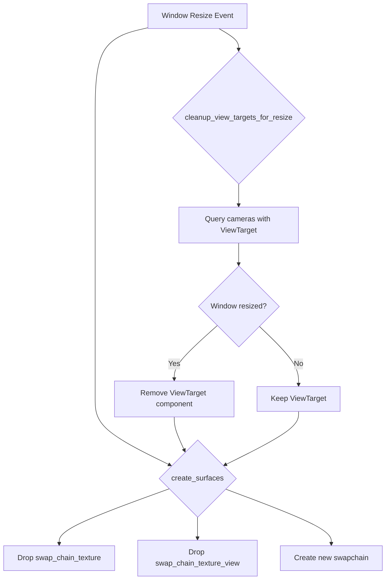

+++
title = "#22254 Make sure swapchain texture views are dropped"
date = "2025-12-26T00:00:00"
draft = false
template = "pull_request_page.html"
in_search_index = true

[taxonomies]
list_display = ["show"]

[extra]
current_language = "en"
available_languages = {"en" = { name = "English", url = "/pull_request/bevy/2025-12/pr-22254-en-20251226" }, "zh-cn" = { name = "中文", url = "/pull_request/bevy/2025-12/pr-22254-zh-cn-20251226" }}
labels = ["A-Rendering", "P-Crash", "P-Regression"]
+++

# Make sure swapchain texture views are dropped

## Basic Information
- **Title**: Make sure swapchain texture views are dropped
- **PR Link**: https://github.com/bevyengine/bevy/pull/22254
- **Author**: tychedelia
- **Status**: MERGED
- **Labels**: A-Rendering, P-Crash, S-Ready-For-Final-Review, P-Regression
- **Created**: 2025-12-24T04:43:33Z
- **Merged**: 2025-12-26T21:57:52Z
- **Merged By**: james7132

## Description Translation

Fixes https://github.com/bevyengine/bevy/issues/22225

Supersedes https://github.com/bevyengine/bevy/pull/22242 with a little less code

Haven't tested since I don't have access to a software renderer at the moment.

## The Story of This Pull Request

This PR addresses a crash that occurs when resizing windows in Bevy applications. The issue (#22225) was a regression that caused validation errors in wgpu when window swapchain resources weren't properly cleaned up during resize operations.

The root problem was that when a window resizes, the swapchain needs to be reconfigured. However, existing texture views associated with the old swapchain texture weren't being properly dropped before creating a new swapchain. In wgpu, you cannot have multiple swapchain textures or views active simultaneously for the same window. When the window resized, the code would attempt to create a new swapchain while the old texture view was still referenced elsewhere in the rendering pipeline.

Looking at the code, there were two related issues. First, the `ViewTarget` component, which holds references to swapchain textures, wasn't being removed when windows resized. This meant that even though the swapchain texture itself was being dropped in `create_surfaces`, any entities with `ViewTarget` components would still hold references to the old texture views. Second, the swapchain texture view wasn't being explicitly dropped alongside the swapchain texture during the resize handling.

The solution implements a two-part fix. First, it adds a new system `cleanup_view_targets_for_resize` that runs before `create_surfaces`. This system queries for cameras with `ViewTarget` components and checks if their target window has resized or changed presentation mode. If so, it removes the `ViewTarget` component from those entities. This ensures that any stale references to old swapchain textures are cleared before the new swapchain is created.

```rust
pub fn cleanup_view_targets_for_resize(
    mut commands: Commands,
    windows: Res<ExtractedWindows>,
    cameras: Query<(Entity, &ExtractedCamera), With<ViewTarget>>,
) {
    for (entity, camera) in &cameras {
        if let Some(NormalizedRenderTarget::Window(window_ref)) = &camera.target
            && let Some(window) = windows.get(&window_ref.entity())
            && (window.size_changed || window.present_mode_changed)
        {
            commands.entity(entity).remove::<ViewTarget>();
        }
    }
}
```

Second, in the `create_surfaces` function, the code now explicitly drops the `swap_chain_texture_view` in addition to the `swap_chain_texture` when reconfiguring the window. This mirrors the existing pattern for the texture and ensures both resources are properly released.

```rust
// normally this is dropped on present but we double check here to be safe as failure to
// drop it will cause validation errors in wgpu
drop(window.swap_chain_texture.take());
drop(window.swap_chain_texture_view.take());
```

This PR supersedes an earlier attempt (#22242) with a more minimal solution. The earlier PR likely contained more extensive changes, but this version achieves the same fix with less code by focusing on the core issue: ensuring swapchain texture views are properly dropped during resize operations.

The implementation demonstrates good defensive programming by adding safety checks in multiple places. The comment in `create_surfaces` acknowledges that these resources are normally dropped during presentation, but adds explicit drops as a safety measure. This is important because graphics APIs like wgpu are strict about resource lifetimes, and failure to properly manage them leads to validation errors and crashes.

## Visual Representation



## Key Files Changed

### `crates/bevy_render/src/view/mod.rs` (+18/-0)

This file adds a new system to clean up `ViewTarget` components when windows resize. The system runs in the render schedule before `create_surfaces` to ensure stale texture references are removed before new swapchains are created.

**Key changes:**
```rust
// System added to RenderSystems::ManageViews set
cleanup_view_targets_for_resize
    .in_set(RenderSystems::ManageViews)
    .before(create_surfaces),

// New system implementation
pub fn cleanup_view_targets_for_resize(
    mut commands: Commands,
    windows: Res<ExtractedWindows>,
    cameras: Query<(Entity, &ExtractedCamera), With<ViewTarget>>,
) {
    for (entity, camera) in &cameras {
        if let Some(NormalizedRenderTarget::Window(window_ref)) = &camera.target
            && let Some(window) = windows.get(&window_ref.entity())
            && (window.size_changed || window.present_mode_changed)
        {
            commands.entity(entity).remove::<ViewTarget>();
        }
    }
}
```

### `crates/bevy_render/src/view/window/mod.rs` (+1/-0)

This file adds a single line to ensure the swapchain texture view is dropped when reconfiguring window surfaces during resize operations.

**Key change:**
```rust
// In create_surfaces function, when reconfiguring window
drop(window.swap_chain_texture.take());
drop(window.swap_chain_texture_view.take());  // Added this line
```

## Further Reading

1. [wgpu Swapchain Documentation](https://docs.rs/wgpu/latest/wgpu/struct.SwapChain.html) - Understanding swapchain management in wgpu
2. [Bevy Render Graph Documentation](https://bevyengine.org/learn/advanced-topics/rendering/render-graph/) - How Bevy manages rendering resources
3. [wgpu Resource Management](https://sotrh.github.io/learn-wgpu/beginner/tutorial6-uniforms/#resource-views) - Understanding texture views in wgpu
4. [Bevy ViewTarget Component](https://docs.rs/bevy_render/latest/bevy_render/view/struct.ViewTarget.html) - Documentation for the ViewTarget component affected by this change