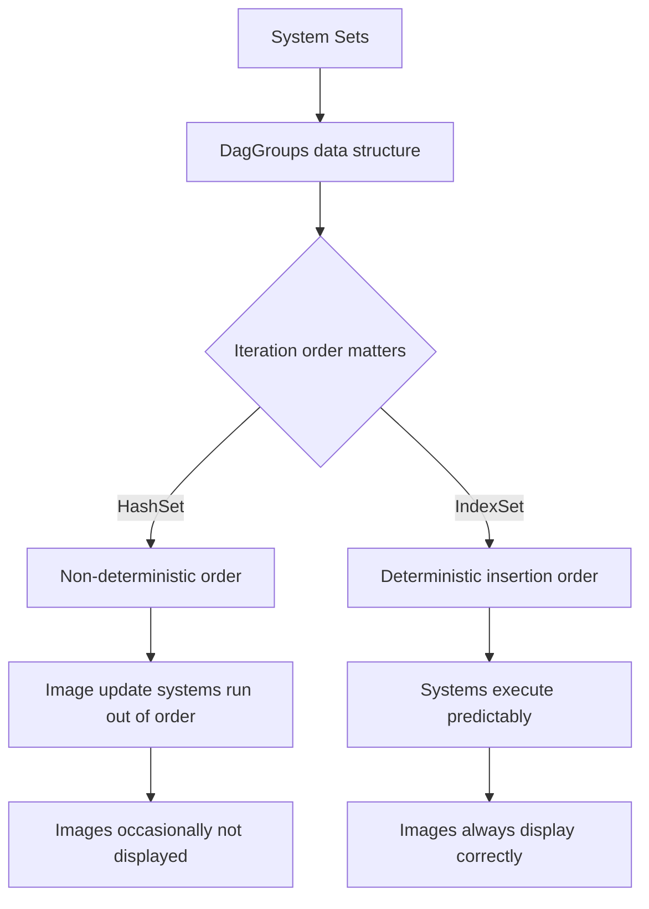

+++
title = "#22255 Fix Updated images occasionally never displayed on materials by ensuring correct ordering of system sets"
date = "2025-12-30T00:00:00"
draft = false
template = "pull_request_page.html"
in_search_index = true

[taxonomies]
list_display = ["show"]

[extra]
current_language = "en"
available_languages = {"en" = { name = "English", url = "/pull_request/bevy/2025-12/pr-22255-en-20251230" }, "zh-cn" = { name = "中文", url = "/pull_request/bevy/2025-12/pr-22255-zh-cn-20251230" }}
labels = ["C-Bug", "A-ECS", "P-Regression"]
+++

# Fix Updated images occasionally never displayed on materials by ensuring correct ordering of system sets

## Basic Information
- **Title**: Fix Updated images occasionally never displayed on materials by ensuring correct ordering of system sets
- **PR Link**: https://github.com/bevyengine/bevy/pull/22255
- **Author**: ItsDoot
- **Status**: MERGED
- **Labels**: C-Bug, A-ECS, S-Ready-For-Final-Review, P-Regression
- **Created**: 2025-12-24T05:38:02Z
- **Merged**: 2025-12-30T01:17:47Z
- **Merged By**: alice-i-cecile

## Description Translation
### Objective
- Fixes #22212

### Solution
Replace `HashSet` usage with `IndexSet` in `DagGroups` to maintain insertion order like the previous `Vec` implementation.

### Testing
Used the provided example in the bug report. Should we add it as a test or example somewhere?

## The Story of This Pull Request

This PR addresses a regression in Bevy's ECS scheduling system that caused updated images to occasionally never display on materials. The issue was subtle but significant - it involved non-deterministic ordering of systems within system sets due to an underlying data structure change.

The problem originated from a previous refactoring that replaced `Vec` with `HashSet` in the `DagGroups` data structure. While this change improved certain aspects of the code, it introduced non-deterministic iteration order. In the context of ECS scheduling, where system execution order matters for correctness, this unpredictability led to visual artifacts where updated images would sometimes fail to display correctly.

The developer identified the root cause: `HashSet` doesn't guarantee insertion order preservation during iteration, whereas the previous `Vec` implementation did. This mattered because systems within the same set need to execute in a predictable order to ensure that data dependencies are resolved correctly. When systems that update materials and systems that render them ended up in different relative orders on different runs, the rendering system could execute before the material update system, causing stale data to be used.

The solution was straightforward: replace `HashSet` with `IndexSet` from the `indexmap` crate. `IndexSet` provides the same O(1) lookup characteristics as `HashSet` but maintains insertion order, exactly matching the behavior of the original `Vec` implementation. This change restores deterministic system ordering while preserving the performance benefits of hash-based lookups.

The implementation required changes across four files in the ECS module, primarily updating type signatures and initialization logic. The core change was in `DagGroups`, where the internal storage type switched from `HashMap<K, HashSet<V, S>, S>` to `HashMap<K, IndexSet<V, S>, S>`. This change propagated through several method signatures and trait implementations, particularly in the `ScheduleBuildPass` trait hierarchy.

One important detail is the use of `FixedHasher` throughout. Bevy uses a deterministic hasher to ensure consistent behavior across runs, which is crucial for the ECS scheduler. The PR maintains this by explicitly specifying `FixedHasher` as the hasher type for the `IndexSet`.

The fix is minimal and focused - it addresses the regression without introducing new complexity. By preserving insertion order while maintaining hash-based performance characteristics, it solves the ordering issue while keeping the benefits of the previous refactoring.

## Visual Representation



## Key Files Changed

1. **crates/bevy_ecs/src/schedule/auto_insert_apply_deferred.rs** (+3/-2)
   - Changed the `collapse_set` method signature to accept `IndexSet` instead of `HashSet`
   - This ensures that when systems are collapsed into a set, their order is preserved

2. **crates/bevy_ecs/src/schedule/graph/dag.rs** (+6/-5)
   - The core change: updated `DagGroups` to use `IndexSet` instead of `HashSet`
   - Changed the `flatten` method to work with `IndexSet`
   - Updated type definitions and method signatures throughout

   ```rust
   // Before:
   pub struct DagGroups<K, V, S = FixedHasher>(HashMap<K, HashSet<V, S>, S>);
   
   // After:
   pub struct DagGroups<K, V, S = FixedHasher>(HashMap<K, IndexSet<V, S>, S>);
   ```

3. **crates/bevy_ecs/src/schedule/pass.rs** (+11/-7)
   - Updated the `ScheduleBuildPass` trait to use `IndexSet` in the `collapse_set` method
   - Modified the trait object implementation to match

   ```rust
   // Before:
   fn collapse_set(
       &mut self,
       set: SystemSetKey,
       systems: &HashSet<SystemKey>,
       dependency_flattening: &DiGraph<NodeId>,
   ) -> impl Iterator<Item = (NodeId, NodeId)>;
   
   // After:
   fn collapse_set(
       &mut self,
       set: SystemSetKey,
       systems: &IndexSet<SystemKey, FixedHasher>,
       dependency_flattening: &DiGraph<NodeId>,
   ) -> impl Iterator<Item = (NodeId, NodeId)>;
   ```

4. **crates/bevy_ecs/src/schedule/schedule.rs** (+7/-4)
   - Updated `systems_in_set` method to return `IndexSet` instead of `HashSet`
   - Changed `remove_systems_by_keys` to accept `IndexSet`

## Further Reading

- [IndexSet documentation](https://docs.rs/indexmap/latest/indexmap/set/struct.IndexSet.html) - The data structure used to replace HashSet
- [Bevy ECS Scheduling](https://bevy-cheatbook.github.io/programming/schedules.html) - Understanding Bevy's scheduling system
- [Deterministic hashing in Bevy](https://github.com/bevyengine/bevy/blob/main/crates/bevy_utils/src/fixed_state.rs) - Bevy's FixedState hasher for deterministic behavior
- [PR #22212](https://github.com/bevyengine/bevy/issues/22212) - The original bug report with reproduction case