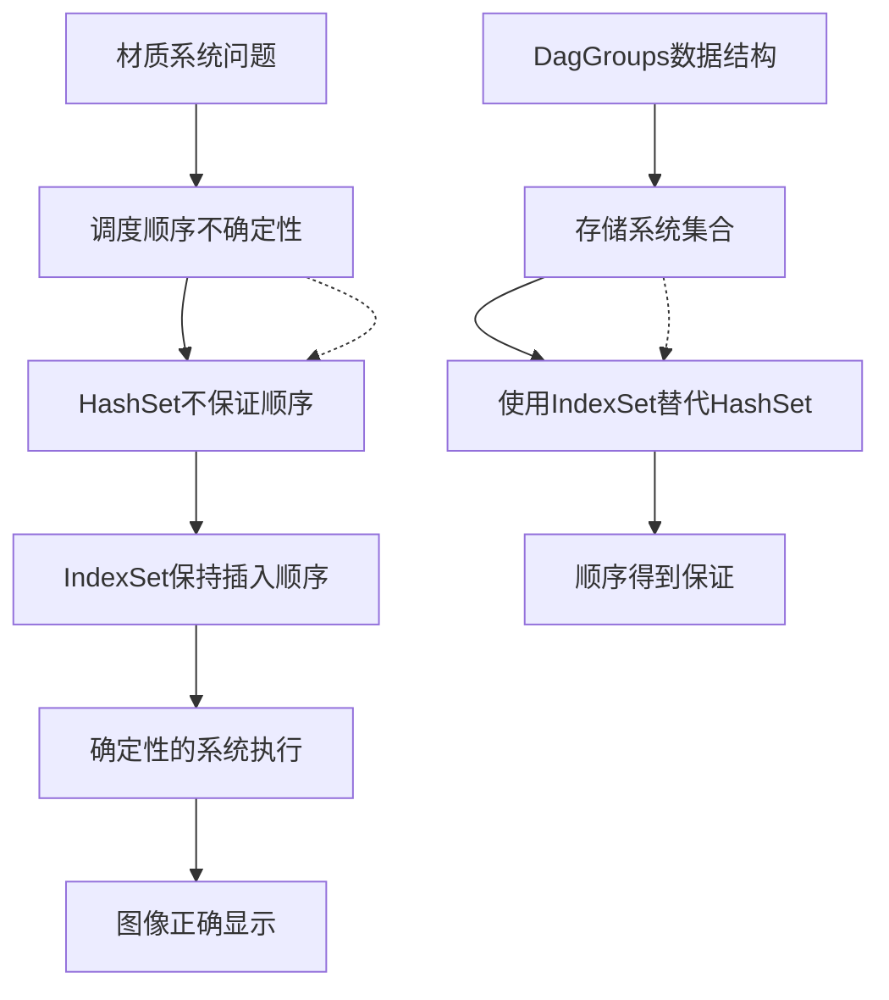

+++
title = "#22255 Fix Updated images occasionally never displayed on materials by ensuring correct ordering of system sets"
date = "2025-12-30T00:00:00"
draft = false
template = "pull_request_page.html"
in_search_index = false

[extra]
current_language = "zh-cn"
available_languages = {"en" = { name = "English", url = "/pull_request/bevy/2025-12/pr-22255-en-20251230" }, "zh-cn" = { name = "中文", url = "/pull_request/bevy/2025-12/pr-22255-zh-cn-20251230" }}
labels = ["C-Bug", "A-ECS", "P-Regression"]
+++

# Title
Fix Updated images occasionally never displayed on materials by ensuring correct ordering of system sets

## Basic Information
- **Title**: Fix Updated images occasionally never displayed on materials by ensuring correct ordering of system sets
- **PR Link**: https://github.com/bevyengine/bevy/pull/22255
- **Author**: ItsDoot
- **Status**: MERGED
- **Labels**: C-Bug, A-ECS, S-Ready-For-Final-Review, P-Regression
- **Created**: 2025-12-24T05:38:02Z
- **Merged**: 2025-12-30T01:17:47Z
- **Merged By**: alice-i-cecile

## Description Translation
**目标**
- 修复 #22212

**解决方案**
将 `DagGroups` 中的 `HashSet` 用法替换为 `IndexSet`，以保持与先前 `Vec` 实现相同的插入顺序。

**测试**
使用了错误报告中提供的示例。我们是否应该将其作为测试或示例添加到某处？

## The Story of This Pull Request

这个PR解决了一个关于材质图像更新的问题：更新后的图像偶尔永远不会显示在材质上。问题根源在于Bevy的ECS调度系统中系统执行顺序的不确定性。

**问题与背景**
在issue #22212中，开发者报告了一个材质系统的问题：当更新图像时，有时新图像不会显示在材质上。经过调试，发现问题与Bevy的调度系统有关。具体来说，在系统调度图的构建过程中，系统集合（system sets）中的系统顺序是不确定的。这可能导致依赖关系处理不正确，进而影响图像更新系统的执行顺序。

问题发生在调度图的构建阶段。Bevy使用有向无环图（DAG）来表示系统之间的依赖关系。`DagGroups` 结构体负责将系统分组到系统集合中。在之前的实现中，这个分组使用了 `HashSet` 来存储每个集合中的系统。`HashSet` 不保证元素的顺序，这导致系统在集合中的顺序是随机的。当调度器需要处理这些系统时，顺序的不确定性可能导致依赖关系解析错误，最终使得图像更新系统在错误的时间执行或根本不执行。

**解决方案**
解决方案是将 `HashSet` 替换为 `IndexSet`。`IndexSet` 来自 `indexmap` crate，它结合了哈希集合的快速查找特性和维护插入顺序的能力。这个改变确保了系统在集合中的顺序与它们被添加时的顺序一致，从而恢复了确定性的执行顺序。

这个修复实际上回归到了之前使用 `Vec` 实现时的行为（`Vec` 保持插入顺序），但同时保留了哈希集合的去重和快速成员检查的优点。`IndexSet` 提供了两全其美的解决方案：既保持了顺序，又有接近 `HashSet` 的性能。

**实现细节**
这个PR修改了四个文件，主要集中在调度系统的内部数据结构上：

1. **`DagGroups` 结构体的泛型参数变化**：将 `HashMap<K, HashSet<V, S>, S>` 改为 `HashMap<K, IndexSet<V, S>, S>`。这意味着现在每个键（系统集合）对应一个保持顺序的集合。

2. **相关方法的签名更新**：所有接受或返回系统集合的方法现在都使用 `IndexSet` 而不是 `HashSet`。这包括 `collapse_set`、`flatten` 等方法。

3. **调度图API的更新**：公共API方法如 `systems_in_set` 也更新为返回 `IndexSet`，确保外部代码能够获得有序的系统集合。

**技术见解**
这个修复凸显了在调度系统中顺序确定性的重要性。虽然哈希集合在大多数情况下是高效的，但在需要保持顺序的场景中，它们可能引入难以调试的非确定性行为。`IndexSet` 是一个很好的折中方案，它在保持顺序的同时仍然提供O(1)的平均查找时间。

需要注意的是，这个修复解决了一个回归问题。根据PR标签中的"P-Regression"，这个问题是在之前的某个更改中引入的。很可能是在将 `Vec` 改为 `HashSet` 以优化性能时，无意中破坏了顺序保证。

**影响**
这个修复确保了材质系统能够可靠地显示更新的图像。更广泛地说，它恢复了调度系统中系统执行顺序的确定性，这对于任何依赖特定执行顺序的功能都至关重要。这个改变是向后兼容的，因为它不改变API的语义，只是修复了底层实现的行为。

从工程角度来看，这个PR展示了在面对非确定性bug时，仔细检查数据结构和它们的顺序保证的重要性。当性能优化（如使用 `HashSet` 替代 `Vec`）可能影响正确性时，需要权衡考虑。

## Visual Representation



## Key Files Changed

### 1. `crates/bevy_ecs/src/schedule/graph/dag.rs`
这个文件定义了DAG图的数据结构，是修复的核心。

**关键修改：**
```rust
// 之前：
pub struct DagGroups<K, V, S = FixedHasher>(HashMap<K, HashSet<V, S>, S>);

// 之后：
pub struct DagGroups<K, V, S = FixedHasher>(HashMap<K, IndexSet<V, S>, S>);
```

**相关方法的变化：**
```rust
// 之前：
pub fn flatten<N>(
    &self,
    dag: Dag<N>,
    mut collapse_group: impl FnMut(K, &HashSet<V, S>, &Dag<N>, &mut Vec<(N, N)>),
) -> Dag<V>

// 之后：
pub fn flatten<N>(
    &self,
    dag: Dag<N>,
    mut collapse_group: impl FnMut(K, &IndexSet<V, S>, &Dag<N>, &mut Vec<(N, N)>),
) -> Dag<V>
```

**说明：**
这个文件中的 `DagGroups` 结构体负责在调度图中对系统进行分组。将 `HashSet` 改为 `IndexSet` 确保了每个系统集合中的系统保持插入顺序，从而保证调度执行的确定性。

### 2. `crates/bevy_ecs/src/schedule/pass.rs`
这个文件定义了调度构建pass的trait。

**关键修改：**
```rust
// 之前：
fn collapse_set(
    &mut self,
    set: SystemSetKey,
    systems: &HashSet<SystemKey>,
    dependency_flattening: &DiGraph<NodeId>,
) -> impl Iterator<Item = (NodeId, NodeId)>;

// 之后：
fn collapse_set(
    &mut self,
    set: SystemSetKey,
    systems: &IndexSet<SystemKey, FixedHasher>,
    dependency_flattening: &DiGraph<NodeId>,
) -> impl Iterator<Item = (NodeId, NodeId)>;
```

**说明：**
`ScheduleBuildPass` trait中的 `collapse_set` 方法现在接受 `IndexSet` 而不是 `HashSet`。这确保了所有实现这个trait的pass都能够接收到有序的系统集合。

### 3. `crates/bevy_ecs/src/schedule/schedule.rs`
这个文件包含调度图的主要逻辑。

**关键修改：**
```rust
// 之前：
pub fn systems_in_set(
    &self,
    system_set: InternedSystemSet,
) -> Result<&HashSet<SystemKey>, ScheduleError>

// 之后：
pub fn systems_in_set(
    &self,
    system_set: InternedSystemSet,
) -> Result<&IndexSet<SystemKey, FixedHasher>, ScheduleError>
```

**说明：**
公共API方法 `systems_in_set` 现在返回 `IndexSet`，为外部调用者提供有序的系统集合。这保持了API的一致性。

### 4. `crates/bevy_ecs/src/schedule/auto_insert_apply_deferred.rs`
这个文件实现了一个特定的调度构建pass。

**关键修改：**
```rust
// 之前：
fn collapse_set(
    &mut self,
    set: SystemSetKey,
    systems: &HashSet<SystemKey>,
    dependency_flattening: &DiGraph<NodeId>,
) -> impl Iterator<Item = (NodeId, NodeId)>

// 之后：
fn collapse_set(
    &mut self,
    set: SystemSetKey,
    systems: &IndexSet<SystemKey, FixedHasher>,
    dependency_flattening: &DiGraph<NodeId>,
) -> impl Iterator<Item = (NodeId, NodeId)>
```

**说明：**
`AutoInsertApplyDeferredPass` 现在也使用 `IndexSet`，确保它在处理系统集合时能够依赖确定的顺序。

## Further Reading

1. **IndexMap crate文档**：了解 `IndexSet` 的实现细节和性能特征
   - https://docs.rs/indexmap/latest/indexmap/set/struct.IndexSet.html

2. **Bevy ECS调度系统**：理解Bevy如何安排系统执行
   - https://bevy-cheatbook.github.io/programming/schedules.html

3. **确定性调度的重要性**：在游戏引擎中为什么系统执行顺序很重要
   - 相关讨论：https://github.com/bevyengine/bevy/discussions/22212

4. **哈希集合与有序集合的比较**：不同数据结构的权衡
   - https://doc.rust-lang.org/std/collections/index.html#performance

5. **回归测试**：如何防止这类问题再次发生
   - https://en.wikipedia.org/wiki/Regression_testing