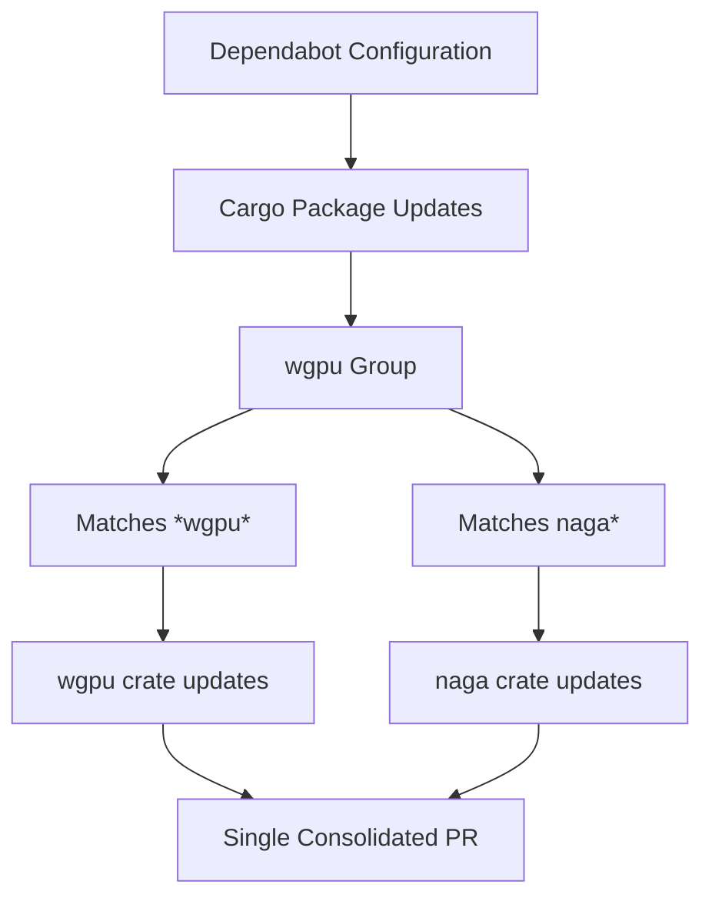

+++
title = "#22262 Group wgpu dep updates together into one"
date = "2025-12-25T00:00:00"
draft = false
template = "pull_request_page.html"
in_search_index = true

[taxonomies]
list_display = ["show"]

[extra]
current_language = "en"
available_languages = {"en" = { name = "English", url = "/pull_request/bevy/2025-12/pr-22262-en-20251225" }, "zh-cn" = { name = "中文", url = "/pull_request/bevy/2025-12/pr-22262-zh-cn-20251225" }}
labels = ["A-Build-System"]
+++

# Group wgpu dep updates together into one

## Basic Information
- **Title**: Group wgpu dep updates together into one
- **PR Link**: https://github.com/bevyengine/bevy/pull/22262
- **Author**: loreball
- **Status**: MERGED
- **Labels**: A-Build-System, S-Ready-For-Final-Review
- **Created**: 2025-12-24T21:03:23Z
- **Merged**: 2025-12-25T23:09:45Z
- **Merged By**: mockersf

## Description Translation

# Objective

Closes #22251

## Testing

Validation against https://www.schemastore.org/dependabot-2.0.json + hope.

## The Story of This Pull Request

This PR addresses a practical issue with dependency management in the Bevy project's build system. The problem was straightforward: when Dependabot, GitHub's automated dependency update tool, checked for updates to the wgpu graphics library and its related dependencies, it would create multiple separate pull requests for what are effectively related components of the same graphics stack.

In the context of Bevy's architecture, wgpu is the primary graphics abstraction layer that provides a modern, cross-platform graphics API. The naga library is tightly coupled with wgpu as it handles shader processing and validation. These two components are developed together and versioned in sync, so updating one without the other can lead to compatibility issues or broken builds.

The solution implemented here is to configure Dependabot's grouping feature to treat updates to wgpu and naga as a single logical unit. The approach is minimal and focused: we add a `groups` configuration to the existing Dependabot setup for the Cargo package ecosystem. The group named "wgpu" includes two patterns: `"*wgpu*"` which matches any package with "wgpu" in its name (like wgpu, wgpu-types, wgpu-hal), and `"naga*"` which matches any package starting with "naga".

This configuration change is a preventative measure that improves development workflow efficiency. Instead of having to manually coordinate multiple PRs or potentially dealing with intermediate broken states when only one of the related dependencies updates, the development team now receives a single consolidated update that maintains compatibility between wgpu and naga versions.

The implementation required understanding Dependabot's YAML schema, which the author validated against the official JSON schema store. This is a good practice when modifying configuration files with defined schemas, as it helps avoid syntax errors and ensures the configuration works as intended.

From an engineering perspective, this change demonstrates the importance of understanding how build tools interact with dependency graphs. While the change is small in terms of lines of code, its impact on maintenance workflow is significant. It reduces cognitive load for developers reviewing dependency updates and decreases the chance of merge conflicts or version mismatches.

The trade-off is that grouping dependencies means developers won't see individual changelogs for each component in separate PRs, but this is acceptable given the tight coupling between wgpu and naga. The alternative—maintaining separate PRs—carries a higher risk of breaking changes when only partial updates are applied.

This configuration follows infrastructure-as-code principles: we're programmatically defining how our dependency management should work rather than relying on manual processes. It's a simple but effective example of automating a repetitive coordination task that previously required manual intervention.

## Visual Representation



## Key Files Changed

### `.github/dependabot.yml` (+5/-0)

This file configures GitHub's Dependabot for automated dependency updates. The changes add a grouping configuration for wgpu-related dependencies.

**Key modifications:**
```yaml
# File: .github/dependabot.yml
# After (added section):
    groups:
      wgpu:
        patterns:
          - "*wgpu*"
          - "naga*"
```

The changes are inserted into the existing Cargo package ecosystem configuration. The `groups` section creates a logical grouping named "wgpu" that includes two patterns. The `"*wgpu*"` pattern uses wildcards to match any package containing "wgpu" in its name (case-sensitive). The `"naga*"` pattern matches any package starting with "naga". This ensures that when Dependabot checks for updates to these related graphics dependencies, it bundles them into a single pull request rather than creating separate PRs for each component.

This change relates directly to the PR's objective of grouping wgpu dependency updates together. It addresses issue #22251 by configuring the build system to handle these tightly-coupled dependencies as a unit, reducing maintenance overhead and potential version incompatibilities.

## Further Reading

1. [GitHub Dependabot documentation on grouping dependencies](https://docs.github.com/en/code-security/dependabot/dependabot-version-updates/configuration-options-for-the-dependabot.yml-file#groups)
2. [Dependabot configuration schema reference](https://www.schemastore.org/json/dependabot-2.0.json)
3. [wgpu crate documentation](https://docs.rs/wgpu/latest/wgpu/) - Understanding the graphics abstraction layer
4. [naga crate documentation](https://docs.rs/naga/latest/naga/) - Shader processing library used by wgpu
5. [Bevy's dependency management guidelines](https://github.com/bevyengine/bevy/blob/main/docs/plugins_guidelines.md#dependencies)