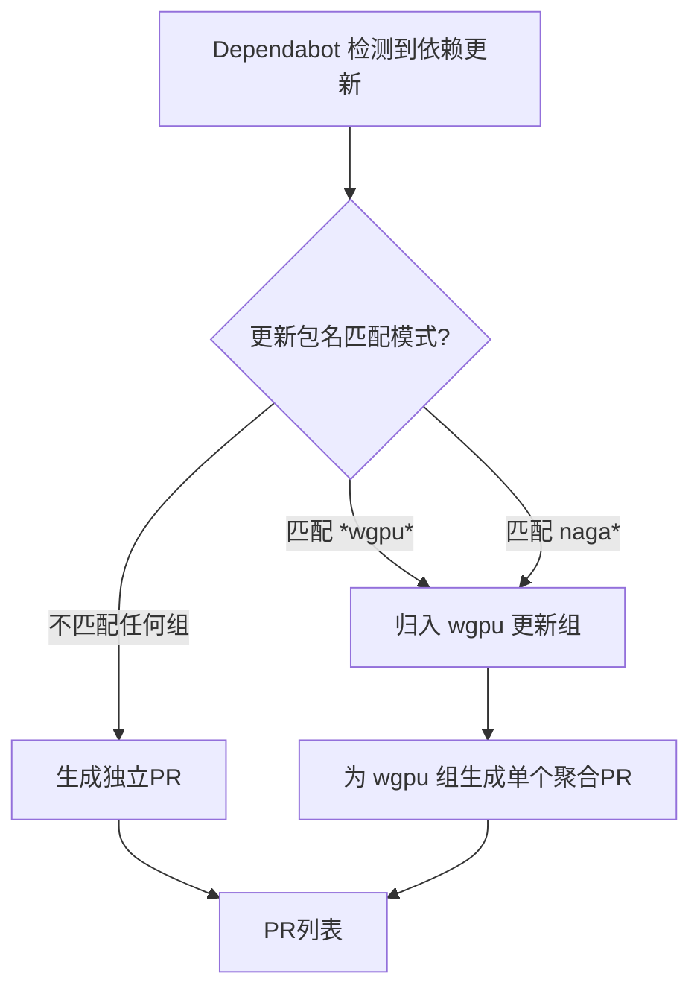

+++
title = "#22262 Group wgpu dep updates together into one"
date = "2025-12-25T00:00:00"
draft = false
template = "pull_request_page.html"
in_search_index = false

[extra]
current_language = "zh-cn"
available_languages = {"en" = { name = "English", url = "/pull_request/bevy/2025-12/pr-22262-en-20251225" }, "zh-cn" = { name = "中文", url = "/pull_request/bevy/2025-12/pr-22262-zh-cn-20251225" }}
labels = ["A-Build-System"]
+++

# Title: Group wgpu dep updates together into one

## Basic Information
- **Title**: Group wgpu dep updates together into one
- **PR Link**: https://github.com/bevyengine/bevy/pull/22262
- **Author**: loreball
- **Status**: MERGED
- **Labels**: A-Build-System, S-Ready-For-Final-Review
- **Created**: 2025-12-24T21:03:23Z
- **Merged**: 2025-12-25T23:09:45Z
- **Merged By**: mockersf

## Description Translation
**目标 (Objective)**
关闭 issue #22251

**测试 (Testing)**
基于 https://www.schemastore.org/dependabot-2.0.json 进行验证 + 预期有效。

## The Story of This Pull Request

这是一个非常聚焦的PR，只修改了一个配置文件，目的是优化项目依赖管理的工作流程。故事的起因是一个issue（#22251），这个issue很可能指出了当前依赖更新流程中的一个低效问题：当`wgpu`及其相关依赖（如`naga`）发布新版本时，Dependabot（GitHub的自动化依赖更新工具）会为每个匹配的依赖包单独创建一个Pull Request。

对于像Bevy这样使用`wgpu`作为图形后端的游戏引擎来说，`wgpu`和`naga`通常是紧密耦合、需要协同更新的依赖项。如果它们分别触发更新PR，会导致：
1.  **通知噪音**：维护者会收到多个独立的PR通知。
2.  **测试负担**：每个PR都需要单独进行CI测试，消耗计算资源。
3.  **合并复杂性**：需要人工确保这些相关的更新被同时合并，以避免出现不兼容的依赖组合。

PR提交者`loreball`采取的解决方案直接且符合最佳实践：利用Dependabot的`groups`功能。这个功能允许将符合特定命名模式（`patterns`）的依赖包归类到一个组里。当组内任何一个依赖有可用更新时，Dependabot会将这些更新聚合到**单个Pull Request**中。

具体实现上，修改位于项目根目录的`.github/dependabot.yml`文件。在已有的`cargo`包生态系统配置块中，添加了一个`groups`字段。定义了一个名为`wgpu`的组，并设置了两个匹配模式：
- `"*wgpu*"`: 匹配所有包名中包含`wgpu`的依赖（例如`wgpu`， `wgpu-hal`等）。
- `"naga*"`: 匹配所有以`naga`开头的依赖。

这个修改非常精准。它没有改变更新频率（仍然是每周`weekly`），也没有改动负责的标签（依然是`C-Dependencies`）。它仅仅优化了更新事件的呈现方式，将原先可能分散的多个PR合并为一个。

从工程角度看，这是一个典型的“流程优化”而非“功能开发”。它不涉及任何运行时代码，但能显著提升维护效率。解决方案直接使用了Dependabot提供的原生功能，没有引入额外的脚本或工具，保持了配置的简洁性和可维护性。验证方法也体现了务实精神：参考官方JSON Schema确保配置语法正确，然后依靠对Dependabot行为的理解进行合并。

这个PR在圣诞节期间被快速合并，表明维护团队认可这是一个清晰、无风险的改进。它虽然改动量小，但很好地体现了良好的工程实践：通过配置化手段自动化并简化重复性维护任务，让开发者能更专注于核心功能开发。

## Visual Representation



## Key Files Changed

**关键文件修改**
- `.github/dependabot.yml` (+5/-0)

**修改描述与原因**
此文件是配置GitHub Dependabot工具的YAML文件。本次修改在用于Rust（`cargo`）依赖更新的配置块中添加了一个`groups`定义。目的是将`wgpu`生态系统相关的依赖更新分组，让Dependabot将这些更新合并到单个Pull Request中，从而减少PR数量，简化依赖管理流程。

**代码片段**
```yaml
# File: .github/dependabot.yml
# 修改前（仅显示相关部分）:
  - package-ecosystem: "cargo"
    directory: "/"
    schedule:
      interval: "weekly"
    labels:
      - "C-Dependencies"
    # 此处没有 groups 配置

# 修改后:
  - package-ecosystem: "cargo"
    directory: "/"
    schedule:
      interval: "weekly"
    labels:
      - "C-Dependencies"
    groups:
      wgpu:
        patterns:
          - "*wgpu*"
          - "naga*"
```
**与PR目标的关联**
这5行新增的配置直接实现了PR的目标：将wgpu依赖更新分组（`Group wgpu dep updates together into one`）。通过`patterns`列表，精确地捕获了需要协同更新的相关依赖包。

## Further Reading

1.  **GitHub Dependabot 文档 - 依赖分组**: [Configuration options for the dependabot.yml file - groups](https://docs.github.com/en/code-security/dependabot/dependabot-version-updates/configuration-options-for-the-dependabot.yml-file#groups)
2.  **Dependabot 配置文件 JSON Schema**: 开发者用于验证其`.github/dependabot.yml`文件格式正确性的Schema，如PR描述中所用。可访问 [https://www.schemastore.org/json/](https://www.schemastore.org/json/) 查看。
3.  **语义化版本控制 (SemVer)**: 理解依赖版本号（主版本.次版本.修订号）的约定，有助于判断更新是否兼容。这是依赖管理工具（包括Dependabot）工作的基础。

# Full Code Diff
diff --git a/.github/dependabot.yml b/.github/dependabot.yml
index 72fbf07616bbd..5d6733bb838df 100644
--- a/.github/dependabot.yml
+++ b/.github/dependabot.yml
@@ -6,6 +6,11 @@ updates:
       interval: weekly
     labels:
       - "C-Dependencies"
+    groups:
+      wgpu:
+        patterns:
+          - "*wgpu*"
+          - "naga*"
   - package-ecosystem: github-actions
     directory: /
     schedule: