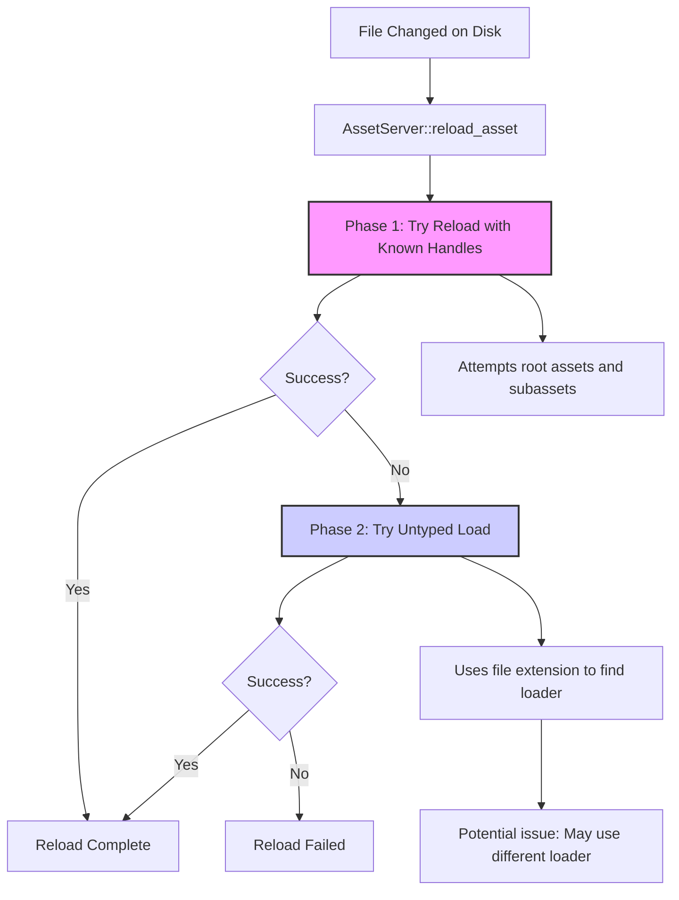

+++
title = "#22264 Add comments explaining why the reloading code is so complex"
date = "2025-12-29T00:00:00"
draft = false
template = "pull_request_page.html"
in_search_index = true

[taxonomies]
list_display = ["show"]

[extra]
current_language = "en"
available_languages = {"en" = { name = "English", url = "/pull_request/bevy/2025-12/pr-22264-en-20251229" }, "zh-cn" = { name = "中文", url = "/pull_request/bevy/2025-12/pr-22264-zh-cn-20251229" }}
labels = ["C-Docs", "A-Assets", "D-Modest"]
+++

# Title
Add comments explaining why the reloading code is so complex

## Basic Information
- **Title**: Add comments explaining why the reloading code is so complex
- **PR Link**: https://github.com/bevyengine/bevy/pull/22264
- **Author**: andriyDev
- **Status**: MERGED
- **Labels**: C-Docs, A-Assets, S-Ready-For-Final-Review, D-Modest
- **Created**: 2025-12-25T01:05:44Z
- **Merged**: 2025-12-29T04:57:56Z
- **Merged By**: alice-i-cecile

## Description Translation
**Objective**
- Fixes #21222.

**Solution**
- Give an explanation, and add a TODO. Note I didn't write this code, so I'm "guessing" on the rationale - but it's an educated guess!

## The Story of This Pull Request

This PR addresses a documentation gap in Bevy's asset reloading system. The issue (#21222) specifically called out the complexity of the reloading code in `AssetServer::reload_asset` as being difficult to understand. The author recognized that while they didn't write the original code, they could provide educated commentary to help future maintainers.

Asset reloading in Bevy handles a non-trivial scenario: when a file changes on disk, the engine needs to reload the asset while maintaining any existing handles to it. This becomes particularly complex when dealing with subassets (assets that are part of a larger asset file, like individual sprites in a sprite sheet).

The existing implementation in `reload_asset` follows a two-phase approach. The PR's documentation clarifies this approach. First, the system attempts to reload the asset for any handles to that path, trying both root assets and subassets. This is the straightforward case where the asset type is known and the appropriate loader can be found.

However, there's an edge case that makes the code more complex. When the root asset has been dropped from memory but its subassets are still in use, the first approach fails because it can't determine the correct loader type (the root asset's type is unknown). The second phase handles this by attempting an untyped load, which tries to find the appropriate loader based on the file extension alone.

The author adds a critical TODO note pointing out a potential issue: the untyped load might not always use the same loader as the original load, which could lead to incorrect behavior. They suggest storing a mapping from asset index to loader as a future improvement to guarantee consistency.

This documentation change is small but significant. By explaining the rationale behind the two-phase approach and identifying a known limitation, it reduces the cognitive load for developers working on or debugging the asset system. The comments serve as both explanation and warning, helping prevent regression when modifications are made to this complex but essential functionality.

## Visual Representation



## Key Files Changed

**File: `crates/bevy_asset/src/server/mod.rs` (+10/-0)**
This file contains the `AssetServer` implementation, specifically the `reload_asset` method which handles reloading assets when their source files change. The changes add explanatory comments to clarify the two-phase reloading logic and identify a potential issue with loader consistency.

**Changes:**
Two comment blocks were added to explain the two-phase reloading approach:

1. **First comment block** (added before the initial reload attempt):
```rust
// First, try to reload the asset for any handles to that path. This will try both
// root assets and subassets.
```

2. **Second comment block** (added before the fallback untyped load):
```rust
// If the above section failed, and there are still living subassets (aka we should
// reload), then just try doing an untyped load. This helps catch cases where the
// root asset has been dropped, but all its subassets are still being used (in which
// case the above section would have tried to find the loader with the root asset's
// type and loaded it). Hopefully the untyped load will find the right loader and
// reload all the subassets (though this is not guaranteed).
// TODO: Make sure we use the same loader as the original load (e.g., by storing a
// map from asset index to loader).
```

These comments clarify that:
- The first phase attempts to reload using known asset handles and types
- The second phase is a fallback for cases where the root asset type is unknown (because the root asset was dropped)
- There's a potential issue where the untyped load might use a different loader than the original
- A future improvement could involve storing loader information with assets

The code changes don't modify any logic - they only add documentation. This is appropriate since the issue was about code comprehension rather than functionality.

## Further Reading

1. **Bevy Asset System Documentation**: For understanding how Bevy handles asset loading and management
2. **Hot Reloading in Game Engines**: General concepts about live asset updates during development
3. **Rust Async/Await Patterns**: The reloading code uses async/await for non-blocking file operations
4. **Type Erasure in Rust**: Relevant to understanding how untyped loading works with different asset types
5. **Observer Pattern**: The asset reloading system follows this pattern, notifying dependent systems of changes