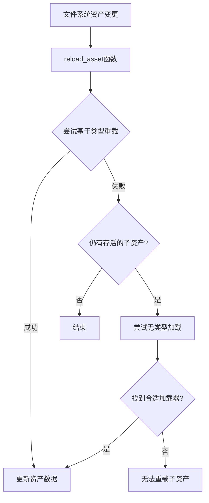

+++
title = "#22264 Add comments explaining why the reloading code is so complex."
date = "2025-12-29T00:00:00"
draft = false
template = "pull_request_page.html"
in_search_index = false

[extra]
current_language = "zh-cn"
available_languages = {"en" = { name = "English", url = "/pull_request/bevy/2025-12/pr-22264-en-20251229" }, "zh-cn" = { name = "中文", url = "/pull_request/bevy/2025-12/pr-22264-zh-cn-20251229" }}
+++

# Add comments explaining why the reloading code is so complex.

## 基本信息
- **标题**: Add comments explaining why the reloading code is so complex.
- **PR链接**: https://github.com/bevyengine/bevy/pull/22264
- **作者**: andriyDev
- **状态**: 已合并
- **标签**: C-Docs, A-Assets, S-Ready-For-Final-Review, D-Modest
- **创建时间**: 2025-12-25T01:05:44Z
- **合并时间**: 2025-12-29T04:57:56Z
- **合并人**: alice-i-cecile

## 描述翻译
### 目标
- 修复 #21222。

### 解决方案
- 提供一个解释，并添加一个 TODO。请注意，这段代码不是我写的，所以我是在"猜测"其设计原理——但这是一种有依据的猜测！

## 本次PR的技术分析

这个PR的核心目标很简单：为Bevy资产系统的复杂重载逻辑添加解释性注释。它不涉及任何功能修改，纯粹是一次文档改进。在软件工程实践中，这类"为复杂代码添加注释"的PR至关重要——它们能显著降低未来维护成本，特别是当原始开发者不再维护项目时。

问题的根源在于Bevy资产服务器的`reload_asset`函数。这个函数负责在文件系统上的资产发生变化时重新加载它们，但其实现逻辑涉及多层条件和边缘情况处理，如果没有足够注释，很难理解每个分支的意图。作者andriyDev在查看代码时也遇到了理解困难，因此决定通过添加注释来澄清代码逻辑，同时也留下了一个TODO用于标记潜在的改进方向。

从技术实现角度看，`reload_asset`函数需要处理两种主要场景：

首先，函数尝试通过已有句柄的类型信息重新加载资产。这段代码遍历所有指向该路径的句柄，获取它们的类型ID和加载器信息，然后尝试使用相同的类型进行重新加载。这在大多数情况下有效，特别是当根资产（root asset）仍然存在时。

```rust
// First, try to reload the asset for any handles to that path. This will try both
// root assets and subassets.
let requests = server
    .read_infos()
    .get_path_handles(&path)
    .into_iter()
    .filter_map(|handle| {
        // ... 获取句柄信息的代码
    })
    .collect::<Vec<_>>();
```

然而，存在一个复杂的边缘情况：当根资产已经被丢弃（dropped），但它的子资产（subassets）仍在被使用时。例如，一个纹理图集（texture atlas）作为根资产可能已被释放，但从中提取的单个精灵纹理仍在使用中。在这种情况下，上述基于类型的方法会失败，因为系统中可能不再存在根资产类型的句柄。

为了解决这个问题，代码引入了第二层重载尝试——无类型加载（untyped load）。当第一轮重载失败，但系统检测到仍需要重载时（通过`should_reload`检查），它会尝试不带类型信息的加载：

```rust
// If the above section failed, and there are still living subassets (aka we should
// reload), then just try doing an untyped load. This helps catch cases where the
// root asset has been dropped, but all its subassets are still being used (in which
// case the above section would have tried to find the loader with the root asset's
// type and loaded it). Hopefully the untyped load will find the right loader and
// reload all the subassets (though this is not guaranteed).
// TODO: Make sure we use the same loader as the original load (e.g., by storing a
// map from asset index to loader).
if !reloaded && server.read_infos().should_reload(&path) {
    // ... 执行无类型加载
}
```

作者添加的注释清楚地解释了这种两阶段方法的设计原理：首先尝试精确的类型匹配重载，如果失败但仍有存活的子资产，则回退到无类型加载。然而，这种回退方法并非完美——无类型加载可能无法找到正确的加载器，或者可能找到与原始加载器不同的加载器。

这引出了作者添加的TODO项：理想情况下，系统应该记录每个资产最初使用的加载器，并在重载时使用相同的加载器。当前实现依赖于自动检测，这在某些边缘情况下可能导致问题。这个TODO为未来的改进指明了方向——可以构建从资产索引到加载器的映射，确保重载时的一致性。

从软件工程角度看，这个PR展示了几个重要的实践：

1. **文档作为代码的一部分**：复杂的算法逻辑需要明确的注释来解释设计决策和边缘情况。
2. **诚实的技术债务标注**：作者明确标注了代码的局限性（"not guaranteed"）和未来改进方向（TODO）。
3. **非侵入式改进**：通过纯文档修改解决了理解障碍，没有引入任何行为变更风险。

这次修改虽然微小，但对维护性有显著提升。新开发者或贡献者在阅读这段代码时，不再需要花费大量时间逆向工程其设计意图，注释提供了直接的上下文。这种清晰的文档降低了认知负荷，使团队能更有效地协作和维护代码库。

## 组件关系图



## 关键文件变更

### `crates/bevy_asset/src/server/mod.rs`
**变更描述**：在`reload_asset`函数的异步任务块中添加了详细注释，解释了两阶段重载逻辑的设计原理和局限性。

**变更前**：
```rust
let mut reloaded = false;

let requests = server
    .read_infos()
    .get_path_handles(&path)
    // ... 后续代码
```

**变更后**：
```rust
let mut reloaded = false;

// First, try to reload the asset for any handles to that path. This will try both
// root assets and subassets.
let requests = server
    .read_infos()
    .get_path_handles(&path)
    // ... 后续代码

// If the above section failed, and there are still living subassets (aka we should
// reload), then just try doing an untyped load. This helps catch cases where the
// root asset has been dropped, but all its subassets are still being used (in which
// case the above section would have tried to find the loader with the root asset's
// type and loaded it). Hopefully the untyped load will find the right loader and
// reload all the subassets (though this is not guaranteed).
// TODO: Make sure we use the same loader as the original load (e.g., by storing a
// map from asset index to loader).
if !reloaded && server.read_infos().should_reload(&path) {
    // ... 后续代码
}
```

**关联性**：这些注释直接对应PR的核心目标——解释为什么重载代码如此复杂。它们澄清了代码处理根资产和子资产重载的不同策略，并标识了当前实现的局限性。

## 扩展阅读

- **[Bevy Asset System Documentation](https://docs.rs/bevy_asset/latest/bevy_asset/)** - Bevy资产系统的官方文档
- **[Hot Reloading in Game Engines](https://aras-p.info/blog/2018/12/28/Hot-Reloading-in-Game-Engines/)** - 关于游戏引擎中热重载技术的深入讨论
- **[Code Comments Best Practices](https://google.github.io/styleguide/docguide/comments.html)** - Google的代码注释最佳实践指南
- **[Technical Debt Management](https://martinfowler.com/bliki/TechnicalDebt.html)** - Martin Fowler关于技术债务管理的思考

---

# 完整代码差异
```diff
diff --git a/crates/bevy_asset/src/server/mod.rs b/crates/bevy_asset/src/server/mod.rs
index 639da9ef3ee87..cedafeaf7bcfd 100644
--- a/crates/bevy_asset/src/server/mod.rs
+++ b/crates/bevy_asset/src/server/mod.rs
@@ -887,6 +887,8 @@ impl AssetServer {
             .spawn(async move {
                 let mut reloaded = false;
 
+                // First, try to reload the asset for any handles to that path. This will try both
+                // root assets and subassets.
                 let requests = server
                     .read_infos()
                     .get_path_handles(&path)
@@ -902,6 +904,14 @@ impl AssetServer {
                     }
                 }
 
+                // If the above section failed, and there are still living subassets (aka we should
+                // reload), then just try doing an untyped load. This helps catch cases where the
+                // root asset has been dropped, but all its subassets are still being used (in which
+                // case the above section would have tried to find the loader with the root asset's
+                // type and loaded it). Hopefully the untyped load will find the right loader and
+                // reload all the subassets (though this is not guaranteed).
+                // TODO: Make sure we use the same loader as the original load (e.g., by storing a
+                // map from asset index to loader).
                 if !reloaded && server.read_infos().should_reload(&path) {
                     server.write_infos().stats.started_load_tasks += 1;
                     match server.load_internal(None, path.clone(), true, None).await {
```