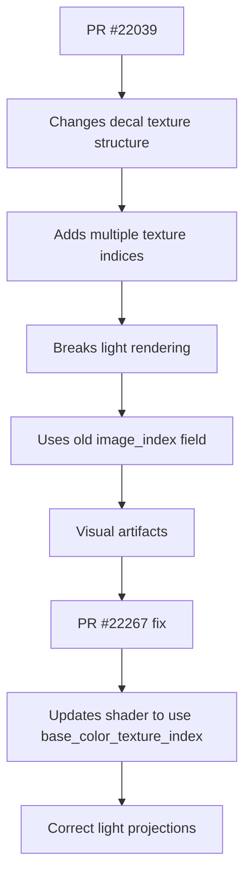

+++
title = "#22267 fix decal index selection in light textures"
date = "2025-12-29T00:00:00"
draft = false
template = "pull_request_page.html"
in_search_index = true

[taxonomies]
list_display = ["show"]

[extra]
current_language = "en"
available_languages = {"en" = { name = "English", url = "/pull_request/bevy/2025-12/pr-22267-en-20251229" }, "zh-cn" = { name = "中文", url = "/pull_request/bevy/2025-12/pr-22267-zh-cn-20251229" }}
labels = ["A-Rendering"]
+++

# Title
fix decal index selection in light textures

## Basic Information
- **Title**: fix decal index selection in light textures
- **PR Link**: https://github.com/bevyengine/bevy/pull/22267
- **Author**: ChristopherBiscardi
- **Status**: MERGED
- **Labels**: A-Rendering, S-Ready-For-Final-Review
- **Created**: 2025-12-25T17:04:39Z
- **Merged**: 2025-12-29T18:12:22Z
- **Merged By**: mockersf

## Description Translation
# Objective

https://github.com/bevyengine/bevy/pull/22039 changed how many images are associated with a decal. light textures use decal base textures, ignoring the others.

fixes #22266

## Solution

use base color texture index

## Testing

```
cargo run --example light_textures --features="pbr_light_textures"
```

## Showcase

### before


### after


## The Story of This Pull Request

The problem started with PR #22039, which modified how decals manage their texture associations. Previously, decals had a single `image_index` field pointing to their texture. After that PR, decals can have multiple textures associated with them—specifically, they now have separate texture indices for base color, normal maps, and other material properties.

The issue (#22266) arose because the light rendering code wasn't updated to match this new structure. The `point_light`, `spot_light`, and `directional_light` functions in the PBR lighting shader were still using the old `image_index` field to access decal textures. Since light textures should use the base color texture of the decal (not other texture types like normal maps), this caused incorrect texture sampling, resulting in visual artifacts.

The solution was straightforward: update all three light functions to use `base_color_texture_index` instead of `image_index`. This ensures that light projections use the correct texture from the decal's multi-texture setup. The fix is minimal—only three lines changed in a single WGSL shader file.

This is a classic example of how architectural changes can have downstream effects. When PR #22039 refactored the decal texture system to support multiple texture types, it created a breaking change for any code that assumed a single texture index. The light rendering code was one such consumer that needed updating.

The visual differences are significant. In the "before" screenshot, the projected textures appear incorrect—likely showing noise or misaligned patterns because they were sampling from the wrong texture index. The "after" screenshot shows clean, properly projected textures that match the decal's intended appearance.

From an engineering perspective, this fix highlights the importance of understanding data structure dependencies across the codebase. When a core data structure changes (like the decal struct gaining multiple texture indices), all consumers of that structure must be reviewed and updated accordingly. The WGSL shader changes demonstrate how rendering logic in Bevy is split between Rust code and shader code, requiring coordination between both domains.

## Visual Representation



## Key Files Changed

### `crates/bevy_pbr/src/render/pbr_lighting.wgsl` (+3/-3)

This WGSL shader file contains the lighting calculations for Bevy's PBR renderer. The changes update three light functions to use the correct texture index when sampling decal textures for light projections.

**Key modifications:**

The pattern is the same in all three functions. Here's the change in the `point_light` function:

```wgsl
// Before:
let image_index = view_bindings::clustered_decals.decals[(*light).decal_index].image_index;

// After:
let image_index = view_bindings::clustered_decals.decals[(*light).decal_index].base_color_texture_index;
```

The same change appears in `spot_light` and `directional_light` functions. Each function now correctly references the base color texture index instead of the generic image index that no longer exists in the expected form after PR #22039.

These changes ensure that when lights project decal textures onto surfaces, they sample from the decal's base color texture rather than potentially incorrect texture indices that could point to normal maps or other material properties.

## Further Reading

1. **WGSL Shading Language**: https://www.w3.org/TR/WGSL/
2. **Bevy PBR Rendering**: https://bevyengine.org/learn/quick-start/getting-started/rendering/
3. **Decals in Rendering**: Technical explanation of decal projection techniques in real-time rendering
4. **Texture Arrays and Indices**: How modern graphics APIs manage multiple textures for materials

# Full Code Diff
```diff
diff --git a/crates/bevy_pbr/src/render/pbr_lighting.wgsl b/crates/bevy_pbr/src/render/pbr_lighting.wgsl
index 6dff89c041a9f..e4724b89c02e3 100644
--- a/crates/bevy_pbr/src/render/pbr_lighting.wgsl
+++ b/crates/bevy_pbr/src/render/pbr_lighting.wgsl
@@ -711,7 +711,7 @@ fn point_light(
         let relative_position = (view_bindings::clustered_decals.decals[(*light).decal_index].local_from_world * vec4(P, 1.0)).xyz;
         let cubemap_type = view_bindings::clustered_decals.decals[(*light).decal_index].tag;
         let decal_uv = cubemap_uv(relative_position, cubemap_type);
-        let image_index = view_bindings::clustered_decals.decals[(*light).decal_index].image_index;
+        let image_index = view_bindings::clustered_decals.decals[(*light).decal_index].base_color_texture_index;
 
         texture_sample = textureSampleLevel(
             view_bindings::clustered_decal_textures[image_index],
@@ -759,7 +759,7 @@ fn spot_light(
             vec4((*input).P, 1.0)).xyz;
         if local_position.z < 0.0 {
             let decal_uv = (local_position.xy / (local_position.z * (*light).spot_light_tan_angle)) * vec2(-0.5, 0.5) + 0.5;
-            let image_index = view_bindings::clustered_decals.decals[(*light).decal_index].image_index;
+            let image_index = view_bindings::clustered_decals.decals[(*light).decal_index].base_color_texture_index;
 
             texture_sample = textureSampleLevel(
                 view_bindings::clustered_decal_textures[image_index],
@@ -840,7 +840,7 @@ fn directional_light(
         if (view_bindings::clustered_decals.decals[(*light).decal_index].tag != 0u)
                 || all(clamp(decal_uv, vec2(0.0), vec2(1.0)) == decal_uv)
         {
-            let image_index = view_bindings::clustered_decals.decals[(*light).decal_index].image_index;
+            let image_index = view_bindings::clustered_decals.decals[(*light).decal_index].base_color_texture_index;
 
             texture_sample = textureSampleLevel(
                 view_bindings::clustered_decal_textures[image_index],
```