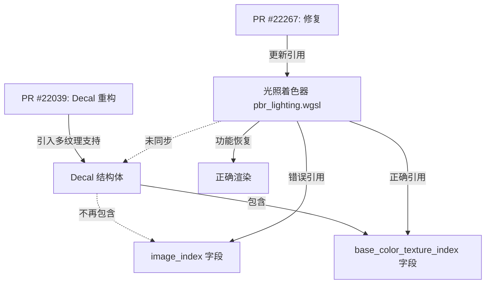

+++
title = "#22267 fix decal index selection in light textures"
date = "2025-12-29T00:00:00"
draft = false
template = "pull_request_page.html"
in_search_index = false

[extra]
current_language = "zh-cn"
available_languages = {"en" = { name = "English", url = "/pull_request/bevy/2025-12/pr-22267-en-20251229" }, "zh-cn" = { name = "中文", url = "/pull_request/bevy/2025-12/pr-22267-zh-cn-20251229" }}
labels = ["A-Rendering"]
+++

# Title
fix decal index selection in light textures

## Basic Information
- **Title**: fix decal index selection in light textures
- **PR Link**: https://github.com/bevyengine/bevy/pull/22267
- **Author**: ChristopherBiscardi
- **Status**: MERGED
- **Labels**: A-Rendering, S-Ready-For-Final-Review
- **Created**: 2025-12-25T17:04:39Z
- **Merged**: 2025-12-29T18:12:22Z
- **Merged By**: mockersf

## Description Translation
# 目标

https://github.com/bevyengine/bevy/pull/22039 修改了与一个decal（贴花）关联的贴图数量。光照纹理使用了decal的基础贴图，忽略了其他的贴图。

修复问题 #22266

## 解决方案

使用基础颜色贴图的索引。

## 测试

```
cargo run --example light_textures --features="pbr_light_textures"
```

## 效果展示

### 修复前


### 修复后


## The Story of This Pull Request

这个PR源于一个由前序PR引入的兼容性问题。PR #22039 修改了Bevy渲染引擎中Decal（贴花）系统的内部数据结构，使其能够支持多个贴图（例如基础颜色、法线、金属粗糙度等）。然而，这次重构并没有完全更新所有相关的代码路径。

问题的核心在于`pbr_lighting.wgsl`着色器文件中的光照计算逻辑。`Decal`结构体在Rust端的定义被更新了，从一个单一的`image_index`字段变为了存储多个贴图索引的结构，其中`base_color_texture_index`字段专门用于存储基础颜色贴图的索引。但是，在WGSL着色器代码中，光照函数（点光源、聚光灯、平行光）仍然在尝试访问旧的、已不存在的`image_index`字段来获取纹理。这导致着色器读取了错误的内存数据，进而引发了渲染错误，具体表现为贴花纹理无法正确应用到光照纹理上，如图片展示的那样。

解决这个问题的方法非常直接。开发者需要确保着色器代码与Rust端的结构体定义保持同步。修复方案就是简单地将三处`image_index`的引用替换为正确的`base_color_texture_index`。

这个修复虽然只涉及三行代码的修改，但至关重要。它确保了光照系统能够正确地索引到decal的基础颜色纹理，从而让基于贴花的投影纹理光照功能恢复正常。这个案例提醒我们，在修改底层数据结构（尤其是在渲染管线中）时，必须仔细检查所有依赖该结构的代码，包括CPU端的Rust代码和GPU端的着色器代码。即使是一个微小的字段重命名或结构调整，如果漏掉了对某处着色器代码的更新，也可能导致难以调试的渲染错误。

## Visual Representation



## Key Files Changed

- `crates/bevy_pbr/src/render/pbr_lighting.wgsl` (+3/-3)

此文件是Bevy PBR（基于物理的渲染）管线中的核心WebGPU着色语言（WGSL）文件，负责计算点光源、聚光灯和平行光的光照贡献。PR的修改发生在此文件中访问Decal纹理索引的三处地方。

1.  **修改详情**：在三个不同的光照函数（`point_light`, `spot_light`, `directional_light`）中，将获取Decal纹理索引的字段从`image_index`更正为`base_color_texture_index`。这个改动是为了与Rust端的`Decal`结构体定义保持一致。

```wgsl
// File: crates/bevy_pbr/src/render/pbr_lighting.wgsl
// 修改前（第714行，point_light函数内）：
let image_index = view_bindings::clustered_decals.decals[(*light).decal_index].image_index;

// 修改后（第714行，point_light函数内）：
let image_index = view_bindings::clustered_decals.decals[(*light).decal_index].base_color_texture_index;

// 修改前（第762行，spot_light函数内）：
let image_index = view_bindings::clustered_decals.decals[(*light).decal_index].image_index;

// 修改后（第762行，spot_light函数内）：
let image_index = view_bindings::clustered_decals.decals[(*light).decal_index].base_color_texture_index;

// 修改前（第843行，directional_light函数内）：
let image_index = view_bindings::clustered_decals.decals[(*light).decal_index].image_index;

// 修改后（第843行，directional_light函数内）：
let image_index = view_bindings::clustered_decals.decals[(*light).decal_index].base_color_texture_index;
```

2.  **与PR目标的关系**：这个文件是问题发生的直接位置。PR #22039修改了数据源的字段名，但未同步更新此消费端的着色器代码，导致了字段引用错误。此PR的修改直接解决了这个不一致问题，是修复渲染错误的关键。

## Further Reading

1.  **相关PR**: [PR #22039](https://github.com/bevyengine/bevy/pull/22039) - 这是引入变更的前序PR，理解它如何修改`Decal`结构体有助于更全面地理解本修复的背景。
2.  **Bevy 渲染管线文档**: 官方文档或社区指南中关于PBR渲染、光照和贴花系统的部分，可以帮助理解这些组件如何协同工作。
3.  **WGSL 规范**: WebGPU Shading Language 的规范，有助于理解着色器代码的语法和结构，特别是`view_bindings`和纹理采样的部分。
4.  **Issue #22266**: 本PR修复的原始问题报告，可能包含更多的错误现象和讨论细节。

# Full Code Diff
diff --git a/crates/bevy_pbr/src/render/pbr_lighting.wgsl b/crates/bevy_pbr/src/render/pbr_lighting.wgsl
index 6dff89c041a9f..e4724b89c02e3 100644
--- a/crates/bevy_pbr/src/render/pbr_lighting.wgsl
+++ b/crates/bevy_pbr/src/render/pbr_lighting.wgsl
@@ -711,7 +711,7 @@ fn point_light(
         let relative_position = (view_bindings::clustered_decals.decals[(*light).decal_index].local_from_world * vec4(P, 1.0)).xyz;
         let cubemap_type = view_bindings::clustered_decals.decals[(*light).decal_index].tag;
         let decal_uv = cubemap_uv(relative_position, cubemap_type);
-        let image_index = view_bindings::clustered_decals.decals[(*light).decal_index].image_index;
+        let image_index = view_bindings::clustered_decals.decals[(*light).decal_index].base_color_texture_index;
 
         texture_sample = textureSampleLevel(
             view_bindings::clustered_decal_textures[image_index],
@@ -759,7 +759,7 @@ fn spot_light(
             vec4((*input).P, 1.0)).xyz;
         if local_position.z < 0.0 {
             let decal_uv = (local_position.xy / (local_position.z * (*light).spot_light_tan_angle)) * vec2(-0.5, 0.5) + 0.5;
-            let image_index = view_bindings::clustered_decals.decals[(*light).decal_index].image_index;
+            let image_index = view_bindings::clustered_decals.decals[(*light).decal_index].base_color_texture_index;
 
             texture_sample = textureSampleLevel(
                 view_bindings::clustered_decal_textures[image_index],
@@ -840,7 +840,7 @@ fn directional_light(
         if (view_bindings::clustered_decals.decals[(*light).decal_index].tag != 0u)
                 || all(clamp(decal_uv, vec2(0.0), vec2(1.0)) == decal_uv)
         {
-            let image_index = view_bindings::clustered_decals.decals[(*light).decal_index].image_index;
+            let image_index = view_bindings::clustered_decals.decals[(*light).decal_index].base_color_texture_index;
 
             texture_sample = textureSampleLevel(
                 view_bindings::clustered_decal_textures[image_index],