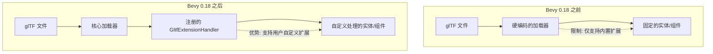

+++
title = "#22268 gltf extension handler release notes"
date = "2025-12-30T00:00:00"
draft = false
template = "pull_request_page.html"
in_search_index = false

[extra]
current_language = "zh-cn"
available_languages = {"en" = { name = "English", url = "/pull_request/bevy/2025-12/pr-22268-en-20251230" }, "zh-cn" = { name = "中文", url = "/pull_request/bevy/2025-12/pr-22268-zh-cn-20251230" }}
+++

# Title

## 基本信息
- **标题**: gltf extension handler release notes
- **PR链接**: https://github.com/bevyengine/bevy/pull/22268
- **作者**: ChristopherBiscardi
- **状态**: 已合并
- **标签**: C-Docs, S-Ready-For-Final-Review, A-glTF
- **创建时间**: 2025-12-25T17:39:56Z
- **合并时间**: 2025-12-30T21:17:08Z
- **合并者**: alice-i-cecile

## 描述翻译
#22106 的发布说明

## 这个 Pull Request 的故事

这次 PR 是一个纯文档更新，为 Bevy 引擎中新实现的用户空间 glTF 扩展处理功能添加发布说明。该功能通过 PR #22106 引入，允许开发者通过实现 `GltfExtensionHandler` trait 来自定义处理 glTF 文件中的扩展数据。

在此之前，Bevy 的 glTF 加载器对扩展（如 `KHR_lights_punctual`）的处理是硬编码在引擎内部的。这种方式限制了用户自定义处理 glTF 数据的能力，特别是当需要处理引擎尚未内置支持的扩展时。对于需要特定数据转换或自定义组件注入的用例，开发者必须通过后处理场景（scene）中的实体（entity）来实现，这既繁琐又容易出错。

新的 `GltfExtensionHandler` trait 提供了一个在加载过程中进行状态化处理的机制。开发者可以注册自定义的处理器，在 glTF 资源的加载流程中拦截并处理特定的扩展数据。这个设计的核心在于，要处理扩展数据，处理器必须同时能够访问和处理非扩展的核心数据，如网格（mesh）、材质（material）和动画（animation）等。这种设计确保了处理器能够在正确的上下文中工作，并能在加载过程中直接修改最终生成的实体和组件。

发布说明详细解释了 glTF 中两种扩展机制的区别："Extras"（额外数据）和"Extensions"（扩展）。Extras 用于存放应用特定的任意数据（例如用户在 Blender 中设置的自定义属性），Bevy 一直以来都通过 `GltfExtras` 组件支持这一特性。Extensions 则更强大和灵活，旨在定义可跨应用共享的数据格式，它允许在 glTF 文件结构的更多位置添加新类型的对象（如光源）或数据。

一个典型的使用案例是 Skein 项目。它定义了一个 glTF 扩展，允许将 Bevy 组件数据附加到 glTF 对象上。这个扩展数据通常由 Blender 生成，然后在 Bevy 中通过 Skein 实现的 `GltfExtensionHandler` 进行消费。这些组件会在场景加载时，与内置的 `Transform`、`Mesh3d` 等组件一同被插入到相应的实体上。采用 glTF 扩展格式的好处是，其他关卡编辑器（如 Trenchbroom）也能写入相同格式，实现了工具链的互操作性。

为了演示这一功能，Bevy 增加了两个新的示例。`gltf_extension_animation_graph` 示例展示了如何构建并插入一个 `AnimationGraph` 到动画根实体上。`gltf_extension_mesh_2d` 示例则演示了如何将一个 3D 网格和材质组件替换为其对应的 2D 版本，这对于使用 3D 建模软件（如 Blender）来构建 2D 世界的场景非常有用。

这次发布说明的编写直接明了，没有过度修饰。它清晰地阐述了新功能的定位、解决了什么问题、如何使用，并提供了具体用例和示例，帮助开发者快速理解并应用这一新特性。这是一种非常有效的技术文档风格，聚焦于传递实用信息而非制造叙事。

## 视觉表示



## 关键文件变更

- `release-content/release-notes/gltf_extension_handling.md` (+53/-0)
  这是一个全新的文件，专门用于记录 glTF 扩展处理功能的发布说明。文件内容结构清晰，首先点明新功能解决的问题（硬编码处理），然后介绍新机制（`GltfExtensionHandler` trait），接着详细区分了 glTF 中的 "Extras" 和 "Extensions" 概念，并通过案例研究和示例来说明实际应用场景。这种文档模式对于引导用户理解和使用新 API 非常有帮助。

**关键代码片段（文件内容）：**
```markdown
---
title: "Userspace glTF Extension Handling"
authors: ["@christopherbiscardi"]
pull_requests: [22106]
---

Prior to 0.18, the code to handle extensions like `KHR_lights_punctual` was hardcoded into Bevy's glTF loader.
In 0.18, users may implement the `GltfExtensionHandler` trait to do stateful processing of glTF data as it loads.
Processing _extension_ data is only half the story here because to process extension data you also have to be able to process the non-extension data like meshes, materials, animations, and more.

Extension handlers can be written for wide variety of use cases, including:

- Insert Bevy Component data on entities
- Convert all `Mesh3d` components to `Mesh2d`
- Build `AnimationGraph`s and insert them on animation roots
- Replace `StandardMaterial` with custom materials
- Insert lightmaps

## Extras vs Extensions

glTF has two mechanisms for extending glTF files with additional user data: Extras and Extensions.

**Extras** are meant to be arbitrary application-specific data, often authored by users directly in tools like Blender's custom properties.
Extras are historically well supported by Bevy; If you add a custom property in Blender that data will end up in one of the `GltfExtras` components on the relevant `Entity`.

**Extensions** are meant for data that can be shared across applications.
They are more flexible, allowing for new data in more places inside a glTF file, and more powerful as a result.
Extensions can add new object types, such as `lights` from the `KHR_lights_punctual` extension, as well as arbitrary buffers, data that is at the root of the glTF file, and more.

More examples of extensions can be found in the [KhronosGroup git repo](https://github.com/KhronosGroup/glTF/blob/7bbd90978cad06389eee3a36882c5ef2f2039faf/extensions/README.md)

## Case Study

Extensions typically require an application that is _producing_ the data as well as _consuming_ the data.

For example: [Skein](https://github.com/rust-adventure/skein) defines a glTF extension that allows adding Bevy Components to glTF objects.
This is most commonly produced by Blender and consumed by Skein's `GltfExtensionHandler` in Bevy.
These components are then inserted on entities in a scene at the same time built-in components like `Transform` and `Mesh3d` are.

Using glTF Extensions for this data means that other level editors like Trenchbroom can also write the same format to glTF files.
Any third party software that writes component data into a glTF file can use Skein's `GltfExtensionHandler`, resulting in components being "ready-to-go" when spawning `Scene`s.

## New Examples

Two new examples show off use cases:

- The first builds an `AnimationGraph` and inserts it onto the animation root in a Scene, which means it is now accessible to play animations using the `AnimationPlayer` on the same `Entity` later when that Scene is spawned.
- The second uses a `GltfExtensionHandler` to switch the 3d Mesh and Material components for their 2d counterparts. This is useful if you're using software like Blender to build 2d worlds.

```shell
cargo run --example gltf_extension_animation_graph
cargo run --example gltf_extension_mesh_2d
```
```

## 扩展阅读
- **glTF 扩展官方列表**: [KhronosGroup/glTF extensions README](https://github.com/KhronosGroup/glTF/blob/7bbd90978cad06389eee3a36882c5ef2f2039faf/extensions/README.md) - 了解 glTF 生态中已有的各种扩展。
- **Skein 项目**: [rust-adventure/skein](https://github.com/rust-adventure/skein) - 一个实践 `GltfExtensionHandler` 的具体案例，展示了如何通过扩展在 glTF 中存储和加载 Bevy 组件。
- **Bevy 示例代码**: 查看 `examples/3d/gltf_extension_animation_graph.rs` 和 `examples/3d/gltf_extension_mesh_2d.rs`，这是学习如何实现 `GltfExtensionHandler` trait 的最佳起点。
- **相关 PR #22106**: 这是实现该功能的核心代码变更，阅读其代码可以深入理解 `GltfExtensionHandler` 的内部工作机制和 API 设计。

# Full Code Diff
diff --git a/release-content/release-notes/gltf_extension_handling.md b/release-content/release-notes/gltf_extension_handling.md
new file mode 100644
index 0000000000000..f2753aaf16c30
--- /dev/null
+++ b/release-content/release-notes/gltf_extension_handling.md
@@ -0,0 +1,53 @@
+---
+title: "Userspace glTF Extension Handling"
+authors: ["@christopherbiscardi"]
+pull_requests: [22106]
+---
+
+Prior to 0.18, the code to handle extensions like `KHR_lights_punctual` was hardcoded into Bevy's glTF loader.
+In 0.18, users may implement the `GltfExtensionHandler` trait to do stateful processing of glTF data as it loads.
+Processing _extension_ data is only half the story here because to process extension data you also have to be able to process the non-extension data like meshes, materials, animations, and more.
+
+Extension handlers can be written for wide variety of use cases, including:
+
+- Insert Bevy Component data on entities
+- Convert all `Mesh3d` components to `Mesh2d`
+- Build `AnimationGraph`s and insert them on animation roots
+- Replace `StandardMaterial` with custom materials
+- Insert lightmaps
+
+## Extras vs Extensions
+
+glTF has two mechanisms for extending glTF files with additional user data: Extras and Extensions.
+
+**Extras** are meant to be arbitrary application-specific data, often authored by users directly in tools like Blender's custom properties.
+Extras are historically well supported by Bevy; If you add a custom property in Blender that data will end up in one of the `GltfExtras` components on the relevant `Entity`.
+
+**Extensions** are meant for data that can be shared across applications.
+They are more flexible, allowing for new data in more places inside a glTF file, and more powerful as a result.
+Extensions can add new object types, such as `lights` from the `KHR_lights_punctual` extension, as well as arbitrary buffers, data that is at the root of the glTF file, and more.
+
+More examples of extensions can be found in the [KhronosGroup git repo](https://github.com/KhronosGroup/glTF/blob/7bbd90978cad06389eee3a36882c5ef2f2039faf/extensions/README.md)
+
+## Case Study
+
+Extensions typically require an application that is _producing_ the data as well as _consuming_ the data.
+
+For example: [Skein](https://github.com/rust-adventure/skein) defines a glTF extension that allows adding Bevy Components to glTF objects.
+This is most commonly produced by Blender and consumed by Skein's `GltfExtensionHandler` in Bevy.
+These components are then inserted on entities in a scene at the same time built-in components like `Transform` and `Mesh3d` are.
+
+Using glTF Extensions for this data means that other level editors like Trenchbroom can also write the same format to glTF files.
+Any third party software that writes component data into a glTF file can use Skein's `GltfExtensionHandler`, resulting in components being "ready-to-go" when spawning `Scene`s.
+
+## New Examples
+
+Two new examples show off use cases:
+
+- The first builds an `AnimationGraph` and inserts it onto the animation root in a Scene, which means it is now accessible to play animations using the `AnimationPlayer` on the same `Entity` later when that Scene is spawned.
+- The second uses a `GltfExtensionHandler` to switch the 3d Mesh and Material components for their 2d counterparts. This is useful if you're using software like Blender to build 2d worlds.
+
+```shell
+cargo run --example gltf_extension_animation_graph
+cargo run --example gltf_extension_mesh_2d
+```