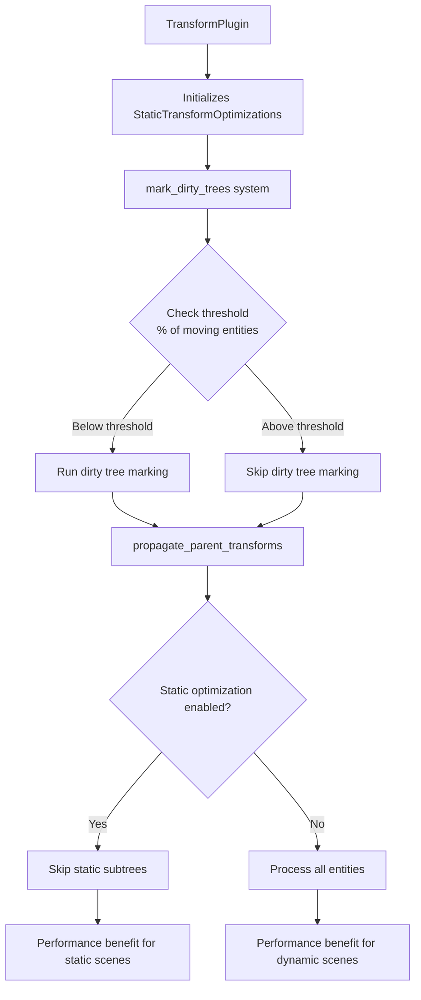

+++
title = "#22281 Optimize transform propagation for dynamic scenes"
date = "2025-12-30T00:00:00"
draft = false
template = "pull_request_page.html"
in_search_index = true

[taxonomies]
list_display = ["show"]

[extra]
current_language = "en"
available_languages = {"en" = { name = "English", url = "/pull_request/bevy/2025-12/pr-22281-en-20251230" }, "zh-cn" = { name = "中文", url = "/pull_request/bevy/2025-12/pr-22281-zh-cn-20251230" }}
labels = ["C-Performance", "A-Transform", "D-Straightforward"]
+++

# Optimize transform propagation for dynamic scenes

## Basic Information
- **Title**: Optimize transform propagation for dynamic scenes
- **PR Link**: https://github.com/bevyengine/bevy/pull/22281
- **Author**: aevyrie
- **Status**: MERGED
- **Labels**: C-Performance, S-Ready-For-Final-Review, A-Transform, X-Uncontroversial, D-Straightforward
- **Created**: 2025-12-26T21:18:20Z
- **Merged**: 2025-12-30T01:31:57Z
- **Merged By**: alice-i-cecile

## Description Translation

# Objective

- Follow up from previous transform optimization (#18589), make the `mark_dirty_trees` system more intelligent - don't run this expensive static scene optimization for dynamic scenes.
- Using a threshold was mentioned as a follow up in that PR, and we also want this threshold to be user-configurable.
- This was not implemented previously because the optimizations were still large improvements even in dynamic scenes thanks to the improved parallelism #17840

## Solution

- Don't run static scene optimization (dirty tree tracking) for very dynamic scenes - defined here as scenes where more than 30% of objects have their `Transform` updated.
- This is configurable with a percentage threshold, or it can be unconditionally enabled or disabled when setting to `0.0` or `1.0` to avoid the cost of computing the threshold.
- For dynamic scenes, this makes transform prop much faster, twice as fast in the stress tests shown here.

## Testing

transform_hierarchy stress tests, all of these cases spawn about a quarter million entities:

- humanoids_active - dynamic scene that should be faster than `main`:


- humanoids_inactive - static scene that should be unchanged from `main`:


- humanoids_mixed - half dynamic scene that should be faster than `main`


- large_tree - dynamic scene (50% of entities are moved) we expect to see improvements


## The Story of This Pull Request

This PR addresses a performance optimization problem in Bevy's transform system. The core issue is that previous optimizations for static scenes introduced overhead that becomes counterproductive in dynamic scenes where many entities move each frame.

The transform system in Bevy uses a hierarchy where parent transforms affect their children. When a transform changes, the system needs to propagate these changes through the hierarchy. Previous work (#18589) introduced an optimization that tracks "dirty trees" - marking entire subtrees as unchanged when their transforms haven't been modified, allowing the system to skip expensive propagation work for static portions of the scene.

However, this optimization has a cost: the system needs to track which entities have changed and propagate dirty flags up the hierarchy. In highly dynamic scenes where many entities move each frame, this tracking work can exceed the benefits of skipping static subtrees. The PR author notes that this wasn't implemented earlier because parallelization improvements (#17840) still provided benefits even in dynamic scenes.

The solution introduces a configurable threshold system. The new `StaticTransformOptimizations` resource tracks whether static scene optimization should be enabled based on the percentage of moving entities. By default, if more than 30% of entities have their `Transform` updated, the system disables the dirty tree tracking entirely.

The implementation works by having the `mark_dirty_trees` system count how many entities have changed transforms each frame and compare this to the total number of entities with transforms. If the percentage exceeds the threshold, the system skips the dirty tree marking entirely:

```rust
let n_dyn = changed_transforms.count() as f32;
let total = transforms.count() as f32;
if n_dyn / total > threshold {
    static_optimizations.enabled = false;
}
```

This check happens early in the system, so when optimization is disabled, the system returns immediately without performing any dirty tree marking work.

The `propagate_parent_transforms` system then checks the `enabled` flag and skips processing for entities that aren't marked as dirty when optimization is enabled:

```rust
if static_optimizations.enabled && !transform_tree.is_changed() {
    // Early exit if the subtree is static and the optimization is enabled.
    return;
}
```

The threshold is user-configurable, with special cases for 0.0 (always disabled) and 1.0 (always enabled) to avoid the overhead of computing percentages.

The performance impact is significant for dynamic scenes. In stress tests with ~250,000 entities, dynamic scenes show approximately 2x speed improvement for transform propagation. Static scenes remain unchanged, as the optimization continues to work for them.

One important design decision is that the threshold comparison uses a simple percentage of moving entities rather than a more complex heuristic. This keeps the implementation straightforward and predictable. The 30% default was likely chosen through empirical testing as a reasonable balance point.

The changes are minimal and focused. The main modifications are:
1. Adding the `StaticTransformOptimizations` resource
2. Modifying `mark_dirty_trees` to conditionally run based on the threshold
3. Modifying `propagate_parent_transforms` to respect the optimization state
4. Updating tests and examples to initialize the new resource

This approach demonstrates a common performance optimization pattern: adding conditional logic to skip expensive operations when they're not beneficial. The key insight is recognizing that optimizations designed for one workload (static scenes) can become overhead for different workloads (dynamic scenes), and the solution is to dynamically detect which workload you're dealing with.

## Visual Representation



## Key Files Changed

### `crates/bevy_transform/src/systems.rs` (+127/-14)

This file contains the core implementation changes. The main additions are:

1. **New `StaticTransformOptimizations` resource**:
```rust
#[derive(Resource, Debug)]
#[cfg_attr(feature = "bevy_reflect", derive(bevy_reflect::Reflect))]
pub struct StaticTransformOptimizations {
    /// If the percentage of moving objects exceeds this value, skip dirty tree marking.
    threshold: f32,
    /// Updated every frame by [`mark_dirty_trees`].
    enabled: bool,
}
```

2. **Modified `mark_dirty_trees` system** with threshold checking:
```rust
let threshold = static_optimizations.threshold.clamp(0.0, 1.0);
match threshold {
    0.0 => static_optimizations.enabled = false,
    1.0 => static_optimizations.enabled = true,
    _ => {
        static_optimizations.enabled = true;
        let n_dyn = changed_transforms.count() as f32;
        let total = transforms.count() as f32;
        if n_dyn / total > threshold {
            static_optimizations.enabled = false;
        }
    }
}
if !static_optimizations.enabled {
    return;
}
```

3. **Modified `propagate_parent_transforms` system** to check the optimization state:
```rust
if static_optimizations.enabled && !transform_tree.is_changed() {
    // Early exit if the subtree is static and the optimization is enabled.
    return;
}
```

### `crates/bevy_transform/src/plugins.rs` (+5/-2)

The plugin now initializes the `StaticTransformOptimizations` resource:
```rust
impl Plugin for TransformPlugin {
    fn build(&self, app: &mut App) {
        app.init_resource::<StaticTransformOptimizations>()
        // ... rest of plugin setup
    }
}
```

### `crates/bevy_transform/src/lib.rs` (+4/-1)

Exports the new `StaticTransformOptimizations` type from the prelude:
```rust
pub use prelude::{
    StaticTransformOptimizations, TransformPlugin, TransformPoint, TransformSystems,
};
```

### `crates/bevy_ui/src/layout/mod.rs` (+1/-0)

Adds initialization of `StaticTransformOptimizations` in UI tests:
```rust
app.init_resource::<bevy_transform::StaticTransformOptimizations>();
```

### `examples/stress_tests/bevymark.rs` (+1/-0) and `examples/stress_tests/many_foxes.rs` (+1/-0)

These stress tests disable the static optimizations since they represent dynamic scenes:
```rust
.insert_resource(StaticTransformOptimizations::disabled())
```

## Further Reading

1. [Original transform optimization PR #18589](https://github.com/bevyengine/bevy/pull/18589) - The previous optimization that introduced dirty tree tracking
2. [Parallelization improvements #17840](https://github.com/bevyengine/bevy/pull/17840) - Made transform propagation parallel
3. [Bevy Transform System Documentation](https://docs.rs/bevy_transform/latest/bevy_transform/) - Official documentation for Bevy's transform system
4. [Entity Component System Pattern](https://en.wikipedia.org/wiki/Entity_component_system) - Background on ECS architecture used by Bevy

# Full Code Diff
<details>
<summary>Click to expand full diff</summary>

```diff
diff --git a/crates/bevy_transform/src/lib.rs b/crates/bevy_transform/src/lib.rs
index 240d96df5b152..d87d6ba63f037 100644
--- a/crates/bevy_transform/src/lib.rs
+++ b/crates/bevy_transform/src/lib.rs
@@ -46,9 +46,12 @@ pub mod prelude {
         commands::BuildChildrenTransformExt,
         helper::TransformHelper,
         plugins::{TransformPlugin, TransformSystems},
+        systems::StaticTransformOptimizations,
         traits::TransformPoint,
     };
 }
 
 #[cfg(feature = "bevy-support")]
-pub use prelude::{TransformPlugin, TransformPoint, TransformSystems};
+pub use prelude::{
+    StaticTransformOptimizations, TransformPlugin, TransformPoint, TransformSystems,
+};
diff --git a/crates/bevy_transform/src/plugins.rs b/crates/bevy_transform/src/plugins.rs
index 49b34674aa30a..3881d93c56a3e 100644
--- a/crates/bevy_transform/src/plugins.rs
+++ b/crates/bevy_transform/src/plugins.rs
@@ -1,4 +1,7 @@
-use crate::systems::{mark_dirty_trees, propagate_parent_transforms, sync_simple_transforms};
+use crate::systems::{
+    mark_dirty_trees, propagate_parent_transforms, sync_simple_transforms,
+    StaticTransformOptimizations,
+};
 use bevy_app::{App, Plugin, PostStartup, PostUpdate};
 use bevy_ecs::schedule::{IntoScheduleConfigs, SystemSet};
 
@@ -15,7 +18,7 @@ pub struct TransformPlugin;
 
 impl Plugin for TransformPlugin {
     fn build(&self, app: &mut App) {
-        app
+        app.init_resource::<StaticTransformOptimizations>()
             // add transform systems to startup so the first update is "correct"
             .add_systems(
                 PostStartup,
diff --git a/crates/bevy_transform/src/systems.rs b/crates/bevy_transform/src/systems.rs
index 34366b1b3ce25..1e1ea8eb0217d 100644
--- a/crates/bevy_transform/src/systems.rs
+++ b/crates/bevy_transform/src/systems.rs
@@ -1,5 +1,6 @@
 use crate::components::{GlobalTransform, Transform, TransformTreeChanged};
 use bevy_ecs::prelude::*;
+
 #[cfg(feature = "std")]
 pub use parallel::propagate_parent_transforms;
 #[cfg(not(feature = "std"))]
@@ -40,27 +41,108 @@ pub fn sync_simple_transforms(
     }
 }
 
-/// Optimization for static scenes. Propagates a "dirty bit" up the hierarchy towards ancestors.
-/// Transform propagation can ignore entire subtrees of the hierarchy if it encounters an entity
-/// without the dirty bit.
+/// Configure the behavior of static scene optimizations for [`Transform`] propagation.
+///
+/// For scenes with many static entities, it is much faster to track trees of unchanged
+/// [`Transform`]s and skip these during the expensive transform propagation step. If your scene is
+/// very dynamic, the cost of tracking these trees can exceed the performance benefits. By default,
+/// static scene optimization is disabled for worlds with more than 30% of its entities moving.
+///
+/// This resource allows you to configure that threshold at runtime.
+#[derive(Resource, Debug)]
+#[cfg_attr(feature = "bevy_reflect", derive(bevy_reflect::Reflect))]
+pub struct StaticTransformOptimizations {
+    /// If the percentage of moving objects exceeds this value, skip dirty tree marking.
+    threshold: f32,
+    /// Updated every frame by [`mark_dirty_trees`].
+    enabled: bool,
+}
+
+impl StaticTransformOptimizations {
+    /// If the percentage of moving objects exceeds this threshold, disable static [`Transform`]
+    /// optimizations. This is done because the scene is so dynamic that the cost of tracking static
+    /// trees exceeds the performance benefit of skipping propagation for these trees.
+    ///
+    /// - Setting this to `0.0` will result in never running static scene tracking.
+    /// - Setting this to `1.0` will result in always tracking static transform trees.
+    pub fn from_threshold(threshold: f32) -> Self {
+        Self {
+            threshold,
+            enabled: true,
+        }
+    }
+
+    /// Unconditionally disable static scene optimizations.
+    pub fn disabled() -> Self {
+        Self {
+            threshold: 0.0,
+            enabled: false,
+        }
+    }
+
+    /// Unconditionally enable static scene optimizations.
+    pub fn enabled() -> Self {
+        Self {
+            threshold: 1.0,
+            enabled: true,
+        }
+    }
+}
+
+impl Default for StaticTransformOptimizations {
+    fn default() -> Self {
+        Self {
+            // Scenes with more than 30% moving objects are considered dynamic enough to skip static
+            // optimizations.
+            threshold: 0.3,
+            enabled: true,
+        }
+    }
+}
+
+/// Optimization for static scenes.
+///
+/// Propagates a "dirty bit" up the hierarchy towards ancestors. Transform propagation can ignore
+/// entire subtrees of the hierarchy if it encounters an entity without the dirty bit.
+///
+/// Configure behavior with [`StaticTransformOptimizations`].
 pub fn mark_dirty_trees(
     changed_transforms: Query<
         Entity,
         Or<(Changed<Transform>, Changed<ChildOf>, Added<GlobalTransform>)>,
     >,
     mut orphaned: RemovedComponents<ChildOf>,
-    mut transforms: Query<(Option<&ChildOf>, &mut TransformTreeChanged)>,
+    mut transforms: Query<&mut TransformTreeChanged>,
+    parents: Query<&ChildOf>,
+    mut static_optimizations: ResMut<StaticTransformOptimizations>,
 ) {
+    let threshold = static_optimizations.threshold.clamp(0.0, 1.0);
+    match threshold {
+        0.0 => static_optimizations.enabled = false,
+        1.0 => static_optimizations.enabled = true,
+        _ => {
+            static_optimizations.enabled = true;
+            let n_dyn = changed_transforms.count() as f32;
+            let total = transforms.count() as f32;
+            if n_dyn / total > threshold {
+                static_optimizations.enabled = false;
+            }
+        }
+    }
+    if !static_optimizations.enabled {
+        return;
+    }
+
     for entity in changed_transforms.iter().chain(orphaned.read()) {
         let mut next = entity;
-        while let Ok((child_of, mut tree)) = transforms.get_mut(next) {
+        while let Ok(mut tree) = transforms.get_mut(next) {
             if tree.is_changed() && !tree.is_added() {
                 // If the component was changed, this part of the tree has already been processed.
                 // Ignore this if the change was caused by the component being added.
                 break;
             }
             tree.set_changed();
-            if let Some(parent) = child_of.map(ChildOf::parent) {
+            if let Ok(parent) = parents.get(next).map(ChildOf::parent) {
                 next = parent;
             } else {
                 break;
@@ -250,6 +332,7 @@ mod serial {
 mod parallel {
     use crate::prelude::*;
     // TODO: this implementation could be used in no_std if there are equivalents of these.
+    use crate::systems::StaticTransformOptimizations;
     use alloc::{sync::Arc, vec::Vec};
     use bevy_ecs::{entity::UniqueEntityIter, prelude::*, system::lifetimeless::Read};
     use bevy_tasks::{ComputeTaskPool, TaskPool};
@@ -269,15 +352,27 @@ mod parallel {
     pub fn propagate_parent_transforms(
         mut queue: Local<WorkQueue>,
         mut roots: Query<
-            (Entity, Ref<Transform>, &mut GlobalTransform, &Children),
-            (Without<ChildOf>, Changed<TransformTreeChanged>),
+            (
+                Entity,
+                Ref<Transform>,
+                &mut GlobalTransform,
+                &Children,
+                Ref<TransformTreeChanged>,
+            ),
+            Without<ChildOf>,
         >,
         nodes: NodeQuery,
+        static_optimizations: Res<StaticTransformOptimizations>,
     ) {
         // Process roots in parallel, seeding the work queue
         roots.par_iter_mut().for_each_init(
             || queue.local_queue.borrow_local_mut(),
-            |outbox, (parent, transform, mut parent_transform, children)| {
+            |outbox, (parent, transform, mut parent_transform, children, transform_tree)| {
+                if static_optimizations.enabled && !transform_tree.is_changed() {
+                    // Early exit if the subtree is static and the optimization is enabled.
+                    return;
+                }
+
                 *parent_transform = GlobalTransform::from(*transform);
 
                 // SAFETY: the parent entities passed into this function are taken from iterating
@@ -292,6 +387,7 @@ mod parallel {
                         &nodes,
                         outbox,
                         &queue,
+                        &static_optimizations,
                         // Need to revisit this single-max-depth by profiling more representative
                         // scenes. It's possible that it is actually beneficial to go deep into the
                         // hierarchy to build up a good task queue before starting the workers.
@@ -323,15 +419,21 @@ mod parallel {
         let task_pool = ComputeTaskPool::get_or_init(TaskPool::default);
         task_pool.scope(|s| {
             (1..task_pool.thread_num()) // First worker is run locally instead of the task pool.
-                .for_each(|_| s.spawn(async { propagation_worker(&queue, &nodes) }));
-            propagation_worker(&queue, &nodes);
+                .for_each(|_| {
+                    s.spawn(async { propagation_worker(&queue, &nodes, &static_optimizations) });
+                });
+            propagation_worker(&queue, &nodes, &static_optimizations);
         });
     }
 
     /// A parallel worker that will consume processed parent entities from the queue, and push
     /// children to the queue once it has propagated their [`GlobalTransform`].
     #[inline]
-    fn propagation_worker(queue: &WorkQueue, nodes: &NodeQuery) {
+    fn propagation_worker(
+        queue: &WorkQueue,
+        nodes: &NodeQuery,
+        static_optimizations: &StaticTransformOptimizations,
+    ) {
         #[cfg(feature = "std")]
         let _span = bevy_log::info_span!("transform propagation worker").entered();
 
@@ -386,6 +488,7 @@ mod parallel {
                         nodes,
                         &mut outbox,
                         queue,
+                        static_optimizations,
                         // Only affects performance. Trees deeper than this will still be fully
                         // propagated, but the work will be broken into multiple tasks. This number
                         // was chosen to be larger than any reasonable tree depth, while not being
@@ -426,6 +529,7 @@ mod parallel {
         nodes: &NodeQuery,
         outbox: &mut Vec<Entity>,
         queue: &WorkQueue,
+        static_optimizations: &StaticTransformOptimizations,
         max_depth: usize,
     ) {
         // Create mutable copies of the input variables, used for iterative depth-first traversal.
@@ -448,7 +552,10 @@ mod parallel {
             let mut last_child = None;
             let new_children = children_iter.filter_map(
                 |(child, (transform, mut global_transform, tree), (children, child_of))| {
-                    if !tree.is_changed() && !p_global_transform.is_changed() {
+                    if static_optimizations.enabled
+                        && !tree.is_changed()
+                        && !p_global_transform.is_changed()
+                    {
                         // Static scene optimization
                         return None;
                     }
@@ -580,6 +687,7 @@ mod test {
             )
                 .chain(),
         );
+        world.insert_resource(StaticTransformOptimizations::default());
 
         let mut command_queue = CommandQueue::default();
         let mut commands = Commands::new(&mut command_queue, &world);
@@ -638,6 +746,7 @@ mod test {
             )
                 .chain(),
         );
+        world.insert_resource(StaticTransformOptimizations::default());
 
         // Root entity
         world.spawn(Transform::from_xyz(1.0, 0.0, 0.0));
@@ -675,6 +784,7 @@ mod test {
             )
                 .chain(),
         );
+        world.insert_resource(StaticTransformOptimizations::default());
 
         // Root entity
         let mut queue = CommandQueue::default();
@@ -714,6 +824,7 @@ mod test {
             )
                 .chain(),
         );
+        world.insert_resource(StaticTransformOptimizations::default());
 
         // Add parent entities
         let mut children = Vec::new();
@@ -793,7 +904,8 @@ mod test {
                 propagate_parent_transforms,
             )
                 .chain(),
-        );
+        )
+        .insert_resource(StaticTransformOptimizations::default());
 
         let translation = vec3(1.0, 0.0, 0.0);
 
@@ -913,6 +1025,7 @@ mod test {
             )
                 .chain(),
         );
+        world.insert_resource(StaticTransformOptimizations::default());
 
         // Spawn a `Transform` entity with a local translation of `Vec3::ONE`
         let mut spawn_transform_bundle =
diff --git a/crates/bevy_ui/src/layout/mod.rs b/crates/bevy_ui/src/layout/mod.rs
index 092d45bc285db..e88718a31cd0d 100644
--- a/crates/bevy_ui/src/layout/mod.rs
+++ b/crates/bevy_ui/src/layout/mod.rs
@@ -390,6 +390,7 @@ mod tests {
         app.init_resource::<bevy_text::TextPipeline>();
         app.init_resource::<bevy_text::CosmicFontSystem>();
         app.init_resource::<bevy_text::SwashCache>();
+        app.init_resource::<bevy_transform::StaticTransformOptimizations>();
 
         app.add_systems(
             PostUpdate,
diff --git a/examples/stress_tests/bevymark.rs b/examples/stress_tests/bevymark.rs
index f133a3b2a438c..0ea3ec137d288 100644
--- a/examples/stress_tests/bevymark.rs
+++ b/examples/stress_tests/bevymark.rs
@@ -142,6 +142,7 @@ fn main() {
             FrameTimeDiagnosticsPlugin::default(),
             LogDiagnosticsPlugin::default(),
         ))
+        .insert_resource(StaticTransformOptimizations::disabled())
         .insert_resource(WinitSettings::continuous())
         .insert_resource(args)
         .insert_resource(BevyCounter {
diff --git a/examples/stress_tests/many_foxes.rs b/examples/stress_tests/many_foxes.rs
index 10d7ece5929c7..ca5a5ddb83fb1 100644
--- a/examples/stress_tests/many_foxes.rs
+++ b/examples/stress_tests/many_foxes.rs
@@ -54,6 +54,7 @@ fn main() {
             FrameTimeDiagnosticsPlugin::default(),
             LogDiagnosticsPlugin::default(),
         ))
+        .insert_resource(StaticTransformOptimizations::disabled())
         .insert_resource(WinitSettings::continuous())
         .insert_resource(Foxes {
             count: args.count,
```

</details>