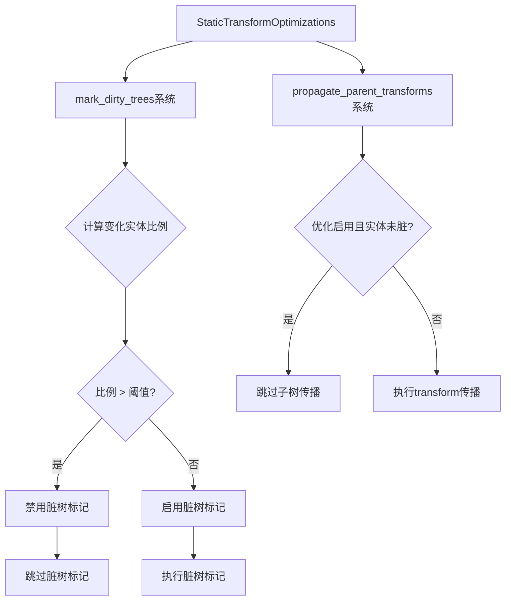

+++
title = "#22281 Optimize transform propagation for dynamic scenes"
date = "2025-12-30T00:00:00"
draft = false
template = "pull_request_page.html"
in_search_index = false

[extra]
current_language = "zh-cn"
available_languages = {"en" = { name = "English", url = "/pull_request/bevy/2025-12/pr-22281-en-20251230" }, "zh-cn" = { name = "中文", url = "/pull_request/bevy/2025-12/pr-22281-zh-cn-20251230" }}
labels = ["C-Performance", "A-Transform", "D-Straightforward"]
+++

# Title
PR #22281: Optimize transform propagation for dynamic scenes

## Basic Information
- **Title**: Optimize transform propagation for dynamic scenes
- **PR Link**: https://github.com/bevyengine/bevy/pull/22281
- **Author**: aevyrie
- **Status**: MERGED
- **Labels**: C-Performance, S-Ready-For-Final-Review, A-Transform, X-Uncontroversial, D-Straightforward
- **Created**: 2025-12-26T21:18:20Z
- **Merged**: 2025-12-30T01:31:57Z
- **Merged By**: alice-i-cecile

## Description Translation

# 目标

- 在之前transform优化(#18589)的基础上，让`mark_dirty_trees`系统更智能——不要对动态场景运行这种昂贵的静态场景优化。
- 在之前的PR中提到使用阈值作为后续改进，并且我们希望这个阈值可以由用户配置。
- 之前没有实现这个功能，因为即使在动态场景中，由于改进了并行性#17840，优化仍然是很大的改进。

## 解决方案

- 对于非常动态的场景（定义为此处超过30%的对象其`Transform`被更新的场景），不运行静态场景优化（脏树跟踪）。
- 这可以通过百分比阈值进行配置，或者可以通过设置为`0.0`或`1.0`来无条件启用或禁用，以避免计算阈值的成本。
- 对于动态场景，这使得transform传播更快，在本文所示的压力测试中快了两倍。

## 测试

transform_hierarchy压力测试，所有这些情况都生成了大约25万个实体：

- humanoids_active - 动态场景，应该比`main`分支更快：


- humanoids_inactive - 静态场景，应该与`main`分支相同：


- humanoids_mixed - 半动态场景，应该比`main`分支更快


- large_tree - 动态场景（50%的实体被移动），我们期望看到改进


## The Story of This Pull Request

这个PR的核心问题是解决Bevy引擎中transform传播系统在动态场景下的性能开销。在之前的PR #18589中，团队引入了一个静态场景优化——通过标记"脏树"来跳过未变化transform子树的传播计算。这个优化对静态场景很有效，但在高度动态的场景中，维护脏树跟踪本身的开销可能会超过其带来的收益。

开发者需要解决一个权衡问题：何时应该启用静态优化？在PR #18589中就已经提到使用阈值作为后续改进，但由于并行化改进#17840带来了显著收益，当时没有立即实现阈值机制。

解决方案是引入一个新的资源`StaticTransformOptimizations`，它允许根据场景的动态程度智能地启用或禁用脏树跟踪。具体来说，系统会计算每帧中被标记为"变化"的Transform实体的比例。如果这个比例超过配置的阈值（默认30%），系统就会跳过脏树标记，从而避免在高度动态场景中产生不必要的开销。

从实现角度看，这个PR展示了几个关键的技术决策：

1. **可配置的阈值系统**：`StaticTransformOptimizations`提供了灵活的配置选项，包括基于阈值的自动决策、无条件启用或禁用。阈值被限制在[0.0, 1.0]范围内，边界值0.0和1.0有特殊含义，可以避免不必要的计算。

2. **性能优化的实现**：在`mark_dirty_trees`系统中，只有当优化被启用时才会执行脏树标记。系统通过计算变化实体的比例来动态决定是否启用优化，这个计算本身是高效的——只进行计数操作。

3. **传播系统的集成**：并行传播系统`propagate_parent_transforms`现在会检查`StaticTransformOptimizations`资源的状态。如果优化被启用且实体没有被标记为脏，系统会跳过整个子树的传播计算。

4. **向后兼容性**：默认行为保持与之前相似，但对于高度动态的场景会自动禁用优化。压力测试显示，在动态场景中性能提升了约2倍，而静态场景的性能保持不变。

这个实现的一个关键洞察是：对于transform系统，没有一种优化策略适合所有场景。静态场景受益于脏树跟踪，而动态场景则应该避免这种开销。通过引入可配置的阈值，系统能够根据实际运行时的场景特性自动选择最优策略。

从代码架构角度看，这个PR展示了如何优雅地扩展现有的系统。新增的`StaticTransformOptimizations`资源与现有系统的集成是无缝的，所有的变化都被限制在transform模块内部，对API的影响最小。

## Visual Representation



## Key Files Changed

### `crates/bevy_transform/src/systems.rs` (+127/-14)
这是PR中最核心的修改文件，包含了主要的算法实现。

**关键变化1：新增StaticTransformOptimizations资源**
```rust
#[derive(Resource, Debug)]
#[cfg_attr(feature = "bevy_reflect", derive(bevy_reflect::Reflect))]
pub struct StaticTransformOptimizations {
    /// If the percentage of moving objects exceeds this value, skip dirty tree marking.
    threshold: f32,
    /// Updated every frame by [`mark_dirty_trees`].
    enabled: bool,
}
```
这个资源允许配置阈值并跟踪当前优化状态。提供了`from_threshold()`、`disabled()`和`enabled()`等构造方法。

**关键变化2：修改mark_dirty_trees系统**
```rust
pub fn mark_dirty_trees(
    changed_transforms: Query<Entity, Or<(Changed<Transform>, Changed<ChildOf>, Added<GlobalTransform>)>>,
    // ... 其他参数
    mut static_optimizations: ResMut<StaticTransformOptimizations>,
) {
    let threshold = static_optimizations.threshold.clamp(0.0, 1.0);
    match threshold {
        0.0 => static_optimizations.enabled = false,
        1.0 => static_optimizations.enabled = true,
        _ => {
            static_optimizations.enabled = true;
            let n_dyn = changed_transforms.count() as f32;
            let total = transforms.count() as f32;
            if n_dyn / total > threshold {
                static_optimizations.enabled = false;
            }
        }
    }
    if !static_optimizations.enabled {
        return;
    }
    // ... 原来的脏树标记逻辑
}
```
系统现在会根据阈值决定是否执行脏树标记。边界值0.0和1.0有特殊处理以避免不必要的计算。

**关键变化3：修改并行传播系统**
```rust
if static_optimizations.enabled && !transform_tree.is_changed() {
    // Early exit if the subtree is static and the optimization is enabled.
    return;
}
```
在`propagate_parent_transforms`中，如果优化启用且实体未标记为脏，则跳过整个子树的传播计算。

### `crates/bevy_transform/src/plugins.rs` (+5/-2)
**修改TransformPlugin以初始化资源**
```rust
impl Plugin for TransformPlugin {
    fn build(&self, app: &mut App) {
        app.init_resource::<StaticTransformOptimizations>()
            // ... 其他系统
    }
}
```
在插件构建时初始化`StaticTransformOptimizations`资源，确保系统可用。

### `crates/bevy_transform/src/lib.rs` (+4/-1)
**导出新类型**
```rust
pub use prelude::{
    StaticTransformOptimizations, TransformPlugin, TransformPoint, TransformSystems,
};
```
将`StaticTransformOptimizations`添加到公开API中，方便用户使用。

### `crates/bevy_ui/src/layout/mod.rs` (+1/-0)
**在UI测试中初始化资源**
```rust
app.init_resource::<bevy_transform::StaticTransformOptimizations>();
```
确保UI布局测试中transform优化资源被正确初始化。

### `examples/stress_tests/bevymark.rs` 和 `examples/stress_tests/many_foxes.rs` (+1/-0 每个)
**在压力测试中禁用优化**
```rust
.insert_resource(StaticTransformOptimizations::disabled())
```
在压力测试示例中明确禁用静态优化，以确保测试结果的稳定性和可预测性。

## Further Reading

1. **Bevy Transform System Documentation**: 了解Bevy中transform系统的基本工作原理
2. **Entity Component System (ECS) Pattern**: 理解Bevy使用的ECS架构模式
3. **Performance Optimization Techniques in Game Engines**: 学习游戏引擎中常见的性能优化策略
4. **PR #18589**: 查看之前的transform优化实现，了解脏树跟踪的原始设计
5. **PR #17840**: 了解transform传播的并行化改进，这是本PR提及的背景优化