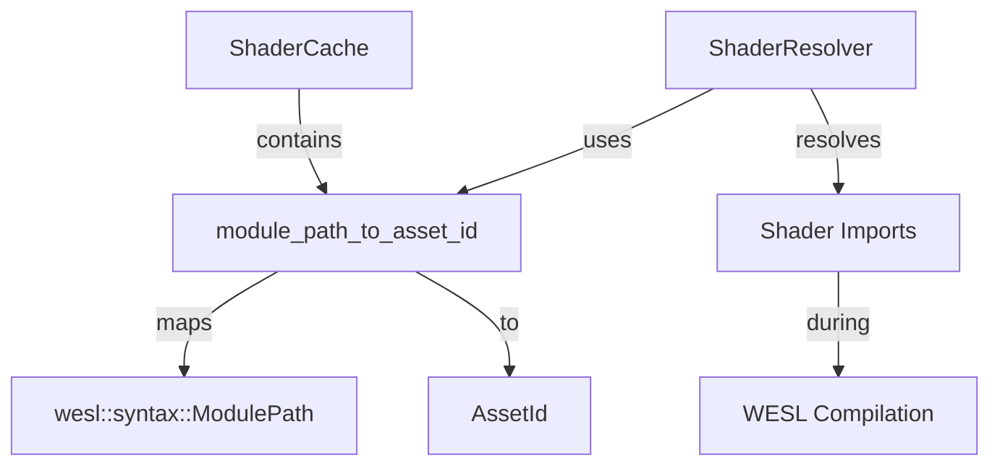

+++
title = "#22283 Rename `asset_paths` to `module_path_to_asset_id`."
date = "2025-12-30T00:00:00"
draft = false
template = "pull_request_page.html"
in_search_index = true

[taxonomies]
list_display = ["show"]

[extra]
current_language = "en"
available_languages = {"en" = { name = "English", url = "/pull_request/bevy/2025-12/pr-22283-en-20251230" }, "zh-cn" = { name = "中文", url = "/pull_request/bevy/2025-12/pr-22283-zh-cn-20251230" }}
labels = ["D-Trivial", "A-Rendering", "A-Assets", "C-Code-Quality"]
+++

# Title
Rename `asset_paths` to `module_path_to_asset_id`

## Basic Information
- **Title**: Rename `asset_paths` to `module_path_to_asset_id`.
- **PR Link**: https://github.com/bevyengine/bevy/pull/22283
- **Author**: andriyDev
- **Status**: MERGED
- **Labels**: D-Trivial, A-Rendering, A-Assets, C-Code-Quality, S-Ready-For-Final-Review
- **Created**: 2025-12-26T23:09:35Z
- **Merged**: 2025-12-30T01:34:39Z
- **Merged By**: alice-i-cecile

## Description Translation
# Objective

- `asset_paths` is a confusing name since this doesn't store `AssetPath` at all!

## Solution

- Rename `asset_paths` to `module_path_to_asset_id`. Note this is primarily an internal detail, other than `ShaderResolver::new` whose argument is renamed (though I suspect `ShaderResolver::new` should actually be private).

## The Story of This Pull Request

The problem addressed by this PR was straightforward: a confusing field name in the Bevy shader caching system. The field `asset_paths` in `ShaderCache` didn't actually store `AssetPath` instances, but rather a mapping from `wesl::syntax::ModulePath` to `AssetId<Shader>`. This naming mismatch created potential confusion for developers working with the codebase, as the field name suggested different contents than what it actually held.

The solution was a simple rename to `module_path_to_asset_id`, which more accurately reflects the field's purpose: it's a lookup table that maps WESL module paths to their corresponding shader asset IDs. This change improves code readability and maintainability by making the field's purpose immediately clear from its name.

The implementation required changing the field name in several locations:
1. The field declaration in the `ShaderCache` struct
2. The field initialization in `ShaderCache::new`
3. Two usage sites in `ShaderCache::process` where the field is accessed
4. One usage site in `ShaderCache::set_shader` where the field is modified
5. The corresponding changes in the `ShaderResolver` struct and its methods

The `ShaderResolver` struct, which uses this mapping to resolve shader imports during WESL shader compilation, also required updating its field name and constructor parameter. This change is particularly noticeable because `ShaderResolver::new` is a public method, but as noted in the PR description, this is primarily an internal implementation detail.

The technical context here involves Bevy's shader system and the WESL (WebGPU Shading Language) format. When Bevy compiles shaders, it needs to resolve imports between shader modules. The `ShaderCache` maintains this mapping to allow the `ShaderResolver` to look up shader source code by module path during the compilation process. The rename clarifies that this mapping specifically deals with WESL module paths, not general asset paths.

This change doesn't affect functionality or performance—it's purely a code quality improvement. The rename makes the code more self-documenting and reduces the cognitive load for developers who need to understand or modify the shader caching system. It also aligns with good software engineering practices where accurate naming is crucial for maintainable code.

## Visual Representation



## Key Files Changed

### `crates/bevy_shader/src/shader_cache.rs` (+16/-10)

This file contains the main implementation of Bevy's shader caching system. The changes rename a field to better reflect its actual purpose.

**Key Changes:**

1. **Field declaration in `ShaderCache` struct:**
```rust
// Before:
#[cfg(feature = "shader_format_wesl")]
asset_paths: HashMap<wesl::syntax::ModulePath, AssetId<Shader>>,

// After:
#[cfg(feature = "shader_format_wesl")]
module_path_to_asset_id: HashMap<wesl::syntax::ModulePath, AssetId<Shader>>,
```

2. **Field initialization in `ShaderCache::new`:**
```rust
// Before:
#[cfg(feature = "shader_format_wesl")]
asset_paths: Default::default(),

// After:
#[cfg(feature = "shader_format_wesl")]
module_path_to_asset_id: Default::default(),
```

3. **Usage in `ShaderCache::process` for creating `ShaderResolver`:**
```rust
// Before:
let shader_resolver = ShaderResolver::new(&self.asset_paths, &self.shaders);

// After:
let shader_resolver = ShaderResolver::new(&self.module_path_to_asset_id, &self.shaders);
```

4. **Insertion in `ShaderCache::set_shader`:**
```rust
// Before:
self.asset_paths
    .insert(wesl::syntax::ModulePath::from_path(path), id);

// After:
self.module_path_to_asset_id
    .insert(wesl::syntax::ModulePath::from_path(path), id);
```

5. **Corresponding changes in `ShaderResolver` struct and methods:**
```rust
// Before in struct:
asset_paths: &'a HashMap<wesl::syntax::ModulePath, AssetId<Shader>>,

// After in struct:
module_path_to_asset_id: &'a HashMap<wesl::syntax::ModulePath, AssetId<Shader>>,

// Before in constructor:
pub fn new(
    asset_paths: &'a HashMap<wesl::syntax::ModulePath, AssetId<Shader>>,
    shaders: &'a HashMap<AssetId<Shader>, Shader>,
) -> Self

// After in constructor:
pub fn new(
    module_path_to_asset_id: &'a HashMap<wesl::syntax::ModulePath, AssetId<Shader>>,
    shaders: &'a HashMap<AssetId<Shader>, Shader>,
) -> Self

// Before in resolve method:
let asset_id = self.asset_paths.get(module_path).ok_or_else(|| {
    wesl::ResolveError::ModuleNotFound(module_path.clone(), "Invalid asset id".to_string())
})?;

// After in resolve method:
let asset_id = self
    .module_path_to_asset_id
    .get(module_path)
    .ok_or_else(|| {
        wesl::ResolveError::ModuleNotFound(
            module_path.clone(),
            "Invalid asset id".to_string(),
        )
    })?;
```

These changes ensure that the field name consistently and accurately reflects its purpose throughout the codebase.

## Further Reading

1. **Bevy Assets System**: The official Bevy documentation on assets provides context for how `AssetId` is used throughout the engine: https://bevyengine.org/learn/book/features/assets/

2. **Rust HashMap Documentation**: Understanding Rust's HashMap is essential for working with mappings like `module_path_to_asset_id`: https://doc.rust-lang.org/std/collections/struct.HashMap.html

3. **Code Naming Best Practices**: Clean Code by Robert C. Martin discusses the importance of meaningful names in software development.

4. **WESL (WebGPU Shading Language)**: While not extensively documented outside the codebase, understanding WESL helps contextualize why module paths are used for shader imports.

5. **Bevy Shader System**: The Bevy shader system documentation provides background on how shaders are processed and cached in Bevy.