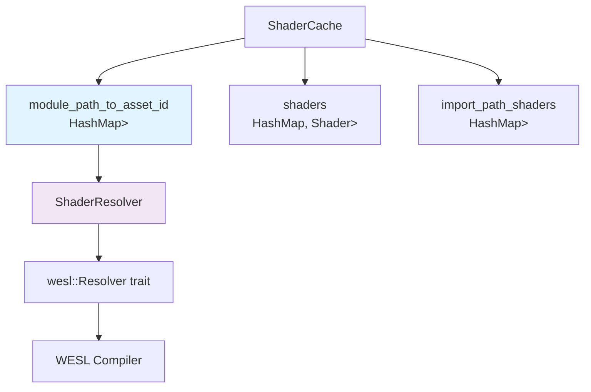

+++
title = "#22283 Rename `asset_paths` to `module_path_to_asset_id`."
date = "2025-12-30T00:00:00"
draft = false
template = "pull_request_page.html"
in_search_index = false

[extra]
current_language = "zh-cn"
available_languages = {"en" = { name = "English", url = "/pull_request/bevy/2025-12/pr-22283-en-20251230" }, "zh-cn" = { name = "中文", url = "/pull_request/bevy/2025-12/pr-22283-zh-cn-20251230" }}
+++

# 重命名 `asset_paths` 为 `module_path_to_asset_id`

## 基本信息
- **标题**: Rename `asset_paths` to `module_path_to_asset_id`.
- **PR 链接**: https://github.com/bevyengine/bevy/pull/22283
- **作者**: andriyDev
- **状态**: 已合并
- **标签**: D-Trivial, A-Rendering, A-Assets, C-Code-Quality, S-Ready-For-Final-Review
- **创建时间**: 2025-12-26T23:09:35Z
- **合并时间**: 2025-12-30T01:34:39Z
- **合并者**: alice-i-cecile

## 描述翻译

### 目标
- `asset_paths` 是一个容易引起误解的名称，因为它根本不存储 `AssetPath`！

### 解决方案
- 将 `asset_paths` 重命名为 `module_path_to_asset_id`。请注意，这主要是一个内部实现细节，除了 `ShaderResolver::new` 方法的参数被重命名（尽管我怀疑 `ShaderResolver::new` 实际上应该是私有的）。

## 本次 PR 的技术分析

这个 PR 的核心是解决一个变量命名误导性的问题。在 Bevy 的着色器系统中，有一个数据结构被用来跟踪着色器模块（module）与资源 ID 之间的映射关系，但之前的命名 `asset_paths` 暗示它存储的是资源路径（AssetPath），而实际上它存储的是从模块路径（ModulePath）到资源 ID（AssetId<Shader>）的映射。这种命名不一致可能导致开发者误解该字段的实际用途。

问题的发现可能源于代码审查或调试过程中，开发者注意到 `ShaderCache` 结构体中的一个字段名为 `asset_paths`，但查看其类型声明 `HashMap<wesl::syntax::ModulePath, AssetId<Shader>>` 后发现，键是模块路径而不是资源路径。这种命名与实际类型不匹配的情况属于典型的代码质量问题，容易导致维护时的困惑。

解决方案直接明了：将字段重命名为 `module_path_to_asset_id`，使其更准确地反映其实际用途。这个新名称清楚地表明了这是一个从模块路径到资源 ID 的映射关系。虽然这只是一个重命名操作，没有改变任何功能逻辑，但对于代码的可读性和可维护性有重要意义。

从实现细节来看，这个 PR 修改了以下几个关键部分：

1. 在 `ShaderCache` 结构体中，将 `asset_paths` 字段重命名为 `module_path_to_asset_id`
2. 在 `ShaderCache` 的初始化代码中更新字段名
3. 在 `process` 方法中更新对 `ShaderResolver::new` 的调用参数
4. 在 `insert` 方法中更新对映射的插入操作
5. 在 `ShaderResolver` 结构体及其构造函数中也进行了相应的重命名

特别值得注意的是 `ShaderResolver` 结构体的变化。`ShaderResolver` 是一个实现了 `wesl::Resolver` trait 的解析器，用于在编译 WESL（WebGPU Shading Language）着色器时解析模块导入。重命名后，`ShaderResolver::new` 方法的参数也从 `asset_paths` 变为 `module_path_to_asset_id`，这进一步澄清了该参数的实际含义。

尽管作者在 PR 描述中提到 `ShaderResolver::new` 可能应该是私有的，但这个 PR 并未对此进行修改，保持了最小变更原则。这种谨慎的做法是值得肯定的，因为它避免了不必要的范围扩大，让 PR 专注于解决命名问题。

从工程实践的角度看，这个 PR 展示了良好的代码质量维护习惯。即使是看似简单的重命名操作，也需要仔细检查所有相关引用点，确保一致性。在大型代码库中，不准确的命名就像技术债务，会随着时间推移增加维护成本。及时修复这类问题有助于保持代码库的健康状态。

从技术架构角度看，这个重命名使得着色器缓存系统的内部数据结构更加清晰。`ShaderCache` 负责管理着色器资源的编译和缓存，而 `module_path_to_asset_id` 字段专门用于处理 WESL 着色器模块的导入解析。通过更准确的命名，后续开发者更容易理解这个字段在着色器编译流程中的作用。



## 关键文件更改

### `crates/bevy_shader/src/shader_cache.rs` (+16/-10)

这个文件包含了所有主要的修改。重命名操作涉及结构体字段、初始化代码和方法调用。

#### 1. ShaderCache 结构体字段重命名

```rust
// 之前:
#[cfg(feature = "shader_format_wesl")]
asset_paths: HashMap<wesl::syntax::ModulePath, AssetId<Shader>>,

// 之后:
#[cfg(feature = "shader_format_wesl")]
module_path_to_asset_id: HashMap<wesl::syntax::ModulePath, AssetId<Shader>>,
```

这个更改将字段名从容易误解的 `asset_paths` 改为更准确的 `module_path_to_asset_id`，清晰表明了这是一个从模块路径到资源 ID 的映射。

#### 2. ShaderCache 初始化代码更新

```rust
// 之前:
#[cfg(feature = "shader_format_wesl")]
asset_paths: Default::default(),

// 之后:
#[cfg(feature = "shader_format_wesl")]
module_path_to_asset_id: Default::default(),
```

初始化代码相应更新以匹配新的字段名。

#### 3. process 方法中的 ShaderResolver 调用更新

```rust
// 之前:
let shader_resolver = ShaderResolver::new(&self.asset_paths, &self.shaders);

// 之后:
let shader_resolver = ShaderResolver::new(&self.module_path_to_asset_id, &self.shaders);
```

在编译 WESL 着色器时，创建 `ShaderResolver` 的参数更新为新的字段名。

#### 4. insert 方法中的映射插入操作更新

```rust
// 之前:
self.asset_paths
    .insert(wesl::syntax::ModulePath::from_path(path), id);

// 之后:
self.module_path_to_asset_id
    .insert(wesl::syntax::ModulePath::from_path(path), id);
```

当插入新的着色器资源时，更新对应的映射字段名。

#### 5. ShaderResolver 结构体及相关方法更新

```rust
// 之前:
pub struct ShaderResolver<'a> {
    asset_paths: &'a HashMap<wesl::syntax::ModulePath, AssetId<Shader>>,
    shaders: &'a HashMap<AssetId<Shader>, Shader>,
}

impl<'a> ShaderResolver<'a> {
    pub fn new(
        asset_paths: &'a HashMap<wesl::syntax::ModulePath, AssetId<Shader>>,
        shaders: &'a HashMap<AssetId<Shader>, Shader>,
    ) -> Self {
        Self { asset_paths, shaders }
    }
}

// 之后:
pub struct ShaderResolver<'a> {
    module_path_to_asset_id: &'a HashMap<wesl::syntax::ModulePath, AssetId<Shader>>,
    shaders: &'a HashMap<AssetId<Shader>, Shader>,
}

impl<'a> ShaderResolver<'a> {
    pub fn new(
        module_path_to_asset_id: &'a HashMap<wesl::syntax::ModulePath, AssetId<Shader>>,
        shaders: &'a HashMap<AssetId<Shader>, Shader>,
    ) -> Self {
        Self { module_path_to_asset_id, shaders }
    }
}
```

`ShaderResolver` 结构体及其构造函数也进行了相应的重命名，确保整个代码路径中的命名一致性。

## 进一步阅读

1. **Bevy 着色器系统文档**: 了解 Bevy 如何处理着色器编译和缓存的整体架构
2. **WESL (WebGPU Shading Language)**: 了解 Bevy 使用的着色器语言及其模块系统
3. **Rust 命名约定**: 了解 Rust 社区中变量和结构体命名的最佳实践
4. **代码重构技术**: 学习如何安全地进行重命名重构，特别是在大型代码库中
5. **Bevy 资源系统**: 理解 `AssetId` 和资源管理在 Bevy 中是如何工作的