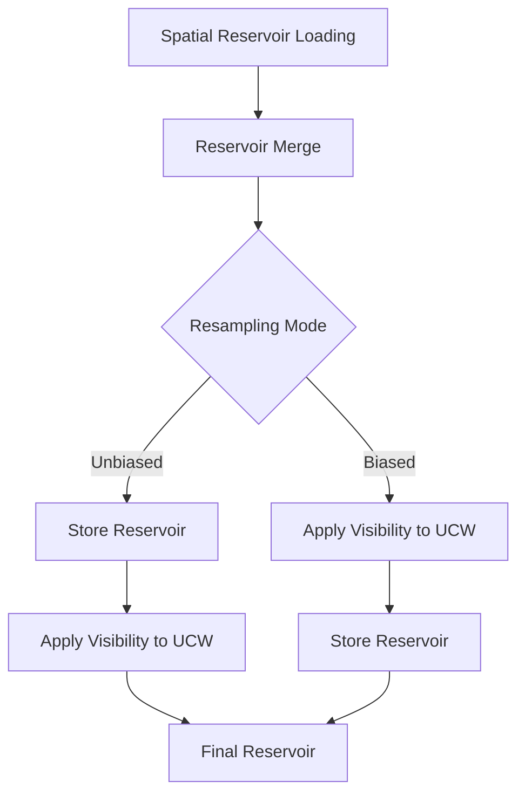

+++
title = "#22287 Solari: Fix indirect shadows"
date = "2025-12-30T00:00:00"
draft = false
template = "pull_request_page.html"
in_search_index = true

[taxonomies]
list_display = ["show"]

[extra]
current_language = "en"
available_languages = {"en" = { name = "English", url = "/pull_request/bevy/2025-12/pr-22287-en-20251230" }, "zh-cn" = { name = "中文", url = "/pull_request/bevy/2025-12/pr-22287-zh-cn-20251230" }}
labels = ["A-Rendering", "C-Refinement"]
+++

# Title: Solari: Fix indirect shadows

## Basic Information
- **Title**: Solari: Fix indirect shadows
- **PR Link**: https://github.com/bevyengine/bevy/pull/22287
- **Author**: JMS55
- **Status**: MERGED
- **Labels**: A-Rendering, S-Ready-For-Final-Review, C-Refinement
- **Created**: 2025-12-27T17:48:15Z
- **Merged**: 2025-12-30T01:37:46Z
- **Merged By**: alice-i-cecile

## Description Translation
Same series of changes to resampling we did for DI, but now applied to GI.

Effectively reverts https://github.com/bevyengine/bevy/pull/21919.

The piece I was missing before was that I was applying the visibility test to the reservoir's radiance, and not the UCW, which was wrong.

## The Story of This Pull Request

This pull request addresses a bug in the Solari global illumination system related to how visibility tests were applied during reservoir resampling. The issue manifested as incorrect indirect shadows, where the visibility test was being applied to the wrong component of the reservoir data structure.

The context involves the ReSTIR (Reservoir-based Spatio-Temporal Importance Resampling) GI implementation in Bevy's Solari system. ReSTIR GI is a real-time global illumination technique that uses reservoir sampling to reuse light paths across space and time. The core challenge is properly handling visibility between sample points when merging reservoirs from different locations.

In a previous PR (#21919), changes were made to apply visibility tests during spatial resampling. However, those changes contained a subtle bug: the visibility test was being applied to the reservoir's radiance rather than the unbiased contribution weight (UCW). This was incorrect because in ReSTIR, the UCW is the component that accumulates the weight of samples, and it's this weight that needs to be adjusted based on visibility between the current surface and the sample point.

The solution approach was to reapply the same pattern used for direct illumination (DI) to global illumination (GI). The key insight was recognizing that the UCW, not the radiance, should be multiplied by the visibility factor. This required restructuring the code to apply the visibility test at the correct point in the resampling pipeline and ensuring it affected the right component.

The implementation modifies the `spatial_and_shade` function in the ReSTIR GI shader. The changes introduce conditional compilation paths for biased vs unbiased resampling. In unbiased resampling mode (more accurate but less stable), the reservoir is stored first, then the UCW is multiplied by the visibility test result. In biased resampling mode (more stable but less accurate), the UCW is multiplied by visibility before storing the reservoir.

Additionally, the `load_spatial_reservoir` function was simplified by removing an incorrect visibility multiplication that was being applied to the spatial reservoir's radiance. This correction ensures that when loading neighboring reservoirs for spatial reuse, their radiance values remain unchanged - only the weight (UCW) is adjusted based on visibility during the merge operation.

The technical insight here is understanding the distinction between biased and unbiased resampling in ReSTIR. Unbiased resampling provides theoretically correct results but can be noisy, while biased resampling trades some accuracy for stability. The visibility test needs to be applied differently in these two modes to maintain their respective guarantees.

The impact of this fix is significant for visual quality: indirect shadows now behave correctly, with proper occlusion between surfaces. The fix also aligns the GI implementation with the DI implementation, ensuring consistency across the rendering pipeline. This correction demonstrates the importance of understanding the mathematical foundations of reservoir sampling and the precise role of each component in the data structure.

## Visual Representation



## Key Files Changed

### `crates/bevy_solari/src/realtime/restir_gi.wgsl` (+12/-5)

This file contains the WebGPU Shading Language (WGSL) code for the ReSTIR global illumination implementation. The changes fix how visibility tests are applied during reservoir resampling.

Key modifications:

1. **Restructured spatial_and_shade function**: The function now conditionally applies visibility multiplication based on the resampling mode (biased vs unbiased). This ensures the unbiased contribution weight (UCW) is correctly adjusted for visibility between the current surface and the sample point.

```wgsl
// Before (simplified from context):
let combined_reservoir = merge_result.merged_reservoir;
gi_reservoirs_a[pixel_index] = combined_reservoir;

// After:
var combined_reservoir = merge_result.merged_reservoir;

// More accuracy, less stability
#ifndef BIASED_RESAMPLING
gi_reservoirs_a[pixel_index] = combined_reservoir;
#endif

combined_reservoir.unbiased_contribution_weight *= trace_point_visibility(surface.world_position, combined_reservoir.sample_point_world_position);

// More stability, less accuracy (shadows extend further out than they should)
#ifdef BIASED_RESAMPLING
gi_reservoirs_a[pixel_index] = combined_reservoir;
#endif
```

2. **Fixed load_spatial_reservoir function**: Removed incorrect visibility multiplication that was being applied to the spatial reservoir's radiance. The visibility test should only affect the UCW during merging, not the radiance of loaded reservoirs.

```wgsl
// Before:
let spatial_pixel_index = spatial_pixel_id.x + spatial_pixel_id.y * u32(view.main_pass_viewport.z);
var spatial_reservoir = gi_reservoirs_b[spatial_pixel_index];
spatial_reservoir.radiance *= trace_point_visibility(world_position, spatial_reservoir.sample_point_world_position);
return NeighborInfo(spatial_reservoir, spatial_surface.world_position, spatial_surface.world_normal, spatial_diffuse_brdf);

// After:
let spatial_pixel_index = spatial_pixel_id.x + spatial_pixel_id.y * u32(view.main_pass_viewport.z);
let spatial_reservoir = gi_reservoirs_b[spatial_pixel_index];
return NeighborInfo(spatial_reservoir, spatial_surface.world_position, spatial_surface.world_normal, spatial_diffuse_brdf);
```

These changes ensure that visibility tests are applied consistently and correctly across the ReSTIR GI pipeline, fixing indirect shadow rendering.

## Further Reading

1. [ReSTIR: Reservoir-based Spatio-Temporal Importance Resampling](https://research.nvidia.com/publication/2020-07_restir-reservoir-based-spatio-temporal-importance-resampling) - The original paper introducing ReSTIR
2. [ReSTIR GI: Path Resampling for Real-Time Path Tracing](https://research.nvidia.com/publication/2021-06_restir-gi-path-resampling-real-time-path-tracing) - Extension of ReSTIR to global illumination
3. [Bevy Solari Documentation](https://github.com/bevyengine/bevy/blob/main/crates/bevy_solari/README.md) - Overview of the Solari rendering system in Bevy
4. [WGSL Specification](https://www.w3.org/TR/WGSL/) - WebGPU Shading Language reference

# Full Code Diff
diff --git a/crates/bevy_solari/src/realtime/restir_gi.wgsl b/crates/bevy_solari/src/realtime/restir_gi.wgsl
index 88ed44f7e3016..8fc3089da0b33 100644
--- a/crates/bevy_solari/src/realtime/restir_gi.wgsl
+++ b/crates/bevy_solari/src/realtime/restir_gi.wgsl
@@ -67,9 +67,19 @@ fn spatial_and_shade(@builtin(global_invocation_id) global_id: vec3<u32>) {
     let spatial = load_spatial_reservoir(global_id.xy, depth, surface.world_position, surface.world_normal, &rng);
     let merge_result = merge_reservoirs(input_reservoir, surface.world_position, surface.world_normal, surface.material.base_color / PI,
         spatial.reservoir, spatial.world_position, spatial.world_normal, spatial.diffuse_brdf, &rng);
-    let combined_reservoir = merge_result.merged_reservoir;
+    var combined_reservoir = merge_result.merged_reservoir;
 
+    // More accuracy, less stability
+#ifndef BIASED_RESAMPLING
     gi_reservoirs_a[pixel_index] = combined_reservoir;
+#endif
+
+    combined_reservoir.unbiased_contribution_weight *= trace_point_visibility(surface.world_position, combined_reservoir.sample_point_world_position);
+
+    // More stability, less accuracy (shadows extend further out than they should)
+#ifdef BIASED_RESAMPLING
+    gi_reservoirs_a[pixel_index] = combined_reservoir;
+#endif
 
     let brdf = evaluate_diffuse_brdf(surface.material.base_color, surface.material.metallic);
 
@@ -163,10 +173,7 @@ fn load_spatial_reservoir(pixel_id: vec2<u32>, depth: f32, world_position: vec3<
         }
 
         let spatial_pixel_index = spatial_pixel_id.x + spatial_pixel_id.y * u32(view.main_pass_viewport.z);
-        var spatial_reservoir = gi_reservoirs_b[spatial_pixel_index];
-
-        spatial_reservoir.radiance *= trace_point_visibility(world_position, spatial_reservoir.sample_point_world_position);
-
+        let spatial_reservoir = gi_reservoirs_b[spatial_pixel_index];
         return NeighborInfo(spatial_reservoir, spatial_surface.world_position, spatial_surface.world_normal, spatial_diffuse_brdf);
     }
 
