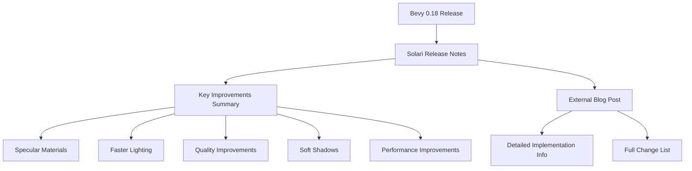

+++
title = "#22289 0.18: Solari release notes"
date = "2025-12-30T00:00:00"
draft = false
template = "pull_request_page.html"
in_search_index = true

[taxonomies]
list_display = ["show"]

[extra]
current_language = "en"
available_languages = {"en" = { name = "English", url = "/pull_request/bevy/2025-12/pr-22289-en-20251230" }, "zh-cn" = { name = "中文", url = "/pull_request/bevy/2025-12/pr-22289-zh-cn-20251230" }}
labels = ["C-Docs", "A-Rendering", "M-Release-Note", "S-Waiting-on-Author"]
+++

# Title: 0.18: Solari release notes

## Basic Information
- **Title**: 0.18: Solari release notes
- **PR Link**: https://github.com/bevyengine/bevy/pull/22289
- **Author**: JMS55
- **Status**: MERGED
- **Labels**: C-Docs, A-Rendering, M-Release-Note, S-Waiting-on-Author
- **Created**: 2025-12-27T23:21:38Z
- **Merged**: 2025-12-30T21:17:39Z
- **Merged By**: alice-i-cecile

## Description Translation
Closes #22171.

## The Story of This Pull Request

This PR addresses a documentation gap for Bevy 0.18 by creating the official release notes for the Solari renderer. The context here is straightforward: Bevy maintains detailed release notes for each version, and the Solari renderer - a real-time raytraced rendering path introduced in earlier versions - received significant improvements in the 0.18 release cycle.

The developer faced a practical problem: there were numerous pull requests related to Solari improvements that needed to be documented for users, but listing every individual PR would make the release notes unwieldy. The solution approach was to create a concise, high-level summary that highlights the most important improvements while directing users to a more comprehensive external resource for full details.

The implementation is minimal but effective - a single markdown file that follows Bevy's existing release notes format. The file includes:
1. Standard frontmatter with authors and a curated selection of representative PRs
2. A clear disclaimer that this is only a small selection of the actual changes
3. A bulleted list of key improvements
4. A link to a detailed external blog post for complete information

This approach balances several engineering considerations:
- **Maintainability**: Keeping the release notes concise prevents them from becoming a maintenance burden
- **User experience**: Users get a quick overview of what changed without being overwhelmed
- **Completeness**: The external blog post link ensures technical users can access detailed implementation information
- **Attribution**: The authors are properly credited, and key PRs are referenced

The technical insight here is about managing documentation at scale. When a project receives numerous related improvements across multiple PRs, creating a summary document with curated highlights and external references is more practical than attempting to document every change inline. This pattern is common in large open-source projects where release notes need to be both comprehensive and readable.

The impact is clear: users upgrading to Bevy 0.18 now have proper documentation about Solari improvements. The release notes provide immediate value by highlighting the most noticeable changes (specular materials, faster lighting, improved shadows) while the external blog post serves as technical reference material. This follows the common practice in game engine documentation where high-level feature summaries are complemented by detailed technical deep dives.

The engineering lesson here is about documentation strategy - sometimes the best approach isn't to document everything in the main repository, but to provide curated summaries with pointers to authoritative external resources. This keeps the primary documentation maintainable while still providing access to comprehensive information.

## Visual Representation



## Key Files Changed

### `release-content/release-notes/solari.md` (+19/-0)

This is a new file created to document Solari improvements in Bevy 0.18. The file provides a high-level summary of the renderer's enhancements while linking to a comprehensive external blog post for complete details.

Key modifications (the entire new file):
```markdown
---
title: Solari Improvements
authors: ["@JMS55", "@SparkyPotato"]
pull_requests: [21391, 21355, 21810]
---

(Too many PRs to list in full - this is just a small selection!)

Solari - Bevy's forward-looking realtime raytraced renderer - has seen many improvements in this release.

Notably:

- Support for specular materials and reflections
- Faster-reacting lighting
- A large amount of quality/accuracy improvements
- Physically-based soft shadows for directional lights
- Improved performance on larger scenes

For the full list of details, check out the author's [full blog post](https://jms55.github.io/posts/2025-12-27-solari-bevy-0-18).
```

The file structure follows Bevy's established pattern for release notes:
1. Frontmatter with metadata (title, authors, representative PRs)
2. A disclaimer about the selective nature of the PR listing
3. A brief introduction to Solari
4. A bulleted list of key improvements
5. A link to external detailed documentation

This change relates to the overall purpose of the PR by providing the necessary documentation for Solari improvements in Bevy 0.18, closing issue #22171 which requested these release notes.

## Further Reading

1. [Bevy Release Notes Documentation](https://github.com/bevyengine/bevy/tree/main/release-content/release-notes) - Understanding Bevy's release notes structure
2. [Solari Renderer Introduction](https://bevyengine.org/news/bevy-0-14/#experimental-ray-traced-rendering-solari) - Background on Solari's initial introduction
3. [Markdown Frontmatter](https://jekyllrb.com/docs/front-matter/) - Understanding the YAML frontmatter format used in documentation
4. [Real-time Ray Tracing Techniques](https://developer.nvidia.com/rtx/raytracing) - Technical background on real-time raytracing concepts

# Full Code Diff
```diff
diff --git a/release-content/release-notes/solari.md b/release-content/release-notes/solari.md
new file mode 100644
index 0000000000000..1586b9ebe467f
--- /dev/null
+++ b/release-content/release-notes/solari.md
@@ -0,0 +1,19 @@
+---
+title: Solari Improvements
+authors: ["@JMS55", "@SparkyPotato"]
+pull_requests: [21391, 21355, 21810]
+---
+
+(Too many PRs to list in full - this is just a small selection!)
+
+Solari - Bevy's forward-looking realtime raytraced renderer - has seen many improvements in this release.
+
+Notably:
+
+- Support for specular materials and reflections
+- Faster-reacting lighting
+- A large amount of quality/accuracy improvements
+- Physically-based soft shadows for directional lights
+- Improved performance on larger scenes
+
+For the full list of details, check out the author's [full blog post](https://jms55.github.io/posts/2025-12-27-solari-bevy-0-18).
```