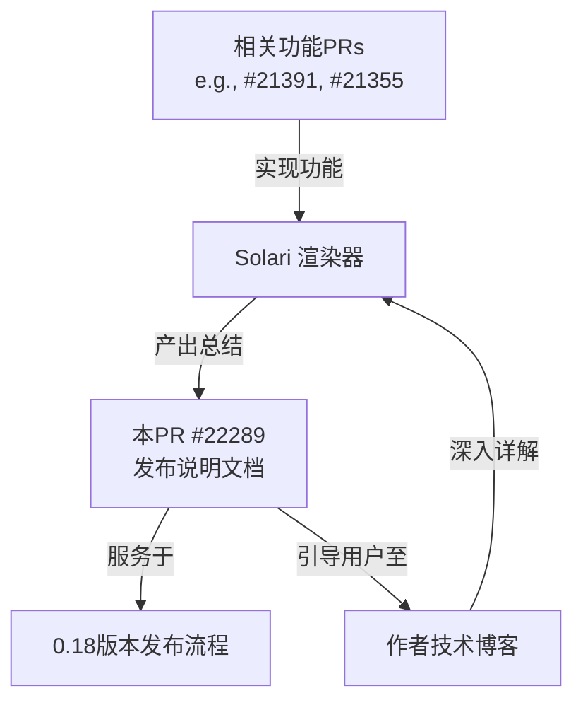

+++
title = "#22289 0.18: Solari release notes"
date = "2025-12-30T00:00:00"
draft = false
template = "pull_request_page.html"
in_search_index = false

[extra]
current_language = "zh-cn"
available_languages = {"en" = { name = "English", url = "/pull_request/bevy/2025-12/pr-22289-en-20251230" }, "zh-cn" = { name = "中文", url = "/pull_request/bevy/2025-12/pr-22289-zh-cn-20251230" }}
labels = ["C-Docs", "A-Rendering", "M-Release-Note", "S-Waiting-on-Author"]
+++

# Title: 0.18: Solari release notes

## Basic Information
- **Title**: 0.18: Solari release notes
- **PR Link**: https://github.com/bevyengine/bevy/pull/22289
- **Author**: JMS55
- **Status**: MERGED
- **Labels**: C-Docs, A-Rendering, M-Release-Note, S-Waiting-on-Author
- **Created**: 2025-12-27T23:21:38Z
- **Merged**: 2025-12-30T21:17:39Z
- **Merged By**: alice-i-cecile

## Description Translation
关闭 #22171。

## The Story of This Pull Request

这个PR是一个文档性质的提交，其核心目的是为Bevy 0.18版本的发布创建一个针对其前瞻性实时光线追踪渲染器Solari的发布说明。发布说明是开发工作流程中一个正式且关键的部分，它连接了代码的变更与最终用户的理解。虽然这个PR本身不包含功能代码，但它作为工程成果的聚合点和沟通节点，意义重大。

**背景与动机**：在开发周期中，一个重大的渲染特性（Solari）会经历大量的Pull Requests（PRs）。例如，本说明就引用了#21391、#21355和#21810。当版本发布时，用户和贡献者需要一种方式来了解这些零散提交所带来的整体影响。如果不进行梳理和总结，用户将难以评估版本升级的价值，也增加了新功能的学习成本。因此，创建一个结构化的发布说明文档是一个必要的工程实践，用以提炼和传达技术进展。

**解决方案与实现**：本次实现非常直接。开发者创建了一个新文件 `release-content/release-notes/solari.md`。这个文件遵循了项目既定的发布说明模板和结构，使得它能够被自动集成到最终的发布文档中。

其内容设计遵循了清晰的层级：
1.  **元数据**：通过YAML头定义了标题、作者和关联的核心PRs。这提供了基本的追踪和归属信息。
2.  **概述**：一句话明确指出Solari的定位和在本版本中的状态（“已获众多改进”）。
3.  **要点列表**：这是文档的核心，以无序号列表形式列出了几个关键的改进领域。这种形式便于快速浏览，每个要点都指向一个具体的渲染技术或性能维度。

我们可以看一下这个列表的技术含义：
-   **Support for specular materials and reflections**：这是基础PBR（Physically Based Rendering，基于物理的渲染）工作流的关键组成部分。添加对高光材质和反射的支持，意味着Solari现在能够更真实地模拟金属、光滑表面等材质，极大地提升了场景的视觉真实感。
-   **Faster-reacting lighting**：这直接关系到渲染系统的响应能力和性能。“反应更快”的照明可能意味着优化了光照计算的更新频率或算法，使得动态光源或物体移动时的光影变化更加及时，这对于交互式应用至关重要。
-   **A large amount of quality/accuracy improvements**：这是一个概括性描述，表明在渲染方程、采样、抗锯齿等多个方面进行了广泛的修复和优化，旨在减少视觉瑕疵，使结果更接近物理正确。
-   **Physically-based soft shadows for directional lights**：为方向光（如太阳光）添加物理正确的柔和阴影。这是一个重要的视觉特性，硬阴影往往显得不真实，而柔和阴影能极大地增强场景的自然感和深度感。其“物理基础”意味着阴影的柔和程度是基于光源的尺寸和距离计算的，而非简单的高斯模糊。
-   **Improved performance on larger scenes**：直接针对性能的优化。光线追踪是计算密集型任务，在大型场景中性能容易成为瓶颈。此项改进表明渲染器在算法或工程实现上（可能是加速结构、管线调度或内存访问模式）得到了优化，能够处理更复杂的场景。

**技术洞察**：这份发布说明的结构体现了良好的工程沟通习惯。它没有试图穷举所有相关PR（注明了“Too many PRs to list in full”），而是选择了概括和引导。它将复杂的底层代码变更（如光线追踪着色器、管线状态、资源绑定）翻译成了用户和开发者能直观理解的、面向最终效果和性能的语言。同时，它提供了一个关键的外部链接——作者的完整博客文章。这是一个非常有效的做法，将简洁的发布说明与深入的技术剖析分离，满足了不同层次读者的需求。

**影响与总结**：这个PR的合入，标志着Bevy 0.18版本中Solari渲染器改进工作的文档化完成。它虽然不改变任何运行时行为，但作为项目知识管理和用户沟通的一部分，其价值在于：
1.  **提高透明度**：让社区清楚了解Solari的发展方向和已实现的功能。
2.  **降低认知负载**：为用户提供了一个快速了解核心改进的入口。
3.  **建立参考**：为未来的技术讨论、问题排查和进一步开发提供了官方版本的功能基准说明。
4.  **完善流程**：遵循并强化了项目版本发布的标准化流程。

## Visual Representation



## Key Files Changed

只创建了一个新文件：

1.  **文件**: `release-content/release-notes/solari.md`
    *   **变更描述**: 新增了Bevy 0.18版本中Solari渲染器的发布说明文档。该文档总结了此版本中Solari的主要改进，并提供了指向详细技术博客的链接。
    *   **代码片段**:
        ```markdown
        ---
        title: Solari Improvements
        authors: ["@JMS55", "@SparkyPotato"]
        pull_requests: [21391, 21355, 21810]
        ---

        (Too many PRs to list in full - this is just a small selection!)

        Solari - Bevy's forward-looking realtime raytraced renderer - has seen many improvements in this release.

        Notably:

        - Support for specular materials and reflections
        - Faster-reacting lighting
        - A large amount of quality/accuracy improvements
        - Physically-based soft shadows for directional lights
        - Improved performance on larger scenes

        For the full list of details, check out the author's [full blog post](https://jms55.github.io/posts/2025-12-27-solari-bevy-0-18).
        ```
    *   **与PR目的的关系**：此文件本身就是本PR的全部交付物。它通过结构化的列表概括了多个技术PR的成果，形成了面向用户的发布信息，完美达成了创建版本发布说明的目标。

## Further Reading

1.  **关联的PRs**: 报告中提到的具体实现PR是深入了解技术细节的第一手资料。建议查阅PR #21391， #21355， #21810 以了解具体的代码变更。
2.  **技术博客**: 作者JMS55的博客文章 [“Solari in Bevy 0.18”](https://jms55.github.io/posts/2025-12-27-solari-bevy-0-18) 是理解这些改进背后原理和实现挑战的最佳资源，包含了更深入的分析和可能的视觉效果对比。
3.  **Bevy 渲染架构**: 为了更好地理解Solari的定位，可以查阅Bevy官方文档中关于渲染管线、`RenderPlugin`和`Extract`、`Prepare`、`Queue`、`Phase`、`Draw`等渲染阶段的设计。
4.  **实时光线追踪基础**: 学习现代图形API（如Vulkan， DirectX 12 Ultimate）中的光线追踪管线概念，有助于理解Solari这类渲染器所面临的挑战和采用的技术。