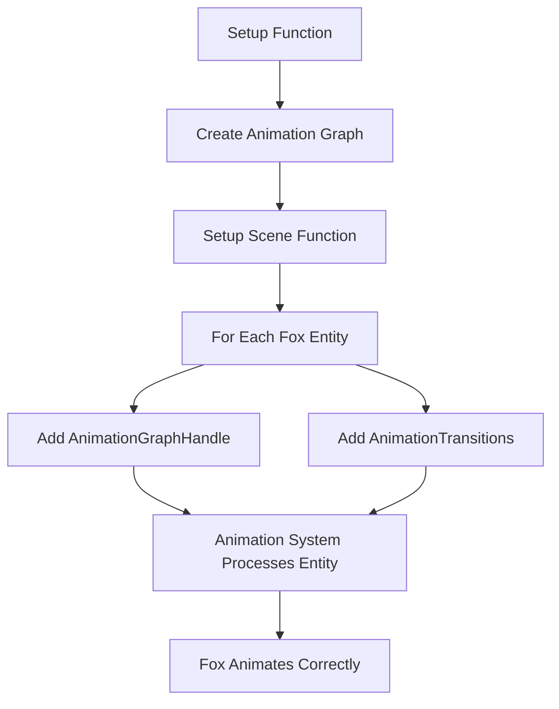

+++
title = "#22292 Fix many_foxes animation controls"
date = "2025-12-30T00:00:00"
draft = false
template = "pull_request_page.html"
in_search_index = true

[taxonomies]
list_display = ["show"]

[extra]
current_language = "en"
available_languages = {"en" = { name = "English", url = "/pull_request/bevy/2025-12/pr-22292-en-20251230" }, "zh-cn" = { name = "中文", url = "/pull_request/bevy/2025-12/pr-22292-zh-cn-20251230" }}
labels = ["C-Examples"]
+++

# Title
Fix many_foxes animation controls

## Basic Information
- **Title**: Fix many_foxes animation controls
- **PR Link**: https://github.com/bevyengine/bevy/pull/22292
- **Author**: mockersf
- **Status**: MERGED
- **Labels**: C-Examples, S-Ready-For-Final-Review
- **Created**: 2025-12-28T20:43:47Z
- **Merged**: 2025-12-30T01:41:28Z
- **Merged By**: alice-i-cecile

## Description Translation
# Objective

- Fix #22285

## Solution

- Example is relying on component `AnimationTransitions` which wasn't added. Add it

## The Story of This Pull Request

The PR addresses a straightforward bug in the `many_foxes` stress test example where animation controls were broken. The example is designed to demonstrate performance by rendering thousands of animated fox models, but it had a missing component dependency that prevented the animation system from functioning correctly.

The problem originated in the animation system refactoring where the `AnimationTransitions` component became a required dependency for entities using animation graphs. This component tracks state for animation transitions and is necessary for the animation playback system to function. Without it, entities with `AnimationGraphHandle` components couldn't properly play animations.

The fix is minimal but important for maintaining example correctness. The developer identified that the example was trying to use animation features that required the `AnimationTransitions` component but wasn't actually adding it to the entities. This is a classic missing dependency issue where the system expects certain components to be present but the setup code doesn't provide them.

Looking at the implementation, the fix involves two changes. First, there's a minor optimization in the clip setup code where `animation_clips.iter().cloned()` is simplified to just `animation_clips`. Since `animation_clips` is an array that can be turned into an iterator directly, the extra cloning and iterator wrapping was unnecessary. This is a small cleanup but doesn't affect functionality.

The main fix is in the entity setup where the `AnimationTransitions::default()` component is now added alongside the `AnimationGraphHandle`. This ensures each fox entity has the necessary component for the animation system to manage its animation state:

```rust
// Before:
commands.entity(child).insert(AnimationGraphHandle(animations.graph.clone()));

// After:
commands.entity(child).insert((
    AnimationGraphHandle(animations.graph.clone()),
    AnimationTransitions::default(),
));
```

This change follows the Bevy ECS pattern where systems query for component combinations, and entities must have all required components for those systems to process them. The animation system likely queries for entities with both `AnimationGraphHandle` and `AnimationTransitions` components, so missing the latter meant the entities were silently ignored.

From an engineering perspective, this fix demonstrates the importance of keeping examples up-to-date with API changes. Examples serve as both documentation and test cases, so when they break, it indicates either an API design issue or missing documentation about required component combinations. In this case, the example was missing a required component that should have been obvious from the animation system's component requirements.

The fix also shows good practices in Bevy development: using tuple inserts for adding multiple components efficiently and relying on default values for components where appropriate. The `AnimationTransitions::default()` provides a reasonable starting state with no active transitions, which is appropriate for the initial animation setup.

## Visual Representation



## Key Files Changed

**File:** `examples/stress_tests/many_foxes.rs`

This file contains the `many_foxes` stress test example that demonstrates rendering performance with thousands of animated fox models.

**Changes made:**

1. **Minor optimization in animation clip setup:**
   ```rust
   // Before:
   .add_clips(animation_clips.iter().cloned(), 1.0, animation_graph.root)
   
   // After:
   .add_clips(animation_clips, 1.0, animation_graph.root)
   ```
   This change simplifies the code by passing the array directly instead of creating an iterator of clones. Since arrays implement `IntoIterator`, this is equivalent but cleaner.

2. **Fixed missing `AnimationTransitions` component:**
   ```rust
   // Before:
   commands
       .entity(child)
       .insert(AnimationGraphHandle(animations.graph.clone()));
   
   // After:
   commands.entity(child).insert((
       AnimationGraphHandle(animations.graph.clone()),
       AnimationTransitions::default(),
   ));
   ```
   This is the core fix. The example was missing the `AnimationTransitions` component that the animation system requires to manage animation state and transitions between animations. Without this component, the animation system would ignore these entities.

## Further Reading

- [Bevy Animation System Documentation](https://docs.rs/bevy_animation/latest/bevy_animation/) - Official documentation for Bevy's animation system
- [Bevy ECS Component Patterns](https://bevy-cheatbook.github.io/programming/ecs-intro.html) - Guide to Entity Component System patterns in Bevy
- [Issue #22285](https://github.com/bevyengine/bevy/issues/22285) - Original issue reporting the broken animation controls
- [Bevy Examples Repository](https://github.com/bevyengine/bevy/tree/main/examples) - Other Bevy examples demonstrating various features