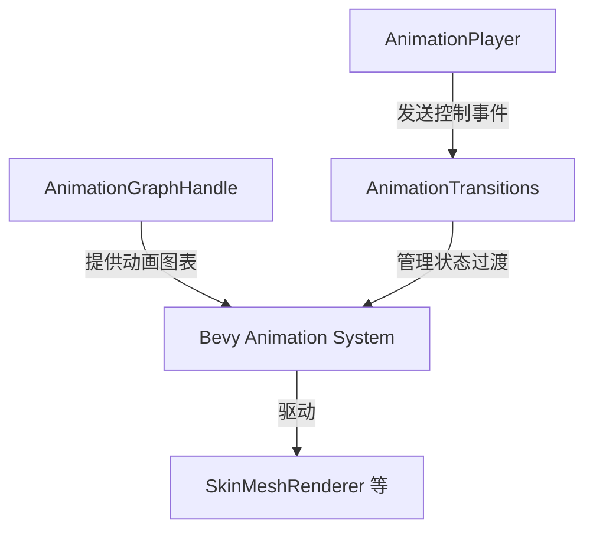

+++
title = "#22292 Fix many_foxes animation controls"
date = "2025-12-30T00:00:00"
draft = false
template = "pull_request_page.html"
in_search_index = false

[extra]
current_language = "zh-cn"
available_languages = {"en" = { name = "English", url = "/pull_request/bevy/2025-12/pr-22292-en-20251230" }, "zh-cn" = { name = "中文", url = "/pull_request/bevy/2025-12/pr-22292-zh-cn-20251230" }}
+++

# Fix many_foxes animation controls

## 基本信息
- **标题**: Fix many_foxes animation controls
- **PR链接**: https://github.com/bevyengine/bevy/pull/22292
- **作者**: mockersf
- **状态**: 已合并
- **标签**: C-Examples, S-Ready-For-Final-Review
- **创建时间**: 2025-12-28T20:43:47Z
- **合并时间**: 2025-12-30T01:41:28Z
- **合并者**: alice-i-cecile

## 描述翻译

# Objective（目标）

- 修复 #22285

## Solution（解决方案）

- 示例依赖的组件 `AnimationTransitions` 没有被添加。现在将其添加。

## 该PR的故事

这是一个关于修复示例代码中一个简单但关键缺失的快速故事。

**问题与上下文**

在 `many_foxes` 压力测试示例（PR #22285）中，一个动画控制系统被添加，允许用户通过键盘控制狐狸动画的播放、暂停和切换。然而，该系统依赖于一个名为 `AnimationTransitions` 的组件，这个组件是 Bevy 动画系统的一部分，用于管理动画状态之间的平滑过渡。

问题在于，在设置场景并为狐狸实体添加动画组件的代码中，只插入了 `AnimationGraphHandle`，但遗漏了 `AnimationTransitions` 组件。没有这个组件，动画系统将无法正确处理用户通过 `AnimationPlayer` 发出的控制命令（如播放、暂停），导致动画控制功能失效。这是一个典型的“缺少必需依赖”的错误。

**解决方案与实现**

修复方案直截了当：在创建狐狸实体时，同时插入 `AnimationTransitions` 组件。这个组件有一个方便的 `default()` 实现，创建一个默认的空过渡状态机即可。

查看代码改动，修复位于 `examples/stress_tests/many_foxes.rs` 文件的第244行附近。在修改前，命令流（commands）是这样插入组件的：
```rust
commands.entity(child).insert(AnimationGraphHandle(animations.graph.clone()));
```
修改后，它使用了元组来一次性插入两个组件：
```rust
commands.entity(child).insert((
    AnimationGraphHandle(animations.graph.clone()),
    AnimationTransitions::default(),
));
```

这个改动确保了每个动画实体都具备了动画系统所需的完整组件集。

**一个额外的优化**

值得注意的是，本次提交还包含了一个不相关的微小优化。在同一文件的第122行，`add_clips` 方法的调用被简化了。
修改前：
```rust
.add_clips(animation_clips.iter().cloned(), 1.0, animation_graph.root)
```
修改后：
```rust
.add_clips(animation_clips, 1.0, animation_graph.root)
```
原始代码先对 `animation_clips` 切片进行迭代（`.iter()`），然后克隆每个元素（`.cloned()`），最后将迭代器传递给 `add_clips`。但 `add_clips` 方法的第一个参数类型是 `impl IntoIterator<Item = Handle<AnimationClip>>`，`animation_clips`（一个 `[Handle<AnimationClip>; 6]` 数组）本身可以直接转换为迭代器，无需额外的迭代和克隆步骤。这个改动移除了不必要的操作，使代码更简洁高效。虽然这个优化与修复动画控制的主要问题无关，但它是一个良好的代码清理实践。

**影响**

这个修复确保 `many_foxes` 示例的动画控制功能按预期工作。用户现在可以正确使用 `P` 键暂停/播放动画，使用 `N` 键切换到下一个动画。这对于演示 Bevy 动画系统的交互能力至关重要，尤其是在一个包含许多动画实体的压力测试场景中。

从代码质量的角度来看，这次修复提醒我们，在向实体添加功能时，必须确保所有必要的组件都已就位。特别是在使用像动画系统这样由多个协同工作的组件构成的复杂功能时，仔细检查组件依赖关系非常重要。

## 视觉表示



此图展示了修复后涉及的几个关键组件之间的关系。`AnimationPlayer` 是用户输入与控制事件的来源。`AnimationGraphHandle` 持有动画资源。新增的 `AnimationTransitions` 组件负责接收来自 `AnimationPlayer` 的事件，并管理动画状态间的平滑切换。三者协同工作，使 Bevy 的动画系统能够正确驱动模型的变换或骨骼动画。

## 关键文件更改

- `examples/stress_tests/many_foxes.rs` (+5/-4)

该文件是压力测试示例 `many_foxes` 的源代码。修改包含两部分：一个微小的API调用优化和主要的Bug修复。

1.  **优化 `add_clips` 调用**：移除不必要的 `.iter().cloned()`。
```rust
// 文件: examples/stress_tests/many_foxes.rs
// 修改前:
let node_indices = animation_graph
    .add_clips(animation_clips.iter().cloned(), 1.0, animation_graph.root)
    .collect();

// 修改后:
let node_indices = animation_graph
    .add_clips(animation_clips, 1.0, animation_graph.root)
    .collect();
```

2.  **修复缺失的 `AnimationTransitions` 组件**：这是本次PR的核心修复。在为每个狐狸子实体设置动画时，需要同时插入 `AnimationGraphHandle` 和 `AnimationTransitions` 组件。
```rust
// 文件: examples/stress_tests/many_foxes.rs
// 修改前:
commands
    .entity(child)
    .insert(AnimationGraphHandle(animations.graph.clone()));

// 修改后:
commands.entity(child).insert((
    AnimationGraphHandle(animations.graph.clone()),
    AnimationTransitions::default(),
));
```
这个改动直接解决了问题 #22285，确保了动画控制系统能够正常运行。

## 扩展阅读

- **[Bevy Animation Book](https://bevyengine.org/learn/books/animation-book/)**: Bevy官方动画手册，详细解释了动画图、动画播放器（AnimationPlayer）和动画过渡（AnimationTransitions）等概念。
- **Bevy 源码 `crates/bevy_animation`**: 深入了解 `AnimationTransitions` 组件和 `AnimationPlayer` 系统是如何实现的。
- **[Issue #22285](https://github.com/bevyengine/bevy/issues/22285)**: 本PR所修复的原始问题报告，包含了问题现象的详细描述。