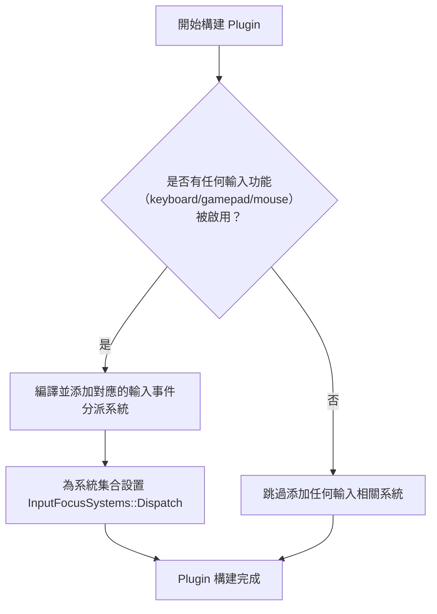

+++
title = "#22293"
date = "2025-12-29T00:00:00"
draft = false
template = "pull_request_page.html"
in_search_index = false

[extra]
current_language = "zh-cn"
available_languages = {"en" = { name = "English", url = "/pull_request/bevy/2025-12/pr-22293-en-20251229" }, "zh-cn" = { name = "中文", url = "/pull_request/bevy/2025-12/pr-22293-zh-cn-20251229" }}
+++

# Title

## 基本資訊
- **標題**: bevy_input_focus: don't add nothing when no input is enabled
- **PR 連結**: https://github.com/bevyengine/bevy/pull/22293
- **作者**: mockersf
- **狀態**: 已合併
- **標籤**: C-Bug, A-Input, S-Ready-For-Final-Review, D-Straightforward
- **建立時間**: 2025-12-28T21:09:46Z
- **合併時間**: 2025-12-29T20:02:52Z
- **合併者**: mockersf

## 描述翻譯
### 目標
- `cargo build --no-default-features --features bevy_input_focus` 命令執行失敗：
```
   Compiling bevy_input_focus v0.18.0-dev (/home/runner/work/bevy-releasability/bevy-releasability/crates/bevy_input_focus)
error[E0599]: no method named `in_set` found for unit type `()` in the current scope
   --> crates/bevy_input_focus/src/lib.rs:236:22
    |
228 | /                 (
229 | |                     #[cfg(feature = "keyboard")]
230 | |                     dispatch_focused_input::<KeyboardInput>,
231 | |                     #[cfg(feature = "gamepad")]
...   |
236 | |                     .in_set(InputFocusSystems::Dispatch),
    | |_____________________-^^^^^^
    |
```
- 此問題由 PR #22177 引入。

### 解決方案
- 當沒有任何輸入功能（input features）被啟用時，不要添加空的系統元組（empty system tuple）。

## 這個 PR 的故事

這個 PR 要解決的問題很具體：在特定的編譯設定下，建置會失敗。開發者在使用指令 `cargo build --no-default-features --features bevy_input_focus` 時，遭遇了 Rust 編譯器報錯。錯誤訊息指出，在 `lib.rs` 的第 236 行，試圖在一個單元類型 `()` 上呼叫 `.in_set()` 方法，但這個方法並不存在。這是一個典型的條件編譯（conditional compilation）導致的邊界案例問題。

問題的根本原因在於，`bevy_input_focus` 這個 crate 設計上支援多種輸入裝置，例如鍵盤、遊戲手把和滑鼠，而每一種輸入支援都可以透過 Cargo feature（例如 `"keyboard"`、`"gamepad"`、`"mouse"`）來獨立啟用或關閉。在 `InputDispatchPlugin` 的 `build` 方法中，原本的實作會嘗試將一個包含多個條件性系統的元組（tuple）添加到應用程式的排程中。然而，當使用者透過 `--no-default-features` 停用所有預設功能，並只啟用 `bevy_input_focus` 這個 crate 本身時，很可能會導致 `keyboard`、`gamepad`、`mouse` 這三個 feature 都未被啟用。

在這種情況下，原始程式碼中 `add_systems` 呼叫內部的元組：
```rust
(
    #[cfg(feature = "keyboard")]
    dispatch_focused_input::<KeyboardInput>,
    #[cfg(feature = "gamepad")]
    dispatch_focused_input::<GamepadButtonChangedEvent>,
    #[cfg(feature = "mouse")]
    dispatch_focused_input::<MouseWheel>,
)
```
會因為所有 `#[cfg(...)]` 條件都不滿足，而最終變成一個空的元組 `()`。接下來的 `.in_set(InputFocusSystems::Dispatch)` 試圖在這個空元組上執行，但空元組（即單元類型）並沒有 `in_set` 這個系統鏈結（chaining）方法，因此導致了編譯錯誤。

解決方案直截了當：既然問題出在「沒有任何輸入功能被啟用時，我們不該嘗試添加系統」，那就把添加系統的整個邏輯用條件編譯包起來。具體做法是，在 `add_systems` 這行程式碼外層，加上一個檢查任何輸入功能是否啟用的條件：`#[cfg(any(feature = "keyboard", feature = "gamepad", feature = "mouse"))]`。這樣一來，只有當至少一個輸入功能被啟用時，`app.add_systems(...)` 這行程式碼才會被編譯進去，從根本上避免了產生空元組的情境。

這個修復雖然只涉及幾行程式碼的移動和一個條件編譯屬性的添加，但它凸顯了在使用條件編譯構建動態系統集合時的一個重要工程考量：你必須考慮所有可能的條件組合，特別是「所有條件都不滿足」這種邊緣情況。在 Bevy 這種以靈活性著稱的 ECS 遊戲引擎中，這種考量尤其重要，因為它允許使用者高度自訂他們需要的功能模組，而核心程式庫必須確保在各種自訂組合下都能正常運作。

此外，PR 也順帶優化了一個小細節：將 `bevy_app::PreUpdate` 的導入也加上了相同的條件編譯屬性 `#[cfg(any(...))]`。這是一個好的實踐，因為當沒有任何輸入功能時，`PreUpdate` 排程在這個 crate 中實際上並不會被使用，條件化導入可以讓編譯產物更乾淨。

總的來說，這個 PR 是一個典型的「邊界案例修復」。它沒有引入新功能，而是確保了現有程式碼在一個之前被遺漏的、合法的使用情境下能夠正常編譯。這類修復對於維護函式庫的穩健性和使用者體驗至關重要。

## 視覺化表示

以下流程圖展示了條件編譯如何影響系統的添加邏輯：



## 關鍵檔案變更

**修改的檔案**：`crates/bevy_input_focus/src/lib.rs` (+18/-14)

這個 PR 只修改了一個檔案。主要變更是重構了 `InputDispatchPlugin::build` 方法中的系統添加邏輯，並調整了相關的導入語句。

**變更詳情與程式碼片段**：

1. **條件化導入（Conditional Imports）**：
   為了避免在沒有任何輸入功能時導入未使用的排程（Schedule），`PreUpdate` 的導入被加上了條件編譯屬性。
   ```rust
   // 修改後：
   #[cfg(any(feature = "keyboard", feature = "gamepad", feature = "mouse"))]
   use bevy_app::PreUpdate;
   use bevy_app::{App, Plugin, PostStartup};
   ```

2. **重構系統添加邏輯**：
   核心的修復是將 `app.add_systems(...)` 呼叫包裹在一個條件編譯塊中。這樣可以確保僅在至少一個輸入功能啟用時，才會嘗試構建並添加系統元組。
   ```rust
   // 修改前：
   .add_systems(
       PreUpdate,
       (
           #[cfg(feature = "keyboard")]
           dispatch_focused_input::<KeyboardInput>,
           #[cfg(feature = "gamepad")]
           dispatch_focused_input::<GamepadButtonChangedEvent>,
           #[cfg(feature = "mouse")]
           dispatch_focused_input::<MouseWheel>,
       )
           .in_set(InputFocusSystems::Dispatch),
   );

   // 修改後：
   #[cfg(any(feature = "keyboard", feature = "gamepad", feature = "mouse"))]
   app.add_systems(
       PreUpdate,
       (
           #[cfg(feature = "keyboard")]
           dispatch_focused_input::<KeyboardInput>,
           #[cfg(feature = "gamepad")]
           dispatch_focused_input::<GamepadButtonChangedEvent>,
           #[cfg(feature = "mouse")]
           dispatch_focused_input::<MouseWheel>,
       )
           .in_set(InputFocusSystems::Dispatch),
   );
   ```
   這個改變直接解決了編譯錯誤。當所有 `#[cfg(feature = "...")]` 都不滿足時，修改前的程式碼會生成一個空的 `().in_set(...)` 導致錯誤；修改後，整段添加系統的程式碼都會被編譯器忽略，從而避免了這個問題。

## 延伸閱讀

1.  **Rust 條件編譯（Conditional Compilation）**：Rust 官方文件中的 `#[cfg]` 屬性說明，是理解此 PR 技術背景的基礎。
    - [Rust Reference: Conditional Compilation](https://doc.rust-lang.org/reference/conditional-compilation.html)

2.  **Bevy 插件系統與排程**：了解 Bevy 的 `Plugin` trait 和系統排程（如 `PreUpdate`）如何工作，有助於理解程式碼變更的上下文。
    - [Bevy: Plugins](https://docs.rs/bevy_app/latest/bevy_app/trait.Plugin.html)
    - [Bevy: Schedules and Stages (now Sets)](https://bevy-cheatbook.github.io/programming/schedules.html) （注意：Bevy 0.12 後，「Stage」概念已被「System Set」和「Schedules」取代）

3.  **Cargo Features**：關於如何在 Rust 專案中定義和使用 features 來進行條件編譯和依賴管理。
    - [Cargo Book: Features](https://doc.rust-lang.org/cargo/reference/features.html)

# Full Code Diff
diff --git a/crates/bevy_input_focus/src/lib.rs b/crates/bevy_input_focus/src/lib.rs
index 7dc4f757b3b7f..fac16f62209bd 100644
--- a/crates/bevy_input_focus/src/lib.rs
+++ b/crates/bevy_input_focus/src/lib.rs
@@ -30,7 +30,9 @@ pub mod tab_navigation;
 mod autofocus;
 pub use autofocus::*;
 
-use bevy_app::{App, Plugin, PostStartup, PreUpdate};
+#[cfg(any(feature = "keyboard", feature = "gamepad", feature = "mouse"))]
+use bevy_app::PreUpdate;
+use bevy_app::{App, Plugin, PostStartup};
 use bevy_ecs::{
     entity::Entities, prelude::*, query::QueryData, system::SystemParam, traversal::Traversal,
 };
@@ -222,19 +224,21 @@ impl Plugin for InputDispatchPlugin {
     fn build(&self, app: &mut App) {
         app.add_systems(PostStartup, set_initial_focus)
             .init_resource::<InputFocus>()
-            .init_resource::<InputFocusVisible>()
-            .add_systems(
-                PreUpdate,
-                (
-                    #[cfg(feature = "keyboard")]
-                    dispatch_focused_input::<KeyboardInput>,
-                    #[cfg(feature = "gamepad")]
-                    dispatch_focused_input::<GamepadButtonChangedEvent>,
-                    #[cfg(feature = "mouse")]
-                    dispatch_focused_input::<MouseWheel>,
-                )
-                    .in_set(InputFocusSystems::Dispatch),
-            );
+            .init_resource::<InputFocusVisible>();
+
+        #[cfg(any(feature = "keyboard", feature = "gamepad", feature = "mouse"))]
+        app.add_systems(
+            PreUpdate,
+            (
+                #[cfg(feature = "keyboard")]
+                dispatch_focused_input::<KeyboardInput>,
+                #[cfg(feature = "gamepad")]
+                dispatch_focused_input::<GamepadButtonChangedEvent>,
+                #[cfg(feature = "mouse")]
+                dispatch_focused_input::<MouseWheel>,
+            )
+                .in_set(InputFocusSystems::Dispatch),
+        );
     }
 }