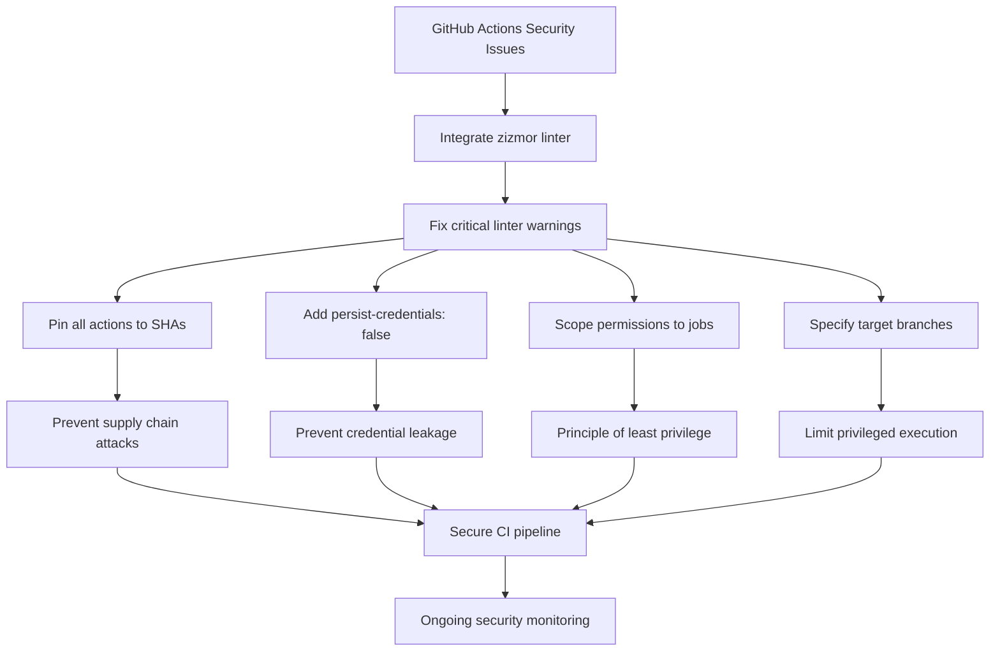

+++
title = "#22294 use zizmor to lint GitHub actions"
date = "2025-12-30T00:00:00"
draft = false
template = "pull_request_page.html"
in_search_index = true

[taxonomies]
list_display = ["show"]

[extra]
current_language = "en"
available_languages = {"en" = { name = "English", url = "/pull_request/bevy/2025-12/pr-22294-en-20251230" }, "zh-cn" = { name = "中文", url = "/pull_request/bevy/2025-12/pr-22294-zh-cn-20251230" }}
labels = ["A-Build-System", "C-Code-Quality"]
+++

# Title

## Basic Information
- **Title**: use zizmor to lint GitHub actions
- **PR Link**: https://github.com/bevyengine/bevy/pull/22294
- **Author**: mockersf
- **Status**: MERGED
- **Labels**: A-Build-System, C-Code-Quality, S-Ready-For-Final-Review
- **Created**: 2025-12-28T23:03:18Z
- **Merged**: 2025-12-30T01:48:30Z
- **Merged By**: alice-i-cecile

## Description
# Objective

- Improve security of Bevy CI

## Solution

- Use zizmor to lint actions https://github.com/zizmorcore/zizmor
- Fix a few lints
  - pin actions
  - specify `persist-credentials`
  - set write permissions at job level instead of workflow level
  - set target branch for `pull_request_target` workflows
- Add the linter as CI. With the proposed config, it should report potential issues in the security center and not block merging. There are still a few lints that fail and need more rework to fix


## The Story of This Pull Request

This PR addresses GitHub Actions security improvements in the Bevy repository. The core issue was that the existing CI workflows had several security anti-patterns that could potentially expose the repository to supply chain attacks or credential leakage. The developer identified that while Bevy already had various quality checks in place, the GitHub Actions configuration itself needed security hardening.

The solution involved implementing a multi-pronged approach. First, the developer integrated zizmor, a specialized linter for GitHub Actions workflows, as a continuous security check. Zizmor scans workflows for security issues like unpinned actions, excessive permissions, and other misconfigurations. Rather than immediately blocking all workflows, the linter was configured to report issues to GitHub's security center without preventing merges, allowing for gradual improvement while maintaining development velocity.

The implementation required changes across 14 different workflow files. The most significant changes fell into four main categories:

1. **Action version pinning**: All GitHub Actions references were updated from version tags (like `v6`) to specific commit SHAs with version comments. This prevents supply chain attacks where a malicious actor could push new code to a tagged version.

```yaml
# Before:
- uses: actions/checkout@v6

# After:
- uses: actions/checkout@8e8c483db84b4bee98b60c0593521ed34d9990e8 # v6.0.1
```

2. **Credential persistence control**: The `persist-credentials: false` parameter was added to all checkout actions to prevent the GITHUB_TOKEN from being stored in git configuration, reducing the attack surface.

3. **Granular permission scoping**: Write permissions were moved from the workflow level to individual job levels. This follows the principle of least privilege - only jobs that actually need write access (like commenting on PRs) receive it, rather than granting blanket permissions to all jobs in the workflow.

```yaml
# Before (at workflow level):
permissions:
  pull-requests: 'write'

# After (at job level):
jobs:
  comment-on-migration-guide-label:
    permissions:
      pull-requests: "write"
```

4. **Branch targeting for pull_request_target**: Workflows using the `pull_request_target` event were updated to explicitly target the `main` branch. This is important because `pull_request_target` runs in the context of the base repository with write permissions, so restricting it to specific branches prevents potentially malicious code from forked repositories from running with elevated privileges.

The technical implementation shows careful consideration of the trade-offs between security and usability. The developer chose to fix the most critical security issues immediately while leaving some zizmor warnings for future work, acknowledging that complete security hardening requires incremental improvement rather than blocking all development.

An interesting technical detail is the renaming of `codeql.yml` to `security-static-analysis.yml`. This reflects a broader categorization where CodeQL becomes one component of a comprehensive security analysis suite that now includes zizmor. The new workflow structure provides a clear separation between different types of security checks.

From an engineering perspective, this PR demonstrates several best practices for securing CI/CD pipelines. The use of a specialized linter for infrastructure-as-code (in this case, GitHub Actions workflows) parallels the use of linters for application code. The gradual rollout approach - fixing critical issues first while establishing ongoing monitoring for others - shows practical risk management.

The changes affect various aspects of Bevy's development workflow:
- CI builds now use pinned, immutable action versions
- Comment automation jobs have more restricted permissions
- Security scanning is now integrated into the regular CI process
- Example runs and documentation builds inherit the same security improvements

This PR doesn't just fix immediate security issues but establishes a framework for ongoing security maintenance. By integrating zizmor into the CI pipeline, future changes to GitHub Actions workflows will be automatically checked for security issues before they can be merged. This creates a sustainable security model where the tooling helps maintain security standards rather than relying solely on manual review.

## Visual Representation



## Key Files Changed

### `.github/workflows/ci.yml` (+101/-49)
This is the main CI workflow file. The changes here standardize security practices across the primary build and test pipeline.

Key changes:
- Updated all action references from version tags to pinned SHA hashes with version comments
- Added `persist-credentials: false` to every checkout step
- Standardized the format for dtolnay/rust-toolchain usage with explicit toolchain parameters

```yaml
# Before:
- uses: actions/checkout@v6
- uses: dtolnay/rust-toolchain@stable

# After:
- uses: actions/checkout@8e8c483db84b4bee98b60c0593521ed34d9990e8 # v6.0.1
  with:
    persist-credentials: false
- uses: dtolnay/rust-toolchain@f7ccc83f9ed1e5b9c81d8a67d7ad1a747e22a561
  with:
    toolchain: stable
```

### `.github/workflows/ci-comment-failures.yml` (+17/-16)
This workflow posts comments on PRs when specific CI failures occur. The security changes here are particularly important since this workflow interacts with PRs.

Key changes:
- Moved `pull-requests: write` permissions from workflow level to each job level
- Updated action versions to pinned SHAs
- Added `persist-credentials: false` to checkout steps

```yaml
# Before (permissions at workflow level):
permissions:
  pull-requests: 'write'

# After (permissions at job level):
jobs:
  missing-examples:
    permissions:
      pull-requests: "write"
```

### `.github/workflows/example-run.yml` (+30/-18)
This workflow runs Bevy examples and generates screenshots. It uses multiple platforms and handles artifact uploads.

Key changes:
- Pinned all action versions (checkout, rust-toolchain, cache, upload-artifact)
- Added `persist-credentials: false` to checkout steps
- Maintained existing functionality while improving security posture

### `.github/workflows/dependencies.yml` (+24/-8)
This workflow checks for dependency issues using cargo-deny. The changes follow the same pattern as other workflows.

Key changes:
- Updated checkout and rust-toolchain actions to pinned versions
- Added `persist-credentials: false` to all checkout steps

```yaml
# Before:
- uses: actions/checkout@v6
- uses: dtolnay/rust-toolchain@stable

# After:
- uses: actions/checkout@8e8c483db84b4bee98b60c0593521ed34d9990e8 # v6.0.1
  with:
    persist-credentials: false
- uses: dtolnay/rust-toolchain@f7ccc83f9ed1e5b9c81d8a67d7ad1a747e22a561
  with:
    toolchain: stable
```

### `.github/workflows/security-static-analysis.yml` (renamed from `codeql.yml`)
This file was renamed and expanded to include zizmor alongside CodeQL analysis.

Key changes:
- Renamed from `codeql.yml` to reflect broader security scope
- Added new `zizmor` job that runs the security linter
- Pinned action versions for checkout and CodeQL actions

```yaml
# New zizmor job added:
zizmor:
  runs-on: ubuntu-latest
  permissions:
    security-events: write
    contents: read
    actions: read
  steps:
    - name: Checkout repository
      uses: actions/checkout@1af3b93b6815bc44a9784bd300feb67ff0d1eeb3 # v6.0.0
      with:
        persist-credentials: false
    - name: Run zizmor 🌈
      uses: zizmorcore/zizmor-action@e639db99335bc9038abc0e066dfcd72e23d26fb4 # v0.3.0
```

## Further Reading

1. [GitHub Actions Security Hardening Guide](https://docs.github.com/en/actions/security-guides/security-hardening-for-github-actions)
2. [zizmor GitHub Action Documentation](https://github.com/zizmorcore/zizmor)
3. [Supply Chain Security for GitHub Actions](https://docs.github.com/en/actions/security-guides/security-hardening-for-github-actions#using-third-party-actions)
4. [Principle of Least Privilege in CI/CD](https://cloud.google.com/architecture/devops/devops-tech-least-privilege)
5. [GitHub Security Best Practices](https://docs.github.com/en/code-security/getting-started/github-security-features)