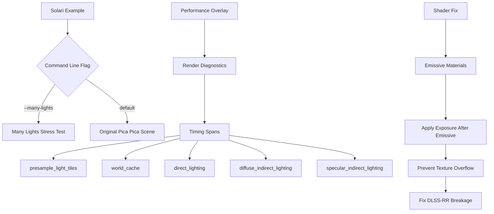

+++
title = "#22295 Solari: More examples, fix emissive"
date = "2025-12-30T00:00:00"
draft = false
template = "pull_request_page.html"
in_search_index = true

[taxonomies]
list_display = ["show"]

[extra]
current_language = "en"
available_languages = {"en" = { name = "English", url = "/pull_request/bevy/2025-12/pr-22295-en-20251230" }, "zh-cn" = { name = "中文", url = "/pull_request/bevy/2025-12/pr-22295-zh-cn-20251230" }}
labels = ["C-Bug", "A-Rendering", "C-Examples"]
+++

# Title

## Basic Information
- **Title**: Solari: More examples, fix emissive
- **PR Link**: https://github.com/bevyengine/bevy/pull/22295
- **Author**: JMS55
- **Status**: MERGED
- **Labels**: C-Bug, A-Rendering, C-Examples, S-Ready-For-Final-Review
- **Created**: 2025-12-29T02:28:48Z
- **Merged**: 2025-12-30T01:56:11Z
- **Merged By**: alice-i-cecile

## Description Translation
This PR makes three main changes to the Solari rendering system:

* Add a small profiling overlay to the Solari example that times different parts of Solari's GPU work (DLSS-RR not added because wgpu timestamps aren't working correctly with wgpu_hal work, I need to fix that as a separate thing)
* Add a many-lights stress test to the Solari example (100 lights) inspired by https://x.com/Roystoncinemo/status/1841917611833229411. Currently somewhat unusable, but this will hopefully be a bigger focus for Solari 0.19.
* Changed emissive to have exposure applied, as if `emissive_exposure_weight` was always set to 1.0 (StandardMaterial defaults to 0.0 which I'm not convinced is a good idea, but that's a separate topic). If we didn't do this, the emissive meshes would render as insanely bright white to the point of overflowing the texture and breaking DLSS-RR. I think the new behavior is more what people expect to happen, and matches the pathtracer result now.


## The Story of This Pull Request

This pull request addresses several practical issues with Bevy's Solari real-time rendering system: it adds performance profiling capabilities, introduces a stress test for many-light scenarios, and fixes a critical issue with emissive materials that was causing rendering artifacts and breaking DLSS-RR.

### The Problem and Context

The developer faced three distinct but related issues:

1. **Lack of performance visibility**: Developers using Solari couldn't easily measure the GPU time spent in different stages of the rendering pipeline, making optimization work difficult.
2. **Missing stress testing**: The system lacked a test case for handling many light sources, which is a common real-world scenario that can expose performance bottlenecks.
3. **Incorrect emissive material handling**: Emissive materials weren't having exposure applied, causing them to render as extremely bright white. This wasn't just a visual issue - it was breaking DLSS-RR (Deep Learning Super Sampling Ray Reconstruction) by overflowing texture values.

### The Solution Approach

The developer took a straightforward engineering approach to each problem:

1. **Performance profiling**: Added fine-grained timing spans to the Solari render graph node, then created a UI overlay to display these timings.
2. **Stress test**: Created a new scene setup with 100 emissive spheres (acting as lights) and 200 randomly placed cubes to test many-light performance.
3. **Emissive fix**: Changed the order of operations in the shader to apply exposure *after* adding emissive contributions, effectively treating `emissive_exposure_weight` as 1.0.

The developer made pragmatic decisions based on what would provide immediate value while acknowledging that some issues (like wgpu timestamp support for DLSS-RR profiling) would need to be addressed separately.

### The Implementation

The changes can be broken down into three main areas:

**Performance Profiling Overlay**
The render graph node (`node.rs`) was modified to add detailed timing spans for each major stage of the Solari pipeline: light tile presampling, world cache updates, direct lighting, diffuse indirect lighting, and specular indirect lighting. Previously, there was only a single timing span for the entire "solari_lighting" pass.

```rust
// Before: Single timing span
let pass_span = diagnostics.pass_span(&mut pass, "solari_lighting");

// After: Multiple detailed spans
let d = diagnostics.time_span(&mut pass, "solari_lighting/presample_light_tiles");
// ... setup and dispatch ...
d.end(&mut pass);

let d = diagnostics.time_span(&mut pass, "solari_lighting/world_cache");
// ... more work ...
d.end(&mut pass);
```

This detailed breakdown allows developers to identify which specific parts of the pipeline are bottlenecks.

**Many-Lights Stress Test**
A new `setup_many_lights` function was added that creates a scene with:
- A large checkerboard plane with UV coordinates scaled by 3x
- 200 randomly scaled and positioned cubes with random colors and roughness
- 100 randomly positioned emissive spheres with high-intensity random colors

The scene uses deterministic random generation (ChaCha8Rng with seed 42) for reproducibility. This setup is activated via a new command-line flag `--many-lights`.

**Emissive Material Fix**
The shader code in both `restir_di.wgsl` and `restir_gi.wgsl` was modified to apply exposure multiplication *after* adding the emissive term:

```wgsl
// Before in restir_di.wgsl:
var pixel_color = merge_result.selected_sample_radiance * combined_reservoir.unbiased_contribution_weight;
pixel_color *= view.exposure;
pixel_color *= brdf;
pixel_color += surface.material.emissive;

// After:
var pixel_color = merge_result.selected_sample_radiance * combined_reservoir.unbiased_contribution_weight;
pixel_color *= brdf;
pixel_color += surface.material.emissive;
pixel_color *= view.exposure;
```

This change ensures that emissive materials are affected by the scene's exposure settings, preventing them from being unrealistically bright and avoiding texture value overflow issues.

### Technical Insights

The emissive fix reveals an interesting aspect of physically based rendering: exposure control should apply to *all* light sources in the scene, including emissive materials. By applying exposure after adding emissive contributions, we treat emissive materials as proper light sources that participate in the scene's overall lighting model.

The performance profiling implementation demonstrates Bevy's diagnostic system capabilities. Each timing span corresponds to a specific stage in the render graph, and these can be queried at runtime to display performance metrics. The developer noted that DLSS-RR timing isn't included due to issues with wgpu timestamps, which highlights the practical challenges of GPU profiling across different hardware and API layers.

The many-lights example uses a clever approach to testing: it doesn't try to create a perfectly artistic scene, but rather a stress test that pushes the system to its limits. The 100 emissive spheres (each with random colors up to 20,000 intensity) create a challenging lighting scenario that will help identify performance bottlenecks in Solari's lighting algorithms.

### The Impact

These changes provide immediate practical benefits:

1. **Better debugging**: Developers can now see exactly where time is being spent in the Solari pipeline, making optimization efforts more targeted.
2. **Real-world testing**: The many-lights example exposes performance issues that might not show up in simpler scenes, helping guide future development of Solari 0.19.
3. **Visual correctness**: Emissive materials now behave more predictably and won't break DLSS-RR, improving both visual quality and stability.

The changes are backward compatible - existing scenes will see improved emissive material behavior without requiring code changes. The performance overlay is opt-in (only in the example), and the many-lights test is a separate example mode.

## Visual Representation



## Key Files Changed

### `examples/3d/solari.rs` (+268/-11)

**What changed**: Added performance profiling UI, many-lights stress test scene, and refactored the example to support multiple scenes.

**Key modifications**:
```rust
// Added command-line argument for many-lights test
#[argh(switch)]
many_lights: Option<bool>,

// Conditional scene setup based on command-line flag
if args.many_lights == Some(true) {
    app.add_systems(Startup, setup_many_lights);
} else {
    app.add_systems(Startup, setup_pica_pica);
}

// Performance overlay UI with detailed timing display
commands.spawn((
    Node {
        position_type: PositionType::Absolute,
        right: px(0.0),
        padding: px(4.0).all(),
        border_radius: BorderRadius::bottom_left(px(4.0)),
        ..default()
    },
    BackgroundColor(Color::srgba(0.10, 0.10, 0.10, 0.8)),
    children![(
        PerformanceText,
        Text::default(),
        TextFont {
            font_size: 8.0,
            ..default()
        },
    )],
));

// Function to update performance text with detailed timing
fn update_performance_text(
    mut text: Single<&mut Text, With<PerformanceText>>,
    diagnostics: Res<DiagnosticsStore>,
) {
    text.0.clear();
    let mut total = 0.0;
    let mut add_diagnostic = |name: &str, path: &'static str| {
        let path = DiagnosticPath::new(path);
        if let Some(average) = diagnostics.get(&path).and_then(Diagnostic::average) {
            text.push_str(&format!("{name:17}  {average:.2} ms\n"));
            total += average;
        }
    };
    // ... timing display for each pipeline stage
}
```

**Relation to PR purpose**: This file implements the user-facing changes - the performance overlay and the new stress test scene.

### `crates/bevy_solari/src/realtime/node.rs` (+16/-3)

**What changed**: Added detailed timing spans for each major stage of the Solari lighting pipeline.

**Key modifications**:
```rust
// Removed single timing span
// let pass_span = diagnostics.pass_span(&mut pass, "solari_lighting");

// Added individual timing spans for each pipeline stage
let d = diagnostics.time_span(&mut pass, "solari_lighting/presample_light_tiles");
// ... pipeline setup and dispatch ...
d.end(&mut pass);

let d = diagnostics.time_span(&mut pass, "solari_lighting/world_cache");
// ... more work ...
d.end(&mut pass);

// Similar pattern for direct_lighting, diffuse_indirect_lighting, specular_indirect_lighting
```

**Relation to PR purpose**: This enables the performance profiling by breaking down the single timing measurement into detailed per-stage measurements.

### `crates/bevy_solari/src/realtime/restir_di.wgsl` (+1/-1)

**What changed**: Reordered operations to apply exposure after adding emissive contribution.

**Key modifications**:
```wgsl
// Before:
var pixel_color = merge_result.selected_sample_radiance * combined_reservoir.unbiased_contribution_weight;
pixel_color *= view.exposure;
pixel_color *= brdf;
pixel_color += surface.material.emissive;

// After:
var pixel_color = merge_result.selected_sample_radiance * combined_reservoir.unbiased_contribution_weight;
pixel_color *= brdf;
pixel_color += surface.material.emissive;
pixel_color *= view.exposure;
```

**Relation to PR purpose**: This fixes the emissive material issue by ensuring exposure applies to emissive contributions.

### `crates/bevy_solari/src/realtime/restir_gi.wgsl` (+12/-5)

**What changed**: Modified indirect lighting shader to apply visibility tracing in a different place, with conditional compilation for biased vs unbiased resampling.

**Key modifications**:
```wgsl
// Added conditional storage of reservoir based on BIASED_RESAMPLING define
#ifndef BIASED_RESAMPLING
    gi_reservoirs_a[pixel_index] = combined_reservoir;
#endif

// Apply visibility tracing
combined_reservoir.unbiased_contribution_weight *= trace_point_visibility(surface.world_position, combined_reservoir.sample_point_world_position);

#ifdef BIASED_RESAMPLING
    gi_reservoirs_a[pixel_index] = combined_reservoir;
#endif

// Simplified neighbor loading by removing visibility multiplication
let spatial_reservoir = gi_reservoirs_b[spatial_pixel_index];
// (removed: spatial_reservoir.radiance *= trace_point_visibility(...))
```

**Relation to PR purpose**: This optimizes the indirect lighting shader and provides configurability for the trade-off between accuracy and stability in visibility calculations.

## Further Reading

- [Bevy Render Graph Documentation](https://bevyengine.org/learn/advanced-topics/rendering/render-graph/) - Understanding how timing spans fit into Bevy's render graph system
- [Physically Based Rendering (PBR) Theory](https://learnopengl.com/PBR/Theory) - Background on how exposure affects lighting calculations
- [WGSL Shader Language Specification](https://www.w3.org/TR/WGSL/) - For understanding the shader code changes
- [ReSTIR GI Paper](https://research.nvidia.com/publication/2021-06_restir-gi-path-resampling-real-time-path-tracing) - Technical details on the indirect lighting algorithm used in Solari
- [Bevy Diagnostics System](https://docs.rs/bevy/latest/bevy/diagnostic/) - How Bevy handles performance measurements and diagnostics