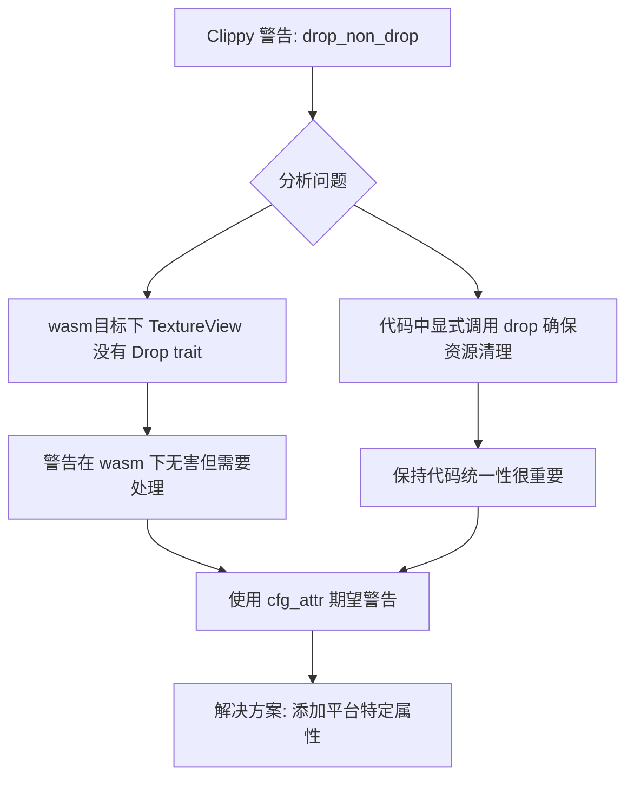

+++
title = "#22303 bevy_render: dropped texture view is not Drop in wasm"
date = "2025-12-30T00:00:00"
draft = false
template = "pull_request_page.html"
in_search_index = false

[extra]
current_language = "zh-cn"
available_languages = {"en" = { name = "English", url = "/pull_request/bevy/2025-12/pr-22303-en-20251230" }, "zh-cn" = { name = "中文", url = "/pull_request/bevy/2025-12/pr-22303-zh-cn-20251230" }}
labels = ["C-Bug", "A-Rendering", "C-Code-Quality", "O-Web"]
+++

# Title

## Basic Information
- **Title**: bevy_render: dropped texture view is not Drop in wasm
- **PR Link**: https://github.com/bevyengine/bevy/pull/22303
- **Author**: mockersf
- **Status**: MERGED
- **Labels**: C-Bug, A-Rendering, C-Code-Quality, O-Web, S-Ready-For-Final-Review
- **Created**: 2025-12-29T18:22:12Z
- **Merged**: 2025-12-30T02:01:08Z
- **Merged By**: alice-i-cecile

## Description Translation

### 目标

- 在使用 wasm 目标运行 `cargo clippy --no-deps --package bevy_render --target wasm32-unknown-unknown` 时失败，出现以下警告：

```
warning: call to `std::mem::drop` with a value that does not implement `Drop`. Dropping such a type only extends its contained lifetimes
   --> crates/bevy_render/src/view/window/mod.rs:416:13
    |
416 |             drop(window.swap_chain_texture_view.take());
    |             ^^^^^^^^^^^^^^^^^^^^^^^^^^^^^^^^^^^^^^^^^^^
    |
note: argument has type `std::option::Option<render_resource::texture::TextureView>`
   --> crates/bevy_render/src/view/window/mod.rs:416:18
    |
416 |             drop(window.swap_chain_texture_view.take());
    |                  ^^^^^^^^^^^^^^^^^^^^^^^^^^^^^^^^^^^^^
    = help: for further information visit https://rust-lang.github.io/rust-clippy/rust-1.92.0/index.html#drop_non_drop
    = note: `#[warn(clippy::drop_non_drop)]` on by default

warning: `bevy_render` (lib) generated 1 warning
```

### 解决方案

- 在 wasm 目标上期望（expect）这个 lint。这不是实际的问题，而且为 wasm 做特殊处理也不会更好。

## The Story of This Pull Request

这个 PR 解决了一个在 WebAssembly 编译目标下出现的 Clippy 警告问题。问题出现在 Bevy 渲染引擎的窗口管理模块中，具体是在处理交换链纹理视图（swap chain texture view）时。

问题的核心是，在 wasm32-unknown-unknown 目标下运行 Clippy 时，检测到了一个 `drop_non_drop` 警告。这个警告指出，代码正在调用 `std::mem::drop` 函数来释放一个没有实现 `Drop` trait 的类型。在这种情况下，这个类型是 `Option<TextureView>`。

从技术角度分析，这个警告出现的原因是在 wasm 目标下，`TextureView` 类型确实没有实现 `Drop` trait。这是因为在 WebGPU 的 wasm 实现中，纹理视图的管理方式与原生平台不同。在原生平台上，`TextureView` 可能需要显式地释放 GPU 资源，因此实现了 `Drop` trait。但在 wasm 环境下，这些资源的管理可能由 JavaScript 的垃圾回收机制处理，或者通过不同的生命周期管理方式。

然而，开发者在实现这个代码时，为了确保代码的健壮性，添加了一个额外的 `drop` 调用。这个调用位于 `create_surfaces` 函数中，在重新配置窗口表面时，会先尝试丢弃（drop）旧的交换链纹理和纹理视图。这是为了防止在 wgpu 中产生验证错误，确保旧的资源被正确清理。

在实际情况下，这个 `drop` 调用在 wasm 环境下确实没有实际作用，因为 `TextureView` 没有实现 `Drop` trait。但 Clippy 将它标记为警告，因为从静态分析的角度看，这是不必要的操作。

开发者 mockersf 选择的解决方案是使用 `#[cfg_attr]` 属性来条件性地期望（expect）这个特定的 Clippy 警告。这意味着当针对 wasm32 架构编译时，编译器会期望看到 `clippy::drop_non_drop` 警告，从而避免使构建失败。同时，通过 `reason` 参数提供了清晰的解释，说明为什么需要这个例外。

这种解决方案有几个技术考量：

1. **最小化更改**：只添加了一个属性注解，没有改变实际的代码逻辑或结构。
2. **平台特定处理**：使用条件编译属性确保只在 wasm 目标上应用这个例外。
3. **清晰的文档**：通过 `reason` 参数解释了为什么需要这个例外，帮助未来的维护者理解上下文。
4. **保持代码一致性**：没有为 wasm 创建特殊的代码路径，保持了代码的简洁性和一致性。

这个决策背后的工程思考是：虽然可以为 wasm 目标完全移除这个 `drop` 调用，但这可能会引入平台特定的代码分支，增加维护复杂度。而当前的解决方案在保持代码统一的同时，只是静默了在 wasm 环境下无害的警告。

从更广泛的角度看，这个 PR 展示了如何在多平台项目中处理平台特定的编译器警告。它采用了一种务实的方法：承认警告的存在，提供明确的解释，但不过度工程化解决方案。这种平衡在维护跨平台代码库时是很重要的，特别是在涉及到图形 API 和资源管理这种复杂领域时。

## Visual Representation



## Key Files Changed

### `crates/bevy_render/src/view/window/mod.rs`

这个文件包含了窗口渲染表面的创建和管理逻辑。具体更改是在 `create_surfaces` 函数中添加了一个条件属性，用于处理 wasm 目标下的 Clippy 警告。

**更改详情**：

在原有的 `drop(window.swap_chain_texture_view.take());` 调用前添加了条件属性：

```rust
#[cfg_attr(
    target_arch = "wasm32",
    expect(clippy::drop_non_drop, reason = "texture views are not drop on wasm")
)]
drop(window.swap_chain_texture_view.take());
```

**代码上下文**：
这个 `drop` 调用位于重新配置窗口表面的逻辑中。当窗口大小或其他属性发生变化时，需要重新创建交换链。在这之前，代码会显式地丢弃旧的纹理和纹理视图，以防止 wgpu 验证错误。

**为什么这些更改重要**：
1. 解决了 wasm 编译目标下的 Clippy 警告，确保 CI/CD 流程不会因警告而失败
2. 保持了代码的平台兼容性，同时避免引入复杂的条件编译分支
3. 通过属性注解提供了清晰的文档，解释了为什么这个警告在 wasm 环境下可以安全忽略

## Further Reading

1. **Rust Clippy 文档**：了解 `drop_non_drop` lint 的详细信息和最佳实践
   - https://rust-lang.github.io/rust-clippy/rust-1.92.0/index.html#drop_non_drop

2. **Bevy 渲染架构**：理解 Bevy 的渲染系统和纹理管理机制
   - https://bevyengine.org/learn/book/getting-started/rendering/

3. **WebGPU 和 wasm**：了解 WebGPU 在 WebAssembly 环境中的实现细节
   - https://www.w3.org/TR/webgpu/

4. **Rust 条件编译**：掌握 `#[cfg]` 和 `#[cfg_attr]` 属性的使用方法
   - https://doc.rust-lang.org/reference/conditional-compilation.html