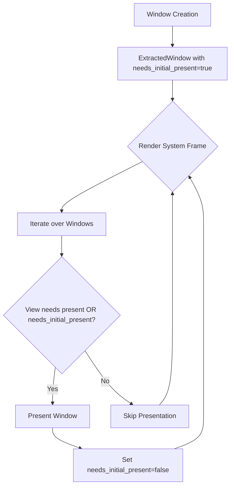

+++
title = "#22307 Always present window at least once"
date = "2025-12-30T00:00:00"
draft = false
template = "pull_request_page.html"
in_search_index = true

[taxonomies]
list_display = ["show"]

[extra]
current_language = "en"
available_languages = {"en" = { name = "English", url = "/pull_request/bevy/2025-12/pr-22307-en-20251230" }, "zh-cn" = { name = "中文", url = "/pull_request/bevy/2025-12/pr-22307-zh-cn-20251230" }}
labels = ["C-Bug", "A-Rendering", "A-Windowing", "P-Regression"]
+++

# Title
Always present window at least once

## Basic Information
- **Title**: Always present window at least once
- **PR Link**: https://github.com/bevyengine/bevy/pull/22307
- **Author**: tychedelia
- **Status**: MERGED
- **Labels**: C-Bug, A-Rendering, A-Windowing, S-Ready-For-Final-Review, P-Regression
- **Created**: 2025-12-29T21:45:47Z
- **Merged**: 2025-12-30T02:05:58Z
- **Merged By**: alice-i-cecile

## Description Translation
Closes #22306. In theory we could cfg gate this for just wayland but doesn't seem harmful to do as a general case so nbd imo.

Don't have access to wayland right now so can't test but the docs [here](https://wayland.app/protocols/xdg-shell#xdg_surface) and [here](https://wayland-book.com/surfaces-in-depth/lifecycle.html) seem to confirm this is the right fix.

## The Story of This Pull Request

This PR addresses a Wayland-specific window initialization issue that manifested as windows not appearing on screen. The problem occurred because Bevy's render system was conditionally presenting windows only when there was a camera view targeting that window that required presentation. On Wayland, however, windows have a strict lifecycle requirement: they must commit a buffer at least once before they become visible. Without this initial buffer commit, windows remain invisible even though the application logic is otherwise functional.

The issue was identified as a regression, likely introduced when the presentation logic was refactored to be more efficient by only presenting windows when necessary. While this optimization worked for most platforms, it broke Wayland's strict surface lifecycle requirements.

The developer's investigation led to the Wayland protocol documentation for xdg_surface, which specifies that a surface must have a buffer attached and committed before it can be shown. This requirement is fundamental to Wayland's design - surfaces start in a "pending" state and only become visible after an initial commit. The fix needed to ensure that every window, regardless of camera state, gets presented at least once during initialization.

Instead of implementing a platform-specific conditional compilation guard, the developer chose a simpler, more robust approach: adding a flag to track whether each window has been presented at least once. This approach has minimal overhead and works universally across all platforms. While technically only required for Wayland, forcing an initial presentation on all platforms doesn't cause issues and simplifies the codebase by avoiding platform-specific logic.

The implementation adds a `needs_initial_present` boolean field to the `ExtractedWindow` struct, initialized to `true` when windows are created. In the render system's presentation logic, the code now checks this flag alongside the existing condition that checks if any camera view targeting the window needs presentation. If either condition is true, the window gets presented, and the flag is cleared.

This change required restructuring the render system's loop. Previously, the system iterated over camera views and presented their target windows. Now, it iterates over windows directly and checks if any associated camera view needs presentation OR if the window itself needs its initial presentation. This restructuring is actually cleaner because it centralizes window presentation logic and avoids the previous pattern of potentially presenting the same window multiple times in a single frame when multiple cameras target it.

The fix demonstrates an important principle in cross-platform graphics programming: different windowing systems have different initialization and lifecycle requirements. What appears as an optimization on one platform (skipping unnecessary presentations) can be a hard requirement violation on another. The solution shows pragmatic engineering - instead of over-engineering with platform-specific code, implement a simple universal solution that satisfies the strictest platform's requirements without harming others.

## Visual Representation



## Key Files Changed

### 1. `crates/bevy_render/src/view/window/mod.rs` (+6/-0)

This file defines the `ExtractedWindow` struct that holds window data for rendering. The change adds a new field to track whether a window needs its initial presentation.

**Key modification:**
```rust
// Before (struct definition excerpt):
pub struct ExtractedWindow {
    pub size_changed: bool,
    pub present_mode_changed: bool,
    pub alpha_mode: CompositeAlphaMode,
}

// After:
pub struct ExtractedWindow {
    pub size_changed: bool,
    pub present_mode_changed: bool,
    pub alpha_mode: CompositeAlphaMode,
    /// Whether this window needs an initial buffer commit.
    ///
    /// On Wayland, windows must present at least once before they are shown.
    /// See <https://wayland.app/protocols/xdg-shell#xdg_surface>
    pub needs_initial_present: bool,
}
```

**In the extract_windows function:**
```rust
// Before:
ExtractedWindow {
    // ... existing fields
    alpha_mode: window.composite_alpha_mode,
}

// After:
ExtractedWindow {
    // ... existing fields
    alpha_mode: window.composite_alpha_mode,
    needs_initial_present: true,
}
```

This change initializes every new window with the flag set to `true`, ensuring it will be presented at least once during its lifecycle.

### 2. `crates/bevy_render/src/renderer/mod.rs` (+10/-7)

This file contains the main render system logic. The change modifies how windows are presented by adding the check for the initial presentation flag and restructuring the loop for clarity.

**Key modification in render_system function:**
```rust
// Before presentation logic:
for (view_target, camera) in views.iter() {
    if let Some(NormalizedRenderTarget::Window(window)) = camera.target
        && view_target.needs_present()
    {
        let Some(window) = windows.get_mut(&window.entity()) else {
            continue;
        };
        window.present();
    }
}

// After presentation logic:
for window in windows.values_mut() {
    let view_needs_present = views.iter().any(|(view_target, camera)| {
        matches!(
            camera.target,
            Some(NormalizedRenderTarget::Window(w)) if w.entity() == window.entity
        ) && view_target.needs_present()
    });

    if view_needs_present || window.needs_initial_present {
        window.present();
        window.needs_initial_present = false;
    }
}
```

The restructured logic now:
1. Iterates over windows directly instead of camera views
2. Checks if any camera view targeting this window needs presentation
3. Also checks if the window itself needs its initial presentation
4. Presents the window if either condition is true
5. Clears the `needs_initial_present` flag after the first presentation

This approach is more efficient when multiple cameras target the same window and ensures the Wayland requirement is met regardless of camera state.

## Further Reading

1. **Wayland Protocol Documentation**: The [xdg-shell protocol](https://wayland.app/protocols/xdg-shell#xdg_surface) specifies the surface lifecycle requirements that necessitated this fix.
2. **Wayland Book - Surfaces in Depth**: The [Wayland Book chapter on surfaces](https://wayland-book.com/surfaces-in-depth/lifecycle.html) provides detailed explanations of surface states and buffer management.
3. **Bevy Rendering Architecture**: Understanding Bevy's ECS-based renderer architecture helps contextualize how window presentation integrates with the overall rendering pipeline.
4. **Cross-Platform Windowing Challenges**: Resources on differences between X11, Wayland, Windows, and macOS windowing systems can help understand why platform-specific requirements emerge.
5. **GPU Presentation Models**: Learning about different presentation modes (V-Sync, immediate, mailbox) and how they interact with windowing systems provides background on why presentation logic needs careful handling.