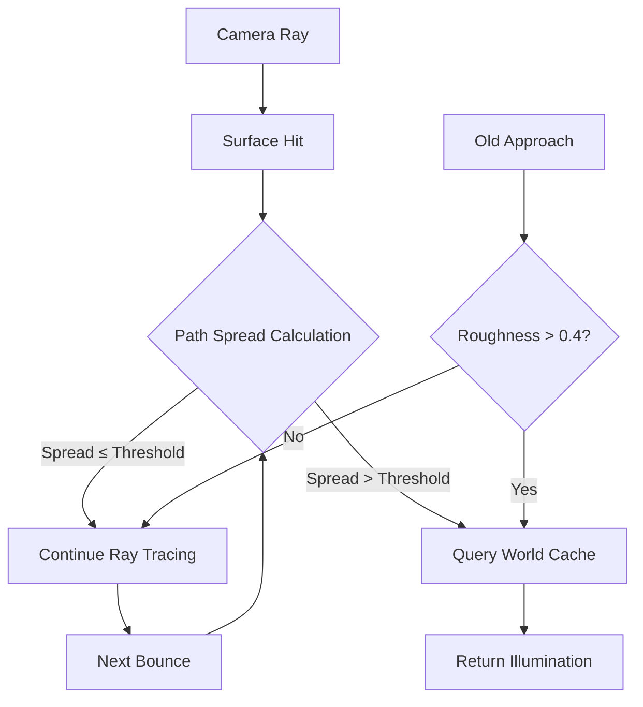

+++
title = "#22311 Solari: Specular path spread heuristic"
date = "2025-12-30T00:00:00"
draft = false
template = "pull_request_page.html"
in_search_index = true

[taxonomies]
list_display = ["show"]

[extra]
current_language = "en"
available_languages = {"en" = { name = "English", url = "/pull_request/bevy/2025-12/pr-22311-en-20251230" }, "zh-cn" = { name = "中文", url = "/pull_request/bevy/2025-12/pr-22311-zh-cn-20251230" }}
labels = ["A-Rendering", "C-Performance", "C-Refinement"]
+++

# Solari: Specular path spread heuristic

## Basic Information
- **Title**: Solari: Specular path spread heuristic
- **PR Link**: https://github.com/bevyengine/bevy/pull/22311
- **Author**: JMS55
- **Status**: MERGED
- **Labels**: A-Rendering, C-Performance, S-Ready-For-Final-Review, C-Refinement
- **Created**: 2025-12-30T02:00:30Z
- **Merged**: 2025-12-30T05:40:56Z
- **Merged By**: alice-i-cecile

## Description Translation
Currently solari's specular GI conditionally terminates in the world cache based on the roughness of a surface.

This PR changes that. Now, solari tracks the spread of the full path to the camera, and terminates in the world cache once the spread is wide enough.

On the plus side this gives
* A good bit better performance
* More stable / higher quality lighting sometimes

On the downside:
* Transitions between world cache LODs tend to show up in rough reflections. Unlike ReSTIR GI, there's currently no temporal reservoirs to hide it.
* Slightly more light leaks / less accuracy sometimes

Overall I think it's a worthwhile change.

## The Story of This Pull Request

This PR addresses an optimization opportunity in Bevy's Solari real-time global illumination system, specifically in how specular GI paths are terminated when querying the world cache. The previous implementation used a simple heuristic: if a surface's roughness exceeded a fixed threshold (`0.4`), the path would terminate early and sample from the world cache instead of continuing to trace rays.

The problem with this approach is that it doesn't account for the actual path geometry. A surface might be rough, but if the ray path from the camera to that surface is short, the spread of potential rays might still be small enough to warrant more accurate tracing rather than relying on the world cache's lower-resolution data. Conversely, a less rough surface viewed from a distance might have a sufficiently wide path spread to benefit from early termination.

The solution implements a more physically-based heuristic from the paper "Real-Time Geometric Glinty Reflections using Spherical Caps" by Müller et al. (2021). Instead of checking surface roughness alone, the code now tracks the cumulative spread of the entire path from camera to surface. When this spread exceeds a threshold relative to the world cache's cell size, the path terminates and uses cached illumination.

The implementation required several key changes. First, the shader needed to import `get_cell_size` to understand the world cache's spatial resolution. More importantly, the algorithm now calculates `a0` - a measure of acceptable spread based on camera distance and surface orientation:

```wgsl
let cos_theta = saturate(dot(wo, surface.world_normal));
var a0 = dot(wo_unnormalized, wo_unnormalized) / (4.0 * PI * cos_theta);
a0 *= TERMINATE_IN_WORLD_CACHE_THRESHOLD;
```

This `a0` value represents how much spread can be tolerated before switching to the world cache, scaled by a new, much smaller threshold (`0.03` compared to the previous `0.4`).

During path tracing, the shader accumulates `path_spread` using the formula from the paper:

```wgsl
path_spread += sqrt((ray.t * ray.t) / (p_bounce * wo_tangent.z));
```

The termination condition changes from a simple roughness check to comparing this accumulated spread against the cache resolution:

```wgsl
if path_spread * path_spread > a0 * get_cell_size(ray_hit.world_position, view.world_position) {
    // Path spread is wide enough, terminate path in the world cache
    // ... use world cache ...
    break;
}
```

This approach is more physically accurate because it considers the actual geometry of the light path rather than just material properties. The performance improvement comes from terminating paths earlier when they're sufficiently diffuse (in a geometric sense), reducing the number of expensive ray traces. The quality improvement in some cases comes from continuing to trace rays for surfaces that are rough but close to the camera, where the world cache's lower resolution would be noticeable.

The trade-offs are technical but important. Without temporal filtering (which ReSTIR GI has but this implementation doesn't), transitions between world cache levels of detail become visible in rough reflections. There's also a slight increase in light leaks because the world cache approximation is less accurate than continued ray tracing. However, the performance gains and overall quality improvements make this a net positive change.

## Visual Representation



## Key Files Changed

### `crates/bevy_solari/src/realtime/specular_gi.wgsl` (+18/-8)

This is the only file modified in the PR. It contains the core specular global illumination shader for Solari. The changes replace a simple roughness-based termination heuristic with a more sophisticated path-spread calculation based on research from Müller et al.

**Key modifications:**

1. **Added import and renamed constant**:
```wgsl
// Before:
#import bevy_solari::world_cache::{query_world_cache, WORLD_CACHE_CELL_LIFETIME}
const WORLD_CACHE_TERMINATION_ROUGHNESS_THRESHOLD: f32 = 0.4;

// After:
#import bevy_solari::world_cache::{query_world_cache, get_cell_size, WORLD_CACHE_CELL_LIFETIME}
const TERMINATE_IN_WORLD_CACHE_THRESHOLD: f32 = 0.03;
```

2. **Modified path tracing call with new parameters**:
```wgsl
// Before:
radiance = trace_glossy_path(surface.world_position, wi, &rng) / pdf;

// After:
let cos_theta = saturate(dot(wo, surface.world_normal));
var a0 = dot(wo_unnormalized, wo_unnormalized) / (4.0 * PI * cos_theta);
a0 *= TERMINATE_IN_WORLD_CACHE_THRESHOLD;
radiance = trace_glossy_path(surface.world_position, wi, pdf, a0, &rng) / pdf;
```

3. **Updated trace_glossy_path function signature and logic**:
```wgsl
// Before:
fn trace_glossy_path(initial_ray_origin: vec3<f32>, initial_wi: vec3<f32>, rng: ptr<function, u32>) -> vec3<f32> {
    // ...
    if ray_hit.material.roughness > WORLD_CACHE_TERMINATION_ROUGHNESS_THRESHOLD && i != 0u {
        // Surface is very rough, terminate path in the world cache
        // ...
    }
}

// After:
fn trace_glossy_path(initial_ray_origin: vec3<f32>, initial_wi: vec3<f32>, initial_p_bounce: f32, a0: f32, rng: ptr<function, u32>) -> vec3<f32> {
    // ...
    var path_spread = 0.0;
    // ...
    // https://d1qx31qr3h6wln.cloudfront.net/publications/mueller21realtime.pdf#subsection.3.4, equation (3)
    path_spread += sqrt((ray.t * ray.t) / (p_bounce * wo_tangent.z));
    
    if path_spread * path_spread > a0 * get_cell_size(ray_hit.world_position, view.world_position) {
        // Path spread is wide enough, terminate path in the world cache
        // ...
    }
}
```

These changes shift the termination heuristic from a material property (roughness) to a geometric property (path spread), which better matches the underlying physics of light transport and provides better performance-quality trade-offs.

## Further Reading

1. **Primary Reference**: Müller, T., Rousselle, F., Keller, A., & Novák, J. (2021). "Real-Time Geometric Glinty Reflections using Spherical Caps." The paper that introduced the path spread heuristic used in this PR. Available at: https://d1qx31qr3h6wln.cloudfront.net/publications/mueller21realtime.pdf

2. **Bevy Solari Documentation**: The Bevy engine's real-time global illumination system that this PR modifies. Understanding the overall architecture helps contextualize these changes.

3. **ReSTIR GI**: The reservoir-based spatiotemporal importance resampling technique mentioned as a comparison point. This approach uses temporal reservoirs to hide LOD transitions, which the current Solari implementation lacks.

4. **WGSL (WebGPU Shading Language)**: The shading language used for Bevy's graphics pipelines. Familiarity with WGSL helps understand the implementation details.

5. **Global Illumination Techniques**: Background on path tracing, importance sampling, and caching strategies for real-time GI provides context for why this optimization matters.