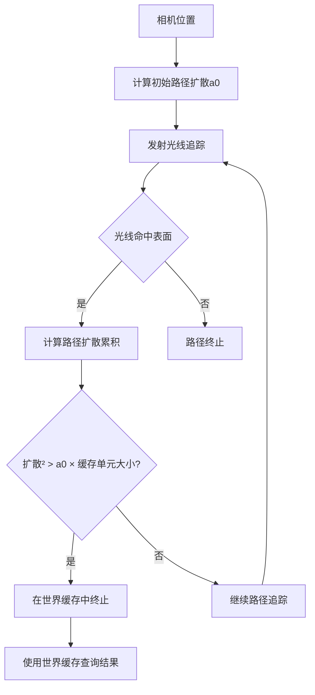

+++
title = "#22311 Solari：镜面反射路径扩散启发式算法"
date = "2025-12-30T00:00:00"
draft = false
template = "pull_request_page.html"
in_search_index = false

[extra]
current_language = "zh-cn"
available_languages = {"en" = { name = "English", url = "/pull_request/bevy/2025-12/pr-22311-en-20251230" }, "zh-cn" = { name = "中文", url = "/pull_request/bevy/2025-12/pr-22311-zh-cn-20251230" }}
+++

# Title: Solari：镜面反射路径扩散启发式算法

## 基本信息
- **标题**: Solari: Specular path spread heuristic
- **PR链接**: https://github.com/bevyengine/bevy/pull/22311
- **作者**: JMS55
- **状态**: 已合并
- **标签**: A-Rendering, C-Performance, S-Ready-For-Final-Review, C-Refinement
- **创建时间**: 2025-12-30T02:00:30Z
- **合并时间**: 2025-12-30T05:40:56Z
- **合并者**: alice-i-cecile

## 描述翻译
目前，Solari的镜面全局光照会根据表面的粗糙度条件性地在世界缓存中终止。

这个PR改变了这一点。现在，Solari追踪从相机出发的完整路径的扩散，当扩散足够宽时，在世界缓存中终止。

优点：
* 性能有显著提升
* 有时能提供更稳定/更高质量的照明

缺点：
* 世界缓存不同细节级别（LOD）之间的过渡在粗糙反射中往往会显现出来。与ReSTIR GI不同，目前没有时间性存储池（temporal reservoirs）来隐藏这种过渡。
* 有时会出现稍微更多的光线泄漏/准确性略有下降

总的来说，我认为这是一个值得的改动。

## 这个拉取请求的故事

**问题和背景**
这个PR解决的问题涉及Solari（Bevy的全局光照系统）中镜面反射路径追踪的性能和准确性优化。在原始的代码实现中，镜面全局光照（specular GI）系统使用一个固定的粗糙度阈值来决定何时在世界缓存（world cache）中终止路径追踪。具体来说，当表面粗糙度超过`WORLD_CACHE_TERMINATION_ROUGHNESS_THRESHOLD`（0.4）时，系统会提前在世界缓存中终止路径，而不是继续追踪更多次反弹。

这种方法的局限性在于，它基于局部的表面属性（粗糙度）做决策，而没有考虑整个光路的扩散情况。这可能导致两种情况：1）过早终止，使得粗糙反射的质量不足；2）过晚终止，导致不必要的性能开销。这个问题在实时光照追踪中尤其重要，因为需要在有限的计算资源内实现最佳的质量-性能权衡。

**解决方案**
开发者JMS55采用了来自ReSTIR GI论文的路径扩散启发式算法。核心思想是追踪从相机到当前命中点的整个路径的扩散（spread），当路径扩散足够宽时再切换到世界缓存。这比基于粗糙度的静态阈值更符合物理原理，因为它考虑了路径累积的几何特性。

实现的关键技术参考是ReSTIR GI论文第3.4节（Mueller et al., 2021），具体是方程(3)和(4)。该算法计算路径的累计扩散，当平方扩散超过阈值时，就使用世界缓存的漫射光照近似剩余的光路。

**实现细节**
主要的改动集中在`specular_gi.wgsl`文件中。让我们看看具体的实现：

1. **常量和导入更新**：
   - 引入了新的常量`TERMINATE_IN_WORLD_CACHE_THRESHOLD: f32 = 0.03`，替代了原来的`WORLD_CACHE_TERMINATION_ROUGHNESS_THRESHOLD: f32 = 0.4`
   - 增加了对`get_cell_size`函数的导入，用于计算世界缓存单元的大小

2. **初始扩散计算**：
   在`specular_gi`函数中，现在计算初始扩散阈值`a0`：

   ```wgsl
   // https://d1qx31qr3h6wln.cloudfront.net/publications/mueller21realtime.pdf#subsection.3.4, equation (4)
   let cos_theta = saturate(dot(wo, surface.world_normal));
   var a0 = dot(wo_unnormalized, wo_unnormalized) / (4.0 * PI * cos_theta);
   a0 *= TERMINATE_IN_WORLD_CACHE_THRESHOLD;
   ```

   这个公式根据相机到表面的距离和出射方向与法线的夹角计算初始扩散面积。`TERMINATE_IN_WORLD_CACHE_THRESHOLD`用作缩放因子，控制何时认为扩散足够宽。

3. **路径扩散追踪**：
   `trace_glossy_path`函数现在接收`initial_p_bounce`和`a0`参数，并在每个反弹点累加路径扩散：

   ```wgsl
   // https://d1qx31qr3h6wln.cloudfront.net/publications/mueller21realtime.pdf#subsection.3.4, equation (3)
   path_spread += sqrt((ray.t * ray.t) / (p_bounce * wo_tangent.z));
   ```

   这里的`ray.t`是光线行程距离，`p_bounce`是当前反弹的概率密度函数（PDF），`wo_tangent.z`是出射方向与局部法线的点积（近似cosθ）。

4. **终止条件更新**：
   终止条件从基于粗糙度改为基于路径扩散：

   ```wgsl
   if path_spread * path_spread > a0 * get_cell_size(ray_hit.world_position, view.world_position) {
       // Path spread is wide enough, terminate path in the world cache
       let diffuse_brdf = ray_hit.material.base_color / PI;
       radiance += throughput * diffuse_brdf * query_world_cache(ray_hit.world_position, ray_hit.geometric_world_normal, view.world_position, WORLD_CACHE_CELL_LIFETIME, rng);
       break;
   }
   ```

   当平方路径扩散超过`a0`乘以世界缓存单元大小时，路径终止并使用世界缓存查询。

**工程权衡**
这个实现展示了几个重要的工程决策：

1. **性能 vs. 质量**：新算法通过更智能的终止条件提高了性能，但也引入了一些质量损失（如LOD过渡可见、轻微光线泄漏）。
2. **理论基础 vs. 实际实现**：算法基于ReSTIR GI的理论，但针对实时渲染进行了调整和简化。
3. **参数调整**：`TERMINATE_IN_WORLD_CACHE_THRESHOLD`设为0.03，这是一个经验值，需要在性能和质量间找到平衡。

**技术洞察**
这个PR的核心技术洞察是：在实时全局光照中，基于路径扩散的终止条件比基于表面属性的静态阈值更有效。扩散度量能更准确地反映路径是否已经"发散"到可以使用较低精度的近似（世界缓存）的程度。

值得注意的是，这个算法没有使用ReSTIR GI的时间性存储池（temporal reservoirs），所以世界缓存LOD过渡更加明显。这是当前实现的一个已知限制，可能在未来的PR中通过添加时间性滤波来解决。

**影响**
这个PR对Bevy的Solari系统产生了以下影响：

1. **性能提升**：通过更早地在适当的情况下使用世界缓存，减少了不必要的路径追踪开销。
2. **质量改善**：在某些情况下，特别是中等粗糙度的表面，光照质量更加稳定。
3. **代码架构**：引入了更复杂的路径追踪度量，为未来的优化奠定了基础。

从工程角度看，这个PR展示了如何将学术研究中的算法（ReSTIR GI）适配到实际的游戏引擎中，同时保持实时性能约束。

## 可视化表示



## 关键文件更改

**文件**: `crates/bevy_solari/src/realtime/specular_gi.wgsl` (+18/-8)

这个文件包含了Solari镜面全局光照的核心着色器逻辑。主要改动集中在路径追踪终止条件的计算方式上。

**关键修改**：

1. **导入和常量更新**：

```wgsl
// 之前：
#import bevy_solari::world_cache::{query_world_cache, WORLD_CACHE_CELL_LIFETIME}
const WORLD_CACHE_TERMINATION_ROUGHNESS_THRESHOLD: f32 = 0.4;

// 之后：
#import bevy_solari::world_cache::{query_world_cache, get_cell_size, WORLD_CACHE_CELL_LIFETIME}
const TERMINATE_IN_WORLD_CACHE_THRESHOLD: f32 = 0.03;
```

2. **初始扩散计算**：

```wgsl
// 新增的代码：
// https://d1qx31qr3h6wln.cloudfront.net/publications/mueller21realtime.pdf#subsection.3.4, equation (4)
let cos_theta = saturate(dot(wo, surface.world_normal));
var a0 = dot(wo_unnormalized, wo_unnormalized) / (4.0 * PI * cos_theta);
a0 *= TERMINATE_IN_WORLD_CACHE_THRESHOLD;
```

3. **函数签名和终止条件更新**：

```wgsl
// 之前：
fn trace_glossy_path(initial_ray_origin: vec3<f32>, initial_wi: vec3<f32>, rng: ptr<function, u32>) -> vec3<f32> {
    // ...
    if ray_hit.material.roughness > WORLD_CACHE_TERMINATION_ROUGHNESS_THRESHOLD && i != 0u {
        // Surface is very rough, terminate path in the world cache
    }

// 之后：
fn trace_glossy_path(initial_ray_origin: vec3<f32>, initial_wi: vec3<f32>, initial_p_bounce: f32, a0: f32, rng: ptr<function, u32>) -> vec3<f32> {
    // ...
    // https://d1qx31qr3h6wln.cloudfront.net/publications/mueller21realtime.pdf#subsection.3.4, equation (3)
    path_spread += sqrt((ray.t * ray.t) / (p_bounce * wo_tangent.z));
    
    if path_spread * path_spread > a0 * get_cell_size(ray_hit.world_position, view.world_position) {
        // Path spread is wide enough, terminate path in the world cache
    }
```

这些改动将终止条件从基于表面粗糙度的静态阈值改为基于路径扩散的动态度量，这是PR的核心贡献。

## 进一步阅读

1. **ReSTIR GI论文**: [Realtime Path Tracing and Denoising in The Last of Us Part I](https://d1qx31qr3h6wln.cloudfront.net/publications/mueller21realtime.pdf) - 这个PR引用的主要论文，详细介绍了路径扩散启发式算法。

2. **Bevy Solari文档**: [Bevy Engine的Solari模块](https://github.com/bevyengine/bevy/tree/main/crates/bevy_solari) - 了解Solari全局光照系统的整体架构。

3. **WGSL编程指南**: [WebGPU Shading Language](https://www.w3.org/TR/WGSL/) - 理解实现中使用的WGSL语法和概念。

4. **实时全局光照技术**: 关于实时路径追踪和全局光照的最新进展，可参考SIGGRAPH和GDC的相关讲座。

5. **Bevy渲染架构**: [Bevy渲染系统文档](https://bevy-cheatbook.github.io/features/rendering.html) - 了解这个PR在更广泛的Bevy渲染架构中的位置。

# 完整代码差异
diff --git a/crates/bevy_solari/src/realtime/specular_gi.wgsl b/crates/bevy_solari/src/realtime/specular_gi.wgsl
index 176be1c619258..58b400076cdef 100644
--- a/crates/bevy_solari/src/realtime/specular_gi.wgsl
+++ b/crates/bevy_solari/src/realtime/specular_gi.wgsl
@@ -5,7 +5,7 @@
 #import bevy_solari::gbuffer_utils::gpixel_resolve
 #import bevy_solari::sampling::{sample_random_light, random_emissive_light_pdf, sample_ggx_vndf, ggx_vndf_pdf, power_heuristic}
 #import bevy_solari::scene_bindings::{trace_ray, resolve_ray_hit_full, ResolvedRayHitFull, RAY_T_MIN, RAY_T_MAX}
-#import bevy_solari::world_cache::{query_world_cache, WORLD_CACHE_CELL_LIFETIME}
+#import bevy_solari::world_cache::{query_world_cache, get_cell_size, WORLD_CACHE_CELL_LIFETIME}
 
 @group(1) @binding(0) var view_output: texture_storage_2d<rgba16float, read_write>;
 @group(1) @binding(5) var<storage, read_write> gi_reservoirs_a: array<Reservoir>;
@@ -16,7 +16,7 @@ struct PushConstants { frame_index: u32, reset: u32 }
 var<push_constant> constants: PushConstants;
 
 const DIFFUSE_GI_REUSE_ROUGHNESS_THRESHOLD: f32 = 0.4;
-const WORLD_CACHE_TERMINATION_ROUGHNESS_THRESHOLD: f32 = 0.4;
+const TERMINATE_IN_WORLD_CACHE_THRESHOLD: f32 = 0.03;
 
 @compute @workgroup_size(8, 8, 1)
 fn specular_gi(@builtin(global_invocation_id) global_id: vec3<u32>) {
@@ -31,7 +31,8 @@ fn specular_gi(@builtin(global_invocation_id) global_id: vec3<u32>) {
     }
     let surface = gpixel_resolve(textureLoad(gbuffer, global_id.xy, 0), depth, global_id.xy, view.main_pass_viewport.zw, view.world_from_clip);
 
-    let wo = normalize(view.world_position - surface.world_position);
+    let wo_unnormalized = view.world_position - surface.world_position;
+    let wo = normalize(wo_unnormalized);
 
     var radiance: vec3<f32>;
     var wi: vec3<f32>;
@@ -51,7 +52,12 @@ fn specular_gi(@builtin(global_invocation_id) global_id: vec3<u32>) {
         wi = wi_tangent.x * T + wi_tangent.y * B + wi_tangent.z * N;
         let pdf = ggx_vndf_pdf(wo_tangent, wi_tangent, surface.material.roughness);
 
-        radiance = trace_glossy_path(surface.world_position, wi, &rng) / pdf;
+        // https://d1qx31qr3h6wln.cloudfront.net/publications/mueller21realtime.pdf#subsection.3.4, equation (4)
+        let cos_theta = saturate(dot(wo, surface.world_normal));
+        var a0 = dot(wo_unnormalized, wo_unnormalized) / (4.0 * PI * cos_theta);
+        a0 *= TERMINATE_IN_WORLD_CACHE_THRESHOLD;
+
+        radiance = trace_glossy_path(surface.world_position, wi, pdf, a0, &rng) / pdf;
     }
 
     let brdf = evaluate_specular_brdf(surface.world_normal, wo, wi, surface.material.base_color, surface.material.metallic,
@@ -68,11 +74,12 @@ fn specular_gi(@builtin(global_invocation_id) global_id: vec3<u32>) {
 #endif
 }
 
-fn trace_glossy_path(initial_ray_origin: vec3<f32>, initial_wi: vec3<f32>, rng: ptr<function, u32>) -> vec3<f32> {
+fn trace_glossy_path(initial_ray_origin: vec3<f32>, initial_wi: vec3<f32>, initial_p_bounce: f32, a0: f32, rng: ptr<function, u32>) -> vec3<f32> {
     var ray_origin = initial_ray_origin;
     var wi = initial_wi;
+    var p_bounce = initial_p_bounce;
     var surface_perfectly_specular = false;
-    var p_bounce = 0.0;
+    var path_spread = 0.0;
 
     // Trace up to three bounces, getting the net throughput from them
     var radiance = vec3(0.0);
@@ -99,8 +106,11 @@ fn trace_glossy_path(initial_ray_origin: vec3<f32>, initial_wi: vec3<f32>, rng:
         // Should not perform NEE for mirror-like surfaces
         surface_perfectly_specular = ray_hit.material.roughness <= 0.001 && ray_hit.material.metallic > 0.9999;
 
-        if ray_hit.material.roughness > WORLD_CACHE_TERMINATION_ROUGHNESS_THRESHOLD && i != 0u {
-            // Surface is very rough, terminate path in the world cache
+        // https://d1qx31qr3h6wln.cloudfront.net/publications/mueller21realtime.pdf#subsection.3.4, equation (3)
+        path_spread += sqrt((ray.t * ray.t) / (p_bounce * wo_tangent.z));
+
+        if path_spread * path_spread > a0 * get_cell_size(ray_hit.world_position, view.world_position) {
+            // Path spread is wide enough, terminate path in the world cache
             let diffuse_brdf = ray_hit.material.base_color / PI;
             radiance += throughput * diffuse_brdf * query_world_cache(ray_hit.world_position, ray_hit.geometric_world_normal, view.world_position, WORLD_CACHE_CELL_LIFETIME, rng);
             break;