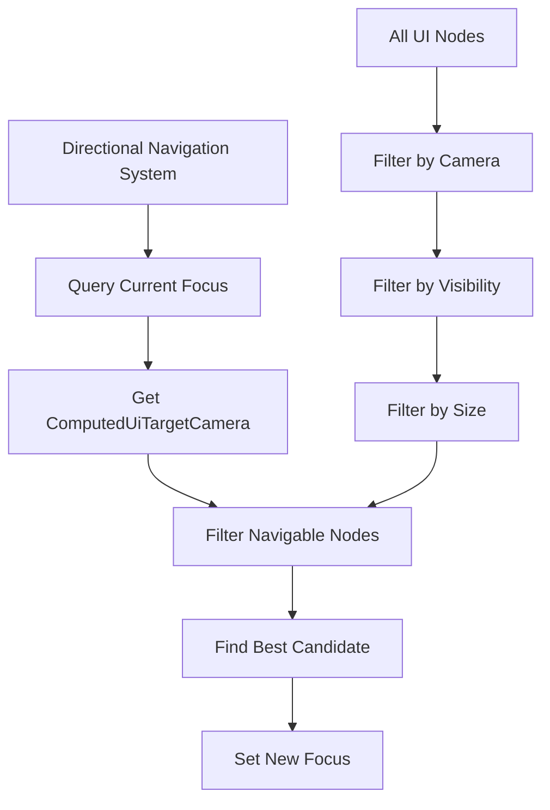

+++
title = "#22312 Fix: Filter for currently focused item’s target camera during directional navigation"
date = "2025-12-30T00:00:00"
draft = false
template = "pull_request_page.html"
in_search_index = true

[taxonomies]
list_display = ["show"]

[extra]
current_language = "en"
available_languages = {"en" = { name = "English", url = "/pull_request/bevy/2025-12/pr-22312-en-20251230" }, "zh-cn" = { name = "中文", url = "/pull_request/bevy/2025-12/pr-22312-zh-cn-20251230" }}
labels = ["C-Bug", "A-Input", "A-UI", "D-Straightforward"]
+++

# Fix: Filter for currently focused item’s target camera during directional navigation

## Basic Information
- **Title**: Fix: Filter for currently focused item’s target camera during directional navigation
- **PR Link**: https://github.com/bevyengine/bevy/pull/22312
- **Author**: kfc35
- **Status**: MERGED
- **Labels**: C-Bug, A-Input, A-UI, S-Ready-For-Final-Review, D-Straightforward
- **Created**: 2025-12-30T02:01:58Z
- **Merged**: 2025-12-30T21:17:08Z
- **Merged By**: alice-i-cecile

## Description Translation
The original description is in English and will be included as-is:

# Objective

- Fixes #22282

## Solution

During automatic directional navigation, additionally query for the current input focus's `ComputedUiTargetCamera`. Use that camera to filter for navigable nodes with the same camera.

## Testing

To ensure no regressions, I checked that `cargo run --example auto_directional_navigation` works as intended, which it does

## The Story of This Pull Request

This PR addresses a bug in Bevy's automatic directional navigation system where UI elements from different cameras could interfere with each other during navigation. The issue (#22282) stemmed from the navigation system not respecting camera boundaries when automatically finding the next focus target.

In Bevy's UI system, multiple cameras can render different UI elements, and each UI element has a `ComputedUiTargetCamera` component that specifies which camera it belongs to. The directional navigation system needed to be aware of this camera assignment to ensure that navigation only occurs within UI elements that share the same target camera.

The core problem was in the `directional_navigation.rs` file. When the automatic navigation system searched for the next focusable element in a given direction, it would consider all navigable UI elements regardless of which camera they belonged to. This could cause navigation to jump between UI elements that are rendered by different cameras, which doesn't make sense from a user interaction perspective since each camera typically represents a distinct view or layer.

The fix involved two main changes to the `DirectionalNavigation` struct and its methods. First, the struct's queries were updated to include the `ComputedUiTargetCamera` component. The `focusable_area_query` was renamed to `camera_and_focusable_area_query` and modified to return the target camera along with the node data.

Second, the navigation logic was updated to filter navigable nodes by camera. The `get_navigable_nodes` method now takes a `target_camera` parameter and only returns nodes that have the same target camera. The `entity_to_focusable_area` method was replaced with `entity_to_camera_and_focusable_area` which returns both the target camera and the focusable area.

The implementation follows Bevy's ECS patterns correctly. The code filters nodes at the query level rather than post-processing, which is more efficient. The change maintains backward compatibility while fixing the specific issue of cross-camera navigation.

One technical detail worth noting is how the camera filtering works. The system checks `if let Some(tc) = computed_target_camera.get() && tc == target_camera` - this handles both the case where a node has no target camera (returns `None`) and ensures we only accept nodes with the exact same camera entity.

This fix is important for games or applications that use multiple UI cameras for different purposes (like a main menu camera and an in-game HUD camera). Without this fix, directional navigation could unpredictably jump between UI elements that aren't even visible in the same view.

## Visual Representation



## Key Files Changed

**File:** `crates/bevy_input_focus/src/directional_navigation.rs` (+63/-33)

This file contains the directional navigation system that handles automatic navigation between UI elements. The changes update the system to respect camera boundaries during navigation.

**Key changes:**

1. **Updated imports** to include `ComputedUiTargetCamera`:

```rust
use bevy_ui::{ComputedNode, ComputedUiTargetCamera, UiGlobalTransform};
```

2. **Modified the `DirectionalNavigation` struct** to include camera information in queries:

```rust
// Before:
/// A query used to get the [`FocusableArea`] for a given entity to be used in automatic navigation.
focusable_area_query: Query<
    'w,
    's,
    (Entity, &'static ComputedNode, &'static UiGlobalTransform),
    With<AutoDirectionalNavigation>,
>,

// After:
/// A query used to get the target camera and the [`FocusableArea`] for a given entity to be used in automatic navigation.
camera_and_focusable_area_query: Query<
    'w,
    's,
    (
        Entity,
        &'static ComputedUiTargetCamera,
        &'static ComputedNode,
        &'static UiGlobalTransform,
    ),
    With<AutoDirectionalNavigation>,
>,
```

3. **Updated the `navigate` method** to use camera filtering:

```rust
// Before:
} else if let Some(origin) = self.entity_to_focusable_area(current_focus)
    && let Some(new_focus) = find_best_candidate(
        &origin,
        direction,
        &self.get_navigable_nodes(),
        &self.config,
    )

// After:
} else if let Some((target_camera, origin)) =
    self.entity_to_camera_and_focusable_area(current_focus)
    && let Some(new_focus) = find_best_candidate(
        &origin,
        direction,
        &self.get_navigable_nodes(target_camera),
        &self.config,
    )
```

4. **Rewrote `get_navigable_nodes`** to filter by camera:

```rust
// Before:
fn get_navigable_nodes(&self) -> Vec<FocusableArea> {
    self.navigable_entities_query
        .iter()
        .filter_map(|(entity, computed, transform, inherited_visibility)| {
            // Skip hidden or zero-size nodes
            if computed.is_empty() || !inherited_visibility.get() {
                return None;
            }

            let (_scale, _rotation, translation) = transform.to_scale_angle_translation();
            Some(FocusableArea {
                entity,
                position: translation,
                size: computed.size(),
            })
        })
        .collect()
}

// After:
fn get_navigable_nodes(&self, target_camera: Entity) -> Vec<FocusableArea> {
    self.navigable_entities_query
        .iter()
        .filter_map(
            |(entity, computed_target_camera, computed, transform, inherited_visibility)| {
                // Skip hidden or zero-size nodes
                if computed.is_empty() || !inherited_visibility.get() {
                    return None;
                }
                // Accept nodes that have the same target camera as the desired target camera
                if let Some(tc) = computed_target_camera.get()
                    && tc == target_camera
                {
                    let (_scale, _rotation, translation) =
                        transform.to_scale_angle_translation();
                    Some(FocusableArea {
                        entity,
                        position: translation,
                        size: computed.size(),
                    })
                } else {
                    // The node either does not have a target camera or it is not the same as the desired one.
                    None
                }
            },
        )
        .collect()
}
```

5. **Replaced `entity_to_focusable_area`** with `entity_to_camera_and_focusable_area`:

```rust
// Before:
fn entity_to_focusable_area(&self, entity: Entity) -> Option<FocusableArea> {
    self.focusable_area_query
        .get(entity)
        .map_or(None, |(entity, computed, transform)| {
            let (_scale, _rotation, translation) = transform.to_scale_angle_translation();
            Some(FocusableArea {
                entity,
                position: translation,
                size: computed.size(),
            })
        })
}

// After:
fn entity_to_camera_and_focusable_area(
    &self,
    entity: Entity,
) -> Option<(Entity, FocusableArea)> {
    self.camera_and_focusable_area_query.get(entity).map_or(
        None,
        |(entity, computed_target_camera, computed, transform)| {
            if let Some(target_camera) = computed_target_camera.get() {
                let (_scale, _rotation, translation) = transform.to_scale_angle_translation();
                Some((
                    target_camera,
                    FocusableArea {
                        entity,
                        position: translation,
                        size: computed.size(),
                    },
                ))
            } else {
                None
            }
        },
    )
}
```

These changes ensure that automatic directional navigation only considers UI elements that share the same target camera as the currently focused element.

## Further Reading

1. **Bevy UI System**: For understanding how Bevy handles UI rendering and camera systems
2. **Entity Component System (ECS)**: The architectural pattern used by Bevy for game development
3. **Input Systems in Game Engines**: How game engines typically handle focus navigation and input management
4. **Bevy's Directional Navigation Example**: The `auto_directional_navigation` example mentioned in the testing section provides a working implementation