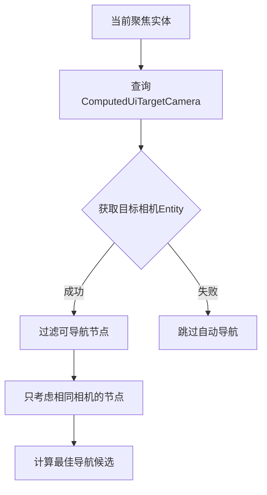

+++
title = "#22312 Fix: Filter for currently focused item’s target camera during directional navigation"
date = "2025-12-30T00:00:00"
draft = false
template = "pull_request_page.html"
in_search_index = false

[extra]
current_language = "zh-cn"
available_languages = {"en" = { name = "English", url = "/pull_request/bevy/2025-12/pr-22312-en-20251230" }, "zh-cn" = { name = "中文", url = "/pull_request/bevy/2025-12/pr-22312-zh-cn-20251230" }}
+++

# Title

## 基本信息
- **标题**: Fix: Filter for currently focused item’s target camera during directional navigation
- **PR链接**: https://github.com/bevyengine/bevy/pull/22312
- **作者**: kfc35
- **状态**: 已合并
- **标签**: C-Bug, A-Input, A-UI, S-Ready-For-Final-Review, D-Straightforward
- **创建时间**: 2025-12-30T02:01:58Z
- **合并时间**: 2025-12-30T21:17:08Z
- **合并者**: alice-i-cecile

## 描述翻译
# 目标

- 修复 #22282

## 解决方案

在自动方向导航期间，额外查询当前输入焦点的 `ComputedUiTargetCamera`。使用该相机过滤具有相同相机的可导航节点。

## 测试

为确保没有回归，我检查了 `cargo run --example auto_directional_navigation` 是否能按预期工作，确实可以。

## 本次PR的技术分析

这次PR解决了一个在Bevy引擎中方向导航功能的具体bug。问题的核心是，当场景中存在多个相机时，自动方向导航功能没有正确考虑当前聚焦项所属的目标相机，导致导航可能跨越不同相机的UI元素，造成视觉和逻辑上的混乱。

### 问题背景与上下文

在UI系统中，`ComputedUiTargetCamera`组件标识了UI元素应该被哪个相机渲染。这是Bevy多相机支持的重要组成部分。然而，在PR #22282中报告了一个问题：方向导航（directional navigation）在选择下一个聚焦目标时，没有考虑当前聚焦项的相机归属，可能选择了不同相机下的UI元素作为导航目标。

从工程角度看，这是一个典型的"上下文丢失"问题。方向导航系统只知道当前聚焦的实体，但没有利用该实体的相机信息来约束导航搜索空间。在多相机场景中，这是必须修复的缺陷，因为不同相机下的UI元素在屏幕空间上可能重叠，但逻辑上属于不同的渲染上下文。

### 解决方案设计

修复方案直接明了：在计算可导航节点时，加入相机过滤条件。技术实现上需要解决两个关键点：

1. **获取当前聚焦项的相机信息**：需要从当前聚焦实体查询`ComputedUiTargetCamera`组件
2. **按相机过滤导航候选集**：只考虑与当前聚焦项相同相机的UI元素

开发者没有考虑更复杂的替代方案，比如支持跨相机导航，因为这个从用户体验和逻辑一致性角度看都不合理。UI元素应该只在相同渲染上下文的元素间导航。

### 实现细节

核心修改集中在`directional_navigation.rs`文件中的`DirectionalNavigation`结构体。主要的架构变化是：

1. **查询结构调整**：
   - `navigable_entities_query`增加了`ComputedUiTargetCamera`字段
   - `focusable_area_query`重命名为`camera_and_focusable_area_query`，同样增加相机字段

2. **关键方法更新**：
   - `get_navigable_nodes()`方法新增`target_camera`参数，并过滤只返回指定相机的节点
   - `entity_to_focusable_area()`方法替换为`entity_to_camera_and_focusable_area()`，同时返回相机和聚焦区域

具体到代码层面，过滤逻辑的实现很简洁：

```rust
// 在get_navigable_nodes方法中的关键过滤条件
if let Some(tc) = computed_target_camera.get()
    && tc == target_camera
{
    // 只处理相同相机的节点
}
```

这个条件检查确保节点有目标相机且与期望的相机匹配。`computed_target_camera.get()`返回`Option<Entity>`，处理了可能没有设置相机的情况。

### 技术洞察

这个修复展示了几个重要的Bevy引擎概念：

1. **组件查询模式**：通过修改查询的组件组合，系统能访问更多上下文信息
2. **实体过滤策略**：在查询迭代中动态过滤比先获取所有实体再过滤更高效
3. **Option类型的使用**：正确处理可能缺失的`ComputedUiTargetCamera`组件

性能方面，这个修改增加了一个组件查询，但对每个节点只增加一次相等性检查，开销可以忽略不计。更重要的工程考量是保持API一致性：方法签名变更（增加参数）是必要的，但通过将`entity_to_focusable_area`替换为返回元组的新方法，保持了向后兼容性。

### 影响与意义

这个修复确保了：
1. **逻辑正确性**：方向导航只在相同渲染上下文的UI元素间工作
2. **用户体验一致性**：用户不会意外导航到不同相机下的隐藏或不可见元素
3. **系统可预测性**：开发者可以依赖导航系统在多相机场景中的正确行为

从代码质量角度，这个修改也提高了系统的自描述性：通过方法名和参数明确表达了"按相机过滤"的意图，使得后续维护者更容易理解系统约束。

## 可视化表示



## 关键文件变更

### `crates/bevy_input_focus/src/directional_navigation.rs` (+63/-33)

这是本次PR修改的唯一文件，包含了方向导航系统的核心逻辑修复。

**主要变更概述：**
1. 引入`ComputedUiTargetCamera`组件到相关查询中
2. 重构方法以传递和利用相机过滤信息
3. 更新导航逻辑只考虑相同相机的UI元素

**代码片段示例：**

```rust
// 变更前的查询定义（简化）
focusable_area_query: Query<
    (Entity, &'static ComputedNode, &'static UiGlobalTransform),
    With<AutoDirectionalNavigation>,
>

// 变更后的查询定义
camera_and_focusable_area_query: Query<
    (Entity, &'static ComputedUiTargetCamera, &'static ComputedNode, &'static UiGlobalTransform),
    With<AutoDirectionalNavigation>,
>
```

```rust
// 变更前的导航节点获取
fn get_navigable_nodes(&self) -> Vec<FocusableArea> {
    // 没有相机过滤
    self.navigable_entities_query
        .iter()
        .filter_map(|(entity, computed, transform, inherited_visibility)| {
            // ... 只过滤可见性和大小
        })
        .collect()
}

// 变更后的导航节点获取
fn get_navigable_nodes(&self, target_camera: Entity) -> Vec<FocusableArea> {
    // 增加相机过滤条件
    self.navigable_entities_query
        .iter()
        .filter_map(|(entity, computed_target_camera, computed, transform, inherited_visibility)| {
            // 检查相机匹配
            if let Some(tc) = computed_target_camera.get()
                && tc == target_camera
            {
                // ... 只处理相同相机的节点
            } else {
                None
            }
        })
        .collect()
}
```

**这些变更与PR目标的关系：**
- 查询结构变更使得系统能访问相机信息
- 过滤逻辑确保导航不跨越相机边界
- 方法参数传递相机上下文，保持关注点分离

## 扩展阅读

1. **Bevy官方文档 - 相机系统**：了解多相机渲染的工作原理
2. **ECS查询模式**：深入学习实体组件系统的高效数据访问方式
3. **UI导航最佳实践**：探索其他游戏引擎如何处理复杂的UI导航场景
4. **Bevy输入系统架构**：理解输入焦点管理在更大系统上下文中的位置