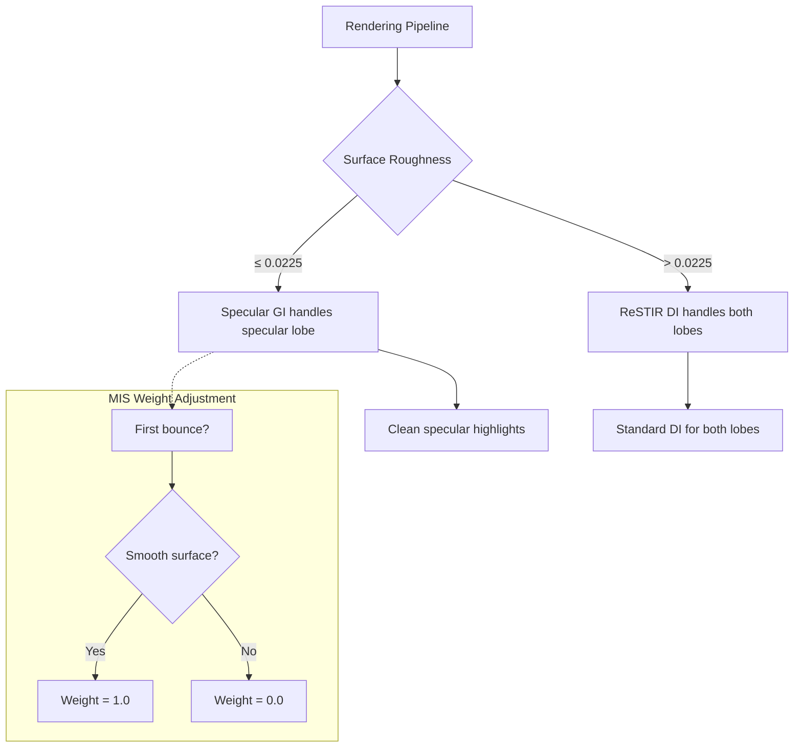

+++
title = "#22313 Specular GI MIS"
date = "2025-12-30T00:00:00"
draft = false
template = "pull_request_page.html"
in_search_index = true

[taxonomies]
list_display = ["show"]

[extra]
current_language = "en"
available_languages = {"en" = { name = "English", url = "/pull_request/bevy/2025-12/pr-22313-en-20251230" }, "zh-cn" = { name = "中文", url = "/pull_request/bevy/2025-12/pr-22313-zh-cn-20251230" }}
labels = ["A-Rendering", "C-Refinement"]
+++

# Title
## Specular GI MIS

## Basic Information
- **Title**: Specular GI MIS
- **PR Link**: https://github.com/bevyengine/bevy/pull/22313
- **Author**: SparkyPotato
- **Status**: MERGED
- **Labels**: A-Rendering, S-Ready-For-Review, C-Refinement
- **Created**: 2025-12-30T02:31:52Z
- **Merged**: 2025-12-30T21:18:41Z
- **Merged By**: alice-i-cecile

## Description Translation
ReSTIR DI (and other DI algorithms) can't find light samples that align well with very smooth, specular surfaces. However, specular GI does a trace for these surfaces, which we can use to improve DI.

This PR uses the specular GI trace to light the specular lobe for smooth surfaces, disabling DI on the specular lobe for them.

This PR:


Previously:


Reference:


## The Story of This Pull Request

This PR addresses a fundamental limitation in the Bevy Solari real-time rendering system: ReSTIR DI (Reservoir-based Spatiotemporal Importance Resampling Direct Illumination) struggles with specular surfaces, particularly smooth ones with low roughness. The core issue is that direct illumination algorithms like ReSTIR DI rely on sampling light sources, but for highly specular surfaces, the BRDF lobe is extremely narrow. Finding light samples that align with this narrow lobe through random sampling is statistically unlikely, leading to noisy or missing specular highlights.

The developer recognized that while ReSTIR DI has this limitation, the specular GI (Global Illumination) system already performs ray tracing for these surfaces. This presents an opportunity: use the specular GI trace to illuminate the specular lobe for smooth surfaces, effectively bypassing ReSTIR DI's weakness for this specific case.

The implementation follows a clear engineering approach. First, a roughness threshold is established (0.15² = 0.0225) to identify "smooth" surfaces. When a surface's roughness is below this threshold, the ReSTIR DI shader is modified to only evaluate the diffuse BRDF component, ignoring the specular lobe entirely. This prevents ReSTIR DI from attempting to handle specular reflections for surfaces where it performs poorly.

Simultaneously, the specular GI system is enhanced to properly handle this division of labor. The key technical challenge here is Multiple Importance Sampling (MIS) weight adjustment. The system needs to ensure that when specular GI handles the first bounce for smooth surfaces, it takes full responsibility (weight = 1.0), and when ReSTIR DI handles it (for rougher surfaces), specular GI doesn't contribute to avoid double-counting.

The implementation modifies the `emissive_mis_weight` function in the specular GI shader to check whether this is the first bounce and whether the surface roughness is below the threshold. For the first bounce on smooth surfaces, it returns a weight of 1.0, giving specular GI full responsibility. For the first bounce on rougher surfaces, it returns 0.0, letting ReSTIR DI handle it exclusively. This ensures proper energy conservation and prevents artifacts from overlapping contributions.

The changes are minimal and surgical: three files modified with relatively small diffs. The developer also changed the `specular_gi.wgsl` shader from an embedded asset to a shader library import, which is a minor refactoring that makes the shader constants available to other shaders via the `#import` system. This is necessary because the `restir_di.wgsl` shader now needs to access the `SPECULAR_GI_FOR_DI_ROUGHNESS_THRESHOLD` constant defined in the specular GI shader.

From an architectural perspective, this PR demonstrates good separation of concerns. The ReSTIR DI system focuses on what it does well (direct illumination for diffuse and moderately rough surfaces) while delegating the challenging case of smooth specular surfaces to the specular GI system. The MIS weight adjustments ensure the two systems work together coherently without overlap or gaps in coverage.

The visual results speak for themselves. The comparison images show that previously, specular highlights on smooth surfaces were noisy and poorly reconstructed by ReSTIR DI alone. With this change, the specular highlights are clean and accurate, closely matching the reference image. This improvement comes with minimal performance overhead since specular GI was already tracing rays for these surfaces; the change simply ensures those traces are properly utilized for direct illumination on smooth surfaces.

## Visual Representation



## Key Files Changed

### 1. `crates/bevy_solari/src/realtime/mod.rs`
**Change**: Changed `specular_gi.wgsl` from `embedded_asset!` to `load_shader_library!`
**Why**: This allows the specular GI shader to be imported by other shaders, specifically so `restir_di.wgsl` can access the `SPECULAR_GI_FOR_DI_ROUGHNESS_THRESHOLD` constant.

```rust
// Before:
embedded_asset!(app, "specular_gi.wgsl");

// After:
load_shader_library!(app, "specular_gi.wgsl");
```

### 2. `crates/bevy_solari/src/realtime/restir_di.wgsl`
**Change**: Modified BRDF evaluation to use only diffuse component for smooth surfaces
**Why**: Prevents ReSTIR DI from trying to handle specular reflections on surfaces where it performs poorly, delegating that work to specular GI.

```wgsl
// Before:
let brdf = evaluate_brdf(surface.world_normal, wo, merge_result.wi, surface.material);

// After:
var brdf: vec3<f32>;
// If the surface is very smooth, let specular GI handle the specular lobe
if surface.material.roughness <= SPECULAR_GI_FOR_DI_ROUGHNESS_THRESHOLD {
    brdf = evaluate_diffuse_brdf(surface.material.base_color, surface.material.metallic);
} else {
    brdf = evaluate_brdf(surface.world_normal, wo, merge_result.wi, surface.material);
}
```

### 3. `crates/bevy_solari/src/realtime/specular_gi.wgsl`
**Changes**:
1. Added import path and exported roughness threshold constant
2. Modified `trace_glossy_path` to accept initial roughness parameter
3. Updated `emissive_mis_weight` to handle first bounce MIS weights correctly

**Why**: These changes enable the specular GI system to properly handle the specular lobe for smooth surfaces with correct MIS weighting.

```wgsl
// Added at top:
#define_import_path bevy_solari::specular_gi
const SPECULAR_GI_FOR_DI_ROUGHNESS_THRESHOLD: f32 = 0.0225;

// Modified function signature:
// Before:
fn trace_glossy_path(initial_ray_origin: vec3<f32>, initial_wi: vec3<f32>, initial_p_bounce: f32, a0: f32, rng: ptr<function, u32>) -> vec3<f32>

// After:
fn trace_glossy_path(initial_ray_origin: vec3<f32>, initial_wi: vec3<f32>, initial_roughness: f32, initial_p_bounce: f32, a0: f32, rng: ptr<function, u32>) -> vec3<f32>

// Updated MIS weight function:
// Before:
fn emissive_mis_weight(p_bounce: f32, ray_hit: ResolvedRayHitFull, previous_surface_perfectly_specular: bool) -> f32 {
    if previous_surface_perfectly_specular { return 1.0; }
    let p_light = random_emissive_light_pdf(ray_hit);
    return power_heuristic(p_bounce, p_light);
}

// After:
fn emissive_mis_weight(i: u32, initial_roughness: f32, p_bounce: f32, ray_hit: ResolvedRayHitFull, previous_surface_perfectly_specular: bool) -> f32 {
    if i != 0u {
        if previous_surface_perfectly_specular { return 1.0; }
        let p_light = random_emissive_light_pdf(ray_hit);
        return power_heuristic(p_bounce, p_light);
    } else {
        // The first bounce gets MIS weight 0.0 or 1.0 depending on if ReSTIR DI shaded using the specular lobe or not
        if initial_roughness <= SPECULAR_GI_FOR_DI_ROUGHNESS_THRESHOLD {
            return 1.0;
        } else {
            return 0.0;
        }
    }
}
```

## Further Reading

1. **ReSTIR DI Paper**: "Spatiotemporal reservoir resampling for real-time ray tracing with dynamic direct lighting" - Explains the core algorithm that this PR works with
2. **Multiple Importance Sampling**: Chapter 9 of "Physically Based Rendering: From Theory to Implementation" - Covers the MIS theory used in this PR
3. **Bevy Solari Documentation**: The real-time global illumination system in Bevy that this PR modifies
4. **BRDF Theory**: Understanding the Cook-Torrance BRDF model helps explain why smooth specular surfaces are challenging for direct illumination algorithms