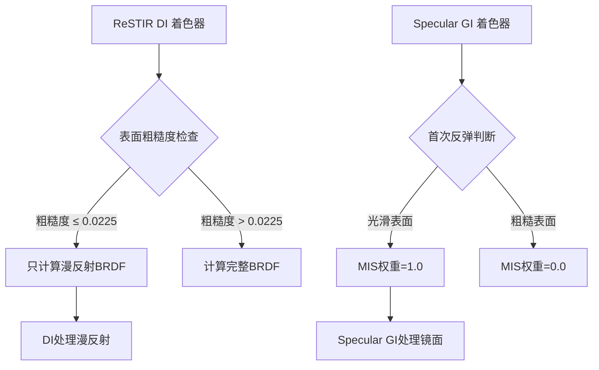

+++
title = "#22313 Specular GI MIS"
date = "2025-12-30T00:00:00"
draft = false
template = "pull_request_page.html"
in_search_index = false

[extra]
current_language = "zh-cn"
available_languages = {"en" = { name = "English", url = "/pull_request/bevy/2025-12/pr-22313-en-20251230" }, "zh-cn" = { name = "中文", url = "/pull_request/bevy/2025-12/pr-22313-zh-cn-20251230" }}
+++

# Specular GI MIS

## 基本信息
- **标题**: Specular GI MIS
- **PR链接**: https://github.com/bevyengine/bevy/pull/22313
- **作者**: SparkyPotato
- **状态**: 已合并
- **标签**: A-Rendering, S-Ready-For-Final-Review, C-Refinement
- **创建时间**: 2025-12-30T02:31:52Z
- **合并时间**: 2025-12-30T21:18:41Z
- **合并者**: alice-i-cecile

## 描述翻译

ReSTIR DI（和其他DI算法）无法为非常光滑的镜面找到良好的光照样本。然而，Specular GI会对这些表面进行追踪，我们可以利用这一点来改进DI。

本PR使用Specular GI追踪来照亮光滑表面的镜面波瓣，并为此类表面禁用DI在镜面波瓣上的计算。

本PR效果：


之前的效果：


参考效果：


## 这个PR的故事

这个PR解决了一个具体的技术问题：在实时光照渲染中，对于非常光滑的镜面材质，ReSTIR DI（一种直接光照重要性采样算法）难以找到合适的光照样本。这是因为镜面反射对光线方向非常敏感，DI算法采样到与镜面波瓣对齐的光线的概率很低，导致渲染结果出现噪点或不准确。

问题产生的背景是，ReSTIR DI主要针对漫反射和粗糙表面设计，它通过重要性采样来找到有效的光照样本。但对于镜面材质，特别是roughness值很低的表面，镜面波瓣非常窄，DI算法几乎不可能采样到正确的方向。这导致镜面反射区域光照不足或出现噪点。

解决方案的思路很直接：既然Specular GI（镜面全局光照）已经对镜面表面进行光线追踪，那么对于这些非常光滑的表面，让Specular GI完全处理镜面波瓣的光照，同时在DI计算中禁用镜面分量的贡献。这样，DI只负责漫反射分量，而Specular GI负责镜面分量的准确计算。

实现上，PR在两个主要部分进行了修改：

首先，在ReSTIR DI着色器中，当检测到表面非常光滑（roughness低于阈值SPECULAR_GI_FOR_DI_ROUGHNESS_THRESHOLD）时，只计算漫反射BRDF，忽略镜面分量。这确保了DI不会尝试为镜面波瓣寻找光照样本。

其次，在Specular GI着色器中，修改了多重重要性采样（MIS）的权重计算，特别是对于首次反弹的光源。当表面非常光滑时，给Specular GI的首次反弹全权重（1.0），而DI的贡献权重为0。这样确保了光照计算的连贯性。

这个实现的关键技术点在于选择适当的粗糙度阈值。通过0.0225这个阈值，可以准确地区分哪些表面应该由Specular GI完全处理镜面分量。阈值的选择需要在视觉质量和性能之间取得平衡。

从架构角度看，这个修改展示了如何协同使用不同的光照技术：DI处理漫反射和粗糙表面的镜面，Specular GI处理光滑表面的镜面。这种分工利用了各自算法的优势，避免了各自的弱点。

性能方面，这个改动对光滑表面应该能提高渲染质量，因为Specular GI的光线追踪比DI的随机采样更适合处理镜面反射。但对于粗糙表面，原有的DI算法仍然有效，保持了性能优势。

最终效果对比图清楚地展示了改进：之前版本中光滑表面的镜面反射区域有明显的噪点，而新版本中这些区域变得平滑且准确，与参考图像更加接近。

## 视觉表示



## 关键文件更改

### `crates/bevy_solari/src/realtime/specular_gi.wgsl` (+21/-10)

这个文件从嵌入式资源改为库着色器，并添加了对光滑表面处理的重要逻辑。

主要更改：
1. 添加了模块定义，使其可以被其他着色器导入
2. 添加了粗糙度阈值常量
3. 修改了`trace_glossy_path`函数，增加了`initial_roughness`参数
4. 修改了`emissive_mis_weight`函数，根据表面是否光滑调整MIS权重

关键代码：
```wgsl
// 添加模块定义和阈值常量
#define_import_path bevy_solari::specular_gi
const SPECULAR_GI_FOR_DI_ROUGHNESS_THRESHOLD: f32 = 0.0225;

// 修改函数签名，增加initial_roughness参数
fn trace_glossy_path(initial_ray_origin: vec3<f32>, initial_wi: vec3<f32>, initial_roughness: f32, initial_p_bounce: f32, a0: f32, rng: ptr<function, u32>) -> vec3<f32> {
    // ... 函数实现
}

// 修改MIS权重计算
fn emissive_mis_weight(i: u32, initial_roughness: f32, p_bounce: f32, ray_hit: ResolvedRayHitFull, previous_surface_perfectly_specular: bool) -> f32 {
    if i != 0u {
        // 非首次反弹的处理
        if previous_surface_perfectly_specular { return 1.0; }
        let p_light = random_emissive_light_pdf(ray_hit);
        return power_heuristic(p_bounce, p_light);
    } else {
        // 首次反弹的特殊处理
        if initial_roughness <= SPECULAR_GI_FOR_DI_ROUGHNESS_THRESHOLD {
            return 1.0;
        } else {
            return 0.0;
        }
    }
}
```

### `crates/bevy_solari/src/realtime/restir_di.wgsl` (+9/-2)

这个文件修改了BRDF计算逻辑，对光滑表面只计算漫反射分量。

主要更改：
1. 导入Specular GI模块以使用阈值常量
2. 根据粗糙度阈值选择BRDF计算方式

关键代码：
```wgsl
// 导入Specular GI模块
#import bevy_solari::specular_gi::SPECULAR_GI_FOR_DI_ROUGHNESS_THRESHOLD

// 修改BRDF计算逻辑
var brdf: vec3<f32>;
// 如果表面非常光滑，让Specular GI处理镜面波瓣
if surface.material.roughness <= SPECULAR_GI_FOR_DI_ROUGHNESS_THRESHOLD {
    brdf = evaluate_diffuse_brdf(surface.material.base_color, surface.material.metallic);
} else {
    brdf = evaluate_brdf(surface.world_normal, wo, merge_result.wi, surface.material);
}
```

### `crates/bevy_solari/src/realtime/mod.rs` (+1/-1)

这个文件只是修改了着色器的加载方式，使Specular GI着色器可以作为库被其他着色器导入。

关键代码：
```rust
// 之前：
embedded_asset!(app, "specular_gi.wgsl");

// 之后：
load_shader_library!(app, "specular_gi.wgsl");
```

## 完整代码差异

```
diff --git a/crates/bevy_solari/src/realtime/mod.rs b/crates/bevy_solari/src/realtime/mod.rs
index 0ab1e13fe6029..c9a6f7ff1d1e8 100644
--- a/crates/bevy_solari/src/realtime/mod.rs
+++ b/crates/bevy_solari/src/realtime/mod.rs
@@ -39,7 +39,7 @@ impl Plugin for SolariLightingPlugin {
         load_shader_library!(app, "presample_light_tiles.wgsl");
         embedded_asset!(app, "restir_di.wgsl");
         embedded_asset!(app, "restir_gi.wgsl");
-        embedded_asset!(app, "specular_gi.wgsl");
+        load_shader_library!(app, "specular_gi.wgsl");
         load_shader_library!(app, "world_cache_query.wgsl");
         embedded_asset!(app, "world_cache_compact.wgsl");
         embedded_asset!(app, "world_cache_update.wgsl");
diff --git a/crates/bevy_solari/src/realtime/restir_di.wgsl b/crates/bevy_solari/src/realtime/restir_di.wgsl
index 77a36cebd28de..01f2cbec13a3e 100644
--- a/crates/bevy_solari/src/realtime/restir_di.wgsl
+++ b/crates/bevy_solari/src/realtime/restir_di.wgsl
@@ -6,11 +6,12 @@
 #import bevy_pbr::utils::{rand_f, rand_range_u, sample_disk}
 #import bevy_render::maths::PI
 #import bevy_render::view::View
-#import bevy_solari::brdf::evaluate_brdf
+#import bevy_solari::brdf::{evaluate_brdf, evaluate_diffuse_brdf}
 #import bevy_solari::gbuffer_utils::{gpixel_resolve, pixel_dissimilar, permute_pixel}
 #import bevy_solari::presample_light_tiles::{ResolvedLightSamplePacked, unpack_resolved_light_sample}
 #import bevy_solari::sampling::{LightSample, calculate_resolved_light_contribution, resolve_and_calculate_light_contribution, resolve_light_sample, trace_light_visibility, balance_heuristic}
 #import bevy_solari::scene_bindings::{light_sources, previous_frame_light_id_translations, LIGHT_NOT_PRESENT_THIS_FRAME}
+#import bevy_solari::specular_gi::SPECULAR_GI_FOR_DI_ROUGHNESS_THRESHOLD
 
 @group(1) @binding(0) var view_output: texture_storage_2d<rgba16float, read_write>;
 @group(1) @binding(1) var<storage, read_write> light_tile_samples: array<LightSample>;
@@ -93,7 +94,13 @@ fn spatial_and_shade(@builtin(global_invocation_id) global_id: vec3<u32>) {
 #endif
 
     let wo = normalize(view.world_position - surface.world_position);
-    let brdf = evaluate_brdf(surface.world_normal, wo, merge_result.wi, surface.material);
+    var brdf: vec3<f32>;
+    // If the surface is very smooth, let specular GI handle the specular lobe
+    if surface.material.roughness <= SPECULAR_GI_FOR_DI_ROUGHNESS_THRESHOLD {
+        brdf = evaluate_diffuse_brdf(surface.material.base_color, surface.material.metallic);
+    } else {
+        brdf = evaluate_brdf(surface.world_normal, wo, merge_result.wi, surface.material);
+    }
 
     var pixel_color = merge_result.selected_sample_radiance * combined_reservoir.unbiased_contribution_weight;
     pixel_color *= brdf;
diff --git a/crates/bevy_solari/src/realtime/specular_gi.wgsl b/crates/bevy_solari/src/realtime/specular_gi.wgsl
index 58b400076cdef..8c3d0e2496cbe 100644
--- a/crates/bevy_solari/src/realtime/specular_gi.wgsl
+++ b/crates/bevy_solari/src/realtime/specular_gi.wgsl
@@ -1,3 +1,5 @@
+#define_import_path bevy_solari::specular_gi
+
 #import bevy_pbr::pbr_functions::calculate_tbn_mikktspace
 #import bevy_render::maths::{orthonormalize, PI}
 #import bevy_render::view::View
@@ -16,6 +18,7 @@ struct PushConstants { frame_index: u32, reset: u32 }
 var<push_constant> constants: PushConstants;
 
 const DIFFUSE_GI_REUSE_ROUGHNESS_THRESHOLD: f32 = 0.4;
+const SPECULAR_GI_FOR_DI_ROUGHNESS_THRESHOLD: f32 = 0.0225;
 const TERMINATE_IN_WORLD_CACHE_THRESHOLD: f32 = 0.03;
 
 @compute @workgroup_size(8, 8, 1)
@@ -57,7 +60,7 @@ fn specular_gi(@builtin(global_invocation_id) global_id: vec3<u32>) {
         var a0 = dot(wo_unnormalized, wo_unnormalized) / (4.0 * PI * cos_theta);
         a0 *= TERMINATE_IN_WORLD_CACHE_THRESHOLD;
 
-        radiance = trace_glossy_path(surface.world_position, wi, pdf, a0, &rng) / pdf;
+        radiance = trace_glossy_path(surface.world_position, wi, surface.material.roughness, pdf, a0, &rng) / pdf;
     }
 
     let brdf = evaluate_specular_brdf(surface.world_normal, wo, wi, surface.material.base_color, surface.material.metallic,
@@ -74,7 +77,7 @@ fn specular_gi(@builtin(global_invocation_id) global_id: vec3<u32>) {
 #endif
 }
 
-fn trace_glossy_path(initial_ray_origin: vec3<f32>, initial_wi: vec3<f32>, initial_p_bounce: f32, a0: f32, rng: ptr<function, u32>) -> vec3<f32> {
+fn trace_glossy_path(initial_ray_origin: vec3<f32>, initial_wi: vec3<f32>, initial_roughness: f32, initial_p_bounce: f32, a0: f32, rng: ptr<function, u32>) -> vec3<f32> {
     var ray_origin = initial_ray_origin;
     var wi = initial_wi;
     var p_bounce = initial_p_bounce;
@@ -98,10 +101,9 @@ fn trace_glossy_path(initial_ray_origin: vec3<f32>, initial_wi: vec3<f32>, initi
         let wo = -wi;
         let wo_tangent = vec3(dot(wo, T), dot(wo, B), dot(wo, N));
 
-        // Add emissive contribution (but not on the first bounce, since ReSTIR DI handles that)
-        if i != 0u {
-            radiance += throughput * emissive_mis_weight(p_bounce, ray_hit, surface_perfectly_specular) * ray_hit.material.emissive;
-        }
+        // Add emissive contribution
+        let mis_weight = emissive_mis_weight(i, initial_roughness, p_bounce, ray_hit, surface_perfectly_specular);
+        radiance += throughput * mis_weight * ray_hit.material.emissive;
 
         // Should not perform NEE for mirror-like surfaces
         surface_perfectly_specular = ray_hit.material.roughness <= 0.001 && ray_hit.material.metallic > 0.9999;
@@ -137,11 +139,20 @@ fn trace_glossy_path(initial_ray_origin: vec3<f32>, initial_wi: vec3<f32>, initi
     return radiance;
 }
 
-fn emissive_mis_weight(p_bounce: f32, ray_hit: ResolvedRayHitFull, previous_surface_perfectly_specular: bool) -> f32 {
-    if previous_surface_perfectly_specular { return 1.0; }
+fn emissive_mis_weight(i: u32, initial_roughness: f32, p_bounce: f32, ray_hit: ResolvedRayHitFull, previous_surface_perfectly_specular: bool) -> f32 {
+    if i != 0u {
+        if previous_surface_perfectly_specular { return 1.0; }
 
-    let p_light = random_emissive_light_pdf(ray_hit);
-    return power_heuristic(p_bounce, p_light);
+        let p_light = random_emissive_light_pdf(ray_hit);
+        return power_heuristic(p_bounce, p_light);
+    } else {
+        // The first bounce gets MIS weight 0.0 or 1.0 depending on if ReSTIR DI shaded using the specular lobe or not
+        if initial_roughness <= SPECULAR_GI_FOR_DI_ROUGHNESS_THRESHOLD {
+            return 1.0;
+        } else {
+            return 0.0;
+        }
+    }
 }
 
 fn nee_mis_weight(inverse_p_light: f32, brdf_rays_can_hit: bool, wo_tangent: vec3<f32>, wi: vec3<f32>, ray_hit: ResolvedRayHitFull, TBN: mat3x3<f32>) -> f32 {
```

## 扩展阅读

1. **ReSTIR DI算法**：了解实时渲染中的重要性采样算法，可以参考原始论文"Spatiotemporal reservoir resampling for real-time ray tracing with dynamic direct lighting"

2. **多重重要性采样（MIS）**：了解如何组合不同采样技术的权重计算，可以参考"Robust Monte Carlo Methods for Light Transport Simulation"

3. **镜面全局光照**：了解镜面反射的光线追踪技术，可以参考实时渲染相关的教科书如"Real-Time Rendering"

4. **BRDF模型**：了解物理基础的渲染模型，特别是Cook-Torrance BRDF模型及其在实时渲染中的应用

5. **Bevy引擎渲染架构**：了解Bevy引擎的渲染系统设计，可以参考官方文档和源代码中的渲染模块