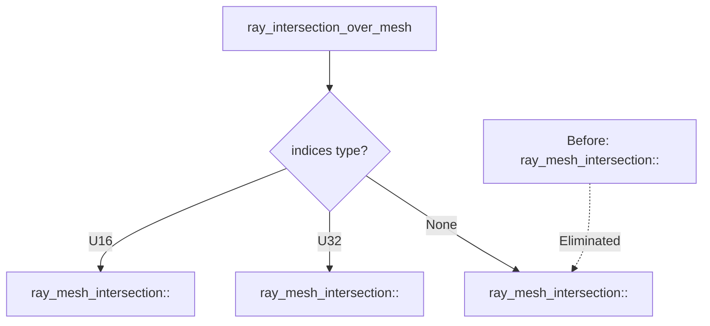

+++
title = "#22315 Small code size improvement"
date = "2025-12-30T00:00:00"
draft = false
template = "pull_request_page.html"
in_search_index = true

[taxonomies]
list_display = ["show"]

[extra]
current_language = "en"
available_languages = {"en" = { name = "English", url = "/pull_request/bevy/2025-12/pr-22315-en-20251230" }, "zh-cn" = { name = "中文", url = "/pull_request/bevy/2025-12/pr-22315-zh-cn-20251230" }}
labels = ["C-Performance", "A-Picking"]
+++

# Small code size improvement

## Basic Information
- **Title**: Small code size improvement
- **PR Link**: https://github.com/bevyengine/bevy/pull/22315
- **Author**: goodartistscopy
- **Status**: MERGED
- **Labels**: C-Performance, A-Picking
- **Created**: 2025-12-30T12:38:18Z
- **Merged**: 2025-12-30T19:34:55Z
- **Merged By**: james7132

## Description Translation
# Objective

- Improve code size slightly

## Solution
- The index-less version of `ray_mesh_intersection<T>()` does not care about the indices type, so any `TryInto<usize>` will do.  
- By avoiding to monomorphize another version of `ray_mesh_intersection<T>` (with `T=usize`) when any of the existing one will do, we get a small improvement in code size (and presumably compilation time as well).

## Testing

- Built the `mesh_ray_cast` example, which works as expected

---
The gain is indeed small (0.8kB in dev, 3kB in release and noise (4B) in size-optimized builds)

## Showcase
`cargo bloat` is used to visualize the differences. Profile dev confirms that one less instance of the function is generated:
```sh
> # BEFORE (dev)
> cargo bloat --filter "ray_mesh_intersection$" --example mesh_ray_cast
File .text   Size        Crate Name
0.0%  0.0%   856B bevy_picking bevy_picking::mesh_picking::ray_cast::intersections::ray_mesh_intersection
0.0%  0.0%   856B bevy_picking bevy_picking::mesh_picking::ray_cast::intersections::ray_mesh_intersection
0.0%  0.0%   856B bevy_picking bevy_picking::mesh_picking::ray_cast::intersections::ray_mesh_intersection
0.0%  0.0% 2.5KiB              filtered data size, the file size is 263.3MiB

> # AFTER (dev)
> cargo bloat --filter "ray_mesh_intersection$" --example mesh_ray_cast
File .text Size        Crate Name
0.0%  0.0%   856B bevy_picking bevy_picking::mesh_picking::ray_cast::intersections::ray_mesh_intersection
0.0%  0.0%   856B bevy_picking bevy_picking::mesh_picking::ray_cast::intersections::ray_mesh_intersection
0.0%  0.0% 1.7KiB              filtered data size, the file size is 263.3MiB
```

In release the function is inlined into `ray_intersection_over_mesh()` which gains 3kB: 
```sh
> # BEFORE (release)
> cargo bloat --release --filter "ray_intersection_over_mesh$" --example mesh_ray_cast
File .text   Size        Crate Name
0.0%  0.0% 5.3KiB bevy_picking bevy_picking::mesh_picking::ray_cast::intersections::ray_intersection_over_mesh
0.0%  0.0% 5.3KiB              filtered data size, the file size is 100.7MiB

> # AFTER (release)
> cargo bloat --release --filter "ray_intersection_over_mesh$" --example mesh_ray_cast
File .text   Size        Crate Name
0.0%  0.0% 2.3KiB bevy_picking bevy_picking::mesh_picking::ray_cast::intersections::ray_intersection_over_mesh
0.0%  0.0% 2.3KiB              filtered data size, the file size is 100.7MiB
```

## The Story of This Pull Request

This PR addresses a straightforward but common Rust performance optimization issue: reducing binary bloat caused by unnecessary monomorphization of generic functions. The problem was in Bevy's picking system, specifically in the mesh ray intersection code.

The mesh picking system uses a generic function `ray_mesh_intersection<T>` that works with different index types (u16, u32) for mesh vertices. When a mesh doesn't use indices (has `None` for indices), the code was calling this function with `T=usize`. This created an unnecessary third instantiation of the generic function, since the function doesn't actually use the index type parameter when indices are `None`.

The key insight here is that when `indices` is `None`, the type parameter `T` in `ray_mesh_intersection<T>` doesn't matter because no indices are being processed. The function only needs a type that implements `TryInto<usize>`, which both `u32` and `usize` satisfy. By changing the call from `ray_mesh_intersection::<usize>(..., None, ...)` to `ray_mesh_intersection::<u32>(..., None, ...)`, we eliminate one monomorphization.

This optimization follows a standard pattern in Rust performance work: reducing duplicate generated code by minimizing unnecessary generic instantiations. The implementation change is minimal - just one character in the type parameter - but the impact on binary size is measurable.

The author used `cargo bloat` to validate the improvement, showing that in development builds, the number of `ray_mesh_intersection` instances decreased from three to two, saving 0.8KB. In release builds where the function gets inlined into `ray_intersection_over_mesh`, the savings were more significant at 3KB. This demonstrates how small, targeted changes can accumulate to meaningful binary size reductions in larger applications.

What's interesting about this optimization is that it doesn't change the runtime behavior at all - it's purely a compile-time optimization. The mesh ray intersection logic remains identical, but the compiler generates less code. This type of optimization is particularly valuable in game engines where binary size matters for distribution and loading times.

## Visual Representation



## Key Files Changed

**crates/bevy_picking/src/mesh_picking/ray_cast/intersections.rs** (+1/-1)

This file contains the mesh ray intersection logic for Bevy's picking system. The change modifies a single line in the `ray_intersection_over_mesh` function to use `u32` instead of `usize` when calling the generic function with no indices.

**Before:**
```rust
pub(super) fn ray_intersection_over_mesh(
    // ... parameters
) -> Option<IntersectionData> {
    // ... other cases
    Some(Indices::U16(indices)) => {
        ray_mesh_intersection::<u16>(ray, transform, positions, normals, Some(indices), uvs, cull)
    }
    Some(Indices::U32(indices)) => {
        ray_mesh_intersection::<u32>(ray, transform, positions, normals, Some(indices), uvs, cull)
    }
    None => ray_mesh_intersection::<usize>(ray, transform, positions, normals, None, uvs, cull),
}
```

**After:**
```rust
pub(super) fn ray_intersection_over_mesh(
    // ... parameters
) -> Option<IntersectionData> {
    // ... other cases
    Some(Indices::U16(indices)) => {
        ray_mesh_intersection::<u16>(ray, transform, positions, normals, Some(indices), uvs, cull)
    }
    Some(Indices::U32(indices)) => {
        ray_mesh_intersection::<u32>(ray, transform, positions, normals, Some(indices), uvs, cull)
    }
    None => ray_mesh_intersection::<u32>(ray, transform, positions, normals, None, uvs, cull),
}
```

The change is subtle but effective: when there are no indices (`None` case), we now use `u32` as the type parameter instead of `usize`. This allows the compiler to reuse the existing `ray_mesh_intersection::<u32>` instantiation rather than creating a separate `ray_mesh_intersection::<usize>` version.

## Further Reading

1. **Rust Performance Book - Generics and Monomorphization**: Understanding how Rust generates specialized code for each concrete type used with generics
2. **`cargo bloat` documentation**: A tool for analyzing binary size in Rust projects
3. **Bevy Picking System**: Documentation on Bevy's entity picking and ray casting systems
4. **Rustonomicon - PhantomData**: Advanced patterns for controlling generic type parameters in Rust
5. **"Zero Cost Abstractions" in Rust**: How Rust's generics system provides abstraction without runtime overhead