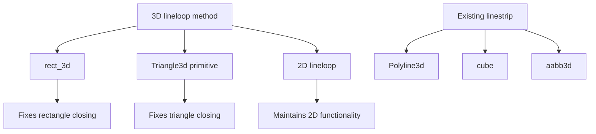

+++
title = "#22317 Fix: Closes shapes for 3d gizmos"
date = "2025-12-31T00:00:00"
draft = false
template = "pull_request_page.html"
in_search_index = true

[taxonomies]
list_display = ["show"]

[extra]
current_language = "en"
available_languages = {"en" = { name = "English", url = "/pull_request/bevy/2025-12/pr-22317-en-20251231" }, "zh-cn" = { name = "中文", url = "/pull_request/bevy/2025-12/pr-22317-zh-cn-20251231" }}
labels = ["C-Bug", "C-Code-Quality", "A-Gizmos"]
+++

# Title

## Basic Information
- **Title**: Fix: Closes shapes for 3d gizmos
- **PR Link**: https://github.com/bevyengine/bevy/pull/22317
- **Author**: kfc35
- **Status**: MERGED
- **Labels**: C-Bug, C-Code-Quality, S-Ready-For-Final-Review, A-Gizmos
- **Created**: 2025-12-30T20:02:15Z
- **Merged**: 2025-12-31T22:22:11Z
- **Merged By**: alice-i-cecile

## Description Translation

# Objective

- Fixes #22204 

## Solution

- Refactored the solution from #22085 and made it use 3 dimensions; have 2d `lineloop` delegate to the 3d one.
- Updated any relevant usages of `linestrip` to use `lineloop` (rect and `GizmoPrimitive3d<Triangle3d>`). `GizmoPrimitive3d<Polyline3d>`, cube(), and aabb3d() still use `linestrip`. As far as I could tell, the cube looked ok for all corners in the `3d_gizmos` example (the black cube in the center of the scene) but another pair of eyes could be helpful there.
- This does not do anything for #22095 !

## Testing

- Ran `cargo run --example 3d_gizmos --features=free_camera` and saw that the green 3d square gizmo now closes


- Ran the demo in #22085 and ensured no regressions for 2d_gizmos
- Ran a modified demo for `Triangle3d` and verified that `Triangle3d` now closes
<details>
  <summary>Modified Demo for Triangle 3d</summary>

```rust
use bevy::prelude::*;

fn main() {
    App::new()
        .add_plugins(DefaultPlugins)
        .add_systems(Startup, setup)
        .add_systems(Update, draw_shapes)
        .run();
}

fn setup(
    mut config_store: ResMut<GizmoConfigStore>,
    mut commands: Commands
)
{
    let (config, _) = config_store.config_mut::<DefaultGizmoConfigGroup>();
    config.line.width = 10.0;
    config.line.joints = GizmoLineJoint::Miter;

    commands.spawn((Camera3d::default(), 
        Transform::from_xyz(0.0, 0.0, -5.0).looking_at(Vec3::ZERO, Vec3::Z)));
}

fn draw_shapes(mut gizmos: Gizmos) {
    gizmos.primitive_3d(
        &Triangle3d { vertices: [Vec3::ZERO, Vec3::new(1.0, 0., 0.), Vec3::new(0.0, 1.0, 0.) ] },
        Vec3::new(0.0, 0.0, 0.),
        Color::srgb_u8(0xFF, 0, 0)
    );
}
```

Before (notice notch in bottom left hand corner):


After (notch in bottom left hand corner is gone):


</details>

## The Story of This Pull Request

This PR addresses a visual bug in Bevy's 3D gizmo system where closed shapes like rectangles and triangles weren't properly connecting their final vertex back to the first vertex. When drawing with thicker lines and certain joint styles (particularly miter joints), this resulted in visible gaps at the corners where the shape should have been fully closed.

The root cause was that while Bevy had a `lineloop` method for 2D gizmos that handled closing shapes properly, the 3D gizmo system only had a `linestrip` method that didn't automatically close shapes. Developers using 3D gizmos had to manually add the starting point again at the end of their vertex list, but this approach didn't properly handle the joint rendering at the first corner.

The developer approached this by first examining how the 2D `lineloop` method worked in a previous fix (#22085). That implementation used a clever technique: after drawing through all the points, it added both the first and second points again to ensure the joint at the first corner would render correctly. The developer recognized this pattern could be abstracted to work in 3D as well.

Instead of creating separate 2D and 3D implementations with duplicated logic, the developer made an architectural decision to have the 2D `lineloop` delegate to the new 3D version. This is a smart reuse of code - by extending 2D points to 3D (adding a z-coordinate of 0), the same 3D line-drawing logic could handle both cases. This approach reduces code duplication and ensures consistent behavior between 2D and 3D gizmos.

The implementation adds a new `lineloop` method to the 3D gizmos API with proper documentation and example usage. The key insight in the implementation is the need to include not just the first point again, but also the second point:

```rust
let mut positions = positions.into_iter();
let first = positions.next();
let second = positions.next();

self.linestrip(
    first
        .into_iter()
        .chain(second)
        .chain(positions)
        .chain(first)
        .chain(second),
    color,
);
```

This pattern ensures that when the line renderer processes the segments, it has enough context to properly calculate and render the joint at the starting point. Without including the second point again, the final segment (from the last point back to the first) wouldn't have information about what comes after it to calculate the joint properly.

After implementing the core `lineloop` method, the developer updated two key usages:
1. The `rect_3d` method now uses `lineloop` instead of manually constructing a closed polyline
2. The `Triangle3d` primitive rendering in the 3D primitives module also switches to `lineloop`

The developer was careful about which shapes to update - only closed shapes that should form complete loops. Other shapes like `Polyline3d` (which by definition doesn't close), cubes, and AABBs were left using `linestrip` since they were already working correctly.

Testing was thorough: the developer verified the fix worked in the existing 3D gizmos example, ensured no regressions in 2D gizmos, and created a custom test to visually confirm triangles now render correctly. The before-and-after screenshots clearly show the missing corner joint being fixed.

This fix demonstrates good API design by extending the existing pattern from 2D to 3D, maintaining backward compatibility (existing code continues to work), and providing a cleaner interface for drawing closed shapes. The delegation from 2D to 3D also shows thoughtful architecture that reduces maintenance burden while ensuring consistency across the codebase.

## Visual Representation



## Key Files Changed

1. **`crates/bevy_gizmos/src/gizmos.rs`** (+37/-18)

   This file contains the core implementation changes:
   
   - Added a new `lineloop` method for 3D gizmos that properly closes shapes
   - Updated `rect_3d` to use the new `lineloop` method instead of manually creating a closed linestrip
   - Refactored the 2D `lineloop` method to delegate to the 3D version, reducing code duplication

   Key code changes:
   
   ```rust
   // New 3D lineloop method
   pub fn lineloop(&mut self, positions: impl IntoIterator<Item = Vec3>, color: impl Into<Color>) {
       if !self.enabled {
           return;
       }
   
       // Loop back to the start; second is needed to ensure that
       // the joint on the first corner is drawn.
       let mut positions = positions.into_iter();
       let first = positions.next();
       let second = positions.next();
   
       self.linestrip(
           first
               .into_iter()
               .chain(second)
               .chain(positions)
               .chain(first)
               .chain(second),
           color,
       );
   }
   
   // Updated rect_3d to use lineloop
   self.lineloop([tl, tr, br, bl], color);
   
   // Refactored 2D lineloop to delegate to 3D
   pub fn lineloop(&mut self, positions: impl IntoIterator<Item = Vec2>, color: impl Into<Color>) {
       if !self.enabled {
           return;
       }
       self.lineloop(positions.into_iter().map(|vec2| vec2.extend(0.)), color);
   }
   ```

2. **`crates/bevy_gizmos/src/primitives/dim3.rs`** (+1/-1)

   This file contains a single line change to fix triangle rendering:
   
   - Updated the `Triangle3d` primitive rendering to use `lineloop` instead of `linestrip`
   
   Key code change:
   
   ```rust
   // Before:
   self.linestrip([a, b, c, a].map(|vec3| isometry * vec3), color);
   
   // After:
   self.lineloop([a, b, c].map(|vec3| isometry * vec3), color);
   ```

## Further Reading

- [Bevy Gizmos Documentation](https://docs.rs/bevy_gizmos/latest/bevy_gizmos/) - Official API documentation for Bevy's gizmo system
- [Issue #22204](https://github.com/bevyengine/bevy/issues/22204) - Original bug report showing the problem with 3D rectangle gizmos
- [PR #22085](https://github.com/bevyengine/bevy/pull/22085) - Previous fix for 2D gizmos that inspired this solution
- [Bevy Examples: 3D Gizmos](https://github.com/bevyengine/bevy/blob/main/examples/3d_gizmos.rs) - Example demonstrating various 3D gizmo functionality
- [Computer Graphics: Line Joints](https://en.wikipedia.org/wiki/Line_join) - Background on different line joint styles (miter, bevel, round)