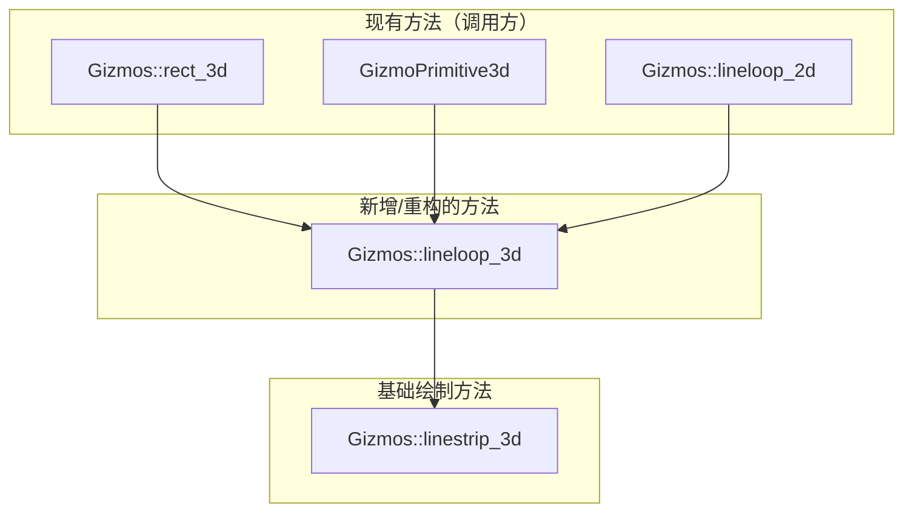

+++
title = "#22317 Fix: Closes shapes for 3d gizmos"
date = "2025-12-31T00:00:00"
draft = false
template = "pull_request_page.html"
in_search_index = false

[extra]
current_language = "zh-cn"
available_languages = {"en" = { name = "English", url = "/pull_request/bevy/2025-12/pr-22317-en-20251231" }, "zh-cn" = { name = "中文", url = "/pull_request/bevy/2025-12/pr-22317-zh-cn-20251231" }}
labels = ["C-Bug", "C-Code-Quality", "A-Gizmos"]
+++

# Title

## Basic Information
- **Title**: Fix: Closes shapes for 3d gizmos
- **PR Link**: https://github.com/bevyengine/bevy/pull/22317
- **Author**: kfc35
- **Status**: MERGED
- **Labels**: C-Bug, C-Code-Quality, S-Ready-For-Final-Review, A-Gizmos
- **Created**: 2025-12-30T20:02:15Z
- **Merged**: 2025-12-31T22:22:11Z
- **Merged By**: alice-i-cecile

## Description Translation
**Objective**
- 修复 #22204

**解决方案**
- 重构了 #22085 中的解决方案，使其适用于 3 维；让 2D 的 `lineloop` 委托给 3D 版本。
- 更新了所有相关使用 `linestrip` 的地方，改用 `lineloop`（矩形和 `GizmoPrimitive3d<Triangle3d>`）。`GizmoPrimitive3d<Polyline3d>`、cube() 和 aabb3d() 仍使用 `linestrip`。据我所见，在 `3d_gizmos` 示例中，立方体（场景中心的黑色立方体）的各个角看起来都正常，但也欢迎其他人帮忙检查一下。
- 此 PR **不**处理 #22095 的问题！

**测试**
- 运行 `cargo run --example 3d_gizmos --features=free_camera` 并确认绿色的 3D 方形 gizmo 现在闭合了。


- 运行了 #22085 中的演示，确保 2D gizmos 没有出现回归问题。
- 运行了一个修改过的 `Triangle3d` 演示，验证 `Triangle3d` 现在闭合了。
<details>
  <summary>修改后的 Triangle 3d 演示代码</summary>

```rust
use bevy::prelude::*;

fn main() {
    App::new()
        .add_plugins(DefaultPlugins)
        .add_systems(Startup, setup)
        .add_systems(Update, draw_shapes)
        .run();
}

fn setup(
    mut config_store: ResMut<GizmoConfigStore>,
    mut commands: Commands
)
{
    let (config, _) = config_store.config_mut::<DefaultGizmoConfigGroup>();
    config.line.width = 10.0;
    config.line.joints = GizmoLineJoint::Miter;

    commands.spawn((Camera3d::default(), 
        Transform::from_xyz(0.0, 0.0, -5.0).looking_at(Vec3::ZERO, Vec3::Z)));
}

fn draw_shapes(mut gizmos: Gizmos) {
    gizmos.primitive_3d(
        &Triangle3d { vertices: [Vec3::ZERO, Vec3::new(1.0, 0., 0.), Vec3::new(0.0, 1.0, 0.) ] },
        Vec3::new(0.0, 0.0, 0.),
        Color::srgb_u8(0xFF, 0, 0)
    );
}
```

修复前（注意左下角的缺口）：


修复后（左下角的缺口消失了）：


</details>

## The Story of This Pull Request

这个PR始于一个具体的视觉缺陷：在Bevy引擎中，一些3D gizmo形状的线条没有正确闭合。例如，使用 `gizmos.rect` 或 `gizmos.primitive_3d` 绘制的 `Triangle3d`，其路径的起点和终点之间会留下一个微小的缺口。这个问题被记录在issue #22204中。对于开发者调试和可视化来说，一个完整的、封闭的轮廓比一个带有缺口的轮廓更清晰、更准确。

问题的根源在于绘制逻辑的不一致。在之前的代码中，2D绘图已经有一个 `lineloop` 方法来创建闭合图形，其实现会聪明地处理点序列，确保首尾相连。然而，3D绘图API中缺少一个对应的 `lineloop` 方法。因此，像 `rect`（在3D空间）和 `Triangle3d` 这类本应闭合的形状，都退而使用 `linestrip` 方法来绘制，而 `linestrip` 只是简单连接提供的点，不会自动闭合图形。

开发者kfc35的解决方案思路清晰且高效：将2D `lineloop` 的核心逻辑“提升”到3D空间，然后在3D中创建一个通用的 `lineloop` 方法。之后，再让2D的 `lineloop` 委托给这个新的3D方法（通过将2D点扩展到3D空间）。这样做不仅修复了3D图形的闭合问题，还消除了2D和3D之间的代码重复，符合DRY（Don't Repeat Yourself）原则。

具体的实现在 `crates/bevy_gizmos/src/gizmos.rs` 中。开发者新增了一个3D的 `lineloop` 方法。这个方法的核心是一个巧妙的迭代器链（iterator chain）：

```rust
self.linestrip(
    first
        .into_iter()
        .chain(second)
        .chain(positions)
        .chain(first)
        .chain(second),
    color,
);
```

它的逻辑是：取出第一个点（`first`）和第二个点（`second`），然后拼接剩余的所有点（`positions`）。为了闭合图形并正确绘制第一个角点的连接处（joint），它再次拼接回 `first` 和 `second`。简单来说，如果原始点序列是 [A, B, C, D]，这个方法会生成 [A, B, C, D, A, B] 给 `linestrip` 去绘制。最后两个点（A, B）确保了从D回到A的线段被绘制，并且A点处的转角连接样式（如Miter）能够基于线段BA和线段AB的方向被正确计算。

完成这个通用方法后，修改调用方就变得很简单了。在同一个文件中，3D `rect` 方法的绘制调用从 `self.linestrip([tl, tr, br, bl, tl], color)` 改为 `self.lineloop([tl, tr, br, bl], color)`。注意，这里的参数列表移除了末尾重复的 `tl`，因为 `lineloop` 会负责处理闭合。在 `crates/bevy_gizmos/src/primitives/dim3.rs` 中，绘制 `Triangle3d` 的代码也从 `self.linestrip([a, b, c, a]...` 改为 `self.lineloop([a, b, c]...`。这种改动使调用方的意图（“画一个闭合环”）更加明确。

对于2D部分，原有的 `lineloop` 方法被重构，现在它只是将2D点（`Vec2`）通过 `.extend(0.)` 转换为3D点（`Vec3`），然后调用新的3D `lineloop` 方法。这完全移除了之前2D `lineloop` 方法中独立的、与3D版本逻辑相同的迭代器链代码，实现了代码复用。

这个PR带来的直接改进是视觉上的：所有使用更新后的方法绘制的3D闭合形状现在都能正确显示，没有缺口。从代码质量角度看，它通过创建一个统一的3D `lineloop` 方法并让2D版本复用其逻辑，提升了代码的抽象层次并减少了重复。这个解决方案也展示了在图形编程中，处理闭合路径时需要考虑额外的点来确保连接处渲染正确，这是一个有用的技术细节。

不过，正如作者在PR描述中明确指出的，这个修复有它的范围。它没有解决所有3D图形（如 `cube()` 和 `aabb3d()`）的闭合问题，因为这些方法仍然使用 `linestrip`。作者评估后认为立方体的视觉表现可以接受，但将更全面的修复留给了未来的工作（如issue #22095）。这种明确界定修复范围的做法在协作开发中是很专业的。

## Visual Representation



## Key Files Changed

1.  **`crates/bevy_gizmos/src/gizmos.rs` (+37/-18)**
    *   **修改内容与原因**：这是本次修复的核心文件。主要做了两件事：一是新增了3D版本的 `lineloop` 方法，提供了绘制闭合3D线段环的通用能力；二是修改了相关的调用方（`rect` 3D部分）和重构了2D `lineloop` 方法，使其复用新的3D逻辑。
    *   **关键代码片段**：
        ```rust
        // 新增的 3D lineloop 方法
        #[inline]
        pub fn lineloop(&mut self, positions: impl IntoIterator<Item = Vec3>, color: impl Into<Color>) {
            // ... 启用检查省略
            let mut positions = positions.into_iter();
            let first = positions.next();
            let second = positions.next();
            self.linestrip(
                first
                    .into_iter()
                    .chain(second)
                    .chain(positions)
                    .chain(first)
                    .chain(second),
                color,
            );
        }

        // 3D rect 方法内的调用修改
        // 之前:
        // self.linestrip([tl, tr, br, bl, tl], color);
        // 之后:
        self.lineloop([tl, tr, br, bl], color);

        // 2D lineloop 方法重构后（委托给 3D 版本）
        #[inline]
        pub fn lineloop(&mut self, positions: impl IntoIterator<Item = Vec2>, color: impl Into<Color>) {
            if !self.enabled {
                return;
            }
            // 主要改动：移除旧的复杂逻辑，直接调用 3D 版本
            self.lineloop(positions.into_iter().map(|vec2| vec2.extend(0.)), color);
        }
        ```
    *   **与PR目标的关系**：新增的3D `lineloop` 方法是修复的基石。修改 `rect` 和重构2D `lineloop` 则是应用此基石的具体行动，共同实现了3D形状闭合和代码复用的目标。

2.  **`crates/bevy_gizmos/src/primitives/dim3.rs` (+1/-1)**
    *   **修改内容与原因**：这个文件包含了为各种3D图元（primitive）实现 gizmo 绘制的代码。这里只修改了 `Triangle3d` 的绘制实现，将其从使用 `linestrip` 改为使用新的 `lineloop`，以确保三角形轮廓闭合。
    *   **关键代码片段**：
        ```rust
        // 之前:
        self.linestrip([a, b, c, a].map(|vec3| isometry * vec3), color);
        // 之后:
        self.lineloop([a, b, c].map(|vec3| isometry * vec3), color);
        ```
    *   **与PR目标的关系**：这是修复 `GizmoPrimitive3d<Triangle3d>` 绘制不闭合问题的直接改动，是本次PR要解决的具体问题之一。

## Further Reading
*   **Bevy Gizmos 官方文档**: 了解 Bevy Gizmo 系统的完整API和功能。
*   **Issue #22085**: 本次修复所借鉴的原始2D `lineloop` 实现所在的PR，提供了问题的初始上下文。
*   **Issue #22095**: 本次PR明确未解决的、关于其他3D gizmo（如立方体边框）闭合问题的 issue，指出了未来的改进方向。
*   **计算机图形学 - 线段连接处（Line Joins）**: 学习关于 `Miter`、`Bevel`、`Round` 等线段连接处样式的知识，理解为何在闭合环时需要额外点来计算连接。