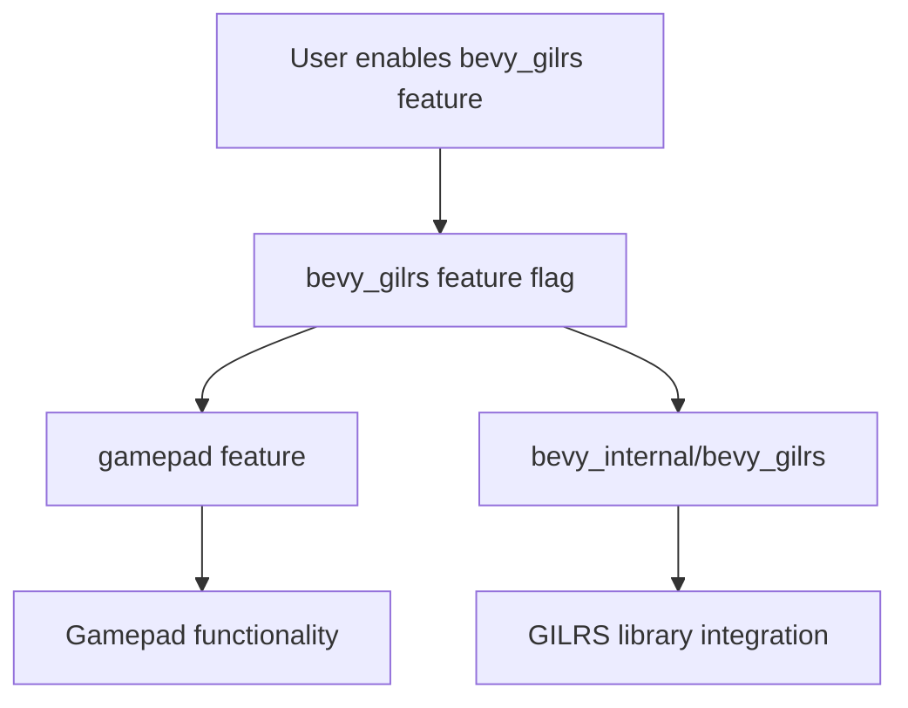

+++
title = "#22320 add gamepad to bevy_gilrs feature flag"
date = "2025-12-31T00:00:00"
draft = false
template = "pull_request_page.html"
in_search_index = true

[taxonomies]
list_display = ["show"]

[extra]
current_language = "en"
available_languages = {"en" = { name = "English", url = "/pull_request/bevy/2025-12/pr-22320-en-20251231" }, "zh-cn" = { name = "中文", url = "/pull_request/bevy/2025-12/pr-22320-zh-cn-20251231" }}
labels = ["C-Docs", "D-Trivial"]
+++

# Title
add gamepad to bevy_gilrs feature flag

## Basic Information
- **Title**: add gamepad to bevy_gilrs feature flag
- **PR Link**: https://github.com/bevyengine/bevy/pull/22320
- **Author**: it-me-joda
- **Status**: MERGED
- **Labels**: C-Docs, D-Trivial, S-Ready-For-Final-Review
- **Created**: 2025-12-31T00:56:41Z
- **Merged**: 2025-12-31T22:28:50Z
- **Merged By**: alice-i-cecile

## Description Translation
**Objective**
- Resolve discrepancy between documentation and implementation of the `bevy_gilrs` and `gamepad` feature flag
- Fixes #22319

**Solution**
- Added `gamepad` to `bevy_gilrs` per the documentation

**Testing**
- I recompiled Bevy with and without this change and ensured no failure to compile

## The Story of This Pull Request

This pull request addresses a straightforward but important discrepancy in Bevy's feature flag configuration. The issue was discovered in the build system where the `bevy_gilrs` feature flag wasn't properly enabling the dependent `gamepad` feature as documented. This kind of inconsistency can cause confusion for developers who rely on feature flags to manage their project dependencies.

The problem surfaced in issue #22319, which reported that the `bevy_gilrs` feature wasn't working as expected according to the documentation. In Bevy's feature system, feature flags can depend on other features to ensure that when a user enables a high-level feature like `bevy_gilrs`, all necessary lower-level components are also enabled automatically. This prevents users from having to manually enable multiple related features and reduces configuration errors.

The developer took a direct approach to fix this by modifying the feature definition in `Cargo.toml`. The change ensures that when someone enables `bevy_gilrs`, the `gamepad` feature is automatically enabled as well. This aligns the implementation with what was already documented, maintaining consistency between the code and its documentation.

From a technical perspective, this is a simple dependency declaration in Cargo's feature system. Features in Rust's Cargo build system can include other features or optional dependencies. When a user adds `features = ["bevy_gilrs"]` to their dependency declaration, Cargo will automatically enable any features listed in that feature's definition. The fix ensures the transitive dependency works correctly.

The developer validated the fix with a practical testing approach: compiling Bevy both with and without the change to ensure no compilation failures. This verification step is important even for small changes because it confirms that the modification doesn't break existing functionality and that the dependency chain works as intended.

This change has minimal impact on performance or architecture but significant impact on developer experience. It ensures that developers who enable gamepad support through the `bevy_gilrs` feature get the complete gamepad functionality without needing to understand the internal dependency structure. The fix also maintains the principle that documentation should accurately reflect implementation, which is crucial for open-source projects where users rely on accurate documentation to use the library effectively.

## Visual Representation



## Key Files Changed

**File: `Cargo.toml`**
1. **Change Description**: Modified the `bevy_gilrs` feature definition to include the `gamepad` feature as a dependency, fixing the discrepancy between documentation and implementation.

2. **Code Change**:
```toml
# Before:
bevy_gilrs = ["bevy_internal/bevy_gilrs"]

# After:
bevy_gilrs = ["gamepad", "bevy_internal/bevy_gilrs"]
```

3. **Relationship to PR Purpose**: This single-line change directly addresses the core issue by ensuring that when the `bevy_gilrs` feature is enabled, it automatically enables both the internal GILRS integration and the public `gamepad` feature that provides the gamepad API to users.

## Further Reading

1. **Rust Cargo Features Documentation**: [The Cargo Book - Features](https://doc.rust-lang.org/cargo/reference/features.html) - Comprehensive guide to how features work in Rust's build system
2. **Bevy Feature Flags**: [Bevy Engine Features Documentation](https://bevyengine.org/learn/book/getting-started/features/) - Official documentation on using feature flags in Bevy
3. **GILRS Library**: [GILRS GitHub Repository](https://github.com/gilrs-project/gilrs) - The gamepad input library that Bevy integrates through the `bevy_gilrs` feature
4. **Semantic Versioning and Features**: [SemVer Compatibility with Features](https://doc.rust-lang.org/cargo/reference/semver.html#cargo) - How features affect API stability and versioning

## Full Code Diff
```
diff --git a/Cargo.toml b/Cargo.toml
index 72f417c75d52a..a455c173da68f 100644
--- a/Cargo.toml
+++ b/Cargo.toml
@@ -310,7 +310,7 @@ bevy_post_process = ["bevy_internal/bevy_post_process"]
 bevy_anti_alias = ["bevy_internal/bevy_anti_alias"]
 
 # Adds gamepad support
-bevy_gilrs = ["bevy_internal/bevy_gilrs"]
+bevy_gilrs = ["gamepad", "bevy_internal/bevy_gilrs"]
 
 # [glTF](https://www.khronos.org/gltf/) support
 bevy_gltf = ["bevy_internal/bevy_gltf"]
```