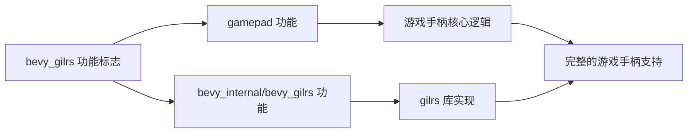

+++
title = "#22320 add gamepad to bevy_gilrs feature flag"
date = "2025-12-31T00:00:00"
draft = false
template = "pull_request_page.html"
in_search_index = false

[extra]
current_language = "zh-cn"
available_languages = {"en" = { name = "English", url = "/pull_request/bevy/2025-12/pr-22320-en-20251231" }, "zh-cn" = { name = "中文", url = "/pull_request/bevy/2025-12/pr-22320-zh-cn-20251231" }}
labels = ["C-Docs", "D-Trivial"]
+++

# Title: add gamepad to bevy_gilrs feature flag

## Basic Information
- **Title**: add gamepad to bevy_gilrs feature flag
- **PR Link**: https://github.com/bevyengine/bevy/pull/22320
- **Author**: it-me-joda
- **Status**: MERGED
- **Labels**: C-Docs, D-Trivial, S-Ready-For-Final-Review
- **Created**: 2025-12-31T00:56:41Z
- **Merged**: 2025-12-31T22:28:50Z
- **Merged By**: alice-i-cecile

## Description Translation

# Objective

- 解决文档与 `bevy_gilrs` 和 `gamepad` 功能标志实现之间的不一致问题
- 修复 #22319

## Solution

- 按照文档说明，将 `gamepad` 添加到 `bevy_gilrs` 功能标志中

## Testing

- 我重新编译了 Bevy，在有此更改和没有此更改的情况下都确保了编译不会失败

## The Story of This Pull Request

这是一个关于功能标志一致性的简单修复。PR #22320 解决了一个在 Bevy 项目根目录 `Cargo.toml` 文件中的微小但重要的不一致问题。

问题源于文档与代码实现之间的差异。在 Bevy 的功能标志系统中，`bevy_gilrs` 功能旨在添加游戏手柄支持。根据文档，启用 `bevy_gilrs` 应该自动包含 `gamepad` 功能。然而，在实际的代码实现中，`bevy_gilrs` 功能标志的定义缺少了 `gamepad` 依赖。

这种不一致可能导致开发者在尝试使用游戏手柄功能时遇到问题。如果他们按照文档说明仅启用 `bevy_gilrs`，他们可能无法获得完整的游戏手柄支持，因为相关的 `gamepad` 功能模块没有被包含进来。

解决方案非常简单直接：只需要在 `bevy_gilrs` 功能标志的定义中添加 `gamepad` 依赖。这样，当开发者启用 `bevy_gilrs` 功能时，他们会自动获得完整的游戏手柄支持，包括所有必要的组件和系统。

从技术角度来看，这是 Rust 的 Cargo 功能标志系统的标准用法。功能标志可以相互依赖，这样复杂的特性可以分解为更小的、可组合的部分。在这种情况下，`gamepad` 功能可能包含游戏手柄处理的核心逻辑，而 `bevy_gilrs` 功能则添加了基于 gilrs 库的具体实现。

修复的实现只需要修改一行代码。将原来的 `bevy_gilrs = ["bevy_internal/bevy_gilrs"]` 改为 `bevy_gilrs = ["gamepad", "bevy_internal/bevy_gilrs"]`。这意味着当启用 `bevy_gilrs` 时，Cargo 会首先启用 `gamepad` 功能，然后启用 `bevy_internal/bevy_gilrs` 功能。

作者通过重新编译项目来测试这个更改，确保了编译在两种情况下都不会失败。这种测试方法对于这种类型的功能标志更改是合适的，因为它验证了更改不会破坏构建过程。

这个 PR 虽然很小，但它体现了保持文档与代码一致性的重要性。不一致的功能标志定义可能导致混淆和难以调试的问题，特别是对于不熟悉项目内部结构的新贡献者。通过修复这种不一致，项目保持了更好的可预测性和易用性。

## Visual Representation



## Key Files Changed

### `Cargo.toml`
这是 Bevy 项目的根 Cargo.toml 文件，包含了项目的功能标志定义。

**修改内容**：
修改了 `bevy_gilrs` 功能标志的定义，添加了 `gamepad` 作为依赖。

```toml
# 修改前：
# Adds gamepad support
bevy_gilrs = ["bevy_internal/bevy_gilrs"]

# 修改后：
# Adds gamepad support
bevy_gilrs = ["gamepad", "bevy_internal/bevy_gilrs"]
```

**为什么重要**：
这个更改确保了当开发者启用 `bevy_gilrs` 功能时，他们会自动获得完整的游戏手柄支持。这是必要的，因为 `gamepad` 功能可能包含了游戏手柄处理的核心逻辑，而 `bevy_internal/bevy_gilrs` 只包含具体的 gilrs 库实现。

## Further Reading

1. [Cargo 功能标志文档](https://doc.rust-lang.org/cargo/reference/features.html) - Rust Cargo 功能标志的官方文档
2. [Bevy 游戏手柄输入指南](https://bevyengine.org/learn/quick-start/input/) - Bevy 游戏手柄输入的官方教程
3. [gilrs 库](https://crates.io/crates/gilrs) - Rust 游戏手柄输入库
4. [语义化版本控制中的功能标志](https://semver.org/#spec-item-11) - 功能标志在版本控制中的作用

# Full Code Diff
```
diff --git a/Cargo.toml b/Cargo.toml
index 72f417c75d52a..a455c173da68f 100644
--- a/Cargo.toml
+++ b/Cargo.toml
@@ -310,7 +310,7 @@ bevy_post_process = ["bevy_internal/bevy_post_process"]
 bevy_anti_alias = ["bevy_internal/bevy_anti_alias"]
 
 # Adds gamepad support
-bevy_gilrs = ["bevy_internal/bevy_gilrs"]
+bevy_gilrs = ["gamepad", "bevy_internal/bevy_gilrs"]
 
 # [glTF](https://www.khronos.org/gltf/) support
 bevy_gltf = ["bevy_internal/bevy_gltf"]
```