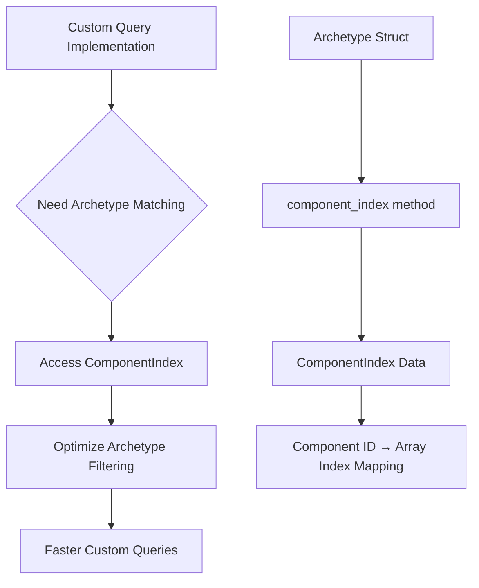

+++
title = "#22322 make `Archetype::component_index` pub"
date = "2025-12-31T00:00:00"
draft = false
template = "pull_request_page.html"
in_search_index = true

[taxonomies]
list_display = ["show"]

[extra]
current_language = "en"
available_languages = {"en" = { name = "English", url = "/pull_request/bevy/2025-12/pr-22322-en-20251231" }, "zh-cn" = { name = "中文", url = "/pull_request/bevy/2025-12/pr-22322-zh-cn-20251231" }}
labels = ["A-ECS", "C-Usability"]
+++

# Title
make `Archetype::component_index` pub

## Basic Information
- **Title**: make `Archetype::component_index` pub
- **PR Link**: https://github.com/bevyengine/bevy/pull/22322
- **Author**: eugineerd
- **Status**: MERGED
- **Labels**: A-ECS, C-Usability, S-Ready-For-Final-Review
- **Created**: 2025-12-31T08:44:23Z
- **Merged**: 2025-12-31T22:22:11Z
- **Merged By**: alice-i-cecile

## Description Translation
# Objective
While experimenting with implementing a custom `Query` I noticed that `ComponentIndex` isn't accessible to user code, but it would be very useful to speed up archetype matching.

## Solution
Make `Archetype::component_index` getter pub.

## The Story of This Pull Request

This PR addresses a straightforward but important accessibility issue in Bevy's Entity Component System (ECS) API. The author was experimenting with implementing a custom `Query` type and discovered that while working on archetype matching optimizations, they needed access to the `ComponentIndex` data structure. However, this data was only available internally through a `pub(crate)` method, preventing external users from leveraging it for performance-critical operations.

The `ComponentIndex` is a core data structure in Bevy's ECS that maps component IDs to their indices within an archetype. When working with archetypes, knowing where a specific component is located within an archetype's component arrays is essential for efficient data access. The author recognized that making this information publicly available would enable developers building custom queries or other ECS extensions to implement more efficient archetype matching algorithms.

The implementation is minimal: a single-line change in `archetype.rs` that modifies the visibility of the `component_index` getter method from `pub(crate)` to `pub`. This change exposes the existing functionality without modifying any implementation details or adding new code. The method returns a reference to the `ComponentIndex`, maintaining the existing ownership semantics and ensuring no unnecessary copies are made.

From an architectural perspective, this change aligns with Bevy's philosophy of providing low-level building blocks for power users while maintaining a high-level API for common use cases. The `ComponentIndex` structure was already well-designed and tested internally; exposing it simply makes existing functionality available to the broader ecosystem.

The primary impact of this change is that developers implementing custom ECS extensions can now access the component layout information of archetypes directly. This enables optimizations like:
- Faster archetype filtering when implementing custom query systems
- More efficient component access patterns in specialized systems
- Better integration with third-party ECS tooling that needs to understand archetype layouts

The change is backward compatible since it only increases visibility of an existing method. No existing code breaks, and the API surface expands to support more advanced use cases. This follows the principle of progressive disclosure—keeping the simple cases simple while enabling complex optimizations when needed.

## Visual Representation



## Key Files Changed

**crates/bevy_ecs/src/archetype.rs** (+1/-1)

This file contains the `Archetype` struct and its implementation. The change is minimal but significant for API accessibility:

1. **What changed and why**: The visibility modifier for the `component_index` method was changed from `pub(crate)` to `pub`. This allows external code (outside the `bevy_ecs` crate) to access the component index mapping for archetypes, which is useful for implementing custom queries and optimizing archetype matching.

2. **Code snippet showing the modification**:

```rust
// File: crates/bevy_ecs/src/archetype.rs
// Before:
pub(crate) fn component_index(&self) -> &ComponentIndex {
    &self.by_component
}

// After:
pub fn component_index(&self) -> &ComponentIndex {
    &self.by_component
}
```

3. **Relationship to PR purpose**: This single-line change directly addresses the PR's objective by making the `ComponentIndex` accessible to user code, enabling developers to implement more efficient archetype matching in custom query implementations.

## Further Reading

1. [Bevy ECS Documentation](https://docs.rs/bevy_ecs/latest/bevy_ecs/) - Official documentation for Bevy's Entity Component System
2. [Bevy ECS Archetypes](https://docs.rs/bevy_ecs/latest/bevy_ecs/archetype/index.html) - Detailed information about archetypes in Bevy
3. [ComponentIndex API Documentation](https://docs.rs/bevy_ecs/latest/bevy_ecs/archetype/struct.ComponentIndex.html) - Documentation for the ComponentIndex structure
4. [Rust Visibility and Privacy](https://doc.rust-lang.org/reference/visibility-and-privacy.html) - Understanding Rust's visibility modifiers (`pub`, `pub(crate)`, etc.)
5. [Bevy ECS Query System](https://bevyengine.org/learn/quick-start/ecs-queries/) - Official guide to Bevy's query system

# Full Code Diff
```diff
diff --git a/crates/bevy_ecs/src/archetype.rs b/crates/bevy_ecs/src/archetype.rs
index 1e394d2a5fef8..984d8a14aa67f 100644
--- a/crates/bevy_ecs/src/archetype.rs
+++ b/crates/bevy_ecs/src/archetype.rs
@@ -936,7 +936,7 @@ impl Archetypes {
     }
 
     /// Get the component index
-    pub(crate) fn component_index(&self) -> &ComponentIndex {
+    pub fn component_index(&self) -> &ComponentIndex {
         &self.by_component
     }
```