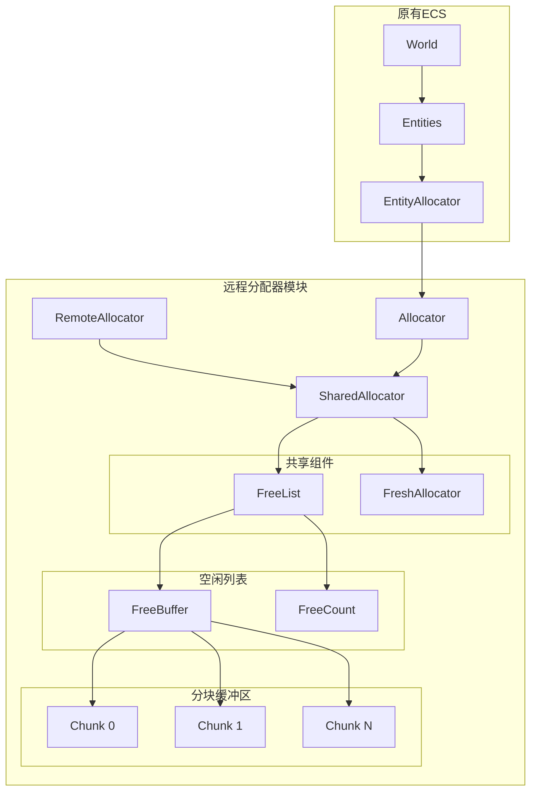

+++
title = "#18670 Remote entity reservation v9"
date = "2026-01-23T00:00:00"
draft = false
template = "pull_request_page.html"
in_search_index = false

[extra]
current_language = "zh-cn"
available_languages = {"en" = { name = "English", url = "/pull_request/bevy/2026-01/pr-18670-en-20260123" }, "zh-cn" = { name = "中文", url = "/pull_request/bevy/2026-01/pr-18670-zh-cn-20260123" }}
labels = ["C-Feature", "A-ECS", "M-Migration-Guide", "X-Controversial", "S-Needs-SME"]
+++

# Title
Remote entity reservation v9

## Basic Information
- **Title**: Remote entity reservation v9
- **PR Link**: https://github.com/bevyengine/bevy/pull/18670
- **Author**: ElliottjPierce
- **Status**: MERGED
- **Labels**: C-Feature, A-ECS, M-Migration-Guide, X-Controversial, S-Needs-SME
- **Created**: 2025-04-01T19:41:01Z
- **Merged**: 2026-01-23T02:53:26Z
- **Merged By**: cart

## Description Translation
解决 #18003

# Objective

这是相同目标的第9个版本。对于作为实体的资产，我们需要能够从任何线程预留实体。理想情况下，这可以在不依赖异步上下文、阻塞或等待的情况下完成。这些妥协中的任何一个都可能损害资产性能或破坏资产系统完全非阻塞的特性。

作为额外好处，这个PR使分配实体只需要 `&Entities` 而不是 `&mut`。`Entities::flush` 现在完全是可选的，意味着 `Entities` 的所有方法都不依赖于刷新，并且有保护措施防止对实体进行两次刷新。

（如果你好奇，v9实际上是从v8分支出来的。v8专注于 #18577（从不刷新实体），但这个版本仍然包含刷新。）

> 这里有一份[文档](https://hackmd.io/@bevy/Bkjgqvcblx)也提供了一些背景信息。如果你没有关注这个问题，我强烈建议在深入研究代码之前先阅读它。

## Solution

在组织上，我将底层的 `EntityAllocator` 从 `Entities` 中分离出来。这使得现在更容易阅读，等等，因为它更复杂了。

基本问题是我们需要能够从任何线程在任何时间分配一个实体。我们还需要能够释放一个实体。所以在分配器层面，有3个操作：`free`、`alloc`（当你知道 `free` 没有被调用时）和 `remote_alloc`（可以在任何时候调用）。这些操作都不能要求可变访问。

最大的挑战是有一个 `free` 实体列表等待被重用。这个列表需要在没有可变访问的情况下完全正常工作，需要可调整大小，并且需要在内存中固定。我最终使用了类似于 [`SplitVec`](https://docs.rs/orx-split-vec/latest/orx_split_vec/) 的策略。这个依赖需要 `std`，并且提前知道最大容量让我们简化了实现，所以我在这里自己实现了。

## Testing

目前没有新的测试。可能值得在某个时候使用 [loom](https://docs.rs/loom/latest/loom/)，但这需要一个额外的依赖、测试特定的 loom 特性标志，并对多个 crate 进行这种处理，特别是 bevy_platform。

## Future work

#18577 仍然是一个好的最终目标。最终（就像 @maniwani 所说的那样会发生），我决定一次性完成所有这些既太有挑战性，也会增加太多复杂性。然而，v9 使得"从不刷新"在未来变得更容易接近得多。我遇到的最大问题是很多地方持有对实体 `Archetype` 的引用（但现在实体可能没有原型），并且到处检查原型可能实际上比刷新性能更差。也许。

现在 `alloc` 可以在没有可变访问的情况下调用，`free`（等）可以在不需要先 `flush` 的情况下调用，我们也可以潜在地加速许多不同的过程。

## Costs

<details>
  <summary>基准测试</summary>

```txt
group                                           main_baseline                           remote_reservation_v9_baseline
-----                                           -------------                           ------------------------------
add_remove/sparse_set                           1.06   625.2±42.08µs        ? ?/sec     1.00   591.8±24.97µs        ? ?/sec
add_remove/table                                1.00   883.9±66.56µs        ? ?/sec     1.06   941.1±34.62µs        ? ?/sec
add_remove_very_big/table                       1.08     37.7±2.55ms        ? ?/sec     1.00     34.9±0.76ms        ? ?/sec
added_archetypes/archetype_count/1000           1.13  688.8±175.58µs        ? ?/sec     1.00  608.6±137.61µs        ? ?/sec
added_archetypes/archetype_count/200            1.13    72.7±18.97µs        ? ?/sec     1.00    64.2±20.78µs        ? ?/sec
added_archetypes/archetype_count/2000           1.11  1086.7±290.33µs        ? ?/sec    1.00  977.2±118.15µs        ? ?/sec
added_archetypes/archetype_count/5000           1.09      2.7±0.29ms        ? ?/sec     1.00      2.5±0.27ms        ? ?/sec
despawn_world/10_entities                       1.00   695.6±13.85ns        ? ?/sec     1.09   760.4±40.01ns        ? ?/sec
despawn_world/1_entities                        1.00   182.0±24.14ns        ? ?/sec     1.56   284.3±50.46ns        ? ?/sec
despawn_world_recursive/10000_entities          1.00  1668.8±95.30µs        ? ?/sec     1.13  1878.0±111.75µs        ? ?/sec
despawn_world_recursive/10_entities             1.00      2.3±0.04µs        ? ?/sec     1.05      2.4±0.09µs        ? ?/sec
despawn_world_recursive/1_entities              1.00   382.2±36.07ns        ? ?/sec     1.41   539.1±60.46ns        ? ?/sec
empty_archetypes/iter/10000                     1.07     12.8±1.61µs        ? ?/sec     1.00     12.0±0.49µs        ? ?/sec
empty_archetypes/par_for_each/100               1.06      9.2±1.04µs        ? ?/sec     1.00      8.7±0.35µs        ? ?/sec
empty_archetypes/par_for_each/1000              1.12     12.8±0.87µs        ? ?/sec     1.00     11.5±0.36µs        ? ?/sec
empty_archetypes/par_for_each/10000             1.19     25.4±0.98µs        ? ?/sec     1.00     21.3±0.41µs        ? ?/sec
empty_archetypes/par_for_each/2000              1.16     13.6±1.17µs        ? ?/sec     1.00     11.7±0.44µs        ? ?/sec
empty_archetypes/par_for_each/500               1.08     11.1±0.70µs        ? ?/sec     1.00     10.3±0.28µs        ? ?/sec
empty_commands/0_entities                       1.00      3.9±0.06ns        ? ?/sec     1.40      5.4±0.06ns        ? ?/sec
entity_hash/entity_set_lookup_miss_gen/10000    1.00     41.6±6.26µs 229.0 MElem/sec    1.05     43.9±5.74µs 217.1 MElem/sec
entity_hash/entity_set_lookup_miss_id/10000     1.25     44.5±5.30µs 214.2 MElem/sec    1.00     35.7±5.03µs 266.8 MElem/sec
event_propagation/four_event_types              1.13   606.5±27.06µs        ? ?/sec     1.00    535.9±5.38µs        ? ?/sec
event_propagation/single_event_type             1.12   870.3±27.20µs        ? ?/sec     1.00   776.4±18.86µs        ? ?/sec
fake_commands/2000_commands                     1.00     12.1±0.08µs        ? ?/sec     1.28     15.4±0.25µs        ? ?/sec
fake_commands/4000_commands                     1.00     24.2±0.26µs        ? ?/sec     1.28     30.9±0.38µs        ? ?/sec
fake_commands/6000_commands                     1.00     36.3±0.50µs        ? ?/sec     1.27     46.2±0.48µs        ? ?/sec
fake_commands/8000_commands                     1.00     48.3±0.15µs        ? ?/sec     1.28     61.6±0.87µs        ? ?/sec
insert_simple/base                              1.29   403.9±79.33µs        ? ?/sec     1.00   312.1±56.57µs        ? ?/sec
insert_simple/unbatched                         2.41  1021.5±234.06µs        ? ?/sec    1.00   423.2±17.00µs        ? ?/sec
iter_fragmented/base                            1.00    346.6±8.58ns        ? ?/sec     1.40    485.0±9.30ns        ? ?/sec
iter_fragmented/foreach                         1.07    141.4±6.76ns        ? ?/sec     1.00    132.4±3.85ns        ? ?/sec
iter_fragmented_sparse/base                     1.19      7.9±0.16ns        ? ?/sec     1.00      6.6±0.09ns        ? ?/sec
iter_simple/foreach_wide                        2.76     46.4±0.46µs        ? ?/sec     1.00     16.8±0.18µs        ? ?/sec
iter_simple/foreach_wide_sparse_set             1.00    80.9±13.81µs        ? ?/sec     1.12    90.3±29.10µs        ? ?/sec
observe/trigger_simple                          1.00    450.3±9.25µs        ? ?/sec     1.08    488.5±9.99µs        ? ?/sec
query_get/50000_entities_table                  1.00    138.8±0.67µs        ? ?/sec     1.05    145.9±1.23µs        ? ?/sec
query_get_many_5/50000_calls_sparse             1.06   607.3±14.47µs        ? ?/sec     1.00   570.5±42.57µs        ? ?/sec
sized_commands_0_bytes/2000_commands            1.00     10.6±1.20µs        ? ?/sec     1.26     13.3±0.18µs        ? ?/sec
sized_commands_0_bytes/4000_commands            1.00     20.6±0.33µs        ? ?/sec     1.29     26.5±0.42µs        ? ?/sec
sized_commands_0_bytes/6000_commands            1.00     30.8±0.26µs        ? ?/sec     1.29     39.9±0.61µs        ? ?/sec
sized_commands_0_bytes/8000_commands            1.00     41.4±0.77µs        ? ?/sec     1.28     53.1±0.65µs        ? ?/sec
sized_commands_12_bytes/2000_commands           1.00     11.6±0.29µs        ? ?/sec     1.23     14.2±0.32µs        ? ?/sec
sized_commands_12_bytes/4000_commands           1.00     22.8±3.30µs        ? ?/sec     1.24     28.3±0.30µs        ? ?/sec
sized_commands_12_bytes/6000_commands           1.00     33.6±0.20µs        ? ?/sec     1.27     42.8±0.63µs        ? ?/sec
sized_commands_12_bytes/8000_commands           1.00     48.8±6.10µs        ? ?/sec     1.22     59.7±0.76µs        ? ?/sec
sized_commands_512_bytes/2000_commands          1.00     46.3±1.28µs        ? ?/sec     1.06     48.9±1.73µs        ? ?/sec
sized_commands_512_bytes/4000_commands          1.00     90.5±2.06µs        ? ?/sec     1.08     97.4±3.33µs        ? ?/sec
spawn_commands/2000_entities                    1.00   155.4±11.61µs        ? ?/sec     1.22   189.5±15.70µs        ? ?/sec
spawn_commands/4000_entities                    1.00   303.7±15.69µs        ? ?/sec     1.22   371.1±18.58µs        ? ?/sec
spawn_commands/6000_entities                    1.00   463.3±31.95µs        ? ?/sec     1.20   554.8±12.55µs        ? ?/sec
spawn_commands/8000_entities                    1.00   619.7±44.57µs        ? ?/sec     1.19   734.9±16.71µs        ? ?/sec
spawn_world/1000_entities                       1.06     41.5±2.97µs        ? ?/sec     1.00     39.1±2.94µs        ? ?/sec
spawn_world/100_entities                        1.20      4.8±2.29µs        ? ?/sec     1.00      4.0±0.69µs        ? ?/sec
spawn_world/10_entities                         1.15   461.9±80.36ns        ? ?/sec     1.00   400.5±26.17ns        ? ?/sec
spawn_world/1_entities                          1.05     41.4±6.35ns        ? ?/sec     1.00     39.4±3.02ns        ? ?/sec
world_get/50000_entities_sparse                 1.00    167.1±4.23µs        ? ?/sec     1.07    178.8±2.44µs        ? ?/sec
world_query_get/50000_entities_sparse_wide      1.00    125.0±0.31µs        ? ?/sec     1.08   135.7±78.30µs        ? ?/sec
world_query_iter/50000_entities_sparse          1.00     38.7±0.08µs        ? ?/sec     1.18     45.6±0.60µs        ? ?/sec
```
</details>

**解释基准测试：**

在大多数地方，v9与main相当甚至更快。一些显著的例外是"sized_commands"和"fake_commands"部分，但那里的回归纯粹是由于`Entities::flush`变慢了，但我们在其他地方弥补了这一点。这些命令实际上什么都不做，所以这不适用于实际用例。这些基准测试只是用来压力测试`CommandQueue`的。

v9导致显著且实际应用回归的唯一地方是"spawn_commands"，v9比main慢大约15%。这可以在以后改变，因为现在`alloc`不需要可变访问。考虑到"spawn_world"在v9上比main快大约20%，我期望我们可以将这15%的回归改为15%的改进。对于那些需要非常快spawn命令的用户来说，他们已经在使用某种形式的批量生成或直接世界访问了。

其他回归似乎要么是最小的、不现实的、将来容易纠正的，或者是错误的。我敢说"错误"，因为来回运行它们有时会产生不同的结果。我使用的是M2 Max，所以可能有些东西从性能核心跳转到效率核心之类的。（我期待标准化的基准测试硬件。）

**胜利：** 我担心，如果没有"从不刷新"，这将是一个全面的回归，但我欣慰地发现情况并非如此。一些非常常见的操作，例如"insert_simple/unbatched"，在这个分支上比main快得多。基本上，在main上，`alloc`也会立即为实体添加`EntityMeta`，但在这个分支上，我们只在`set`中这样做。这似乎改善了时间缓存局部性，并导致了大约220%的改进。"added_arhcetype"也看到了20%-80%的改进，等等。"iter_simple/foreach_wide"也看到了270%的改进。

我认为在实践中，v9在实际调度中的表现会优于main。而且我认为向"从不刷新"迈进（即使只是针对少数操作，如`Commands::spawn`）将进一步提高性能。

## The Story of This Pull Request

这个PR的核心目标是解决实体分配器的一个重要限制：无法从任何线程在任何时间安全地分配实体。这是实现"资产即实体"功能的关键要求，其中资产加载可能发生在后台线程，但需要预留实体ID用于最终实体创建。

### 问题背景

Bevy的实体分配器最初设计时，假设实体分配总是在主线程或至少持有世界可变引用的情况下进行。这对于传统的游戏循环是足够的，但对于异步资产加载场景就产生了问题。当一个资产在后台线程加载时，它可能需要预留一个实体ID，但当前的设计要求必须有世界的可变访问权限（`&mut World`）或至少是`&mut Entities`。

issue #18003 描述了这个问题：为了支持"资产即实体"功能，需要能够从任何线程预留实体，而不阻塞或等待主线程。这需要重新设计实体分配器的并发模型。

### 解决方案架构

作者采用了一个分层的方法来解决这个问题：

1. **分离关注点**：将`EntityAllocator`从`Entities`中分离出来，创建一个专门的`remote_allocator`模块。这使得代码更容易理解和维护。

2. **三种分配模式**：
   - `alloc()`：当知道没有并发的`free()`操作时使用（需要`&self`）
   - `remote_alloc()`：可以在任何时候调用，处理并发访问（需要`&self`）
   - `free()`：释放实体（需要`&mut self`）

3. **内存布局优化**：使用分块缓冲区（chunked buffer）设计，类似于`SplitVec`，但进行了定制以支持并发访问和内存固定。

### 技术实现细节

新的分配器实现位于`crates/bevy_ecs/src/entity/remote_allocator.rs`中，核心设计包括几个关键组件：

**1. 分块缓冲区（FreeBuffer）**
```rust
struct FreeBuffer([Chunk; Self::NUM_CHUNKS as usize]);
```
这个结构将空闲实体列表分割成多个块（chunk），每个块的大小是2的幂。第一个块大小为512，后续每个块大小翻倍。这种设计允许缓冲区动态增长而不需要重新分配整个缓冲区，同时保持内存地址固定，这对于并发访问至关重要。

**2. 空闲列表状态管理（FreeCount）**
```rust
struct FreeCount(AtomicU64);
```
这是一个高度优化的结构，在单个`AtomicU64`中编码了三个信息：
- 33位：空闲列表长度（使用特殊的编码方式表示有符号33位整数）
- 1位：是否禁用长度（用于防止远程分配与释放操作冲突）
- 30位：生成计数器（用于区分相同长度的不同状态）

这种紧凑的编码使得状态更新可以通过单次原子操作完成，提高了并发性能。

**3. 并发控制策略**
远程分配（`remote_alloc()`）使用了一个精心设计的循环来安全地处理并发访问：
```rust
fn remote_alloc(&self) -> Option<Entity> {
    let mut state = self.len.state(Ordering::Acquire);
    loop {
        if state.is_disabled() {
            // 等待释放操作完成
            continue;
        }
        
        let len = state.length();
        let index = len.checked_sub(1)?;
        let entity = unsafe { self.buffer.get(index) };
        
        let ideal_state = state.pop(1);
        match self.len.try_set_state(state, ideal_state, Ordering::Relaxed, Ordering::Acquire) {
            Ok(_) => return Some(entity),
            Err(new_state) => state = new_state,
        }
    }
}
```
这个实现使用`compare_exchange`循环来确保在读取实体和更新状态之间没有发生冲突的`free()`操作。

**4. 内存顺序保证**
代码中大量使用了`Ordering`参数来确保正确的内存顺序：
- `Acquire`：确保读取最新的`free()`操作结果
- `Release`：确保`free()`操作对其他线程可见
- `Relaxed`：在已知没有数据竞争的情况下使用，以提高性能

### 性能权衡

根据基准测试结果，这个实现带来了显著的性能改进，特别是在某些操作上：

1. **显著改进的操作**：
   - `insert_simple/unbatched`：改进约220%
   - `iter_simple/foreach_wide`：改进约270%
   - 多个"added_archetypes"测试：改进20-80%

2. **轻微回归的操作**：
   - `spawn_commands`：回归约15%，但这主要是由于`Entities::flush`变慢
   - 一些命令相关的基准测试显示回归，但这些测试是人为的压力测试，不代表真实使用场景

作者指出，在`spawn_commands`上的回归是未来可以优化的，因为现在`alloc()`不再需要可变访问，有潜力将其转变为性能改进。

### 架构影响

这个PR为未来的优化奠定了基础：

1. **减少刷新需求**：`Entities::flush`现在是可选的，为最终实现"从不刷新"（#18577）铺平了道路。
2. **更灵活的实体分配**：现在可以从任何线程分配实体，支持异步资产加载。
3. **更安全的API**：防止了双重刷实体，并提供了更好的错误检测。

### 工程决策

作者提到几个重要的工程决策：

1. **没有完全实现"从不刷新"**：虽然这是最终目标，但作者决定分阶段实现，因为一次性完成会增加太多复杂性。
2. **自定义实现而非使用现有库**：作者参考了`SplitVec`的设计，但实现了自己的版本以避免`std`依赖，并针对特定用例优化。
3. **使用生成计数器而非版本向量**：30位的生成计数器对于实际使用足够了，虽然理论上可能回绕，但在实践中几乎不可能发生。

## Visual Representation



## Key Files Changed

### 1. `crates/bevy_ecs/src/entity/mod.rs`
这个文件是修改的入口点，主要做了两件事：
- 引入了新的`remote_allocator`模块
- 重构了`EntityAllocator`，将其实现委托给新的分配器

**关键变化：**
```rust
// 之前：
pub struct EntityAllocator {
    free: Vec<Entity>,
    free_len: AtomicUsize,
    next_index: AtomicU32,
}

// 之后：
pub struct EntityAllocator {
    inner: remote_allocator::Allocator,
}
```

**方法委托示例：**
```rust
// 之前：
pub fn alloc(&self) -> Entity {
    let index = self
        .free_len
        .fetch_sub(1, Ordering::Relaxed)
        .wrapping_sub(1);
    self.free.get(index).copied().unwrap_or_else(|| {
        let index = self.next_index.fetch_add(1, Ordering::Relaxed);
        let index = NonMaxU32::new(index).expect("too many entities");
        Entity::from_index(EntityIndex::new(index))
    })
}

// 之后：
pub fn alloc(&self) -> Entity {
    self.inner.alloc()
}
```

### 2. `crates/bevy_ecs/src/entity/remote_allocator.rs` (新文件)
这是实现的核心，包含所有新的并发分配器逻辑。

**主要组件：**
1. **Slot**：存储实体的单元，类似于`MaybeUninit<Entity>`
2. **Chunk**：固定大小的内存块，包含多个`Slot`
3. **FreeBuffer**：分块缓冲区，管理所有`Chunk`
4. **FreeCount**：原子状态管理，编码长度、禁用标志和生成计数器
5. **FreeList**：空闲实体列表，组合`FreeBuffer`和`FreeCount`
6. **SharedAllocator**：共享的核心分配器，组合`FreeList`和`FreshAllocator`
7. **Allocator**：主要的分配器接口，持有`SharedAllocator`的`Arc`
8. **RemoteAllocator**：远程分配器，可安全克隆，用于异步上下文

**核心算法示例 - 远程分配：**
```rust
fn remote_alloc(&self) -> Option<Entity> {
    let mut state = self.len.state(Ordering::Acquire);
    loop {
        if state.is_disabled() {
            // 等待释放操作完成
            continue;
        }
        
        let len = state.length();
        let index = len.checked_sub(1)?;
        let entity = unsafe { self.buffer.get(index) };
        
        let ideal_state = state.pop(1);
        match self.len.try_set_state(state, ideal_state, Ordering::Relaxed, Ordering::Acquire) {
            Ok(_) => return Some(entity),
            Err(new_state) => state = new_state,
        }
    }
}
```

## Further Reading

1. **Bevy实体系统文档**：https://bevy-cheatbook.github.io/programming/entities.html
2. **并发数据结构设计**：*The Art of Multiprocessor Programming* by Maurice Herlihy and Nir Shavit
3. **原子操作和内存顺序**：Rust官方文档中的[原子操作章节](https://doc.rust-lang.org/nomicon/atomics.html)
4. **SplitVec设计理念**：https://docs.rs/orx-split-vec/latest/orx_split_vec/
5. **无锁编程模式**：https://preshing.com/20120612/an-introduction-to-lock-free-programming/
6. **Bevy资产系统**：https://bevy-cheatbook.github.io/features/assets.html