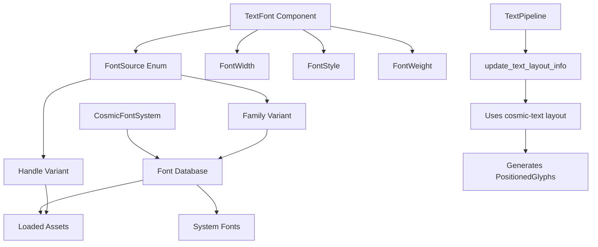

+++
title = "#22156 Minimal Font Families, Font Queries, Collections, System Fonts, Stretch, and Slant support"
date = "2026-01-03T00:00:00"
draft = false
template = "pull_request_page.html"
in_search_index = true

[taxonomies]
list_display = ["show"]

[extra]
current_language = "en"
available_languages = {"en" = { name = "English", url = "/pull_request/bevy/2026-01/pr-22156-en-20260103" }, "zh-cn" = { name = "中文", url = "/pull_request/bevy/2026-01/pr-22156-zh-cn-20260103" }}
labels = ["C-Feature", "M-Migration-Guide", "A-Text", "M-Release-Note"]
+++

# Title

## Basic Information
- **Title**: Minimal Font Families, Font Queries, Collections, System Fonts, Stretch, and Slant support
- **PR Link**: https://github.com/bevyengine/bevy/pull/22156
- **Author**: ickshonpe
- **Status**: MERGED
- **Labels**: C-Feature, S-Ready-For-Final-Review, M-Migration-Guide, A-Text, M-Release-Note
- **Created**: 2025-12-16T22:14:54Z
- **Merged**: 2026-01-03T23:03:06Z
- **Merged By**: alice-i-cecile

## Description Translation
# Objective

Implement support for the remaining missing text features with minimal changes.

## Solution

`TextFont` has been expanded to include new fields:
```rust
pub struct TextFont {
    pub font: FontSource,
    pub font_size: f32,
    pub weight: FontWeight,
    pub width: FontWidth,
    pub style: FontStyle,
    pub font_smoothing: FontSmoothing,
    pub font_features: FontFeatures,
}
```

FontSource has two variants: Handle, which identifies a font by asset handle, and Family, which selects a font by its family name.

`FontWidth` is a newtype struct representing OpenType font stretch classifications ranging from ULTRA_CONDENSED (50%) to ULTRA_EXPANDED (200%). 

`FontStyle` is an enum used to set the slant style of a font, either `Normal`, `Italic`, or `Oblique`.

The system font support is very barebones. You load them using the `CosmicFontSystem` resource:
```rust
font_system.db_mut().load_system_fonts()
```
Then they are available to be selected by family name using `FontSource::Family`.

### Other changes

* `TextPipelines`'s `glyph_info` field has been removed. There is no need to collect the section infos or perform any querys during text layout updates, so that code has been removed as well.

* `update_text_layout_info` used some `try_for_each` with some nested closures which was unnecessarily complicated again. They've been replaced with a regular for loop.

* After font assets are loaded there's a new system `load_font_assets_into_fontdb_system` that automatically adds them to cosmic text's font database. Then they are available to be looked up by family name as well as by asset handle.

* There aren't are performance motivated changes but layout updates seem to be overall significantly more efficient now, with a slight regression for very large numbers of short, single section text entities.

* Font texture atlases are no longer automatically cleared when the font asset they were generated from is removed. There is no way to remove individual fonts from cosmic text's `FontSystem`, so the font is still accessible using the family name with `FontSource::family` and removing the text atlases naively could cause a panic since rendering expects them to be present.

## Testing

```
cargo run --example font_query
```
---

## Showcase


## The Story of This Pull Request

### The Problem and Context
Bevy's text system had several limitations in its typographic capabilities. Developers could only reference fonts by their asset handles, which required loading font files as assets. This approach didn't support common typographic workflows like selecting fonts by family name, using system fonts, or applying font variations like stretch (width) and slant (italic/oblique). These limitations made it difficult to create flexible text rendering systems that could leverage the full capabilities of modern font libraries and operating systems.

The existing implementation was also more complex than necessary. The `TextPipeline` maintained a `glyph_info` vector and performed redundant queries during layout updates. Additionally, the automatic cleanup of font atlases when font assets were removed created issues because fonts could still be accessible through other means.

### The Solution Approach
The developer took a pragmatic approach to implement the missing features with minimal changes to the existing architecture. Rather than redesigning the entire text system, they extended the existing `TextFont` component to include the new typographic properties and introduced a `FontSource` enum to allow font selection by either asset handle or family name. This approach maintained backward compatibility while adding the new functionality.

The implementation leverages the underlying `cosmic-text` library's capabilities for font querying and selection. By integrating more closely with `cosmic-text`'s font database, Bevy can now support system fonts and font family queries without significant architectural changes.

### The Implementation
The core change is the expansion of the `TextFont` struct in `text.rs`:

```rust
// Before:
pub struct TextFont {
    pub font: Handle<Font>,
    pub font_size: f32,
    pub weight: FontWeight,
    pub font_smoothing: FontSmoothing,
    pub font_features: FontFeatures,
}

// After:
pub struct TextFont {
    pub font: FontSource,
    pub font_size: f32,
    pub weight: FontWeight,
    pub width: FontWidth,
    pub style: FontStyle,
    pub font_smoothing: FontSmoothing,
    pub font_features: FontFeatures,
}
```

The new `FontSource` enum provides two ways to specify a font:
```rust
pub enum FontSource {
    Handle(Handle<Font>),
    Family(SmolStr),
}
```

This change required updates throughout the codebase. The `TextPipeline` in `pipeline.rs` was refactored to handle both font source types. The key simplification was removing the `glyph_info` vector and the complex querying logic in `update_text_layout_info`. Instead of collecting font information through queries, the pipeline now extracts the necessary data directly from the layout glyphs provided by `cosmic-text`.

The font loading system was also enhanced. A new system `load_font_assets_into_fontdb_system` in `font.rs` automatically adds loaded font assets to `cosmic-text`'s font database, making them available for lookup by family name:

```rust
pub fn load_font_assets_into_fontdb_system(
    mut fonts: ResMut<Assets<Font>>,
    mut events: MessageReader<AssetEvent<Font>>,
    mut cosmic_font_system: ResMut<CosmicFontSystem>,
    mut text_block_query: Query<&mut ComputedTextBlock>,
) {
    // ... loads fonts into the font database
}
```

An important design decision was to stop automatically clearing font texture atlases when font assets are removed. Since `cosmic-text`'s font database doesn't provide a way to remove individual fonts, and fonts might still be accessible by family name, removing the atlases could cause panics during rendering when the system tries to access glyphs that are no longer available.

### Technical Insights
The implementation demonstrates several sound engineering practices:

1. **Progressive Enhancement**: The changes add functionality without breaking existing APIs. The `FontSource` enum implements `From<Handle<Font>>`, so existing code that passes a `Handle<Font>` to `TextFont` continues to work.

2. **Simplification through Removal**: The PR removes more code than it adds (234 lines removed vs. 167 added in `pipeline.rs`). By eliminating the `glyph_info` vector and simplifying the layout update logic, the code becomes more maintainable and performant.

3. **Leveraging Existing Infrastructure**: The implementation makes better use of `cosmic-text`'s capabilities, particularly its font database and layout system. This reduces the amount of custom font management code in Bevy.

4. **Performance Considerations**: The developer noted that layout updates are "overall significantly more efficient now" with only a slight regression for edge cases. This suggests the simplifications had a positive impact on performance for typical use cases.

5. **Migration Strategy**: The PR includes a migration guide that clearly explains the change from `Handle<Font>` to `FontSource` and provides simple migration instructions.

### The Impact
This PR significantly enhances Bevy's text rendering capabilities while simplifying the underlying implementation. Developers can now:
- Select fonts by family name in addition to asset handles
- Use system fonts (after loading them into the font database)
- Apply font stretch (width) variations from ultra-condensed to ultra-expanded
- Apply font slant styles (normal, italic, oblique)

The changes are backward compatible and come with clear migration instructions. The performance improvements in the layout system are a welcome bonus, and the codebase is now cleaner and more maintainable.

The new `font_query` example demonstrates all the new features in a practical context, showing how to use font weights, widths, and styles together.

## Visual Representation



## Key Files Changed

### `crates/bevy_text/src/text.rs` (+150/-12)
This file contains the core type definitions for the text system. The main changes are:

1. **New `FontSource` enum**: Replaces the direct `Handle<Font>` in `TextFont`.
```rust
pub enum FontSource {
    Handle(Handle<Font>),
    Family(SmolStr),
}
```

2. **Expanded `TextFont` struct**: Added `width` and `style` fields.
```rust
pub struct TextFont {
    pub font: FontSource,
    pub font_size: f32,
    pub weight: FontWeight,
    pub width: FontWidth,      // New field
    pub style: FontStyle,      // New field
    pub font_smoothing: FontSmoothing,
    pub font_features: FontFeatures,
}
```

3. **New `FontWidth` struct**: Represents OpenType font stretch classifications.
```rust
pub struct FontWidth(u16);
impl FontWidth {
    pub const ULTRA_CONDENSED: Self = Self(1);
    pub const EXTRA_CONDENSED: Self = Self(2);
    // ... other constants
}
```

4. **New `FontStyle` enum**: Represents font slant styles.
```rust
pub enum FontStyle {
    Normal,
    Italic,
    Oblique,
}
```

### `crates/bevy_text/src/pipeline.rs` (+167/-234)
The text pipeline was significantly refactored to support the new font features and simplify the layout logic:

1. **Removed `glyph_info` field**: The pipeline no longer needs to collect glyph information separately.
```rust
// Before:
pub struct TextPipeline {
    pub map_handle_to_font_id: HashMap<AssetId<Font>, (ID, Arc<str>)>,
    pub spans_buffer: Vec<...>,
    pub glyph_info: Vec<(AssetId<Font>, FontSmoothing, f32, f32, f32, f32, u16)>, // Removed
}

// After:
pub struct TextPipeline {
    pub map_handle_to_font_id: HashMap<AssetId<Font>, (ID, Arc<str>)>,
    pub spans_buffer: Vec<...>,
    // glyph_info removed
}
```

2. **Simplified `update_text_layout_info`**: The complex nested closure structure was replaced with straightforward for-loops.
```rust
// Before: Complex try_for_each with nested closures
let result = buffer.layout_runs().try_for_each(|run| {
    // ... complex logic
});

// After: Simple for loops
for run in buffer.layout_runs() {
    // ... clearer logic
    for layout_glyph in run.glyphs {
        // ... process each glyph
    }
}
```

3. **Updated font handling**: The pipeline now handles both `FontSource::Handle` and `FontSource::Family` variants.

### `crates/bevy_text/src/font.rs` (+44/-0)
Added a new system to load font assets into the font database:

```rust
pub fn load_font_assets_into_fontdb_system(
    mut fonts: ResMut<Assets<Font>>,
    mut events: MessageReader<AssetEvent<Font>>,
    mut cosmic_font_system: ResMut<CosmicFontSystem>,
    mut text_block_query: Query<&mut ComputedTextBlock>,
) {
    // Loads font assets into cosmic-text's font database
    // Marks text blocks for rerender when new fonts are added
}
```

### `examples/ui/font_query.rs` (+251/-0)
A new example demonstrating all the font features:

```rust
fn setup(mut commands: Commands, asset_server: Res<AssetServer>) {
    let family = FontSource::from(asset_server.load("fonts/MonaSans-VariableFont.ttf"));
    
    commands.spawn((
        // ... UI structure
        children![
            (
                Text::new("Font Weights, Widths & Styles"),
                TextFont {
                    font: family.clone(),
                    font_size: 32.0,
                    ..default()
                },
                Underline,
            ),
            // ... examples of weights, widths, and styles
        ]
    ));
}
```

### `crates/bevy_text/src/font_atlas_set.rs` (+0/-27)
Removed the system that automatically freed unused font atlases:

```rust
// This system was removed:
pub fn free_unused_font_atlases_system(
    mut font_atlas_sets: ResMut<FontAtlasSet>,
    mut font_events: MessageReader<AssetEvent<Font>>,
) {
    // ... cleaned up atlases when fonts were removed
}
```

## Further Reading

1. **OpenType Font Specifications**: The font stretch classifications follow the OpenType specification's `usWidthClass` values (https://docs.microsoft.com/en-us/typography/opentype/spec/os2#uswidthclass)

2. **Cosmic Text Documentation**: The underlying text layout library used by Bevy (https://github.com/pop-os/cosmic-text)

3. **Bevy Text Migration Guide**: For updating existing code to use the new `FontSource` type (included in the PR as `TextFont_font_is_now_a_FontSource.md`)

4. **Variable Fonts**: Understanding variable fonts and their axes (weight, width, slant) can help make the most of the new features (https://developer.mozilla.org/en-US/docs/Web/CSS/CSS_fonts/Variable_fonts_guide)

## Full Code Diff