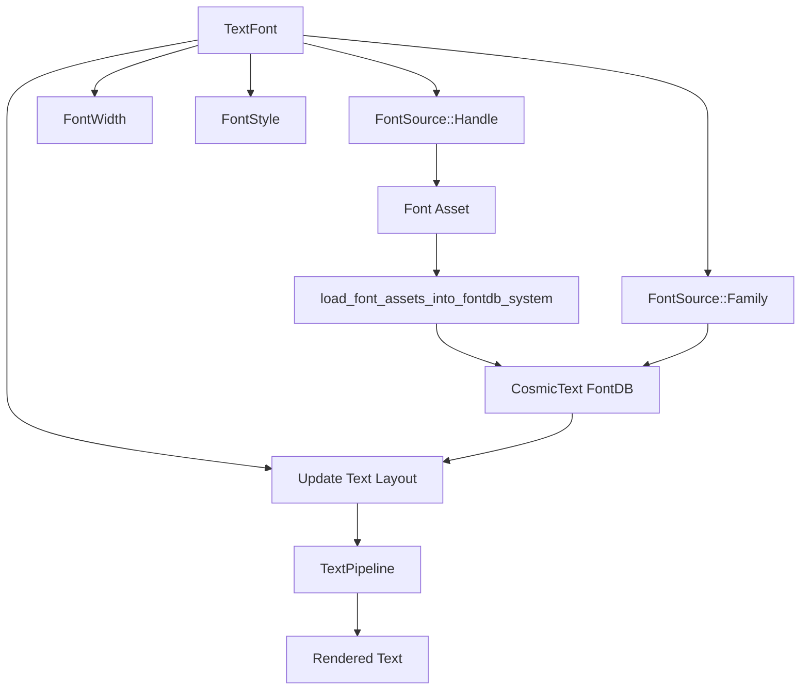

+++
title = "#22156 Minimal Font Families, Font Queries, Collections, System Fonts, Stretch, and Slant support"
date = "2026-01-03T00:00:00"
draft = false
template = "pull_request_page.html"
in_search_index = false

[extra]
current_language = "zh-cn"
available_languages = {"en" = { name = "English", url = "/pull_request/bevy/2026-01/pr-22156-en-20260103" }, "zh-cn" = { name = "中文", url = "/pull_request/bevy/2026-01/pr-22156-zh-cn-20260103" }}
+++

# Title

## 基本信息
- **标题**: Minimal Font Families, Font Queries, Collections, System Fonts, Stretch, and Slant support
- **PR 链接**: https://github.com/bevyengine/bevy/pull/22156
- **作者**: ickshonpe
- **状态**: 已合并
- **标签**: C-Feature, S-Ready-For-Final-Review, M-Migration-Guide, A-Text, M-Release-Note
- **创建时间**: 2025-12-16T22:14:54Z
- **合并时间**: 2026-01-03T23:03:06Z
- **合并者**: alice-i-cecile

## 描述翻译

### 目标
以最小的改动实现对剩余缺失文本功能的支持。

### 解决方案
`TextFont` 已扩展为包含新字段：
```rust
pub struct TextFont {
    pub font: FontSource,
    pub font_size: f32,
    pub weight: FontWeight,
    pub width: FontWidth,
    pub style: FontStyle,
    pub font_smoothing: FontSmoothing,
    pub font_features: FontFeatures,
}
```

FontSource 有两个变体：Handle（通过资源句柄标识字体）和 Family（通过字体族名称选择字体）。

`FontWidth` 是一个表示 OpenType 字体拉伸分类的新类型结构体，范围从 ULTRA_CONDENSED（50%）到 ULTRA_EXPANDED（200%）。

`FontStyle` 是一个用于设置字体倾斜样式的枚举，可以是 `Normal`、`Italic` 或 `Oblique`。

系统字体支持非常基础。你可以使用 `CosmicFontSystem` 资源加载它们：
```rust
font_system.db_mut().load_system_fonts()
```
然后就可以使用 `FontSource::Family` 通过族名称选择它们。

### 其他变更
* `TextPipelines` 的 `glyph_info` 字段已被移除。在文本布局更新期间，不再需要收集段落信息或执行任何查询，因此相关代码也被移除。

* `update_text_layout_info` 使用了一些嵌套闭包的 `try_for_each`，这变得不必要的复杂。它们已被替换为常规的 for 循环。

* 字体资源加载后，新增了一个系统 `load_font_assets_into_fontdb_system`，它会自动将它们添加到 cosmic text 的字体数据库中。然后这些字体既可以通过资源句柄查找，也可以通过族名称查找。

* 虽然没有基于性能的改动，但布局更新现在总体上似乎显著更高效，只是对于大量短的、单段文本实体有轻微的回归。

* 当生成字体纹理图集的字体资源被移除时，字体纹理图集不再自动清理。由于无法从 cosmic text 的 `FontSystem` 中移除单个字体，字体仍然可以通过 `FontSource::family` 使用族名称访问，而简单移除文本图集可能会导致渲染时因期望它们存在而发生恐慌。

### 测试
```
cargo run --example font_query
```

---

### 展示


## 本次 Pull Request 的故事

这个 PR 源于 Bevy 文本渲染系统需要补齐一系列高级字体特性的支持，包括字体族查询、字体集合、系统字体、字体宽度（stretch）和倾斜样式（slant）。之前，`TextFont` 结构体仅支持通过资源句柄引用字体、字号和字重，功能相对基础。

核心问题是，开发者在使用文本时，无法直接通过字体族名称选择字体，也无法指定字体的拉伸或倾斜样式。此外，系统字体的集成也缺失，用户只能加载特定的字体资源文件。这些限制使得创建灵活、动态的文本渲染变得困难。

为了解决这些问题，开发者选择了一种最小化的实现方式，在不破坏现有 API 的前提下扩展 `TextFont` 结构体。主要思路是引入一个新的 `FontSource` 枚举，它既可以包装现有的 `Handle<Font>`，也可以表示一个字体族名称字符串。同时，添加了 `FontWidth` 和 `FontStyle` 类型来支持字体拉伸和倾斜。

在实现层面，`crates/bevy_text/src/text.rs` 是改动最大的文件之一。这里定义了 `FontSource` 枚举及其 `From` trait 实现，确保了与现有代码的向后兼容性——现有的 `Handle<Font>` 可以无缝转换为 `FontSource::Handle`。`TextFont` 结构体新增了 `width` 和 `style` 字段，并修改了 `font` 字段的类型。

```rust
// 关键变化示例：FontSource 枚举
pub enum FontSource {
    Handle(Handle<Font>),
    Family(SmolStr),
}
```

另一个重大改动在 `crates/bevy_text/src/pipeline.rs`。这里移除了 `glyph_info` 字段及相关逻辑，因为在新的布局更新流程中，不再需要在文本布局阶段预先收集每个段落的字体度量信息。取而代之的是，在 `update_text_layout_info` 函数中，我们直接在遍历布局运行的每个字形（glyph）时，根据需要从字体系统获取度量信息并计算下划线和删除线的位置。这种按需计算的方式简化了流程，也移除了之前复杂的 `try_for_each` 链式调用，代之以更清晰的分层 for 循环。

```rust
// 旧逻辑（简化示意）
let result = buffer.layout_runs().try_for_each(|run| {
    // 复杂的闭包嵌套，收集信息并处理字形
});

// 新逻辑
for run in buffer.layout_runs() {
    for layout_glyph in run.glyphs {
        // 直接处理每个字形，需要时获取字体度量
        let metrics = font_system.get_font(...)?.as_swash().metrics(&[]);
        // ... 计算并处理
    }
}
```

技术实现上的一个关键点是字体资源的动态注册。新增的 `load_font_assets_into_fontdb_system` 系统（位于 `crates/bevy_text/src/font.rs`）会监听 `Font` 资产的添加事件，并将字体数据加载到 cosmic text 的底层 `fontdb` 中。这使得字体不仅可以通过其资源 ID 被引用，还可以通过其族名称被查找。这为实现 `FontSource::Family` 奠定了基础。

与此同时，`FontAtlasKey` 的定义也发生了变化。它的 `id` 字段从 `AssetId<Font>` 变成了 cosmic text 的 `fontdb::ID`。这是因为现在字体图集需要与字体在数据库中的内部 ID 关联，而不是与 Bevy 的资产 ID 关联。这导致了 `free_unused_font_atlases_system` 的移除，因为现在无法仅通过资产事件来安全地判断一个字体是否还在使用（它可能通过族名称被引用）。这是一个有意识的权衡，避免了潜在的运行时崩溃（渲染时缺少预期的图集），但代价是可能的内存泄漏。文档中明确指出了这一点。

性能方面，尽管 PR 描述提到没有专门的性能优化，但移除了 `glyph_info` 的收集和简化了布局更新逻辑，使得整体布局更新更高效。不过，对于大量非常短的文本实体，可能会有轻微的性能回归，这可能是由于新流程中更频繁的字体度量查询开销。

为了展示新功能，新增了一个示例 `examples/ui/font_query.rs`。它创建了一个 UI，展示了如何使用不同的字重（Weight）、宽度（Width）和样式（Style）来渲染文本。这个示例直观地验证了所有新字段的功能。

总的来说，这个 PR 通过精心设计的最小化改动，显著增强了 Bevy 文本系统的表达能力。它引入了现代字体渲染中常见的概念，同时保持了 API 的简洁性和向后兼容性。开发者现在可以更灵活地控制文本的外观，包括使用系统字体和查询字体族，这为构建更丰富的用户界面和文本渲染效果打开了大门。

## 视觉呈现



## 关键文件变更

### `crates/bevy_text/src/text.rs` (+150/-12)
这个文件是本次功能扩展的核心。它定义了新的数据类型并更新了 `TextFont` 结构体。

**主要变更：**
1. 引入了 `FontSource` 枚举，用于表示字体的两种来源：资源句柄或字体族名称。
2. 新增了 `FontWidth` 新类型结构体，封装了 OpenType 的宽度分类值（1-9）。
3. 新增了 `FontStyle` 枚举，表示字体的倾斜样式（Normal, Italic, Oblique）。
4. 更新了 `TextFont` 结构体，将 `font` 字段类型改为 `FontSource`，并新增了 `width` 和 `style` 字段。
5. 为 `FontSource`、`FontWidth` 和 `FontStyle` 提供了到 cosmic text 相应类型的 `From` trait 实现，确保它们能无缝集成到现有的文本布局管线中。

**关键代码片段：**
```rust
// FontSource 定义
pub enum FontSource {
    Handle(Handle<Font>),
    Family(SmolStr),
}

// TextFont 的新结构
pub struct TextFont {
    pub font: FontSource, // 从 Handle<Font> 改为 FontSource
    pub font_size: f32,
    pub weight: FontWeight,
    pub width: FontWidth, // 新增字段
    pub style: FontStyle, // 新增字段
    pub font_smoothing: FontSmoothing,
    pub font_features: FontFeatures,
}
```

### `crates/bevy_text/src/pipeline.rs` (+167/-234)
这个文件包含了文本布局管线的核心逻辑，进行了大规模重构以支持新特性并简化流程。

**主要变更：**
1. 移除了 `TextPipeline` 结构体中的 `glyph_info: Vec<(...)>` 字段。该字段之前用于在布局前收集每个文本段的字体度量信息。
2. 重构了 `update_text_layout_info` 函数。移除了 `text_font_query` 和 `scale_factor` 参数。现在字体的度量信息（如下划线位置）是在遍历布局字形时按需从 `font_system` 中查询和计算的。
3. 简化了布局运行（layout runs）和字形处理的逻辑，用清晰的 for 循环替换了之前复杂的 `try_for_each` 和嵌套闭包。
4. 更新了 `FontFaceInfo` 结构体，现在它只包含 `family_name`（一个 `SmolStr`），而不再包含 `stretch` 和 `style`。这些属性现在直接从 `TextFont` 的 `width` 和 `style` 字段获取。
5. 修改了 `load_font_to_fontdb` 函数的逻辑（实际上其功能被分散和整合），现在字体加载和 ID 映射的处理更直接。

**关键代码片段（展示逻辑简化）：**
```rust
// 旧代码（简化）：使用 try_for_each 和嵌套闭包
let result = buffer.layout_runs().try_for_each(|run| {
    run.glyphs.iter().map(...).try_for_each(|...| {
        // 处理每个字形，依赖预先收集的 glyph_info
    })
});

// 新代码：使用嵌套的 for 循环，逻辑更清晰
for run in buffer.layout_runs() {
    for layout_glyph in run.glyphs {
        // 直接查询字体度量
        let metrics = font_system.get_font(layout_glyph.font_id, layout_glyph.font_weight)?.as_swash().metrics(&[]);
        // ... 使用 metrics 进行计算
    }
}
```

### `examples/ui/font_query.rs` (+251/-0)
这是一个全新的示例文件，用于展示本次 PR 新增的字体查询功能。

**主要作用：**
1. 演示如何通过 `FontSource::Family` 使用字体族名称。
2. 展示 `FontWeight` 的所有可能取值（从 THIN 到 BLACK）。
3. 展示 `FontWidth` 的所有可能取值（从 ULTRA_CONDENSED 到 ULTRA_EXPANDED）。
4. 展示 `FontStyle` 的所有变体（Normal, Oblique, Italic）。

**关键代码片段：**
```rust
// 使用 FontSource::Family
TextFont {
    font: "Comic Sans MS".into(), // 字符串被转换为 FontSource::Family
    font_size: 67.0,
    ..default()
},

// 展示不同的 FontWidth
TextFont {
    font: family.clone(),
    width: FontWidth::ULTRA_CONDENSED,
    ..default()
},
```

### `crates/bevy_text/src/font.rs` (+44/-0)
这个文件新增了一个系统，用于将加载的字体资产注册到 cosmic text 的字体数据库中。

**主要变更：**
1. 在 `Font` 资产结构体中新增了 `ids: SmallVec<[ID; 8]>` 字段，用于存储该字体文件在 cosmic text 字体数据库中的内部 ID。
2. 新增了 `load_font_assets_into_fontdb_system` 系统。该系统监听 `AssetEvent::Added<Font>` 事件，将新添加的字体数据加载到 `CosmicFontSystem` 的数据库中，并将生成的 ID 存储回 `Font` 资产的 `ids` 字段。如果添加了新字体，它会标记所有现有的 `ComputedTextBlock` 需要重新渲染，以确保新字体立即可用。

**关键代码片段：**
```rust
pub fn load_font_assets_into_fontdb_system(
    mut fonts: ResMut<Assets<Font>>,
    mut events: MessageReader<AssetEvent<Font>>,
    mut cosmic_font_system: ResMut<CosmicFontSystem>,
    mut text_block_query: Query<&mut ComputedTextBlock>,
) {
    // ... 处理添加事件，加载字体到数据库
    font.ids = font_system.db_mut()
        .load_font_source(cosmic_text::fontdb::Source::Binary(data))
        .into_iter()
        .collect();
    // ... 标记需要重新渲染
}
```

### `crates/bevy_text/src/font_atlas_set.rs` (+44/-30)
这个文件管理字体纹理图集，其键类型和清理逻辑发生了变化。

**主要变更：**
1. `FontAtlasKey` 的 `id` 字段类型从 `AssetId<Font>` 更改为 `cosmic_text::fontdb::ID`。这是因为图集现在与字体在数据库中的内部 ID 关联，而不是 Bevy 资产 ID。
2. 移除了 `From<&TextFont> for FontAtlasKey` 的实现，因为现在构造键需要的信息不同。
3. 移除了 `free_unused_font_atlases_system` 系统。由于字体现在可以通过族名称持久化引用，无法再安全地根据资产移除事件来清理图集。这是为了优先保证渲染稳定性而做出的权衡。

**关键代码片段：**
```rust
// FontAtlasKey 的新定义
pub struct FontAtlasKey {
    pub id: ID, // 类型变了
    pub font_size_bits: u32,
    pub font_smoothing: FontSmoothing,
}
```

## 延伸阅读

* **cosmic-text 库**: 这是 Bevy 当前文本布局和渲染的后端。了解其 [fontdb](https://docs.rs/cosmic-text/latest/cosmic_text/fontdb/index.html) 模块有助于理解字体加载和查询机制。
* **OpenType 规范 - OS/2 表**: 了解 [`usWidthClass`](https://docs.microsoft.com/en-us/typography/opentype/spec/os2#uswidthclass) 有助于理解 `FontWidth` 值的含义和标准范围。
* **Bevy 官方示例 - UI**: 运行 `cargo run --example font_query` 和 `cargo run --example text` 来直观感受新功能。
* **Bevy 迁移指南**: 查看本次 PR 附带的迁移指南 `TextFont_font_is_now_a_FontSource.md`，了解现有代码的适配方法。