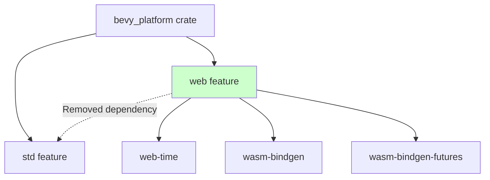

+++
title = "#22184 Removing a Problematic Feature Dependency to Fix no_std Builds"
date = "2026-01-29T00:00:00"
draft = false
template = "pull_request_page.html"
in_search_index = true

[taxonomies]
list_display = ["show"]

[extra]
current_language = "en"
available_languages = {"en" = { name = "English", url = "/pull_request/bevy/2026-01/pr-22184-en-20260129" }, "zh-cn" = { name = "中文", url = "/pull_request/bevy/2026-01/pr-22184-zh-cn-20260129" }}
labels = ["C-Bug", "O-Web", "P-Regression", "A-Utils", "D-Modest"]
+++

# Title: Removing a Problematic Feature Dependency to Fix no_std Builds

## Basic Information
- **Title**: Remove dependency from "bevy_platform/web" to "bevy_platform/std"
- **PR Link**: https://github.com/bevyengine/bevy/pull/22184
- **Author**: kpreid
- **Status**: MERGED
- **Labels**: C-Bug, O-Web, S-Ready-For-Final-Review, P-Regression, A-Utils, D-Modest
- **Created**: 2025-12-18T04:44:52Z
- **Merged**: 2026-01-28T23:41:09Z
- **Merged By**: alice-i-cecile

## Description Translation
# Objective

Fixes #22168.

## Solution

Remove dependency from "bevy_platform/web" to "bevy_platform/std", partially reverting #20369.

This PR was made per @alice-i-cecile 's suggestion https://github.com/bevyengine/bevy/issues/22168#issuecomment-3667179194. I am not familiar enough with Bevy internal dependencies to know if this is a wise change.

## Testing

- Manually tested that the `no_std` build described in the issue succeeds.
- Added a regression test in CI.
- Did not test whether this has any negative effects on actual web builds.

## The Story of This Pull Request

This PR addresses a regression introduced by PR #20369 that broke `no_std` builds when the `web` feature was enabled. The issue was straightforward: the `web` feature in `bevy_platform` was incorrectly depending on the `std` feature, making it impossible to build Bevy for `no_std` targets when web functionality was required.

The problem emerged because feature dependencies in Cargo.toml are additive. When a user tried to build Bevy with `--no-default-features --features default_no_std,web`, the build would fail because the `web` feature pulled in the `std` feature, which wasn't available in `no_std` environments. This was particularly problematic for developers targeting embedded systems or other `no_std` environments that might still need web-related functionality.

The solution was simple but required careful consideration: remove the `"std"` entry from the `web` feature's dependency list in `crates/bevy_platform/Cargo.toml`. This change partially reverts the problematic addition from PR #20369. The author acknowledged they weren't fully familiar with Bevy's internal dependencies but followed the suggestion from maintainer @alice-i-cecile.

The technical insight here is that feature dependencies need to respect the constraints of different target environments. The `web` feature provides browser API bindings and web-specific functionality, but these don't inherently require the standard library. WebAssembly (WASM) targets can use these features without `std`, as demonstrated by the fact that the actual web dependencies (`web-time`, `wasm-bindgen`, etc.) are themselves `no_std` compatible.

To prevent future regressions, the PR adds a CI test that builds with `--no-default-features --features default_no_std,web`. This test runs in the existing `check-compiles-no-std` job rather than creating a separate job, minimizing CI overhead since it can reuse the previous build artifacts. The comment in the workflow explains this optimization: "This is not a separate CI job because the added feature should mostly have no effect and be able to reuse the prior build."

The PR maintains backward compatibility for actual web builds while fixing the `no_std` case. The updated comment in Cargo.toml clarifies the feature's purpose: "Enables use of browser APIs if the build is a `wasm32` target." This makes it clear that the feature is target-specific rather than universally requiring `std`.

## Visual Representation



## Key Files Changed

### 1. `.github/workflows/ci.yml` (+5/-0)
**What changed and why**: Added a regression test to ensure the `web` feature doesn't break `no_std` builds. The test runs in the existing `check-compiles-no-std` job to minimize CI overhead.

```yaml
# File: .github/workflows/ci.yml
# Added lines:
      # Check for regression in "web" feature breaking no_std builds.
      # This is not a separate CI job because the added feature should mostly have no effect
      # and be able to reuse the prior build.
      - name: Check Compile with --features=web
        run: cargo check -p bevy --no-default-features --features default_no_std,web --target x86_64-unknown-none
```

### 2. `crates/bevy_platform/Cargo.toml` (+1/-3)
**What changed and why**: Removed the `"std"` dependency from the `web` feature definition. This fixes the regression where `no_std` builds failed when the `web` feature was enabled.

```toml
# File: crates/bevy_platform/Cargo.toml
# Before:
web = [
  "std",
  "dep:web-time",
  "dep:wasm-bindgen-futures",
  "dep:wasm-bindgen",
]

# After:
web = [
  "dep:web-time",
  "dep:wasm-bindgen-futures",
  "dep:wasm-bindgen",
]
```

The comment was also updated from "Note this is currently only applicable on `wasm32` architectures." to "Enables use of browser APIs if the build is a `wasm32` target." to better reflect the feature's conditional nature.

## Further Reading

1. **Cargo Features Documentation**: [The Cargo Book - Features](https://doc.rust-lang.org/cargo/reference/features.html) - Understanding how feature dependencies work in Rust
2. **no_std Programming in Rust**: [The Embedded Rust Book](https://docs.rust-embedded.org/book/intro/no-std.html) - Guide to writing `no_std` Rust applications
3. **WebAssembly and Rust**: [The Rust and WebAssembly Book](https://rustwasm.github.io/docs/book/) - Using Rust for WebAssembly targets
4. **Bevy's Platform Support**: [Bevy Documentation - Platforms](https://bevyengine.org/learn/book/getting-started/platforms/) - How Bevy handles different target platforms

# Full Code Diff
```diff
diff --git a/.github/workflows/ci.yml b/.github/workflows/ci.yml
index 6158060c0299a..8cff3eeb221a7 100644
--- a/.github/workflows/ci.yml
+++ b/.github/workflows/ci.yml
@@ -179,6 +179,11 @@ jobs:
         uses: ./.github/actions/install-linux-deps
       - name: Check Compile
         run: cargo check -p bevy --no-default-features --features default_no_std --target x86_64-unknown-none
+      # Check for regression in "web" feature breaking no_std builds.
+      # This is not a separate CI job because the added feature should mostly have no effect
+      # and be able to reuse the prior build.
+      - name: Check Compile with --features=web
+        run: cargo check -p bevy --no-default-features --features default_no_std,web --target x86_64-unknown-none
 
   check-compiles-no-std-portable-atomic:
     runs-on: ubuntu-latest
diff --git a/crates/bevy_platform/Cargo.toml b/crates/bevy_platform/Cargo.toml
index e17d5a4bc0c72..6b70808c1f9eb 100644
--- a/crates/bevy_platform/Cargo.toml
+++ b/crates/bevy_platform/Cargo.toml
@@ -45,10 +45,8 @@ alloc = ["portable-atomic-util/alloc", "dep:hashbrown", "serde?/alloc"]
 ## on all platforms, including `no_std`.
 critical-section = ["dep:critical-section", "portable-atomic/critical-section"]
 
-## Enables use of browser APIs.
-## Note this is currently only applicable on `wasm32` architectures.
+## Enables use of browser APIs if the build is a `wasm32` target.
 web = [
-  "std",
   "dep:web-time",
   "dep:wasm-bindgen-futures",
   "dep:wasm-bindgen",
```