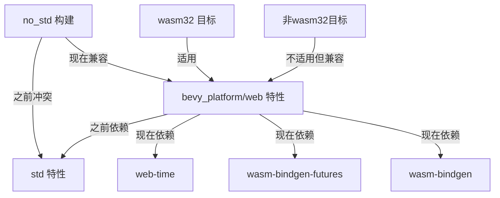

+++
title = "#22184 Remove dependency from \"bevy_platform/web\" to \"bevy_platform/std\""
date = "2026-01-29T00:00:00"
draft = false
template = "pull_request_page.html"
in_search_index = false

[extra]
current_language = "zh-cn"
available_languages = {"en" = { name = "English", url = "/pull_request/bevy/2026-01/pr-22184-en-20260129" }, "zh-cn" = { name = "中文", url = "/pull_request/bevy/2026-01/pr-22184-zh-cn-20260129" }}
+++

# Title
移除 "bevy_platform/web" 对 "bevy_platform/std" 的依赖

## 基本信息
- **标题**: Remove dependency from "bevy_platform/web" to "bevy_platform/std"
- **PR链接**: https://github.com/bevyengine/bevy/pull/22184
- **作者**: kpreid
- **状态**: 已合并
- **标签**: C-Bug, O-Web, S-Ready-For-Final-Review, P-Regression, A-Utils, D-Modest
- **创建时间**: 2025-12-18T04:44:52Z
- **合并时间**: 2026-01-28T23:41:09Z
- **合并者**: alice-i-cecile

## 描述翻译
### 目标
修复 #22168。

### 解决方案
移除 "bevy_platform/web" 对 "bevy_platform/std" 的依赖，部分撤销 #20369 的变更。

这个PR是按照 @alice-i-cecile 的建议 https://github.com/bevyengine/bevy/issues/22168#issuecomment-3667179194 创建的。我对Bevy的内部依赖关系不够熟悉，无法判断这是否是一个明智的更改。

### 测试
- 手动测试了issue中描述的 `no_std` 构建能够成功。
- 在CI中添加了回归测试。
- 未测试这是否会对实际的web构建产生任何负面影响。

## 这个Pull Request的故事

这个PR解决了一个依赖关系问题，这个问题导致特定构建配置失败。问题出现在当开发者尝试使用 `no_std` 模式构建Bevy时，如果同时启用了 `web` 特性，构建就会失败。

问题的根源可以追溯到PR #20369，该PR将 `std` 特性添加到了 `web` 特性的依赖中。这个变更的意图可能是确保web构建能够访问标准库功能，但副作用是破坏了 `no_std` 构建场景。因为 `no_std` 构建明确避免使用标准库，而 `web` 特性现在强制依赖 `std`，这就产生了冲突。

从技术角度看，`bevy_platform` crate 的特性设计允许组合不同的构建目标。`web` 特性本应是针对 `wasm32` 架构的，但它对 `std` 的依赖意味着即使在非wasm32目标上，只要启用了 `web` 特性，就会引入标准库依赖。这违背了 `no_std` 构建的基本原则。

作者kpreid采用了直接的解决方案：从 `web` 特性的依赖列表中移除 `std`。这是一个谨慎的更改，因为它部分撤销了之前的变更，但解决了实际的构建问题。同时，作者更新了注释以澄清 `web` 特性仅适用于 `wasm32` 目标。

这个解决方案体现了软件工程中的一个重要原则：保持特性的正交性。特性之间应该尽可能独立，避免不必要的依赖链。在构建系统配置中，这种独立性尤为重要，因为它允许开发者组合不同的构建选项而不会遇到意外的冲突。

在实现方面，变更很小但影响显著。主要修改发生在 `crates/bevy_platform/Cargo.toml` 中，只是从 `web` 特性的依赖数组中移除了 `"std"` 这一行。然而，为了确保这个问题不会再次出现，作者还在CI配置中添加了回归测试。这个测试会验证在 `no_std` 构建中启用 `web` 特性时，构建仍然能够成功。

从工程角度看，这个PR展示了如何处理回归问题：识别问题根源，实施最小化的修复，然后添加测试以防止未来再次发生。虽然变更很小，但它解决了实际用户的构建问题，并且通过CI测试确保了长期稳定性。

## 可视化表示



## 关键文件变更

### 1. `.github/workflows/ci.yml` (+5/-0)
**变更描述**: 添加了回归测试，确保 `web` 特性不会破坏 `no_std` 构建。

**代码变更**:
```yaml
# 在已有的 "check-compiles-no-std" job 中添加
- name: Check Compile with --features=web
  run: cargo check -p bevy --no-default-features --features default_no_std,web --target x86_64-unknown-none
```

**关联性**: 这个测试验证了修复的有效性，确保未来不会再次出现相同的回归问题。测试设计很巧妙，它重用了之前的构建环境，只是添加了 `web` 特性进行检查。

### 2. `crates/bevy_platform/Cargo.toml` (+1/-3)
**变更描述**: 从 `web` 特性中移除对 `std` 特性的依赖，并更新注释。

**代码变更**:
```toml
# 之前:
## Enables use of browser APIs.
## Note this is currently only applicable on `wasm32` architectures.
web = [
  "std",
  "dep:web-time",
  "dep:wasm-bindgen-futures",
  "dep:wasm-bindgen",
]

# 之后:
## Enables use of browser APIs if the build is a `wasm32` target.
web = [
  "dep:web-time",
  "dep:wasm-bindgen-futures",
  "dep:wasm-bindgen",
]
```

**关联性**: 这是核心修复。移除 `"std"` 依赖解决了构建冲突问题，更新注释更准确地描述了 `web` 特性的适用范围。

## 延伸阅读

1. **Rust Cargo特性系统**: 了解Rust中特性的工作原理和最佳实践
2. **no_std编程**: 学习在嵌入式系统和其他受限环境中使用Rust
3. **Wasm和WebAssembly**: 了解如何在web环境中使用Rust
4. **Bevy引擎架构**: 深入了解Bevy引擎的模块化设计
5. **回归测试**: 学习如何编写有效的回归测试以防止问题复现

# 完整代码差异
```diff
diff --git a/.github/workflows/ci.yml b/.github/workflows/ci.yml
index 6158060c0299a..8cff3eeb221a7 100644
--- a/.github/workflows/ci.yml
+++ b/.github/workflows/ci.yml
@@ -179,6 +179,11 @@ jobs:
         uses: ./.github/actions/install-linux-deps
       - name: Check Compile
         run: cargo check -p bevy --no-default-features --features default_no_std --target x86_64-unknown-none
+      # Check for regression in "web" feature breaking no_std builds.
+      # This is not a separate CI job because the added feature should mostly have no effect
+      # and be able to reuse the prior build.
+      - name: Check Compile with --features=web
+        run: cargo check -p bevy --no-default-features --features default_no_std,web --target x86_64-unknown-none
 
   check-compiles-no-std-portable-atomic:
     runs-on: ubuntu-latest
diff --git a/crates/bevy_platform/Cargo.toml b/crates/bevy_platform/Cargo.toml
index e17d5a4bc0c72..6b70808c1f9eb 100644
--- a/crates/bevy_platform/Cargo.toml
+++ b/crates/bevy_platform/Cargo.toml
@@ -45,10 +45,8 @@ alloc = ["portable-atomic-util/alloc", "dep:hashbrown", "serde?/alloc"]
 ## on all platforms, including `no_std`.
 critical-section = ["dep:critical-section", "portable-atomic/critical-section"]
 
-## Enables use of browser APIs.
-## Note this is currently only applicable on `wasm32` architectures.
+## Enables use of browser APIs if the build is a `wasm32` target.
 web = [
-  "std",
   "dep:web-time",
   "dep:wasm-bindgen-futures",
   "dep:wasm-bindgen",
```