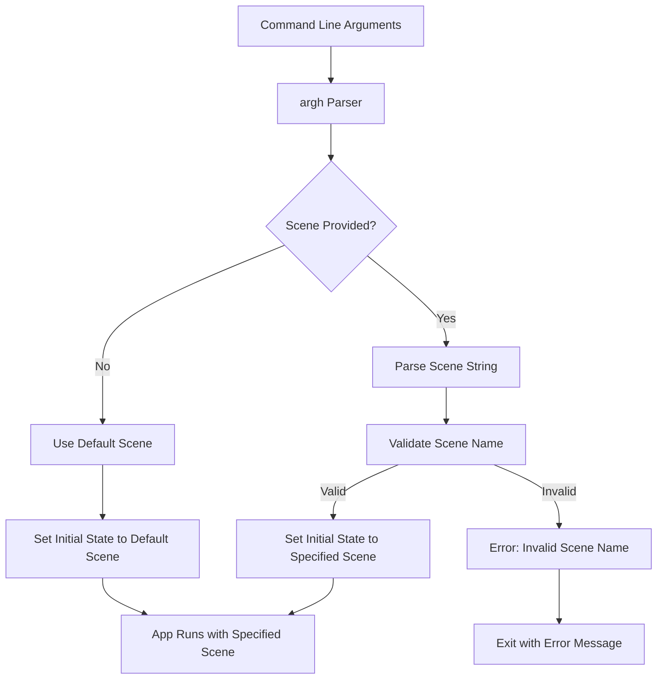

+++
title = "#22223 Add command line option to choose a starting scene in the `testbed_*' examples"
date = "2026-01-01T00:00:00"
draft = false
template = "pull_request_page.html"
in_search_index = true

[taxonomies]
list_display = ["show"]

[extra]
current_language = "en"
available_languages = {"en" = { name = "English", url = "/pull_request/bevy/2026-01/pr-22223-en-20260101" }, "zh-cn" = { name = "中文", url = "/pull_request/bevy/2026-01/pr-22223-zh-cn-20260101" }}
labels = ["C-Testing"]
+++

# Title

## Basic Information
- **Title**: Add command line option to choose a starting scene in the `testbed_*' examples
- **PR Link**: https://github.com/bevyengine/bevy/pull/22223
- **Author**: panpanpro888
- **Status**: MERGED
- **Labels**: S-Ready-For-Final-Review, C-Testing
- **Created**: 2025-12-21T18:17:17Z
- **Merged**: 2025-12-31T23:23:39Z
- **Merged By**: alice-i-cecile

## Description Translation

# Objective

- Fixes #22218

## Solution

- Use `argh` to check if you passed a scene name, and if you did, start on that one instead of the default

## Testing

- Tested on my local machine, I don't see a reason why it would change between different machines and/or platforms


## The Story of This Pull Request

The Bevy testbed examples are useful tools for developers to understand and experiment with different rendering features and scenes. However, before this PR, there was a limitation in how these examples were used. Each testbed example (2D, 3D, and UI) would always start with a default scene, and users had to manually cycle through scenes using keyboard input during runtime to reach specific scenes they wanted to test or examine.

This was inconvenient for several reasons. First, developers working on specific features needed to manually navigate to the relevant scene every time they ran the example. Second, automated testing or demonstration workflows couldn't easily start at a particular scene without simulating user input. The issue #22218 specifically addressed this limitation by requesting a command-line interface to specify which scene to start with.

The solution implemented in this PR is straightforward and consistent with Bevy's existing command-line parsing approach. Bevy already uses the `argh` crate for command-line argument parsing in other parts of the codebase, so the author chose to leverage this existing dependency rather than introducing a new one. This maintains consistency and minimizes dependencies.

The implementation follows a clear pattern across all three testbed examples (2D, 3D, and UI). Each example file receives the same set of modifications. First, an `Args` struct is defined using `argh`'s `FromArgs` derive macro to parse command-line arguments. This struct contains a single optional positional argument for the scene name.

The core of the change involves restructuring how the application's initial state is set. Previously, each example would unconditionally call `app.init_state::<Scene>()` during app construction, which initializes the state to the `Scene` enum's default variant. The new approach parses command-line arguments first, then conditionally sets the initial state based on whether a scene was specified.

Here's the key logic:

```rust
match args.scene {
    None => app.init_state::<Scene>(),
    Some(scene) => app.insert_state(scene),
};
```

When no scene argument is provided, the behavior remains unchanged - `init_state` sets the default scene. When a scene is specified, `insert_state` sets that specific scene as the initial state. This maintains backward compatibility while adding the new functionality.

A critical technical component is the implementation of `std::str::FromStr` for each `Scene` enum. This allows `argh` to parse string arguments into the corresponding enum variants. The implementation handles case-insensitive matching by converting both the input string and the formatted enum variant to lowercase. It also validates the input by cycling through all possible scenes using the existing `Next` trait implementation. If the input doesn't match any scene after a full cycle, it returns an error.

The `FromStr` implementation uses a clever approach that leverages the existing `Next` trait to iterate through all possible scenes. This ensures that the implementation automatically stays in sync if new scenes are added to the enum. The implementation starts from the default scene and iterates through each next scene until it either finds a match or completes a full cycle back to the default.

This PR demonstrates good software engineering practices. It solves a real usability problem with minimal code changes. The solution is consistent across all three affected examples, making maintenance easier. It leverages existing Bevy patterns and dependencies rather than introducing new ones. The implementation is robust, handling edge cases like invalid scene names with appropriate error messages.

The changes have clear practical benefits. Developers can now run specific test scenes directly from the command line, which streamlines development and testing workflows. For example, a developer working on bloom effects in 3D rendering can now run `cargo run --example testbed_3d -- bloom` to immediately start with the bloom scene rather than manually navigating to it.

## Visual Representation



## Key Files Changed

### `examples/testbed/2d.rs` (+30/-1)
**Changes**: Added command-line argument parsing to allow specifying which 2D test scene to start with.

**Key Code Snippets**:
```rust
// Before (partial):
fn main() {
    let mut app = App::new();
    app.add_plugins((DefaultPlugins,))
        .init_state::<Scene>()  // Always initialize to default scene
        // ... other setup

// After (partial):
#[derive(FromArgs)]
/// 2d testbed
pub struct Args {
    #[argh(positional)]
    scene: Option<Scene>,
}

fn main() {
    let args: Args = argh::from_env();  // Parse command-line arguments
    
    let mut app = App::new();
    app.add_plugins((DefaultPlugins,))
        // Removed init_state from here
    
    // Conditional state initialization
    match args.scene {
        None => app.init_state::<Scene>(),      // Default behavior
        Some(scene) => app.insert_state(scene), // Use specified scene
    };
```

### `examples/testbed/3d.rs` (+30/-1)
**Changes**: Added identical command-line argument parsing for 3D test scenes.

**Key Code Snippets**:
```rust
// Scene parsing implementation (identical pattern to 2D.rs):
impl std::str::FromStr for Scene {
    type Err = String;

    fn from_str(s: &str) -> std::result::Result<Self, Self::Err> {
        let mut isit = Self::default();
        while s.to_lowercase() != format!("{isit:?}").to_lowercase() {
            isit = isit.next();
            if isit == Self::default() {
                return Err(format!("Invalid Scene name: {s}"));
            }
        }
        Ok(isit)
    }
}
```

### `examples/testbed/ui.rs` (+30/-1)
**Changes**: Added identical command-line argument parsing for UI test scenes.

**Key Code Snippets**:
```rust
// The same pattern is applied consistently:
#[derive(FromArgs)]
/// ui testbed
pub struct Args {
    #[argh(positional)]
    scene: Option<Scene>,
}

fn main() {
    let args: Args = argh::from_env();
    
    // ... app setup without init_state
    
    match args.scene {
        None => app.init_state::<Scene>(),
        Some(scene) => app.insert_state(scene),
    };
```

## Further Reading

1. **Bevy States Documentation**: Understanding Bevy's state management system is crucial for working with scenes. The official Bevy documentation covers states in detail: https://bevyengine.org/learn/book/next/programming/states/

2. **argh Crate**: The command-line argument parser used in this PR. Documentation available at: https://docs.rs/argh

3. **FromStr Trait**: Rust's standard library trait for parsing strings. Official documentation: https://doc.rust-lang.org/std/str/trait.FromStr.html

4. **Bevy Testbed Examples**: To understand the context of these changes, examine the existing testbed examples in the Bevy repository to see how different scenes are implemented and structured.

# Full Code Diff
diff --git a/examples/testbed/2d.rs b/examples/testbed/2d.rs
index 1751e0f152a2f..d535147704425 100644
--- a/examples/testbed/2d.rs
+++ b/examples/testbed/2d.rs
@@ -4,13 +4,22 @@
 
 mod helpers;
 
+use argh::FromArgs;
 use bevy::prelude::*;
 use helpers::Next;
 
+#[derive(FromArgs)]
+/// 2d testbed
+pub struct Args {
+    #[argh(positional)]
+    scene: Option<Scene>,
+}
+
 fn main() {
+    let args: Args = argh::from_env();
+
     let mut app = App::new();
     app.add_plugins((DefaultPlugins,))
-        .init_state::<Scene>()
         .add_systems(OnEnter(Scene::Shapes), shapes::setup)
         .add_systems(OnEnter(Scene::Bloom), bloom::setup)
         .add_systems(OnEnter(Scene::Text), text::setup)
@@ -20,6 +29,11 @@ fn main() {
         .add_systems(Update, switch_scene)
         .add_systems(Update, gizmos::draw_gizmos.run_if(in_state(Scene::Gizmos)));
 
+    match args.scene {
+        None => app.init_state::<Scene>(),
+        Some(scene) => app.insert_state(scene),
+    };
+
     #[cfg(feature = "bevy_ci_testing")]
     app.add_systems(Update, helpers::switch_scene_in_ci::<Scene>);
 
@@ -37,6 +51,21 @@ enum Scene {
     Gizmos,
 }
 
+impl std::str::FromStr for Scene {
+    type Err = String;
+
+    fn from_str(s: &str) -> std::result::Result<Self, Self::Err> {
+        let mut isit = Self::default();
+        while s.to_lowercase() != format!("{isit:?}").to_lowercase() {
+            isit = isit.next();
+            if isit == Self::default() {
+                return Err(format!("Invalid Scene name: {s}"));
+            }
+        }
+        Ok(isit)
+    }
+}
+
 impl Next for Scene {
     fn next(&self) -> Self {
         match self {
diff --git a/examples/testbed/3d.rs b/examples/testbed/3d.rs
index 64183894865e0..da94d773e2da8 100644
--- a/examples/testbed/3d.rs
+++ b/examples/testbed/3d.rs
@@ -4,13 +4,22 @@
 
 mod helpers;
 
+use argh::FromArgs;
 use bevy::prelude::*;
 use helpers::Next;
 
+#[derive(FromArgs)]
+/// 3d testbed
+pub struct Args {
+    #[argh(positional)]
+    scene: Option<Scene>,
+}
+
 fn main() {
+    let args: Args = argh::from_env();
+
     let mut app = App::new();
     app.add_plugins((DefaultPlugins,))
-        .init_state::<Scene>()
         .add_systems(OnEnter(Scene::Light), light::setup)
         .add_systems(OnEnter(Scene::Bloom), bloom::setup)
         .add_systems(OnEnter(Scene::Gltf), gltf::setup)
@@ -28,6 +37,11 @@ fn main() {
                 .run_if(in_state(Scene::GltfCoordinateConversion)),
         );
 
+    match args.scene {
+        None => app.init_state::<Scene>(),
+        Some(scene) => app.insert_state(scene),
+    };
+
     #[cfg(feature = "bevy_ci_testing")]
     app.add_systems(Update, helpers::switch_scene_in_ci::<Scene>);
 
@@ -45,6 +59,21 @@ enum Scene {
     GltfCoordinateConversion,
 }
 
+impl std::str::FromStr for Scene {
+    type Err = String;
+
+    fn from_str(s: &str) -> std::result::Result<Self, Self::Err> {
+        let mut isit = Self::default();
+        while s.to_lowercase() != format!("{isit:?}").to_lowercase() {
+            isit = isit.next();
+            if isit == Self::default() {
+                return Err(format!("Invalid Scene name: {s}"));
+            }
+        }
+        Ok(isit)
+    }
+}
+
 impl Next for Scene {
     fn next(&self) -> Self {
         match self {
diff --git a/examples/testbed/ui.rs b/examples/testbed/ui.rs
index edba5ce0803bc..3776d0814e549 100644
--- a/examples/testbed/ui.rs
+++ b/examples/testbed/ui.rs
@@ -4,10 +4,20 @@
 
 mod helpers;
 
+use argh::FromArgs;
 use bevy::prelude::*;
 use helpers::Next;
 
+#[derive(FromArgs)]
+/// ui testbed
+pub struct Args {
+    #[argh(positional)]
+    scene: Option<Scene>,
+}
+
 fn main() {
+    let args: Args = argh::from_env();
+
     let mut app = App::new();
     app.add_plugins(DefaultPlugins.set(WindowPlugin {
         primary_window: Some(Window {
@@ -19,7 +29,6 @@ fn main() {
         }),
         ..Default::default()
     }))
-    .init_state::<Scene>()
     .add_systems(OnEnter(Scene::Image), image::setup)
     .add_systems(OnEnter(Scene::Text), text::setup)
     .add_systems(OnEnter(Scene::Grid), grid::setup)
@@ -35,6 +44,11 @@ fn main() {
     .add_systems(OnEnter(Scene::ViewportCoords), viewport_coords::setup)
     .add_systems(Update, switch_scene);
 
+    match args.scene {
+        None => app.init_state::<Scene>(),
+        Some(scene) => app.insert_state(scene),
+    };
+
     #[cfg(feature = "bevy_ui_debug")]
     {
         app.add_systems(OnEnter(Scene::DebugOutlines), debug_outlines::setup);
@@ -68,6 +82,21 @@ enum Scene {
     ViewportCoords,
 }
 
+impl std::str::FromStr for Scene {
+    type Err = String;
+
+    fn from_str(s: &str) -> Result<Self, Self::Err> {
+        let mut isit = Self::default();
+        while s.to_lowercase() != format!("{isit:?}").to_lowercase() {
+            isit = isit.next();
+            if isit == Self::default() {
+                return Err(format!("Invalid Scene name: {s}"));
+            }
+        }
+        Ok(isit)
+    }
+}
+
 impl Next for Scene {
     fn next(&self) -> Self {
         match self {