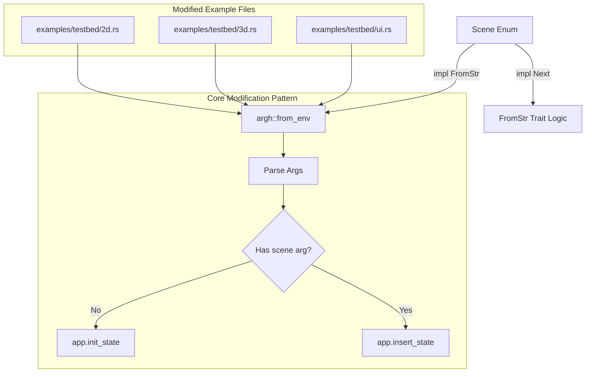

+++
title = "#22223 Add command line option to choose a starting scene in the `testbed_*' examples"
date = "2026-01-01T00:00:00"
draft = false
template = "pull_request_page.html"
in_search_index = false

[extra]
current_language = "zh-cn"
available_languages = {"en" = { name = "English", url = "/pull_request/bevy/2026-01/pr-22223-en-20260101" }, "zh-cn" = { name = "中文", url = "/pull_request/bevy/2026-01/pr-22223-zh-cn-20260101" }}
labels = ["C-Testing"]
+++

# Title

## Basic Information
- **Title**: Add command line option to choose a starting scene in the `testbed_*' examples
- **PR Link**: https://github.com/bevyengine/bevy/pull/22223
- **Author**: panpanpro888
- **Status**: MERGED
- **Labels**: S-Ready-For-Final-Review, C-Testing
- **Created**: 2025-12-21T18:17:17Z
- **Merged**: 2025-12-31T23:23:39Z
- **Merged By**: alice-i-cecile

## Description Translation
### 目标
- 修复 #22218

### 解决方案
- 使用 `argh` 来检查是否传入了一个场景名，如果传入了，就从该场景开始而不是默认场景。

### 测试
- 已在本地机器上测试，我认为没有理由会因不同机器和/或平台而改变。

## The Story of This Pull Request

这个PR源于一个实际使用中的痛点。Bevy的`testbed_2d`、`testbed_3d`和`testbed_ui`示例是非常有用的工具，它们将多个独立的图形或UI测试场景集成在一个可执行文件中，方便开发者通过按键循环切换来查看不同功能的效果。然而，当开发者只想快速验证或调试某一个特定场景时，就必须手动按键切换，直到找到目标场景。这个过程在场景数量较多时（如`testbed_ui`有15个场景）显得效率低下。

该PR的解决方案是给这些示例添加一个可选的命令行参数，允许用户直接指定启动时要进入的场景。实现方式简洁而直接：引入了`argh`这个轻量级命令行参数解析库。首先，定义一个`Args`结构体来声明期望接收的参数，其中包含一个可选的`scene`字段，它是一个`Scene`枚举类型。

```rust
#[derive(FromArgs)]
/// 3d testbed
pub struct Args {
    #[argh(positional)]
    scene: Option<Scene>,
}
```

在`main`函数中，首先通过`argh::from_env()`解析命令行参数。随后，核心逻辑在于应用（`App`）初始状态（State）的设置方式发生了变化。修改前，代码总是调用`.init_state::<Scene>()`，这会将`Scene`枚举的第一个变体（由`Default`实现决定）设置为初始状态。

```rust
// 修改前（在添加插件后）：
app.add_plugins((DefaultPlugins,))
    .init_state::<Scene>()
```

修改后，这一行被移除了，取而代之的是一个`match`表达式。这个表达式根据解析到的命令行参数做出决策：如果用户没有提供场景名（`args.scene`为`None`），则保持原有行为，调用`.init_state::<Scene>()`，使用默认场景启动。这是为了保持向后兼容性，确保不传参数时程序行为不变。如果用户提供了有效的场景名（`Some(scene)`），则调用`.insert_state(scene)`，直接将用户指定的场景设置为应用的初始状态。

```rust
// 修改后的逻辑：
match args.scene {
    None => app.init_state::<Scene>(),
    Some(scene) => app.insert_state(scene),
};
```

为了使`argh`能够将用户输入的字符串（如`"Bloom"`）解析为`Scene`枚举，需要为`Scene`实现`std::str::FromStr` trait。这里的实现方式比较巧妙，它利用了`Scene`枚举已经存在的`Next` trait（该trait定义了`next`方法用于在场景间循环）和`Default` trait。

```rust
impl std::str::FromStr for Scene {
    type Err = String;

    fn from_str(s: &str) -> std::result::Result<Self, Self::Err> {
        let mut isit = Self::default(); // 从默认场景开始
        while s.to_lowercase() != format!("{isit:?}").to_lowercase() { // 不区分大小写比较
            isit = isit.next(); // 尝试下一个场景
            if isit == Self::default() { // 如果回到了起点，说明没有匹配项
                return Err(format!("Invalid Scene name: {s}"));
            }
        }
        Ok(isit)
    }
}
```

这个实现通过遍历所有可能的场景值来查找匹配项，而不是维护一个静态的字符串到枚举的映射表。这样做的好处是，当未来有新的场景被添加到枚举中时，解析逻辑无需修改即可自动支持，提高了代码的可维护性。遍历的终止条件是回到`default()`起点，这意味着我们完整地遍历了一圈。

整个实现的改动模式在`2d.rs`、`3d.rs`和`ui.rs`三个文件中完全一致，体现了良好的模块化和代码复用性。这是一个典型的小而美的增强功能：它没有改变程序的核心架构，只是增加了一个外围的配置入口，就显著提升了开发者的日常工作效率。它也是Bevy生态中灵活使用状态管理和命令行工具的一个清晰示例。

## Visual Representation



## Key Files Changed

### 1. `examples/testbed/2d.rs` (+30/-1)
- **变化描述**：为2D测试床示例添加命令行场景选择功能。
- **关键修改**：
    1. 导入`argh`并定义`Args`结构体。
    2. 在`main`函数中解析参数，并根据参数决定初始状态设置方式。
    3. 为`Scene`枚举实现`FromStr` trait以支持从字符串解析。

```rust
// 代码片段示例：main函数的核心变更逻辑
fn main() {
    let args: Args = argh::from_env(); // 新增：解析命令行
    let mut app = App::new();
    app.add_plugins((DefaultPlugins,))
        // .init_state::<Scene>() // 被删除：统一的状态初始化被移除
        // ... 其他系统添加

    // 新增：根据命令行参数决定如何设置初始状态
    match args.scene {
        None => app.init_state::<Scene>(),
        Some(scene) => app.insert_state(scene),
    };
    // ...
}
```

### 2. `examples/testbed/3d.rs` (+30/-1)
- **变化描述**：为3D测试床示例添加命令行场景选择功能。修改模式与`2d.rs`完全相同。

### 3. `examples/testbed/ui.rs` (+30/-1)
- **变化描述**：为UI测试床示例添加命令行场景选择功能。修改模式与`2d.rs`完全相同，唯一的区别是它配置了特定的`WindowPlugin`。

**与整体目标的关系**：这三个文件的并行修改是本次PR的核心，它们共同解决了在三个不同领域的示例中快速跳转到指定场景的需求。

## Further Reading
1.  **`argh` Crate 文档**: 了解这个简单、符合人体工学的命令行参数解析器的使用方法。 (`https://docs.rs/argh`)
2.  **Bevy States 官方指南**: 深入理解Bevy的状态（State）管理机制，包括`init_state`和`insert_state`的区别与应用场景。 (`https://bevy-cheatbook.github.io/programming/states.html`)
3.  **Rust `std::str::FromStr` Trait 文档**: 学习如何为自己的类型实现从字符串解析的标准方法。 (`https://doc.rust-lang.org/std/str/trait.FromStr.html`)