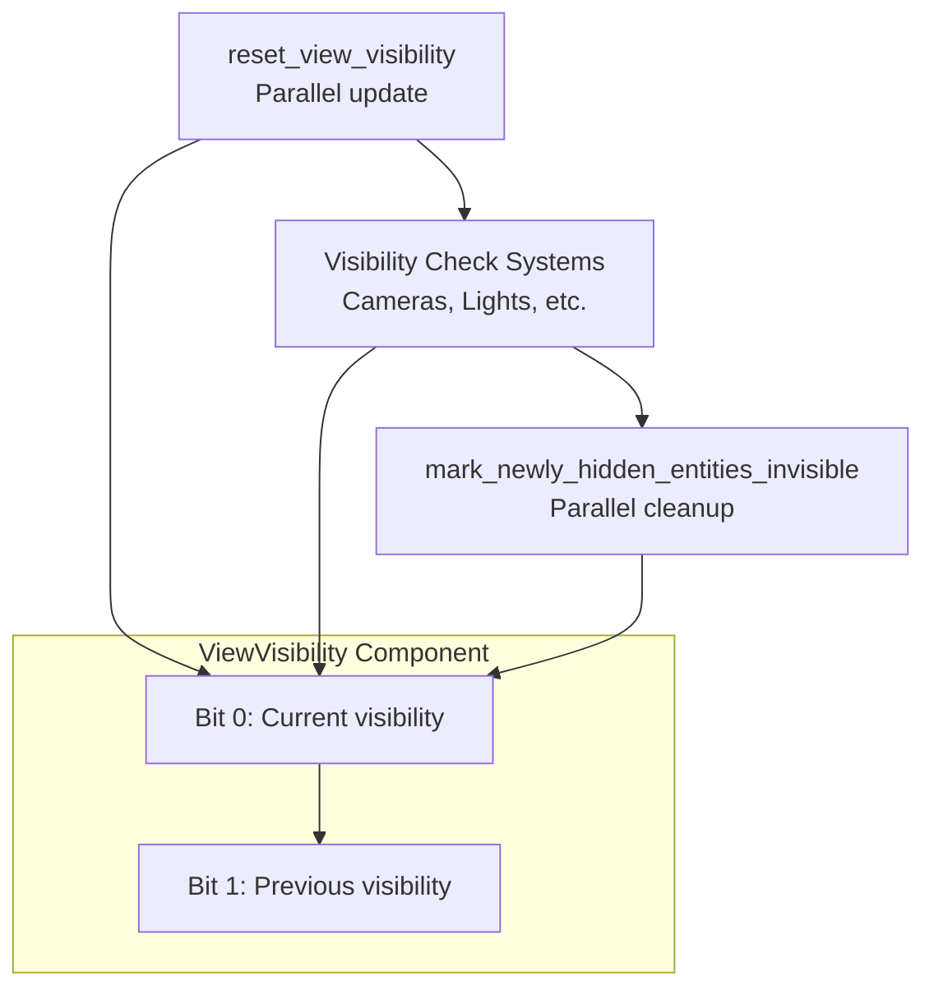

+++
title = "#22226 Optimize Visibility Systems"
date = "2026-01-01T00:00:00"
draft = false
template = "pull_request_page.html"
in_search_index = true

[taxonomies]
list_display = ["show"]

[extra]
current_language = "en"
available_languages = {"en" = { name = "English", url = "/pull_request/bevy/2026-01/pr-22226-en-20260101" }, "zh-cn" = { name = "中文", url = "/pull_request/bevy/2026-01/pr-22226-zh-cn-20260101" }}
labels = ["A-Rendering", "C-Performance", "P-Regression"]
+++

# Optimize Visibility Systems

## Basic Information
- **Title**: Optimize Visibility Systems
- **PR Link**: https://github.com/bevyengine/bevy/pull/22226
- **Author**: aevyrie
- **Status**: MERGED
- **Labels**: A-Rendering, C-Performance, S-Ready-For-Final-Review, P-Regression
- **Created**: 2025-12-22T02:04:27Z
- **Merged**: 2026-01-01T22:25:12Z
- **Merged By**: alice-i-cecile

## Description Translation
# Objective

- Make visibility systems less slow.
- Saves as much as 1.2ms of CPU time on a (GPU bound) 6.7ms frame, rendering caldera hotel.
- Fixes #22256

## Solution

- Replace the `EntityHashSet` with a component added directly to entities. This still allows for correct change detection triggers on visibility, but avoids hashing. This also enables parallel updates.

## Summary

- This PR lead to a rabbit hole that uncovered #22256 
- This PR resolves the regression introduced since 0.17 released
- A more fair comparison is not to main (which has a regression), but to 0.17
- Compared to 0.17.3, this is a 27% speedup to the `PostUpdate` schedule for caldera hotel on an M4 Max


## Testing

- Many cubes, many foxes, caldera
- Yellow is new, red is old.
- Note the bimodality in the old traces, this was consistently repeatable, and seems to have something to do with `EntityHashSet` and `EntityHashMap`. Worth investigating that further, as I've seen that bimodal behavior before, and blamed it on pcores vs ecores, but I verified that is not happening.
- Summary: caldera hotel no longer exhibits bimodal performance with a pathological mode that runs very slowly. Roughly comparing the ~90th percentile performance, the optimized code is about 1.2ms faster. This is particularly significant when you consider this is running on a device that is already hitting 150fps (GPU bound), so it only has a frame budget of 6.7ms.
- Notably, visibility checking was the last egregiously performing set of systems in the common hot path of most bevy apps, and no longer stick out as obviously slow in a frame profile: 

A high level comparison of the change in CPU time by looking at just PostUpdate between old(red) and new(yellow)


### caldera hotel - all entities in view

For this test, I didn't touch the camera, so all entities were in view at all times.

`check_visibility`


`reset_view_visibility`


`mark_newly_hidden_entities_invisible`

This is 23us slower than the "fast mode" of the existing code on main, but 180-250us *faster* than the weird "slow mode" on main. The new code is significantly more stable, and does not exhibit the super slow mode.


### caldera hotel - no entities in view

For this test, I immediately rotated the camera so the hotel was not in view.

`check_visibility`

This is largely a wash. The old code is 2us faster, but this is likely in the realm of noise.


`reset_view_visibility`

This is a big win. The main peak is about 30us faster now, but the major win is the worst case, which is nearly 500us faster.


`mark_newly_hidden_entities_invisible`

Same story as the other caldera comparison with everything in view, this is a bit slower than the fast mode, but way faster than the slow mode on main.


## The Story of This Pull Request

The visibility systems in Bevy were showing significant performance issues, particularly in complex scenes like Caldera Hotel. The problem manifested as bimodal performance - sometimes running fast, other times hitting a pathological slow mode that could consume up to 1.2ms of CPU time in a 6.7ms frame. This was especially problematic because visibility systems run in the hot path of most Bevy applications, and this regression had been introduced since version 0.17.

The root cause was the use of `EntityHashSet` to track visible entities from the previous frame. The system worked by maintaining a global `PreviousVisibleEntities` resource that stored all entities visible in the last frame. During each frame, visibility checking systems would remove entities they judged visible from this set, and at the end, any remaining entities (those that were visible last frame but not this frame) would be marked as hidden. This approach had several problems:

1. **Hashing overhead**: Every entity visibility check required hash operations on the EntityHashSet
2. **Single-threaded constraints**: The global resource couldn't be easily parallelized
3. **Bimodal performance**: The hash set operations exhibited inconsistent performance characteristics

The solution was to move from a centralized hash set to a distributed component-based approach. Instead of tracking visible entities in a global set, each entity now stores its own visibility history directly in the `ViewVisibility` component using bit-packed state. The implementation uses a single `u8` where:
- Bit 0: Current visibility (1 = visible, 0 = hidden)
- Bit 1: Previous frame's visibility

This bit-packing approach enables several optimizations:
- No hashing overhead since we're working directly with component data
- Parallel processing because each entity's visibility state is independent
- Reduced memory footprint compared to maintaining a separate hash set

The visibility pipeline was restructured into three main phases:

1. **Reset phase**: At the start of each frame, `reset_view_visibility` copies the current visibility bit to the previous visibility bit and clears the current bit. This runs in parallel across all entities.

2. **Marking phase**: Visibility checking systems (for cameras, lights, etc.) call `set_visible()` on entities they determine to be visible. This only sets the current bit to 1 if it wasn't already set, avoiding unnecessary change detection triggers.

3. **Cleanup phase**: `mark_newly_hidden_entities_invisible` runs in parallel, checking for entities where the previous bit is 1 (was visible last frame) but the current bit is 0 (not marked visible this frame). These entities are set to `ViewVisibility::HIDDEN`, triggering change detection only when visibility actually changes.

The key insight was realizing that while it's easy to determine if an entity is visible to something (multiple systems can set the visibility flag), it's harder to determine if an entity is globally non-visible. The bit-packing approach solves this by letting each entity track its own visibility history.

This change also required updating the light systems to use the new `SetViewVisibility` trait. Previously, light visibility systems had to coordinate with the global `PreviousVisibleEntities` resource, removing entities they marked as visible. Now they simply call `set_visible()` on the component, which is more efficient and enables better parallelism.

The performance improvements are substantial:
- 27% speedup in the PostUpdate schedule compared to 0.17.3
- Elimination of the bimodal performance pattern
- More consistent frame times
- Better scaling with entity count due to parallel processing

This optimization is particularly important for GPU-bound applications where CPU time is at a premium. By reducing visibility system overhead from 1.2ms to negligible levels, more CPU time is available for game logic and other systems.

## Visual Representation



## Key Files Changed

### `crates/bevy_camera/src/visibility/mod.rs` (+77/-79)

This file contains the core visibility system implementation. The changes completely rework how visibility state is tracked and managed.

**Key Changes:**
1. **ViewVisibility component redesign**: Changed from a simple boolean wrapper to a bit-packed u8 storing current and previous visibility states.
2. **Removed PreviousVisibleEntities resource**: Eliminated the global EntityHashSet in favor of distributed component storage.
3. **Added SetViewVisibility trait**: Provides a clean API for systems to mark entities as visible while avoiding unnecessary change detection.
4. **Parallelized systems**: Both `reset_view_visibility` and `mark_newly_hidden_entities_invisible` now use parallel iteration.

**Code Snippets:**

```rust
// Before: Simple boolean wrapper
#[derive(Component, Deref, Debug, Default, Clone, Copy, Reflect, PartialEq, Eq)]
#[reflect(Component, Default, Debug, PartialEq, Clone)]
pub struct ViewVisibility(bool);

// After: Bit-packed u8 with current and previous visibility
#[derive(Component, Debug, Default, Clone, Copy, Reflect, PartialEq, Eq)]
#[reflect(Component, Default, Debug, PartialEq, Clone)]
pub struct ViewVisibility(
    /// Bit packed booleans to track current and previous view visibility state.
    u8,
);

impl ViewVisibility {
    #[inline]
    pub fn get(self) -> bool {
        self.0 & 1 != 0
    }

    #[inline]
    fn was_visible_now_hidden(self) -> bool {
        self.0 == 0b10
    }

    #[inline]
    fn update(&mut self) {
        self.0 = (self.0 & !2) | ((self.0 & 1) << 1);
    }
}
```

```rust
// Before: Global resource tracking all visible entities
#[derive(Resource, Default, Deref, DerefMut)]
pub struct PreviousVisibleEntities(EntityHashSet);

// After: No global resource needed - state distributed across components
```

### `crates/bevy_light/src/lib.rs` (+19/-47)

This file contains light visibility systems that needed updating to work with the new component-based approach.

**Key Changes:**
1. **Removed PreviousVisibleEntities dependency**: Light systems no longer need to coordinate with the global resource.
2. **Updated to use SetViewVisibility trait**: Simplified visibility marking with `set_visible()` method.
3. **Removed entity removal logic**: No longer need to manually remove entities from PreviousVisibleEntities.

**Code Snippets:**

```rust
// Before: Complex coordination with PreviousVisibleEntities
world.resource_scope::<PreviousVisibleEntities, _>(
    |world, mut previous_visible_entities| {
        let mut query = world.query::<(Entity, &mut ViewVisibility)>();
        for entities in defer_queue.iter_mut() {
            let mut iter = query.iter_many_mut(world, entities.iter());
            while let Some((entity, mut view_visibility)) = iter.fetch_next() {
                if !**view_visibility {
                    view_visibility.set();
                }
                previous_visible_entities.remove(&entity);
            }
        }
    },
);

// After: Simple component update using trait
let mut query = world.query::<&mut ViewVisibility>();
for entities in defer_queue.iter_mut() {
    let mut iter = query.iter_many_mut(world, entities.iter());
    while let Some(mut view_visibility) = iter.fetch_next() {
        view_visibility.set_visible();
    }
}
```

## Further Reading

- [Bevy ECS Documentation](https://docs.rs/bevy_ecs/latest/bevy_ecs/) - Understanding Bevy's Entity Component System
- [Data-Oriented Design](https://dataorienteddesign.com/dodbook/) - Principles behind component-based optimization
- [Bit Manipulation Techniques](https://graphics.stanford.edu/~seander/bithacks.html) - Efficient bit operations used in this PR
- [Parallel Processing in ECS](https://bevy-cheatbook.github.io/programming/ecs-intro.html) - How Bevy implements parallel system execution
- [Performance Profiling with Tracy](https://github.com/wolfpld/tracy) - Tool used for the performance measurements in this PR