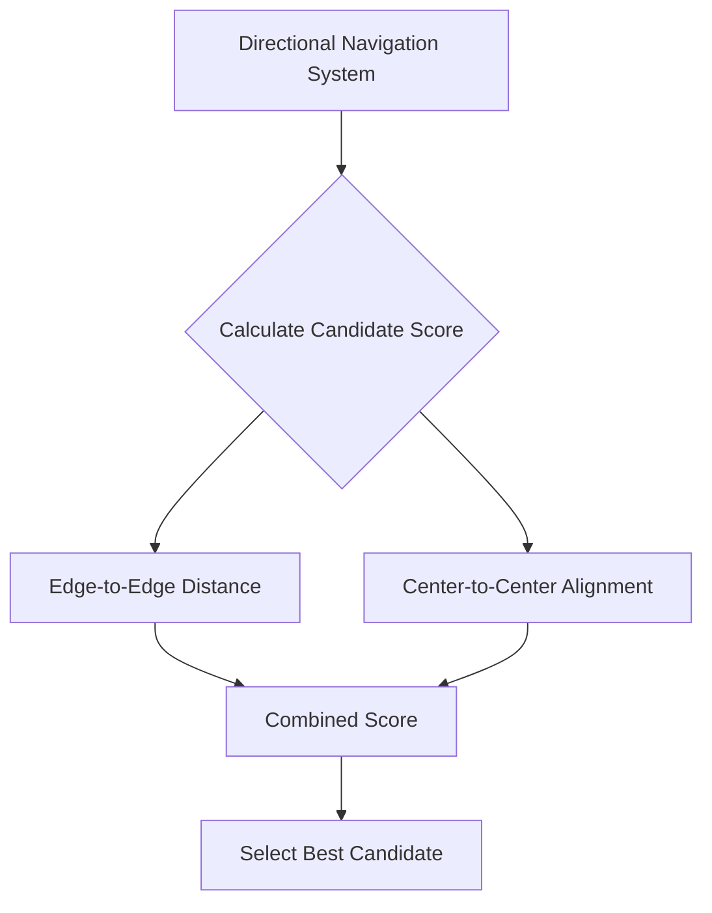

+++
title = "#22241 Directional navigation uses edge to edge distance not center to center"
date = "2026-01-01T00:00:00"
draft = false
template = "pull_request_page.html"
in_search_index = true

[taxonomies]
list_display = ["show"]

[extra]
current_language = "en"
available_languages = {"en" = { name = "English", url = "/pull_request/bevy/2026-01/pr-22241-en-20260101" }, "zh-cn" = { name = "中文", url = "/pull_request/bevy/2026-01/pr-22241-zh-cn-20260101" }}
labels = ["C-Bug", "A-UI", "D-Straightforward"]
+++

# Title
## Directional navigation uses edge to edge distance not center to center

## Basic Information
- **Title**: Directional navigation uses edge to edge distance not center to center
- **PR Link**: https://github.com/bevyengine/bevy/pull/22241
- **Author**: apekros
- **Status**: MERGED
- **Labels**: C-Bug, A-UI, S-Ready-For-Final-Review, D-Straightforward
- **Created**: 2025-12-23T00:56:54Z
- **Merged**: 2025-12-31T23:17:47Z
- **Merged By**: alice-i-cecile

## Description Translation
The PR description is already in English.

# The Story of This Pull Request

## The Problem and Context
The issue surfaced in Bevy's UI directional navigation system, where navigation between focusable elements was calculated using center-to-center distance. This approach led to counterintuitive behavior in common UI layouts. As illustrated in the diagram, when navigating from a left-aligned rectangle eastward, the system would incorrectly choose the bottom rectangle whose center was closer, even though the wider top rectangle was clearly the intended target because its edge was physically closer.

The core problem was mathematical: using Euclidean distance between rectangle centers doesn't reflect how users perceive spatial relationships in UI navigation. Users naturally look for the nearest element edge when navigating directionally, not the nearest center point. This became particularly problematic with elements of varying sizes where a larger element might have its center further away but its edge significantly closer.

## The Solution Approach
The developer implemented a straightforward but effective fix: switching from center-to-center distance to edge-to-edge distance calculation. This required calculating the shortest distance between the bounding rectangles of two elements rather than just the distance between their center points.

The implementation maintains a separation of concerns: while distance calculation uses edge-to-edge measurements, alignment scoring (which determines how directly an element lies in the navigation direction) continues to use center-to-center vectors. This preserves the directional preference aspect of the algorithm while fixing the distance measurement.

## The Implementation
The key change occurs in the `score_candidate` function within `directional_navigation.rs`. Previously, the function calculated simple Euclidean distance between centers:

```rust
// Before the change
let to_candidate = candidate_pos - origin_pos;
let distance = to_candidate.length();
```

After the change, the implementation constructs `Rect` objects from both elements and computes the minimal edge-to-edge distance:

```rust
// After the change
let origin_rect = Rect::from_center_size(origin_pos, origin_size);
let candidate_rect = Rect::from_center_size(candidate_pos, candidate_size);
let dx = (candidate_rect.min.x - origin_rect.max.x)
    .max(origin_rect.min.x - candidate_rect.max.x)
    .max(0.0);
let dy = (candidate_rect.min.y - origin_rect.max.y)
    .max(origin_rect.min.y - candidate_rect.max.y)
    .max(0.0);
let distance = (dx * dx + dy * dy).sqrt();
```

The edge-to-edge distance calculation handles three cases:
1. Non-overlapping rectangles in the given dimension (positive distance)
2. Overlapping rectangles (distance becomes 0 in that dimension)
3. The max(0.0) ensures no negative distances

The alignment scoring continues to use center-to-center vectors to maintain directional accuracy:

```rust
// Alignment scoring unchanged
let center_distance = to_candidate.length();
let alignment = if center_distance > 0.0 {
    to_candidate.normalize().dot(dir).max(0.0)
} else {
    1.0
};
```

## Technical Insights
The edge-to-edge distance calculation uses axis-aligned bounding boxes, which is appropriate for UI elements that are typically axis-aligned rectangles. The formula `dx = max(candidate.min.x - origin.max.x, origin.min.x - candidate.max.x, 0)` efficiently computes the horizontal separation: if rectangles don't overlap horizontally, it's the positive gap; if they overlap, it's 0.

This approach aligns with common UI navigation patterns in other frameworks and operating systems. The decision to keep alignment scoring based on center vectors is practical because alignment should consider the overall direction to the element's center rather than to its nearest edge.

## The Impact
This fix makes directional navigation behave more intuitively, especially in layouts with elements of different sizes. The test case added demonstrates the specific scenario: navigating east from a left rectangle should now correctly choose the wider top rectangle instead of the bottom one, even though the bottom rectangle's center is closer.

The change is minimal and focused, affecting only the distance calculation while preserving the rest of the navigation algorithm. This reduces the risk of regressions and maintains backward compatibility for cases where the previous behavior was already correct.

## Visual Representation



## Key Files Changed

### `crates/bevy_input_focus/src/directional_navigation.rs` (+53/-4)

This file contains the core directional navigation logic for Bevy's UI system. The changes fix the distance calculation algorithm to use edge-to-edge measurements instead of center-to-center.

**Key modifications:**

1. **Imports update**: Added `Rect` import from `bevy_math`
   ```rust
   // Before:
   use bevy_math::{CompassOctant, Dir2, Vec2};
   
   // After:
   use bevy_math::{CompassOctant, Dir2, Rect, Vec2};
   ```

2. **Distance calculation logic**: Replaced center-to-center distance with edge-to-edge distance
   ```rust
   // Before:
   let to_candidate = candidate_pos - origin_pos;
   let distance = to_candidate.length();
   
   // After:
   let origin_rect = Rect::from_center_size(origin_pos, origin_size);
   let candidate_rect = Rect::from_center_size(candidate_pos, candidate_size);
   let dx = (candidate_rect.min.x - origin_rect.max.x)
       .max(origin_rect.min.x - candidate_rect.max.x)
       .max(0.0);
   let dy = (candidate_rect.min.y - origin_rect.max.y)
       .max(origin_rect.min.y - candidate_rect.max.y)
       .max(0.0);
   let distance = (dx * dx + dy * dy).sqrt();
   ```

3. **Test addition**: Added comprehensive test for the edge distance scenario
   ```rust
   #[test]
   fn test_edge_distance_vs_center_distance() {
       // Test setup with three rectangles matching the diagrammed scenario
       // Verifies that navigation chooses the wider top rectangle, not the bottom one
   }
   ```

The changes directly address the bug while maintaining the existing API and behavior for correct cases.

## Further Reading

1. **Bevy UI Navigation Documentation**: For understanding the broader navigation system
2. **Rectangle Distance Algorithms**: Research on minimal distance between axis-aligned rectangles
3. **Accessibility Guidelines**: WCAG recommendations for keyboard navigation in UI systems
4. **Spatial Data Structures**: K-d trees and spatial hashing for efficient nearest-neighbor searches in UI navigation

# Full Code Diff
```diff
diff --git a/crates/bevy_input_focus/src/directional_navigation.rs b/crates/bevy_input_focus/src/directional_navigation.rs
index 79dc20680084a..39dfef80060f0 100644
--- a/crates/bevy_input_focus/src/directional_navigation.rs
+++ b/crates/bevy_input_focus/src/directional_navigation.rs
@@ -66,7 +66,7 @@ use bevy_ecs::{
     prelude::*,
     system::SystemParam,
 };
-use bevy_math::{CompassOctant, Dir2, Vec2};
+use bevy_math::{CompassOctant, Dir2, Rect, Vec2};
 use bevy_ui::{ComputedNode, ComputedUiTargetCamera, UiGlobalTransform};
 use thiserror::Error;
 
@@ -658,7 +658,6 @@ fn score_candidate(
     // Get direction in mathematical coordinates, then flip Y for UI coordinates
     let dir = Dir2::from(octant).as_vec2() * Vec2::new(1.0, -1.0);
     let to_candidate = candidate_pos - origin_pos;
-    let distance = to_candidate.length();
 
     // Check direction first
     // Convert UI coordinates (Y+ = down) to mathematical coordinates (Y+ = up) by flipping Y
@@ -681,6 +680,17 @@ fn score_candidate(
         return f32::INFINITY;
     }
 
+    // Calculate distance between rectangle edges, not centers
+    let origin_rect = Rect::from_center_size(origin_pos, origin_size);
+    let candidate_rect = Rect::from_center_size(candidate_pos, candidate_size);
+    let dx = (candidate_rect.min.x - origin_rect.max.x)
+        .max(origin_rect.min.x - candidate_rect.max.x)
+        .max(0.0);
+    let dy = (candidate_rect.min.y - origin_rect.max.y)
+        .max(origin_rect.min.y - candidate_rect.max.y)
+        .max(0.0);
+    let distance = (dx * dx + dy * dy).sqrt();
+
     // Check max distance
     if let Some(max_dist) = config.max_search_distance {
         if distance > max_dist {
@@ -688,8 +698,9 @@ fn score_candidate(
         }
     }
 
-    // Calculate alignment score
-    let alignment = if distance > 0.0 {
+    // Calculate alignment score using center-to-center direction
+    let center_distance = to_candidate.length();
+    let alignment = if center_distance > 0.0 {
         to_candidate.normalize().dot(dir).max(0.0)
     } else {
         1.0
@@ -1203,4 +1214,42 @@ mod tests {
             Some(node_c)
         );
     }
+
+    #[test]
+    fn test_edge_distance_vs_center_distance() {
+        let mut nav_map = DirectionalNavigationMap::default();
+        let config = AutoNavigationConfig::default();
+
+        let left = Entity::from_bits(1);
+        let wide_top = Entity::from_bits(2);
+        let bottom = Entity::from_bits(3);
+
+        let left_node = FocusableArea {
+            entity: left,
+            position: Vec2::new(100.0, 200.0),
+            size: Vec2::new(100.0, 100.0),
+        };
+
+        let wide_top_node = FocusableArea {
+            entity: wide_top,
+            position: Vec2::new(350.0, 150.0),
+            size: Vec2::new(300.0, 80.0),
+        };
+
+        let bottom_node = FocusableArea {
+            entity: bottom,
+            position: Vec2::new(270.0, 300.0),
+            size: Vec2::new(100.0, 80.0),
+        };
+
+        let nodes = vec![left_node, wide_top_node, bottom_node];
+
+        auto_generate_navigation_edges(&mut nav_map, &nodes, &config);
+
+        assert_eq!(
+            nav_map.get_neighbor(left, CompassOctant::East),
+            Some(wide_top),
+            "Should navigate to wide_top not bottom, even though bottom's center is closer."
+        );
+    }
 }
```