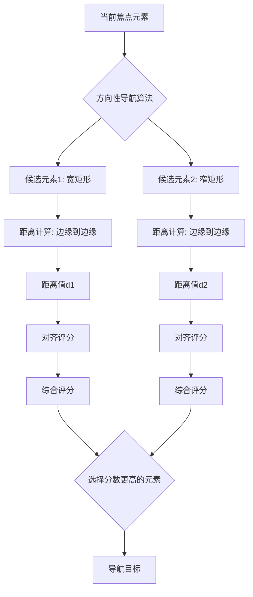

+++
title = "#22241 Directional navigation uses edge to edge distance not center to center"
date = "2026-01-01T00:00:00"
draft = false
template = "pull_request_page.html"
in_search_index = false

[extra]
current_language = "zh-cn"
available_languages = {"en" = { name = "English", url = "/pull_request/bevy/2026-01/pr-22241-en-20260101" }, "zh-cn" = { name = "中文", url = "/pull_request/bevy/2026-01/pr-22241-zh-cn-20260101" }}
+++

# Title

## 基本信息
- **标题**: Directional navigation uses edge to edge distance not center to center
- **PR链接**: https://github.com/bevyengine/bevy/pull/22241
- **作者**: apekros
- **状态**: 已合并
- **标签**: C-Bug, A-UI, S-Ready-For-Final-Review, D-Straightforward
- **创建时间**: 2025-12-23T00:56:54Z
- **合并时间**: 2025-12-31T23:17:47Z
- **合并者**: alice-i-cecile

## 描述翻译
该PR解决的问题由@ickshonpe绘制了清晰的图示：
<details>

</details>
从导航角度来看，应该选的是更宽的矩形，但按照中心到中心的距离计算，下方的矩形因为中心更近而被选中，这是不正确的。

## 解决方案

本修改使用边缘到边缘（edge to edge）的距离计算代替中心到中心（center to center）的距离计算。对齐评分（alignment scoring）仍使用中心到中心的方向计算，如有需要也可以修改，但作者对此不太确定。

## 测试

为上述图示场景添加了测试。

---

## 该PR的技术故事

这个PR解决的问题是关于Bevy引擎中UI方向性导航（directional navigation）算法的一个bug。当用户使用键盘方向键在UI元素之间导航时，系统需要决定哪个元素是下一个合理的导航目标。

### 问题背景和上下文

在UI导航系统中，当用户按下方向键（如上、下、左、右）时，系统需要在当前焦点元素周围的元素中寻找最合适的下一个焦点目标。原来的算法使用中心到中心的距离计算来决定哪个元素"最近"。这在大多数情况下工作正常，但在特定布局中会出现问题。

考虑这样一个场景：当前焦点元素是一个普通矩形，右边有两个可能的导航目标：
1. 一个宽度很大的矩形，它的左边缘离当前元素很近
2. 一个较小的矩形，它的中心离当前元素更近，但实际位置更靠下

<details>

</details>

按照原来的算法，系统会选择第二个（较小的）矩形，因为它的中心更近。但从用户直观感受来看，第一个（更宽的）矩形才是正确的选择，因为它的实际位置更靠近导航方向。

### 解决方案的实现

作者通过修改`score_candidate`函数中的距离计算逻辑来解决这个问题。原来计算的是两个矩形中心点的欧几里得距离：

```rust
// 原来的代码
let to_candidate = candidate_pos - origin_pos;
let distance = to_candidate.length();
```

现在改为计算两个矩形边缘之间的最短距离。具体实现是：

```rust
// 新代码：计算边缘到边缘的距离
let origin_rect = Rect::from_center_size(origin_pos, origin_size);
let candidate_rect = Rect::from_center_size(candidate_pos, candidate_size);
let dx = (candidate_rect.min.x - origin_rect.max.x)
    .max(origin_rect.min.x - candidate_rect.max.x)
    .max(0.0);
let dy = (candidate_rect.min.y - origin_rect.max.y)
    .max(origin_rect.min.y - candidate_rect.max.y)
    .max(0.0);
let distance = (dx * dx + dy * dy).sqrt();
```

这个算法的核心思想是：
1. 首先将每个元素表示为一个矩形（Rect）
2. 对于每个坐标轴，计算两个矩形之间的最小距离：
   - 如果矩形重叠，距离为0（通过`.max(0.0)`确保）
   - 如果矩形分离，计算实际距离
3. 然后使用欧几里得公式计算二维空间中的实际距离

### 技术细节和设计决策

值得注意的是，作者在修改中做了一个重要的设计决策：对齐评分（alignment score）仍使用中心到中心的方向计算。这是因为对齐评分的目的是衡量候选元素与导航方向的匹配程度，这应该基于元素整体的位置关系，而不仅仅是边缘位置。

```rust
// 对齐评分仍使用中心到中心的方向
let center_distance = to_candidate.length();
let alignment = if center_distance > 0.0 {
    to_candidate.normalize().dot(dir).max(0.0)
} else {
    1.0
};
```

这种分离处理是有道理的：距离计算关注元素之间的实际接近程度，而对齐评分关注元素在方向上的对齐程度。如果两个元素在导航方向上完全对齐，即使它们之间有一定距离，也应该获得较高的对齐评分。

### 测试验证

为了确保修改的正确性，作者添加了一个专门的测试用例`test_edge_distance_vs_center_distance`。这个测试重现了问题描述中的场景：

```rust
#[test]
fn test_edge_distance_vs_center_distance() {
    // 创建三个测试元素：
    // left: (100,200)，大小100x100
    // wide_top: (350,150)，大小300x80（更宽但中心更远）
    // bottom: (270,300)，大小100x80（更窄但中心更近）
    // ...
    
    assert_eq!(
        nav_map.get_neighbor(left, CompassOctant::East),
        Some(wide_top),
        "应该导航到wide_top而不是bottom，即使bottom的中心更近"
    );
}
```

这个测试验证了当从左侧元素向右导航时，系统会选择`wide_top`元素，而不是中心更近的`bottom`元素。这正是问题描述中需要修复的行为。

### 影响和意义

这个修改虽然代码量不大，但对用户体验有显著改善。在实际UI设计中，经常会遇到宽度不同的元素并排排列的情况。原来的算法会导致导航行为不符合用户直觉，特别是在工具栏、菜单栏或表单布局中。

从算法角度来看，这个修改使导航系统更加符合常见UI设计模式。边缘到边缘的距离计算更好地反映了用户对"邻近度"的直观理解：如果两个元素的边缘很接近，那么它们就应该被认为是邻近的，无论它们的中心点距离如何。

## 可视化表示



## 关键文件修改

### `crates/bevy_input_focus/src/directional_navigation.rs`
**修改说明**: 修改了方向性导航算法的距离计算方式，从中心到中心改为边缘到边缘，并添加了相应的测试用例。

**关键代码修改**:
```rust
// 之前: 使用中心到中心的距离
let to_candidate = candidate_pos - origin_pos;
let distance = to_candidate.length();

// 之后: 使用边缘到边缘的距离
let origin_rect = Rect::from_center_size(origin_pos, origin_size);
let candidate_rect = Rect::from_center_size(candidate_pos, candidate_size);
let dx = (candidate_rect.min.x - origin_rect.max.x)
    .max(origin_rect.min.x - candidate_rect.max.x)
    .max(0.0);
let dy = (candidate_rect.min.y - origin_rect.max.y)
    .max(origin_rect.min.y - candidate_rect.max.y)
    .max(0.0);
let distance = (dx * dx + dy * dy).sqrt();
```

**与PR目的的关系**: 这是实现PR目标的核心修改，确保导航算法选择正确的目标元素。

## 进一步阅读

1. **Bevy UI导航系统文档**: 了解Bevy中UI导航的基本原理和配置选项
2. **W3C ARIA导航实践**: 关于无障碍UI导航的设计原则和最佳实践
3. **空间导航算法**: 研究其他UI框架如何处理方向性导航问题
4. **矩形几何计算**: 了解更复杂的矩形相交和距离计算方法

---

# 完整代码差异
diff --git a/crates/bevy_input_focus/src/directional_navigation.rs b/crates/bevy_input_focus/src/directional_navigation.rs
index 79dc20680084a..39dfef80060f0 100644
--- a/crates/bevy_input_focus/src/directional_navigation.rs
+++ b/crates/bevy_input_focus/src/directional_navigation.rs
@@ -66,7 +66,7 @@ use bevy_ecs::{
     prelude::*,
     system::SystemParam,
 };
-use bevy_math::{CompassOctant, Dir2, Vec2};
+use bevy_math::{CompassOctant, Dir2, Rect, Vec2};
 use bevy_ui::{ComputedNode, ComputedUiTargetCamera, UiGlobalTransform};
 use thiserror::Error;
 
@@ -658,7 +658,6 @@ fn score_candidate(
     // Get direction in mathematical coordinates, then flip Y for UI coordinates
     let dir = Dir2::from(octant).as_vec2() * Vec2::new(1.0, -1.0);
     let to_candidate = candidate_pos - origin_pos;
-    let distance = to_candidate.length();
 
     // Check direction first
     // Convert UI coordinates (Y+ = down) to mathematical coordinates (Y+ = up) by flipping Y
@@ -681,6 +680,17 @@ fn score_candidate(
         return f32::INFINITY;
     }
 
+    // Calculate distance between rectangle edges, not centers
+    let origin_rect = Rect::from_center_size(origin_pos, origin_size);
+    let candidate_rect = Rect::from_center_size(candidate_pos, candidate_size);
+    let dx = (candidate_rect.min.x - origin_rect.max.x)
+        .max(origin_rect.min.x - candidate_rect.max.x)
+        .max(0.0);
+    let dy = (candidate_rect.min.y - origin_rect.max.y)
+        .max(origin_rect.min.y - candidate_rect.max.y)
+        .max(0.0);
+    let distance = (dx * dx + dy * dy).sqrt();
+
     // Check max distance
     if let Some(max_dist) = config.max_search_distance {
         if distance > max_dist {
@@ -688,8 +698,9 @@ fn score_candidate(
         }
     }
 
-    // Calculate alignment score
-    let alignment = if distance > 0.0 {
+    // Calculate alignment score using center-to-center direction
+    let center_distance = to_candidate.length();
+    let alignment = if center_distance > 0.0 {
         to_candidate.normalize().dot(dir).max(0.0)
     } else {
         1.0
@@ -1203,4 +1214,42 @@ mod tests {
             Some(node_c)
         );
     }
+
+    #[test]
+    fn test_edge_distance_vs_center_distance() {
+        let mut nav_map = DirectionalNavigationMap::default();
+        let config = AutoNavigationConfig::default();
+
+        let left = Entity::from_bits(1);
+        let wide_top = Entity::from_bits(2);
+        let bottom = Entity::from_bits(3);
+
+        let left_node = FocusableArea {
+            entity: left,
+            position: Vec2::new(100.0, 200.0),
+            size: Vec2::new(100.0, 100.0),
+        };
+
+        let wide_top_node = FocusableArea {
+            entity: wide_top,
+            position: Vec2::new(350.0, 150.0),
+            size: Vec2::new(300.0, 80.0),
+        };
+
+        let bottom_node = FocusableArea {
+            entity: bottom,
+            position: Vec2::new(270.0, 300.0),
+            size: Vec2::new(100.0, 80.0),
+        };
+
+        let nodes = vec![left_node, wide_top_node, bottom_node];
+
+        auto_generate_navigation_edges(&mut nav_map, &nodes, &config);
+
+        assert_eq!(
+            nav_map.get_neighbor(left, CompassOctant::East),
+            Some(wide_top),
+            "Should navigate to wide_top not bottom, even though bottom's center is closer."
+        );
+    }
 }