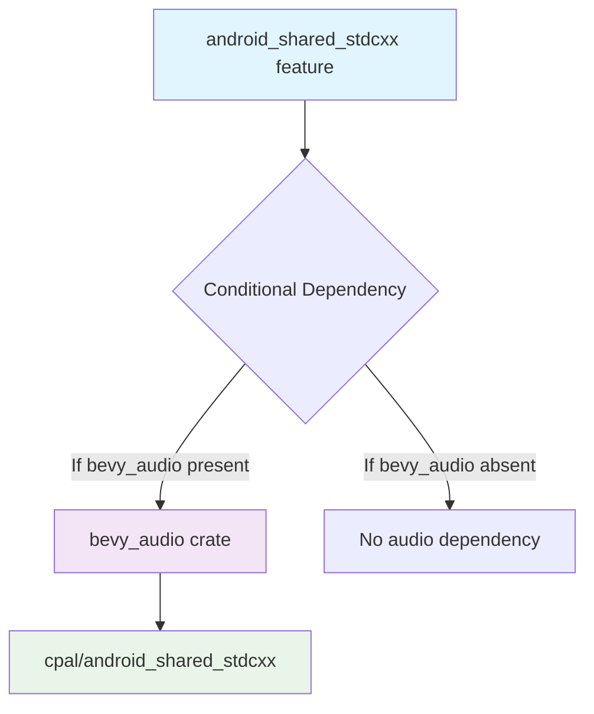

+++
title = "#22245 Make `bevy_audio` optional for `android_shared_stdcxx`"
date = "2026-01-07T00:00:00"
draft = false
template = "pull_request_page.html"
in_search_index = true

[taxonomies]
list_display = ["show"]

[extra]
current_language = "en"
available_languages = {"en" = { name = "English", url = "/pull_request/bevy/2026-01/pr-22245-en-20260107" }, "zh-cn" = { name = "中文", url = "/pull_request/bevy/2026-01/pr-22245-zh-cn-20260107" }}
labels = ["A-Audio", "C-Code-Quality", "O-Android", "S-Waiting-on-Author"]
+++

# Title

## Basic Information
- **Title**: Make `bevy_audio` optional for `android_shared_stdcxx`
- **PR Link**: https://github.com/bevyengine/bevy/pull/22245
- **Author**: Shatur
- **Status**: MERGED
- **Labels**: A-Audio, C-Code-Quality, O-Android, S-Waiting-on-Author
- **Created**: 2025-12-23T16:58:57Z
- **Merged**: 2026-01-07T21:51:06Z
- **Merged By**: cart

## Description Translation

# Objective

- It's a bit unexpected to require `bevy_audio` even when it's not used with `default_platform`, which enables `android_shared_stdcxx`.

## Solution

- Treat this feature similar to `std`. It just enables `android_shared_stdcxx` on `cpal` inside `bevy_audio`.

## The Story of This Pull Request

The issue began with a feature dependency problem in the Bevy game engine's build system. Specifically, when developers used the `android_shared_stdcxx` feature, they were forced to include the entire `bevy_audio` crate as a dependency, even if they didn't need audio functionality. This was counterintuitive because `android_shared_stdcxx` is a platform-specific feature related to Android's C++ standard library handling, not audio functionality.

This behavior stemmed from how the feature was defined in `crates/bevy_internal/Cargo.toml`. The original implementation had a direct dependency: `android_shared_stdcxx = ["bevy_audio/android_shared_stdcxx"]`. This meant that enabling the `android_shared_stdcxx` feature would always activate the corresponding feature in `bevy_audio`.

The root cause was that the `cpal` crate (Cross-Platform Audio Library), which `bevy_audio` depends on, has its own `android_shared_stdcxx` feature. This feature is necessary for Android builds because it enables using a shared C++ standard library on Android platforms. However, not all Bevy projects on Android require audio functionality, so forcing the audio dependency was unnecessary bloat.

The solution drew inspiration from how optional dependencies are handled in Cargo features. The developer modified the feature definition to use Cargo's conditional feature syntax with the `?` operator: `android_shared_stdcxx = ["bevy_audio?/android_shared_stdcxx"]`. This change makes the dependency on `bevy_audio` optional - if `bevy_audio` is present in the dependency graph, the feature gets forwarded to it; if not, the feature simply doesn't apply to anything.

This approach mirrors how the standard library (`std`) feature is often handled. The `android_shared_stdcxx` feature is essentially a configuration flag for Android builds that should propagate to relevant dependencies when they exist, but shouldn't force inclusion of unnecessary crates.

The implementation is minimal but significant. It follows good Cargo feature design practices by making features additive rather than restrictive. This change reduces binary size and build times for Android projects that don't need audio functionality, while maintaining full compatibility for projects that do use `bevy_audio`.

From an architectural perspective, this change improves the modularity of Bevy's feature system. Features should enable functionality, not force unnecessary dependencies. The fix demonstrates proper use of Cargo's feature forwarding syntax, which is particularly important for large, modular codebases like Bevy where different users may need different subsets of functionality.

## Visual Representation



## Key Files Changed

### `crates/bevy_internal/Cargo.toml`
This is the only file modified in this PR. The change updates the feature definition for `android_shared_stdcxx` to make the dependency on `bevy_audio` conditional rather than mandatory.

**Before:**
```toml
# Enable using a shared stdlib for cxx on Android.
android_shared_stdcxx = ["bevy_audio/android_shared_stdcxx"]
```

**After:**
```toml
# Enable using a shared stdlib for cxx on Android.
android_shared_stdcxx = ["bevy_audio?/android_shared_stdcxx"]
```

The key difference is the addition of the `?` character after `bevy_audio`. In Cargo's feature syntax, this means:
- If the `bevy_audio` crate is included in the project (either directly or as a dependency), the `android_shared_stdcxx` feature will be forwarded to it
- If `bevy_audio` is not included, the feature won't try to activate anything (and won't cause an error)

This change aligns with the PR's objective of making `bevy_audio` optional when using the `android_shared_stdcxx` feature, which is particularly useful for Android projects that don't require audio functionality.

## Full Code Diff
```diff
diff --git a/crates/bevy_internal/Cargo.toml b/crates/bevy_internal/Cargo.toml
index 989cddf728d56..1b16fd9de4e85 100644
--- a/crates/bevy_internal/Cargo.toml
+++ b/crates/bevy_internal/Cargo.toml
@@ -262,7 +262,7 @@ bevy_gltf = ["dep:bevy_gltf", "bevy_scene", "bevy_pbr"]
 dynamic_linking = ["bevy_diagnostic/dynamic_linking"]
 
 # Enable using a shared stdlib for cxx on Android.
-android_shared_stdcxx = ["bevy_audio/android_shared_stdcxx"]
+android_shared_stdcxx = ["bevy_audio?/android_shared_stdcxx"]
 
 # Enable AccessKit on Unix backends (currently only works with experimental
 # screen readers and forks.)
```

## Further Reading

1. **Cargo Feature Documentation**: The official Rust Cargo documentation on features provides detailed information about conditional features and the `?` syntax: https://doc.rust-lang.org/cargo/reference/features.html
2. **Bevy's Feature System**: Understanding how Bevy structures its features can help with similar optimizations: https://bevyengine.org/learn/book/getting-started/features/
3. **Android C++ Shared Library**: For context on why `android_shared_stdcxx` is needed, see Android NDK documentation on C++ runtime libraries: https://developer.android.com/ndk/guides/cpp-support
4. **cpal Crate Features**: The cpal crate's feature documentation explains its Android-specific requirements: https://github.com/RustAudio/cpal
5. **Rust Conditional Compilation**: The Rust reference on conditional compilation provides background on how features work under the hood: https://doc.rust-lang.org/reference/conditional-compilation.html