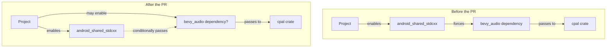

+++
title = "#22245 Make `bevy_audio` optional for `android_shared_stdcxx`"
date = "2026-01-07T00:00:00"
draft = false
template = "pull_request_page.html"
in_search_index = false

[extra]
current_language = "zh-cn"
available_languages = {"en" = { name = "English", url = "/pull_request/bevy/2026-01/pr-22245-en-20260107" }, "zh-cn" = { name = "中文", url = "/pull_request/bevy/2026-01/pr-22245-zh-cn-20260107" }}
labels = ["A-Audio", "C-Code-Quality", "O-Android", "S-Waiting-on-Author"]
+++

# Title

## Basic Information
- **Title**: Make `bevy_audio` optional for `android_shared_stdcxx`
- **PR Link**: https://github.com/bevyengine/bevy/pull/22245
- **Author**: Shatur
- **Status**: MERGED
- **Labels**: A-Audio, C-Code-Quality, O-Android, S-Waiting-on-Author
- **Created**: 2025-12-23T16:58:57Z
- **Merged**: 2026-01-07T21:51:06Z
- **Merged By**: cart

## Description Translation
# Objective

- 当使用了 `default_platform` 特性（它启用了 `android_shared_stdcxx`）但没有使用音频功能时，仍然强制要求依赖 `bevy_audio`，这有点令人意外。

## Solution

- 像对待 `std` 特性一样处理这个特性。它只是对 `bevy_audio` 内部的 `cpal` 启用 `android_shared_stdcxx`。

## The Story of This Pull Request

这是一个关于构建配置和依赖管理的简洁修正。在 Bevy 游戏引擎中，有一个为 Android 平台优化的特性，名为 `android_shared_stdcxx`。启用此特性是为了在 Android 上使用共享的 C++ 标准库（libc++_shared），这有助于减少最终 APK 的大小并避免潜在的库冲突。

在本次修改之前，这个特性的定义直接强制依赖于 `bevy_audio` 库。这意味着任何启用了 `default_platform`（它默认启用了 `android_shared_stdcxx`）的项目，无论其是否实际需要音频功能，都会被强制引入 `bevy_audio` 及其所有依赖项。对于不打算在 Android 上处理音频的应用程序来说，这是一种不必要的开销和依赖膨胀。

这个问题类似于在许多库中常见的 `std` 特性模式。`std` 特性通常用于启用对标准库的依赖，但在 `no_std` 环境中可以禁用。PR 的作者 `Shatur` 注意到了这种不一致性。`android_shared_stdcxx` 的核心功能是配置底层音频库 `cpal`（被 `bevy_audio` 所依赖）的构建方式，它本身并不是 `bevy_audio` 高级功能的依赖。

解决方案在技术上很直接，但概念上很清晰。它利用了 Cargo 的**条件性特性传递**语法。PR 将依赖关系从强制性的（`bevy_audio/android_shared_stdcxx`）更改为可选的条件性传递（`bevy_audio?/android_shared_stdcxx`）。尾部的问号 `?` 是这里的关键。它表示：只有当项目的依赖图中已经包含了 `bevy_audio` 时，才将 `android_shared_stdcxx` 特性传递给 `bevy_audio`（进而传递给 `cpal`）。

这个改动确保了以下场景：
1.  如果一个项目启用了 `default_platform` 或直接启用了 `android_shared_stdcxx`，并且**也**启用了 `bevy_audio`，那么 `android_shared_stdcxx` 特性会正确地传递给 `bevy_audio` -> `cpal`，从而在 Android 上启用共享库。
2.  如果一个项目启用了 `default_platform`，但**没有**启用 `bevy_audio`（例如一个静默应用或一个仅处理输入的客户端），那么 `bevy_audio` 根本不会被引入。`android_shared_stdcxx` 特性没有传递目标，因此被无害地忽略。

这种模式是 Cargo 特性设计中良好实践的体现。它最小化了“默认”特性集所带来的负担，允许用户更精确地控制他们的依赖项，同时保留了对需要它的用户的功能支持。

从工程角度看，这次修改是一次纯粹的元数据优化，没有改变任何运行时代码。它通过更智能地声明包之间的约束来改善开发者的体验和构建的简洁性。它遵循了最小权限和关注点分离的原则：构建系统特性只影响实际需要它们的组件。

## Visual Representation

以下 Mermaid 图说明了特性依赖关系的变化：


## Key Files Changed

- `crates/bevy_internal/Cargo.toml` (+1/-1)

该文件是 Bevy 工作区的根 `Cargo.toml`，定义了工作区成员和一系列聚合特性（例如 `default`， `default_platform`）。本次 PR 只修改了一行代码，即 `android_shared_stdcxx` 特性的定义。

1.  **修改内容与原因**：修改了 `android_shared_stdcxx` 特性的依赖声明，从强制依赖 `bevy_audio` 改为条件性依赖。这使得在不需要音频功能时，可以不引入 `bevy_audio` 及其依赖。

2.  **代码片段**：
    ```toml
    # File: crates/bevy_internal/Cargo.toml
    # Before (line 265):
    android_shared_stdcxx = ["bevy_audio/android_shared_stdcxx"]

    # After (line 265):
    android_shared_stdcxx = ["bevy_audio?/android_shared_stdcxx"]
    ```
    唯一的改动是在 `bevy_audio` 后添加了 `?` 符号。

3.  **与 PR 目标的关联**：这行修改直接实现了 PR 的目标：使 `bevy_audio` 对于 `android_shared_stdcxx` 特性变为可选。它通过使用 Cargo 的条件性特性语法，允许构建系统在不强制引入音频库的情况下传播 Android 特定的构建配置。

## Further Reading

1.  **Cargo Reference: Features** - 特别是关于[特性依赖](https://doc.rust-lang.org/cargo/reference/features.html#dependency-features)和[可选依赖项](https://doc.rust-lang.org/cargo/reference/features.html#optional-dependencies)的部分，详细解释了 `?` 语法和特性传递。
2.  **Rust Blog: What is `std`?** - 理解 `std` 作为一个可选特性的经典模式，这与本次 PR 的解决思路类似。
3.  **Bevy 官方文档: Android 支持** - 可以了解 `android_shared_stdcxx` 在 Android 开发上下文中的具体作用和重要性。