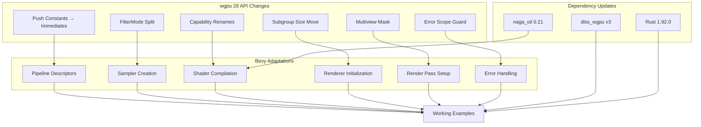

+++
title = "#22265 Upgrade to wgpu 28"
date = "2026-01-22T00:00:00"
draft = false
template = "pull_request_page.html"
in_search_index = true

[taxonomies]
list_display = ["show"]

[extra]
current_language = "en"
available_languages = {"en" = { name = "English", url = "/pull_request/bevy/2026-01/pr-22265-en-20260122" }, "zh-cn" = { name = "中文", url = "/pull_request/bevy/2026-01/pr-22265-zh-cn-20260122" }}
labels = ["A-Rendering", "C-Dependencies"]
+++

# Upgrade to wgpu 28

## Basic Information
- **Title**: Upgrade to wgpu 28
- **PR Link**: https://github.com/bevyengine/bevy/pull/22265
- **Author**: ChristopherBiscardi
- **Status**: MERGED
- **Labels**: A-Rendering, C-Dependencies, S-Ready-For-Final-Review
- **Created**: 2025-12-25T01:07:06Z
- **Merged**: 2026-01-22T19:02:13Z
- **Merged By**: alice-i-cecile

## Description Translation

Upgrade to wgpu 28

> [!important]
> This can't merge until https://github.com/bevyengine/naga_oil/pull/132 does, and the dependency is updated from my fork to the release.
> 
> Also requires wgpu 28 in dlss_wgpu: https://github.com/bevyengine/dlss_wgpu/pull/17

> [!note]
> This does not enable mesh shaders, and neither does the naga_oil PR. I chose to do an upgrade first, then go back and see about mesh shaders.

Here's a general list of changes and what I did. Commits are grouped by feature except for the last one, which enabled solari when I ran the solari example.

## MipmapFilterMode is split from FilterMode

- Split MipmapFilterMode from FilterMode #8314: https://github.com/gfx-rs/wgpu/pull/8314

solution: implement From for `MipmapFilterMode`/`ImageFilterMode` since the values are the same. The split was because the spec indicates they are different types, even though they have the same values.

## Push Constants are now Immediates

- https://github.com/gfx-rs/wgpu/pull/8724

immediate_size is [a u32](https://docs.rs/wgpu/28.0.0/wgpu/struct.PipelineLayoutDescriptor.html#structfield.immediate_size) so use that instead of `PushConstantRange`

## Capabilities name changes

- https://github.com/gfx-rs/wgpu/pull/8671

Got new list from https://github.com/gfx-rs/wgpu/blob/trunk/wgpu-core/src/device/mod.rs#L449 and copied it in.

## subgroup_{min,max}_size moved from Limits to AdapterInfo

- https://github.com/gfx-rs/wgpu/pull/8609

Update the limits to have the fields they have now, mirror the logic from the other limits calls.

## multiview_mask

- https://github.com/gfx-rs/wgpu/pull/8206

set to None because we don't use it currently. Its vaguely for VR.

## error scope is now a guard

- https://github.com/gfx-rs/wgpu/pull/8685

retain guard and then pop() it later

---

I made one mistake during the PR, thinking set_immediates was going to be the size of the immediates and not the offset. I'd like reviewers to take a look at immediates offset and size sites specifically just in case I missed something.

Here's a bunch of examples running


## Known Issues

> [!NOTE]
> 
> There are no current known issues. Everything previous has been solved.

- [x] enable extensions can not be written in naga oil in a way that allows them to be used in composed modules.

Update: this was fixed by introducing a flag in naga-oil to force shaders to allow ray queries in composed modules when using bevy_solari. This is temporary and will be different in WESL-future.

<details><summary>old explanation</summary>
This is blocking solari from working on nvidia (solari runs successfully on macos m1) because it needs `enable wgpu_ray_query;`. Putting the declaration before `#define_import_path` means it gets stripped out (afaict), and putting it after results in 

```
error: expected global declaration, but found a global directive
  ┌─ embedded://bevy_solari/scene/raytracing_scene_bindings.wgsl:3:1
  │
3 │ enable wgpu_ray_query;
  │ ^^^^^^ written after first global declaration
  │
  = expected global declaration, but found a global directive
```

</details>

- [x] dlss_wgpu mixes apis which [causes panics now](https://github.com/bevyengine/dlss_wgpu/pull/17#issuecomment-3690847524).

<details><summary>Previous notes as dlss_wgpu was being fixed here</summary>

The wgpu release notes don't mention which PR this was introduced in, only saying:

> Using both the wgpu command encoding APIs and CommandEncoder::as_hal_mut on the same encoder will now result in a panic.

It was caused by https://github.com/gfx-rs/wgpu/pull/8373 which claimed to not know of any use cases

> With record on finish, the actual ordering on the command buffer is deeply counter intuitive (all as_hal would come first) and I think it additionally was just flat out broken in some ways
> - https://discord.com/channels/691052431525675048/743663924229963868/1453786307099758683

Possible path forward is using multiple command buffers: https://discord.com/channels/691052431525675048/743663924229963868/1453795633503670415

</summary>

## The Story of This Pull Request

This PR updates Bevy's rendering engine from wgpu 27 to wgpu 28, which involves adapting to several breaking API changes in the underlying graphics library. The upgrade was necessary to stay current with wgpu development and access new features, but required careful coordination with upstream dependencies like naga_oil and dlss_wgpu.

The developer faced multiple distinct API changes that needed to be addressed systematically. Rather than attempting to enable new features like mesh shaders immediately, they chose a pragmatic approach: first complete the base upgrade to establish a working foundation, then consider enabling new features in subsequent PRs. This incremental strategy minimized risk and allowed focused testing of the core changes.

The implementation approach involved analyzing each wgpu breaking change individually and applying corresponding fixes throughout Bevy's codebase. The developer grouped commits by feature to maintain clarity, with each commit addressing a specific wgpu API change. They also noted a specific area where they initially misunderstood the new API (thinking `set_immediates` expected size instead of offset), and requested additional review attention on that aspect.

One of the most significant changes was the rename from "push constants" to "immediates." While this might seem like a simple terminology change, it actually represents a conceptual shift in how these small, fast constants are handled in the pipeline. The wgpu team made this change to better align with the underlying hardware concepts and WebGPU specification. In practice, this required updating both the pipeline descriptor structures (replacing `push_constant_ranges: Vec<PushConstantRange>` with `immediate_size: u32`) and all usage sites that set these values (changing `set_push_constants` to `set_immediates`).

The MipmapFilterMode separation from FilterMode was another breaking change that affected many sampler creation calls throughout the codebase. While the enum values remained the same, wgpu now treats these as distinct types for better type safety and specification compliance. The solution implemented bidirectional `From` conversions between Bevy's `ImageFilterMode` and wgpu's `MipmapFilterMode`, allowing existing code to work with minimal changes.

Several other changes required updates to match wgpu's evolving API:
- Capability names in the shader compiler needed updating to match wgpu's new feature flag naming
- Subgroup size limits moved from the `Limits` struct to `AdapterInfo`
- A new `multiview_mask` field was added to render pass descriptors (set to `None` since Bevy doesn't use VR multiview rendering)
- Error scope handling changed from a manual push/pop pattern to a guard-based API

The DLSS integration presented a specific challenge due to wgpu's stricter enforcement against mixing command encoder APIs. The fix involved having DLSS return a separate command buffer that Bevy then adds to the render context, rather than mixing wgpu APIs within the same encoder.

Throughout the implementation, the developer maintained backward compatibility where possible while updating to the new API. They ran multiple examples to verify functionality and provided screenshots as evidence of successful execution. The PR also required updating several dependency versions, including naga_oil to 0.21 and dlss_wgpu to version 3, and bumping the minimum Rust version to 1.92.0.

## Visual Representation



## Key Files Changed

### `crates/bevy_render/src/renderer/mod.rs` (+48/-26)
This file handles renderer initialization and needed updates for wgpu's new API, particularly around adapter enumeration and limits structure.

**Key Changes:**
- Updated adapter enumeration to use async API on Linux
- Modified limits structure to match wgpu 28's new field names and organization
- Added support for new mesh/task shader limits

```rust
// Before (wgpu 27 limits):
max_push_constant_size: limits
    .max_push_constant_size
    .min(constrained_limits.max_push_constant_size),

// After (wgpu 28 limits):
max_immediate_size: limits
    .max_immediate_size
    .min(constrained_limits.max_immediate_size),
```

### `crates/bevy_render/src/render_resource/pipeline_cache.rs` (+19/-28)
This file manages pipeline compilation and caching, and needed updates for the push constants → immediates change.

**Key Changes:**
- Changed pipeline layout caching key from `(Vec<BindGroupLayoutId>, Vec<PushConstantRange>)` to `(Vec<BindGroupLayoutId>, ImmediateSize)`
- Updated pipeline descriptor handling to use `immediate_size` instead of `push_constant_ranges`
- Modified render pipeline creation to pass `multiview_mask: None`

```rust
// Before:
type LayoutCacheKey = (Vec<BindGroupLayoutId>, Vec<PushConstantRange>);

// After:
type ImmediateSize = u32;
type LayoutCacheKey = (Vec<BindGroupLayoutId>, ImmediateSize);
```

### `crates/bevy_render/src/render_phase/draw_state.rs` (+0/-11)
This file contains the tracked render pass wrapper, which needed updating for the push constants API change.

**Key Changes:**
- Renamed `set_push_constants` to `set_immediates` and removed the `stages` parameter
- Updated documentation to reference `Features::IMMEDIATES` instead of `Features::PUSH_CONSTANTS`

```rust
// Before:
pub fn set_push_constants(&mut self, stages: ShaderStages, offset: u32, data: &[u8]) {
    self.pass.set_push_constants(stages, offset, data);
}

// After:
pub fn set_immediates(&mut self, offset: u32, data: &[u8]) {
    self.pass.set_immediates(offset, data);
}
```

### `crates/bevy_shader/src/shader_cache.rs` (+60/-31)
This file handles shader compilation and needed updates for wgpu's new capability naming.

**Key Changes:**
- Completely rewrote the `get_capabilities` function to map wgpu 28 features to naga capabilities
- Updated capability names to match wgpu's new naming scheme (e.g., `PUSH_CONSTANT` → `IMMEDIATES`)
- Added support for new capabilities like mesh shaders and texture atomic operations

```rust
// Example of updated capability mapping:
capabilities.set(
    Capabilities::IMMEDIATES,
    features.contains(Features::IMMEDIATES),
);
```

### `crates/bevy_pbr/src/meshlet/pipelines.rs` (+18/-66)
This file sets up meshlet rendering pipelines and needed updates for the push constants → immediates change.

**Key Changes:**
- Replaced `push_constant_ranges` with `immediate_size` in all compute pipeline descriptors
- Updated values from `Vec<PushConstantRange>` to simple `u32` size values

```rust
// Before:
push_constant_ranges: vec![PushConstantRange {
    stages: ShaderStages::COMPUTE,
    range: 0..4,
}],

// After:
immediate_size: 4,
```

### `crates/bevy_solari/src/realtime/node.rs` (+12/-14)
This file handles Solari real-time lighting and needed updates for both the push constants change and wgpu_ray_query enabling.

**Key Changes:**
- Updated compute pipeline descriptors to use `immediate_size` instead of `push_constant_ranges`
- Changed `set_push_constants` calls to `set_immediates`
- Added `enable wgpu_ray_query;` declarations to WGSL shaders (handled via naga_oil changes)

```rust
// Before:
pass.set_push_constants(
    0,
    bytemuck::cast_slice(&[frame_index, solari_lighting.reset as u32]),
);

// After:
pass.set_immediates(
    0,
    bytemuck::cast_slice(&[frame_index, solari_lighting.reset as u32]),
);
```

## Further Reading

1. [wgpu 28.0.0 Release Notes](https://github.com/gfx-rs/wgpu/releases/tag/v28.0.0) - Official changelog for wgpu 28
2. [WebGPU Specification](https://www.w3.org/TR/webgpu/) - The standard wgpu implements
3. [Bevy Rendering Architecture](https://bevyengine.org/learn/book/next/render/) - Bevy's renderer documentation
4. [Naga Shader Translation](https://github.com/gfx-rs/naga) - The shader translation library used by wgpu
5. [GPU-Driven Rendering Techniques](https://github.com/bevyengine/bevy/blob/main/crates/bevy_pbr/src/meshlet/README.md) - Background on meshlet rendering in Bevy