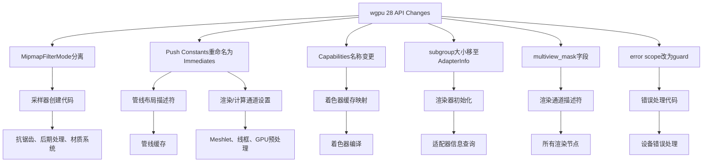

+++
title = "#22265 Upgrade to wgpu 28"
date = "2026-01-22T00:00:00"
draft = false
template = "pull_request_page.html"
in_search_index = false

[extra]
current_language = "zh-cn"
available_languages = {"en" = { name = "English", url = "/pull_request/bevy/2026-01/pr-22265-en-20260122" }, "zh-cn" = { name = "中文", url = "/pull_request/bevy/2026-01/pr-22265-zh-cn-20260122" }}
labels = ["A-Rendering", "C-Dependencies"]
+++

# Title

## Basic Information
- **Title**: Upgrade to wgpu 28
- **PR Link**: https://github.com/bevyengine/bevy/pull/22265
- **Author**: ChristopherBiscardi
- **Status**: MERGED
- **Labels**: A-Rendering, C-Dependencies, S-Ready-For-Final-Review
- **Created**: 2025-12-25T01:07:06Z
- **Merged**: 2026-01-22T19:02:13Z
- **Merged By**: alice-i-cecile

## Description Translation
升级到 wgpu 28

> [!important]
> 此PR无法合并，直到 https://github.com/bevyengine/naga_oil/pull/132 合并，并且依赖从我的fork更新到发布版本。
> 
> 同时需要在 dlss_wgpu 中使用 wgpu 28：https://github.com/bevyengine/dlss_wgpu/pull/17

> [!note]
> 此PR不启用网格着色器，naga_oil PR也不启用。我选择先进行升级，然后再回过来看网格着色器。

以下是更改的概览以及我所做的工作。提交按功能分组，除了最后一个提交，它在运行solari示例时启用了solari。

## MipmapFilterMode 从 FilterMode 中分离

- Split MipmapFilterMode from FilterMode #8314：https://github.com/gfx-rs/wgpu/pull/8314

解决方案：为 `MipmapFilterMode`/`ImageFilterMode` 实现 From trait，因为它们的值相同。分离是因为规范指出它们是不同的类型，即使值相同。

## Push Constants 现在改为 Immediates

- https://github.com/gfx-rs/wgpu/pull/8724

immediate_size 是 [一个 u32](https://docs.rs/wgpu/28.0.0/wgpu/struct.PipelineLayoutDescriptor.html#structfield.immediate_size)，因此使用它代替 `PushConstantRange`。

## Capabilities 名称变更

- https://github.com/gfx-rs/wgpu/pull/8671

从 https://github.com/gfx-rs/wgpu/blob/trunk/wgpu-core/src/device/mod.rs#L449 获取新列表并复制到代码中。

## subgroup_{min,max}_size 从 Limits 移动到 AdapterInfo

- https://github.com/gfx-rs/wgpu/pull/8609

更新 limits 结构体，使其包含现在的字段，并镜像其他 limits 调用的逻辑。

## multiview_mask

- https://github.com/gfx-rs/wgpu/pull/8206

设置为 None，因为我们目前不使用它。它大致用于VR。

## error scope 现在是一个 guard

- https://github.com/gfx-rs/wgpu/pull/8685

保留 guard，然后稍后调用 pop()。

---

我在PR中犯了一个错误，以为 set_immediates 是 immediates 的大小而不是偏移量。我希望审查者仔细检查 immediates 偏移量和大小相关的代码，以防我遗漏了什么。

以下是一些运行示例的截图：


## 已知问题

> [!NOTE]
> 
> 当前没有已知问题。之前的所有问题都已解决。

- [x] enable extensions 无法在 naga oil 中以允许在组合模块中使用的方式编写。

更新：通过在 naga-oil 中引入一个标志来修复，该标志在使用 bevy_solari 时强制着色器在组合模块中允许光线查询。这是临时解决方案，在 WESL 未来版本中会有所不同。

<details><summary>旧的解释</summary>
这导致 solari 在 NVIDIA 上无法工作（solari 在 macOS M1 上运行成功），因为它需要 `enable wgpu_ray_query;`。将声明放在 `#define_import_path` 之前意味着它会被剥离（据我所知），而放在之后会导致：

```
error: expected global declaration, but found a global directive
  ┌─ embedded://bevy_solari/scene/raytracing_scene_bindings.wgsl:3:1
  │
3 │ enable wgpu_ray_query;
  │ ^^^^^^ written after first global declaration
  │
  = expected global declaration, but found a global directive
```

</details>

- [x] dlss_wgpu 混合了 API，现在会导致 panic。

<details><summary>之前 dlss_wgpu 修复时的注释</summary>

wgpu 发布说明没有提及是哪个PR引入了此更改，只是说：

> 现在，在同一编码器上同时使用 wgpu 命令编码 API 和 CommandEncoder::as_hal_mut 将导致 panic。

它是由 https://github.com/gfx-rs/wgpu/pull/8373 引起的，该PR声称不知道任何使用场景：

> 使用记录完成时，命令缓冲区上的实际顺序非常违反直觉（所有 as_hal 会先出现），而且我认为在某些方面它根本就是坏的。
> - https://discord.com/channels/691052431525675048/743663924229963868/1453786307099758683

可能的解决方法是使用多个命令缓冲区：https://discord.com/channels/691052431525675048/743663924229963868/1453795633503670415

</summary>

## The Story of This Pull Request

这个PR的核心任务是升级Bevy的图形后端依赖wgpu从版本27到版本28。wgpu是Rust生态中一个重要的图形抽象层，它提供了跨平台的图形API（如Vulkan、Metal、DirectX 12）访问。对于Bevy这样的游戏引擎，保持与最新wgpu版本的同步至关重要，因为它意味着可以获取最新的性能优化、bug修复以及新特性支持，同时确保与未来驱动和操作系统的兼容性。

升级过程并非简单地修改版本号。wgpu 28引入了一些破坏性变更（breaking changes），这些变更影响了Bevy渲染器的多个层面。开发者必须系统地识别并适应这些变更，确保引擎的所有功能在新技术栈上正常运行。这包括更新渲染管线描述符、适配器信息查询、错误处理机制以及着色器中的语法。

首先，开发者面对的第一个变更是`MipmapFilterMode`从`FilterMode`中分离。在wgpu 28之前，mipmap过滤模式与纹理过滤模式共享同一个枚举类型。但根据WebGPU规范，它们是独立的类型，即使枚举值相同。因此，解决方案是为这两个类型实现`From` trait，确保现有代码能够无缝转换。这个变更影响了所有创建采样器（sampler）的代码，例如在抗锯齿、后期处理、材质系统中，需要将`FilterMode::Linear`等替换为`MipmapFilterMode::Linear`。

第二个重大变更是Push Constants被重命名为Immediates，并且其API发生了改变。在wgpu 27中，管线布局描述符（PipelineLayoutDescriptor）包含一个`push_constant_ranges`字段，它是一个`PushConstantRange`的向量。在wgpu 28中，这个字段被替换为一个`immediate_size`（u32）字段，表示立即值数据的总大小。相应地，在渲染或计算通道中设置这些数据的方法也从`set_push_constants`改为`set_immediates`。这个变更影响深远，因为它触及了所有使用push constants的渲染和计算管线，包括meshlet剔除、线框渲染、GPU预处理等。开发者需要更新所有相关的位置，将原来的`push_constant_ranges`向量替换为计算出的总大小（通常是将所有范围的大小累加），并将`set_push_constants`调用改为`set_immediates`。这里需要注意偏移量的计算，开发者最初错误地认为`set_immediates`的参数是大小而非偏移量，后来进行了修正。

第三个变更涉及功能（Capabilities）枚举的名称。wgpu 28重新组织并重命名了许多功能标志，以更好地反映WebGPU规范。Bevy的着色器缓存系统需要将wgpu的`Features`映射到naga的`Capabilities`。开发者从wgpu源代码中获取了最新的映射列表，并更新了`shader_cache.rs`中的`get_capabilities`函数。这个映射确保了着色器编译时能够正确启用或禁用特定的硬件功能。

第四个变更是子组（subgroup）大小信息从`Limits`结构体移到了`AdapterInfo`中。子组是GPU并行执行的一个概念，与性能优化相关。开发者更新了渲染器初始化代码，从适配器信息中获取这些值，并相应地调整了`WgpuLimits`结构体的字段。

第五个变更是渲染通道描述符（RenderPassDescriptor）新增了一个`multiview_mask`字段，用于多视图渲染（如VR）。由于Bevy目前不使用此功能，开发者将其设置为`None`。这需要在所有创建渲染通道的地方添加这个字段，涉及大量的渲染节点（Node）实现。

第六个变更是错误处理（error scope）的API从基于作用域（scope）的模式改为基于守卫（guard）的模式。原来调用`push_error_scope`会返回一个未来（Future），现在则返回一个守卫对象，必须保留该对象并在适当时候调用`pop`方法。这个变更确保了错误处理资源的正确释放。

除了这些主要的API变更，升级还涉及到其他调整，例如`enumerate_adapters`方法现在返回一个Future（在非WebAssembly目标上），需要异步处理；`wgpu-types`和`naga`等依赖也需要同步升级到版本28；一些第三方crate如`dlss_wgpu`和`naga_oil`也需要相应的版本更新或补丁。

整个升级过程展示了如何在大型代码库中协调依赖更新。开发者采用了分而治之的策略，将变更按功能分组提交，便于审查和测试。最终，通过更新89个crate文件和2个示例文件，Bevy成功迁移到了wgpu 28，为后续利用新特性（如网格着色器）奠定了基础。

## Visual Representation



## Key Files Changed

### `crates/bevy_render/src/renderer/mod.rs` (+48/-26)
此文件处理渲染器初始化和适配器选择。主要变更包括：
1. 将`enumerate_adapters`调用改为异步（通过`.await`），并更新了相关的适配器查找逻辑。
2. 更新`WgpuLimits`结构体以反映wgpu 28中的新字段，特别是将`subgroup_size`相关字段移除，因为它们已移至`AdapterInfo`。
3. 更新了许多限制（limits）字段的名称，例如`max_push_constant_size`改为`max_immediate_size`，以及新增了与网格着色器（mesh shader）和任务着色器（task shader）相关的限制。

代码片段示例（更新limits字段）：
```rust
// 之前（wgpu 27）：
max_push_constant_size: limits
    .max_push_constant_size
    .min(constrained_limits.max_push_constant_size),
min_subgroup_size: limits
    .min_subgroup_size
    .max(constrained_limits.min_subgroup_size),
max_subgroup_size: limits
    .max_subgroup_size
    .min(constrained_limits.max_subgroup_size),

// 之后（wgpu 28）：
max_immediate_size: limits
    .max_immediate_size
    .min(constrained_limits.max_immediate_size),
// subgroup_size 字段已移除，不再在此设置
```

### `crates/bevy_render/src/render_resource/pipeline_cache.rs` (+19/-28)
此文件管理管线缓存和布局创建。主要变更涉及将`push_constant_ranges`替换为`immediate_size`。
1. 布局缓存（LayoutCache）的键类型从`(Vec<BindGroupLayoutId>, Vec<PushConstantRange>)`改为`(Vec<BindGroupLayoutId>, u32)`，其中u32是`immediate_size`。
2. 在创建管线布局时，使用`immediate_size`字段而不是`push_constant_ranges`。
3. 更新了渲染和计算管线描述符的处理逻辑。

代码片段示例（布局缓存键和创建）：
```rust
// 之前：
type LayoutCacheKey = (Vec<BindGroupLayoutId>, Vec<PushConstantRange>);
// 之后：
type ImmediateSize = u32;
type LayoutCacheKey = (Vec<BindGroupLayoutId>, ImmediateSize);

// 在创建布局时：
let layout = layout_cache.get(&device, &bind_group_layout, descriptor.immediate_size);
```

### `crates/bevy_shader/src/shader_cache.rs` (+60/-31)
此文件负责着色器缓存和功能映射。主要更新了`get_capabilities`函数，以匹配wgpu 28中`Features`枚举的新名称和结构。
1. 更新了多个功能映射，例如`PUSH_CONSTANT`改为`IMMEDIATES`。
2. 添加了新的功能映射，如`SHADER_FLOAT16`、`TEXTURE_AND_SAMPLER_BINDING_ARRAY`等。
3. 反映了wgpu 28中功能标志的更细粒度划分。

代码片段示例（部分功能映射）：
```rust
// 之前：
capabilities.set(
    Capabilities::PUSH_CONSTANT,
    features.contains(Features::PUSH_CONSTANTS),
);
// 之后：
capabilities.set(
    Capabilities::IMMEDIATES,
    features.contains(Features::IMMEDIATES),
);
```

### `crates/bevy_pbr/src/meshlet/pipelines.rs` (+18/-66)
此文件定义了meshlet渲染的管线。由于meshlet大量使用push constants（现immediates）进行剔除和调度，因此变更较多。
1. 将所有`ComputePipelineDescriptor`和`RenderPipelineDescriptor`中的`push_constant_ranges`字段替换为`immediate_size`字段。
2. 更新了相关的着色器，将`var<push_constant>`改为`var<immediate>`。

代码片段示例（管线描述符变更）：
```rust
// 之前：
push_constant_ranges: vec![PushConstantRange {
    stages: ShaderStages::COMPUTE,
    range: 0..4,
}],
// 之后：
immediate_size: 4,
```

### `crates/bevy_solari/src/realtime/node.rs` (+12/-14)
此文件包含Solari实时光照节点的实现。它使用了计算着色器和immediates（原push constants）来传递帧索引和重置标志。
1. 将`PushConstantRange`的使用替换为`immediate_size`。
2. 将`set_push_constants`调用改为`set_immediates`。

代码片段示例：
```rust
// 之前：
push_constant_ranges: vec![PushConstantRange {
    stages: ShaderStages::COMPUTE,
    range: 0..8,
}],
// 之后：
immediate_size: 8,
```
以及：
```rust
// 之前：
pass.set_push_constants(
    0,
    bytemuck::cast_slice(&[frame_index, solari_lighting.reset as u32]),
);
// 之后：
pass.set_immediates(
    0,
    bytemuck::cast_slice(&[frame_index, solari_lighting.reset as u32]),
);
```

## Further Reading
- [wgpu 28 发布说明](https://github.com/gfx-rs/wgpu/releases/tag/v28.0.0)：了解wgpu 28的详细变更列表和新特性。
- [WebGPU 规范](https://www.w3.org/TR/webgpu/)：理解API设计背后的原理，特别是Immediates和MipmapFilterMode的变化。
- [Bevy 渲染架构](https://bevyengine.org/learn/quick-start/getting-started/systems/)：熟悉Bevy的渲染器如何组织渲染图、管线和资源。
- [Naga 着色器转换](https://github.com/gfx-rs/naga)：了解Bevy如何通过Naga处理不同着色器语言和功能映射。